# Ch03. 算法分析

[Home]( README.md )

## 本章目标

- 了解算法分析的重要性
- 能够采用“大 O”表示法来描述算法执行时间
- 了解 Python 列表和字典类型中通用操作执行时间的“大 O”级别；
- 了解 Python 数据类型的具体实现对算法分析的影响；
- 了解如何对简单 Python 程序进行执行时间检测。

## 什么是算法分析

### 如何对比两个程序或者算法

- 同一个问题“自然数序列求和”，如何对比两个程序或者算法？
  - 看起来不同，但解决同一个 问题的程序，哪个“更好”？
- 我们来看一段程序，完成从 1 到 n 的累加，输出总和
  - 设置累计变量 =0
  - 从 1 到 n 循环，逐次累加到累计变量
  - 返回累计变量

* 第一段程序
```python
def sum0fN(n):
  theSum = 0
  for i in range (1, n + 1):
    theSum = theSum + i
  return theSum

print (sum0fN(10))
```

* 第二段程序
```python
def foo (tom) :
  fred = 0
  for bill in range (1, tom + 1):
    barney = bill
    fred = fred + barney
  return fred

print(foo(10))
```
- 再看第二段程序，是否感觉怪怪的？
  - 但实际上本程序功能与前面那段相同
  - 这段程序失败之处在于：
    - 变量命名，foo，bar，baz，
    - 无用的垃圾代码
- 比较程序的“好坏”，有很多因素
  - 代码风格、可读性等等 
- 这里我们只关注算法本身
- 算法分析主要就是从计算资源消耗的角度来评判和比较算法
  - 更高效利用计算资源/更少占用资源的算法，就是好算法
  - 从这个角度，前述两段程序实际上是基本相同的，它们都采用了一样的算法来解决累计求和问题

### 算法好坏的评价标准

- 在算法有穷、确定、可行（正确）的基础上
  - 首先要保证是个算法
- 评价主要看 3 方面的指标
  - 运行所花费的时间（时间复杂度）
  - 运行所占用的存储空间（空间复杂性）
  - 其他（如可读性、健壮性、易于维护性）
- 平常用“复杂” 去形容一个算法，有三种不同的含义
  - 算法的描述：算法好不好懂
  - **算法的效率：运行所需的时间和存储空间**（本课采用的含义）
  - 算法的实现：代码好不好懂
- 算法分析：从效率和正确性两个方面

### 计算资源指标

- 那么何为计算资源？
- 一种是算法的执行时间
  - 我们可以对程序进行实际运行测试，获得真实的运行时间
- 一种是算法解决问题过程中需要的存储空间或内存
  - 算法运行过程中所需要的存储空间
  - 除了存储输入、输出外，更需要用于存储中间结果
    - Python 中存储一个整数 N，采用了$2^{30}$进制，1个digit占32位，可以表示[0, $2^{30}-1$]之间的整数
    - 当abs(N)小于$2^{30}$（1千兆）时，都只需要1个digit（即4bytes）
- Python 中有一个 time 模块，可以获取系统当前时间（浮点数）
  - 在算法开始前和结束后分别记录系统时间，即可得到运行时间


* python整数
```python
import sys
print(sys.int_info)
```

* python时间
```python
import time
help(time.time)
```

```python
from time import strftime, localtime, time, gmtime
time (),  strftime ('%Y-%m-%d %H:%M:%S', localtime(time()))
```

```python
epoch_time = 0
strftime ('%Y-%m-%d %H:%M:%S', gmtime(epoch_time))
```

#### 运行时间检测

##### 迭代累计求和

- 累计求和程序的运行时间检测
  - 增加了总运行时间
  - 函数返回一个元组 tuple
  - 包括累计和，以及运行时间（秒）
- 在交互窗口连续运行 5 次看看
  - 1 到 10,000 累加
  - 每次运行约大概需 0.0007 秒

```python
import time 
def sumofN2(n):
  start = time.time()    ## 计时开始

  theSum = 0
  for i in range(1, n+1):
    theSum = theSum + i

  end = time.time()      ## 计时结束
  return theSum, end - start

for i in range(5):
  print("Sum is {} required {:.7f} seconds".format(*sumofN2(10000)))
```

> 注意：`*sumofN2(10000)`中的`*`是 “解包 (unpacking)”，意思是，
>  -  把一个 tuple 里的元素一个个拿出来

- 如果累加到 100,000？
  - 看起来运行时间增加到 10,000 的 10 倍
```python
for i in range(5):
  print("Sum is {} required {:.7f} seconds".format(*sumofN2(100000)))
```

- 如果累加到 1000,000？
  - 看起来运行时间增加到 100,000 的 10 倍
```python
for i in range(5):
  print("Sum is {} required {:.7f} seconds".format(*sumofN2(1000000)))
```

##### 无迭代的累计求和（公式法）

- 利用求和公式的无迭代算法
    $$ S_n = \frac{(a_1 + a_n)n}{2} $$
- 采用同样的方法检测运行时间
  - 10,000; 100,000; 1,000,000
  - 10,000,000; 100,000,000
- 发现两点
  - 新算法的运行时间比旧算法 短很多
  - 运行时间与累计对象 n 的大 小没有关系（而旧算法是正 比例关系）

```python
def sumofN3(n):
  start = time. time()
  theSum = (n * (n + 1)) // 2
  end = time.time()
  return theSum, end - start

print("Sum is {} required {:.7f} seconds".format(*sumofN3(10_000)))
print("Sum is {} required {:.7f} seconds".format(*sumofN3(100_000)))
print("Sum is {} required {:.7f} seconds".format(*sumofN3(1_000_000)))
print("Sum is {} required {:.7f} seconds".format(*sumofN3(10_000_000)))
print("Sum is {} required {:.7f} seconds".format(*sumofN3(100_000_000)))

```

> - 在 Python 中，直接书写整数（int）字面量时不能使用逗号`,`作为千位分隔符。
>   - 从 Python 3.6 版本开始，你可以使用下划线`_`作为数字的可读性分隔符，它会被解释器忽略，不会改变数值大小。
>

#### 运行时间检测的分析


##### 分析工具

- `timeit`函数计时模块
  - `timeit.timeit(stmt, setup, number)`
  - 返回总运行时间（秒）

    > | 参数     | 作用     |
    > | ------ | ------ |
    > | stmt   | 要测试的代码 |
    > | setup  | 初始化代码  |
    > | number | 执行次数   |

- `matplotlib`是 Python 中最常用的 绘图库，可以用来画：
  - 折线图、散点图、柱状图、直方图等

```python
import timeit
import matplotlib.pyplot as plt


# ======================
# 两个要测试的函数
# ======================

def sumofN2(n):

  theSum = 0
  for i in range(1, n+1):
    theSum = theSum + i

  return theSum

def sumofN3(n):
  theSum = (n * (n + 1)) // 2
  return theSum

# ======================
# 输入规模
# ======================

sizes = [100_000, 200_000, 300_000, 500_000
  , 800_000, 1_200_000, 1_500_000, 2_000_000]

t1 = []
t2 = []

# ======================
# 测试运行时间
# ======================

for n in sizes:
    t = timeit.timeit(lambda: sumofN2(n), number=10)/10
    t1.append(t)

    t = timeit.timeit(lambda: sumofN3(n), number=10)/10
    t2.append(t)


# ======================
# 画图
# ======================

plt.plot(sizes, t1, marker='o', label="sumofN2")
plt.plot(sizes, t2, marker='s', label="sumofN3")

plt.xlabel("Input size (n)")
plt.ylabel("Running time (seconds)")
plt.title("Algorithm Runtime Comparison")

plt.legend()
plt.grid(True)

plt.show()

```

- 观察一下第一种迭代算法
  - 包含了一个循环，可能会执行更多语句
  - 这个循环运行次数跟累加值 n 有关系，n 增加，循环次数也增加
- 但关于运行时间的实际检测，有点问题
  - 关于编程语言和运行环境
- 同一个算法，采用不同的编程语言编写，放在不同的机器上运行，得到的运行时间会不一样，有时候会大不一样：
  - 比如把非迭代算法放在老旧机器上跑，甚至可能慢过新机器上的迭 代算法
  - 论文中比较自己算法的效率时，都必须尽可能的说明实验的运行环境
  - 有时觉得这样描述算法效率有点麻烦…

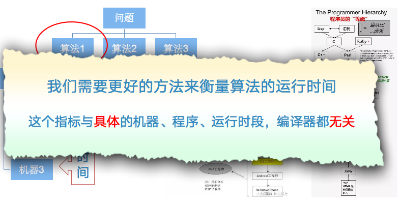

## 大O表示法

- 一个算法所实施的操作数量或步骤数可作为独立于具体程序/机器的度量指标
- 分析一个算法中，所有要执行的语句的数量
  - 抛弃那些不太重要的因素，只保留最主要的影响因素
- 以“行”或“条”为单位，分析 SumOfN 的执行的语句数量，忽略不同语句行的执行时间差别
  - 算法的执行时间T(n)就可以用执行语句数量来表示
  - 对于“问题规模”n，讨论 1～5 行代码
  - T(n) = 1 + (n + 1) + n + 1 = 2n + 3
      ```
      1   def sum0fN(n):
      2     theSum = 0
      3     for i in range(1, n+1):
      4       theSum = theSum + i
      5     return theSum
      ```

### 语句频度和时间复杂度

- 语句频度
  - 语句可能重复的最大次数
  - 语句频度是针对每条语句的
- 时间复杂度
  - 设算法所有语句的语句频度的和是 T(n)
  - 引入函数 f(n)，满足如下条件：


### Big-O 的数学含义–函数渐近的界

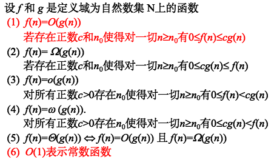

### 大 “O” 和小 “o” 的区别

- 类似于 $\le$ 和 $\lt$ 的区别。
  - f(n) = O(f(n))
  - f(n) $\ne$ o(f(n))
- 同阶无穷大：f(n) = O(g(n)) 且 g(n) = O(f(n))
- 与数学定义不同，计算机中的大 “O” 表示法实际上是要求“同阶无 穷大”
  - T(n) = 2n + 3 = O($n^3$) 不是我们想要的。
- 10086$n^3$ = O($n^3$), $n^3$ = O(10086$n^3$) 系数没有意义

- 以自然数累计求和为例，讨论问题规模对算法执行时间的影响，
  - 需要累计的自然数个数为问题规模的指标
  - 前十万个自然数求和，对比前一千个自然数求和，算是同一问题的更 大规模
  - 算法分析的目标是要找出问题规模会怎么影响一个算法的执行时间
- 数量级函数（Order of Magnitude function）
  - 基本操作数量函数 T(n) 的精确值并不是特别重要，重要的是 T(n) 中 起决定性因素的主导部分
  - 用动态的眼光看，就是当问题规模增大的时候，T(n) 中的一些部分 会盖过其它部分的贡献
  - 数量级函数描述了 T(n) 中随着 n 增加而增加速度最快的部分
  - 称作“大 O”表示法，记作 O(f(n))，其中 f(n) 表示 T(n) 中的主导部分

### 语句频度和时间复杂度（举例）

| 例子 | 程序                       | 语句频度   | 时间复杂度               | 说明  |
| -- | ------------------------ | ------ | ------------------- | --- |
| 1  | `x = x + 1`              | 1      | O(1)                | 常数阶 |
| 2  | `for i in range(n):`     | n+1    | T(n) = 2n + 1       |     |
|    | `    x = x + 1`          | n      |  O(n)               |   线性阶  |
| 3  | `for i in range(n):`     | n+1    |                     |     |
|    | `    for j in range(n):` | n(n+1) | T(n) = 2n² + 2n + 1 |     |
|    | `        x = x + 1`      | n²     | O(n²)               | 平方阶 |


- 计算“时间复杂度” 常见的三种错误：
  - 混淆频度和复杂度，保留常数，保留次重要项

### 统计语句频度的有力工具

line_profiler用来测量函数中每一行代码的运行时间，比 timeit 更细，可以看出 哪一行最慢。

```python
from line_profiler import LineProfiler

def sumss (n) :
  res = 0
  for i in range(n):
    res += i
  return sum

if __name__ == "__main__":
  lprofiler = LineProfiler(sumss)
  lprofiler.runcall(sumss, 10000)
  lprofiler.print_stats()
```

- 注意 for-loop 中控制语句的执行次数，总比块内语句的执行多一次。

### 确定运行时间Big-O的方法

- 例 1：T(n)=n+1
  - 当 n 增大时，常数 1 在最终结果中显得越来越无足轻重
  - 所以可以去掉 1，保留 n 作为主要部分，运行时间数量级就是 O(n)
- 例 2：T(n)=5$n^2$+27n+1005
  - 当 n 很小时，常数 1005 其决定性作用
  - 但当 n 越来越大，$n^2$ 项就越来越重要，其它两项对结果的影响则越 来越小
  - 同样，$n^2$ 项中的系数5，不影响T(n)随n增长的增长速率（growth rate）
    - 不同的机器和实现会改变这个系数，比方说CPU、编译器、Python vs. C
    - 可能Python的T(n)就比C的T(n)大十倍，刚好是算法分析中希望去除的
  - 所以可以在数量级中去掉 27n+1005，以及系数 5 的部分，确定为 O($n^2$)

### 最好、平均、和最差时间复杂度
- 有时决定运行时间的不仅是问题规模，具体情况也会影响算法运行 时间
  - 分为最好、最差和平均情况，平均状况体现了算法的主流性能
  - 下面是不同排序算法的复杂度比较

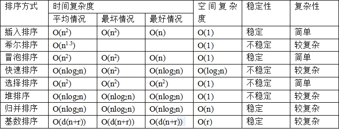

### 讨论算法复杂度的习惯

- 算法原地工作 (in-place) 是指算法所需的辅助空间是常量，空间复杂度 O(1)。
- 默认 $N\gg 1$，复杂度为 O(n) 的算法必然优于复杂度为 $O(n^{1+δ})$ 的算法。
- 在没有特别指明的情况下，时间复杂度就是指“最坏情况” 复杂度。
- 同一个算法用不同的程序设计语言实现，运行效率有较大差异，但从复杂度的角度来看是一样的。

### 常见的大 O 数量级函数

- 通常当n 较小时，不同Big-O函数的大小差别不明显
- 当 n 较大时，容易看出其主要变化量级

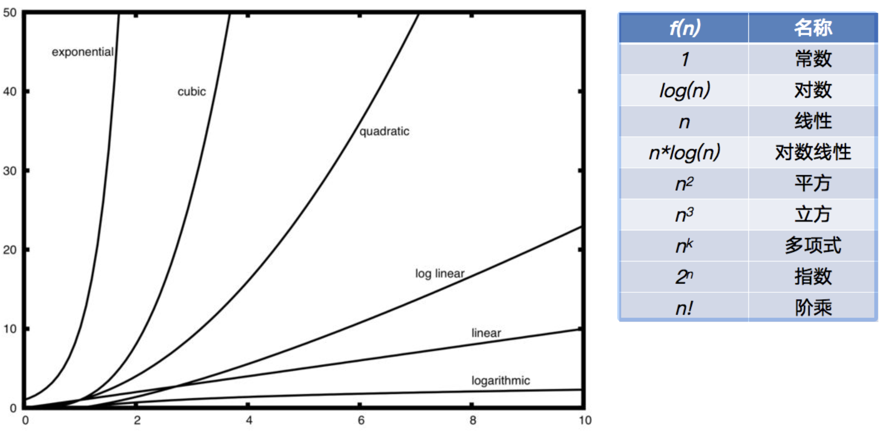

### 从代码分析确定执行时间数量级函数

- 代码中语句执行可以分为 4 个部分
  - T(n)=3+[(n+1)+(n+1)n+3$n^2$]+[(n+1)+2n]+1=4$n^2$+5n+6
- 仅保留最高阶项 $n^2$，去掉所有系数
- 数量级为 O($n^2$)
- Hint: Big-O表示法只需要观察执行次数最多的语句，通常处在最内层循环

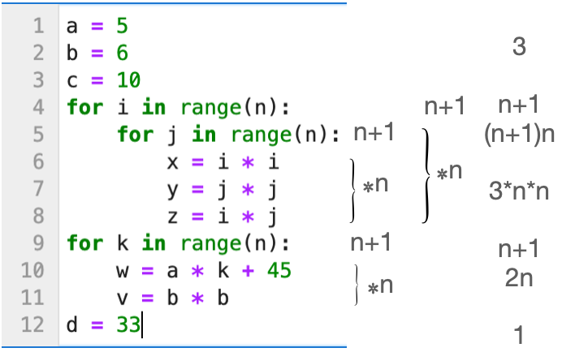

很多时候算法的复杂度并不容易直接看出来。

#### 例题 1：递归分裂不均匀
```python
from line_profiler import LineProfiler

def f1(n):
    if n <= 1:
        return
    f1(n//2)
    f1(2*n//3)

if __name__ == "__main__":
  lprofiler = LineProfiler(f1)
  lprofiler.runcall(f1, 1000_000)
  lprofiler.print_stats()
```
<details>
  <summary> 算法复杂度答案 </summary>

- 递归树每层节点数大约：$2^k$
- 但问题规模逐渐减少
  $$T(n) = T\left(\frac{1}{3}n\right) + T\left(\frac{2}{3}n\right) + O(1)$$
- 最终可得：T(n) = O(n)

</details>

#### 例题 2：对数层嵌套
```python
from line_profiler import LineProfiler

def f2(n):
    i = 1
    while i < n:
        j = 1
        while j < n:
            j *= 2
        i *= 2

if __name__ == "__main__":
  lprofiler = LineProfiler(f2)
  lprofiler.runcall(f2, 1000_000)
  lprofiler.print_stats()
```
<details>
  <summary> 算法复杂度答案 </summary>

- 外层循环：log(n)
- 内存循环：log(n)
- 总复杂度：$O((\log{n})^2)$
</details>

#### 例题 3：平方根循环
```python
from line_profiler import LineProfiler
from math import sqrt

def f3(n):
    i = n
    while i > 1:
        i = int(sqrt(i))

if __name__ == "__main__":
  lprofiler = LineProfiler(f3)
  lprofiler.runcall(f3, 1000_000)
  lprofiler.print_stats()
```

<details>
  <summary> 算法复杂度答案 </summary>

- i的变化过程：
```
n
sqrt(n)
n^(1/4)
n^(1/8)
...
```
- 执行k次：n^(1/2^k) = 2
- 取对数： 2^k ≈ log n
- 总复杂度：O(log log n)
</details>

#### 例题 4：一个非常经典的“迷惑题”
```python
from line_profiler import LineProfiler

def f4(n):
    i = 1
    while i < n:
        for j in range(i):
            pass
        i *= 2

if __name__ == "__main__":
  lprofiler = LineProfiler(f4)
  lprofiler.runcall(f4, 1000_000)
  lprofiler.print_stats()
```

<details>
  <summary> 算法复杂度答案 </summary>

- 计算总操作：1 + 2 + 4 + 8 + ... + n
- 结果：T(n)=2n-1
- 总复杂度：O(n)
</details>

## “变位词”判断问题

- “变位词”判断问题可以很好地展示不同数量级的算法
- 问题描述
  - 所谓“变位词”是指两个词之间存在组成字母的重新排列 关系
  - 如：heart 和 earth，python 和 typhon
  - 为了简单起见，假设参与判断的两个词仅由小写字母构成，而且长度相等
- 解题目标：写一个 bool 函数，以两个词作为参数，返回真假，表示 这两个词是否变位词

### 解法 1：逐字检查

- 解法思路为将字符串 1 中的字符逐个到字符 串 2 中检查是否存在，存在就“打勾”标记（防 止重复检查），如果每个字符都能找到，则两 个词是变位词，只要有 1 个字符找不到，就 不是变位词
- 程序技巧
  - 实现“打勾”标记：将字符串 2 对应字符设为None
  - 由于字符串是不可变类型，需要先复制到列表中

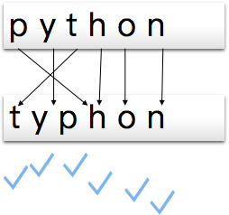

* 程序代码
```python
def anagramSolution1(s1, s2):
  alist = list(s2)
  for c1 in s1 :
    for i, c2 in enumerate(alist):
      if c1 == c2:
        alist[i] = None
        break
    else:
      return False
  else:
    return True

print(anagramSolution1('abcd', 'dcba'))
```
> - enumerate() 用来 在遍历序列时同时得到“下标 + 元素”。
>   - enumerate(sequence) → (index, element)

* 算法分析
  - 问题规模：词中包含的字符个数 n
  - 主要部分在于两重循环：外重循环要遍历s1的每个字符，将内层循环执行 n 次
  - 观察内层循环的比较语句：`c1 == c2`
  - 当变位词判定结果为True时，内层循环在s2中查找并标记字符，最终s2中的每一个字符都被标记
    - 从左至右，标记s2中每一个字符需要的比较次数分别是 1、2、3、$\ldots$ 、n-1、n 
    - 所以总比较次数是 $$\sum_{i=1}^{n}i = \frac{n(n+1)}{2} = O(n^2)$$
  - False: 提前返回，执行次数小于True。
  - 整个算法的复杂度为 $O(n^2)$

### 解法 2：排序比较

* 解题思路为：将两个字符串都按照字母顺序排好序，再逐个字符对比是否相同，如果相同则是变位词

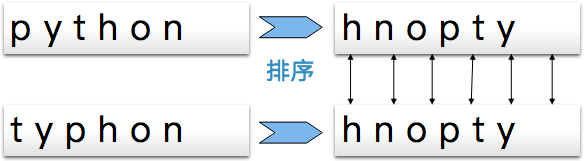

* 程序代码
```python
sorted('xzm')
```

```python
'xzm'.sort()
```

```python
def anagramSolution2(s1, s2):
  alist = list(s1)
  blist = list(s2)
  
  alist.sort()
  blist.sort()

  for a, b in zip(alist, blist):
    if a != b:
      return False
  else:
    return True
    
print(anagramSolution2('abcde', 'edcba'))
```
> - zip() 用来 把多个序列按位置“打包”在一起。
>   - zip(a, b, c) → (a[i], b[i], c[i])

* 算法分析
  - 粗看上去，本算法只有一个循环，最多执行 n 次，数量级应该是 O(n)
  - 但循环前面的两个 sort 并不是无代价的
  - 如果查询下后面的章节，会发现排序算法采用不同的解决方案，其
运行时间数量级差不多是 O(n2) 或者 O(n log n)，大过循环的 O(n)
  - 所以本算法中其决定性作用的步骤是排序步骤
  - 本算法的运行时间数量级就等于排序过程的数量级 O(n log n)

### 解法 3：暴力法

- 暴力法解题思路为：穷尽所有可能组合
- 对于变位词问题来说，暴力法具体是，将字符串 1 中出现的字母进 行全排列，再查看字符串 2 是否出现在全排列列表中
- 这里最大的困难是产生字符串 1 所有字母的全排列，根据组合数学 的结论，如果 n 个字符进行全排列，其所有可能的字符串个数为 n!
- 我们已知 n! 的增长速度甚至超过 $2^n$
  - 例如，对于 20 个字符长的词来说，将产生 20!=2,432,902,008,176,640,000 个候选词
  - 如果每秒钟处理一个候选词的话，需要 77,146,816,596 年（百亿） 的时间来做完所有的匹配。
- 执行次数：n!*n
- 结论：暴力法恐怕不能算是个好算法
- 密码学：只有“暴力法” 能破解的算法，就是安全的。

* 程序代码
```python
import itertools

def anagramSolution3(s1, s2):
  s2 = tuple(s2)
  for s1 in itertools.permutations(s1):
    if s1 == s2:
      return True
  else:
    return False

print(anagramSolution3('abcdefghix', 'xedcbafghi'))
```
> - itertools.permutations() 用来生成 序列的排列（permutations）。
>   - permutations(iterable, r) → 从 iterable 中取 r 个元素的所有排列
>

### 解法 4：计数比较

- 最后一个算法解题思路为：对比两个字符串中每个字母出现的次数，如果 26 个字母出现的次数都相同的话，这两个字符串就一定是变 位词
- 具体做法：为每个字符串设置一个 26 位的计数器，先检查每个字符串，在计数器中累计好每个字母出现的次数
- 计数完成后，进入比较阶段，看两个字符串的计数器是否相同，如果相同则输出是变位词的结论


* 程序代码
```python
def anagramSolution4(s1, s2):
  c1, c2 = [0] * 26, [0] * 26
  for i in s1:
    c1[ord(i) - ord('a')] += 1
  for i in s2:
    c2[ord(i) - ord('a')] += 1
  return c1 == c2

print(anagramSolution4('abcdefghix', 'xedcbafghi'))
```
> - 可不可以`c1 = c2 = [0] * 26` ?
> - `c1 == c2`，在Python中，列表的 == 比较是按元素逐个比较的

* 算法分析

  - 计数比较算法中有 3 个循环迭代，但不象解法 1 那样存在嵌套循坏
    - 前两个循环用于对字符串进行计数，操作次数等于字符串长度 n
    - 第 3 个循环用于计数器比较，操作次数总是 26 次
  - 所以总操作次数 T(n)=2n+26，其数量级为 O(n)，这是一个线性数 量级的算法，是 4 个变位词判断算法中性能最优的。
  - 值得注意的是，本算法依赖于两个长度为 26 的计数器列表，来保 存字符计数，这相比前 3 个算法需要更多的存储空间
    - 由于仅限于 26 个字母构成的词，本算法对空间额外的需求并不明 显，但如果考虑由大字符集构成的词（如中文具有上万不同字符）， 情况就会有所改变。
  - 牺牲存储空间来换取运行时间，或者相反，这种在时间空间之间的
取舍和权衡，在选择问题解法的过程中经常会出现。

* 更多计数法代码
  * 如果字符不限于26个小写字母

```python
from collections import Counter 
def anagramSolution41(s1, s2):
  return Counter (s1) == Counter (s2)

def anagramSolution42(s1, s2):
  d1 = {}
  for i in s1:
    d1[i] = d1.get(i, 0) + 1
  d2 = {}
  for i in s2:
    d2[i] = d2.get(i, 0) + 1
  return d1 == d2

if __name__ == "__main__":
  print(anagramSolution41('apple', 'pleap'))
  print(anagramSolution42('apple', 'pleap'))

```
> - 计数器
>   - collections.Counter 现成的
>   - 用字典实现，如何设定计数初值：`d1[i] = d1.get(i, 0) + 1`

## 多项式函数与指数函数

- 可以看出：为什么关心问题在不在 P 中。

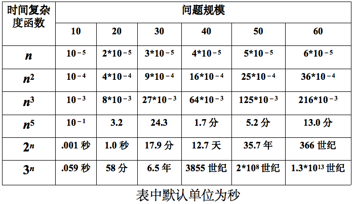

- 计算机变快能够解决的问题

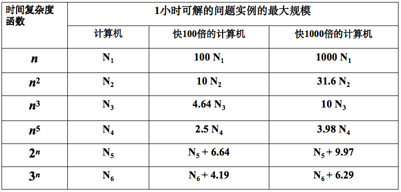

## 算法的正确性

算法分析通常包括以下几个方面的内容：
1. 正确性
1. 时间复杂度
1. 空间复杂度
1. 最好/最坏/平均情况
1. 渐进复杂度

* **算法的正确性证明**讨论的很少
  * 有时候很容易，显而易见
  * 有时候又非常难

### 例题：稳定匹配问题 stable-matching
- 出现在两个集合之间元素进行双向选择时的众多场景中
  - 暑期实习的大学生和公司之间
  - 准备保研的毕业生和导师之间
  - 准备恋爱或结婚的男女之间
- 每个元素都依据自身的利益或喜好选择“尽量”满意的对象
  - **如果中间出现更满意的对象，可以随时更改自己原来的选择**
  - 这山望着那山高。
- 经常出现“失信毁约”的现象，让所有人都感觉很折腾

#### 问题模型

* 我们这里讨论一个“找舞伴”的简单场景，选择是一对一的
  - n 个男同学和 n 个女同学为元旦舞会挑选舞伴，一对一结对
  - 男同学的集合 $M= \{m_1, m_2, \ldots , m_{n-1}, m_n\}$，
  - 女同学的集合 $W= \{w_1, w_2, \ldots , w_{n-1}, w_n\}$
  - 所有可能的配对集合 $M\times{}W=\{(m,w)|m\in{}M\land{}w\in{}W\}$
  - S 是一个匹配 matching：$S\subset{}M\times{}W$ 并且 M 与 W 中的所有元素在 S 中最多出现一次
  - S’ 是一个完美匹配 perfect-matching：$S'\subset{}M\times{}W$ 并且 M 与 W 中 的所有元素在 S’ 中出现且只出现一次，也叫双射关系

* 什么是稳定匹配呢？
  - 所有男生对女生都有自己独立的喜好倾向，女生对男生也一样
    - 依据喜好倾向打分，排序构成意向表 preference list
    - 如果男生 m 给女生 w 打分高于女生 w’，则称为 m prefer w to w’
  - 假设 S 是$M\times{}W$的一个完美匹配，如果 $\{(m,w'),(m',w)\}\subset{}S$ 满足 m prefer w to w’，并且 w prefer m to m’，那么 m 和 w 就有打破 原来的配对重新选择的动机，称 (m,w) 为 S 的一处不稳定性
  - 如果 S 不存在这样的不稳定性，则称 S 是一个稳定匹配。
    - 这时从一个男生的角度来看：现在的舞伴也许不是我的最佳选择，但是我心目中更好的女生也不会放弃她们现在的舞伴来选择我。于是我不会有什么要改变的冲动。
    - 所有的人也许并不十分满意，但都 **安于现状**

* 一个简单的例子：M= {m, m′}，W= {w, w′}
    
  - 第一种情况，男生的 prefer_list 一致，女生同样
    - m prefer w to w’
    - m’ prefer w to w’
    - w prefer m to m’
    - w’ prefer m to m’
  - 这时 S= {(m, w), (m′, w′)} 是唯一的稳定匹配
  - 还有一种情况，两个男生和两个女生之间形成了四角的喜欢关系。
    - m prefer w to w’
    - w prefer m’ to m
    - m’ prefer w’ to w
    - w’ prefer m to m’
  - 出现两种稳定匹配 S1 = {(m, w), (m′, w′)}，S2 = {(m, w′), (m′, w)}
  - 可以看出，问题的难点源于没有统一的 **prefer_list**

#### Gale-Shapley 算法

- propose：邀请
- engage：结对 
- preference list：意向表

```
1     Initially all m in M and w in W are free
2     While there is a man who is free and hasn't proposed to every woman
3       Choose such a man "m"
4       Let w be the highest-ranked woman in m's preference list to whom \\
5          m has not yet proposed
6       If w is free then
7         (m,w) become engaged
8       Else w is currently engaged to m'
9         If w prefers m' to m then
10          m remains free
11        Else w prefers m to m'
12          (m,w) become engaged
13          m' becomes free
14        Endif
15      Endif
16    EndWhile
17    Return the set S of engaged pairs
```

#### 算法复杂度

- 从女生的角度看算法过程，
  - 从第一次被邀请开始，女生一直保持“结对”的状态，不会重新 free
  - 后来只有更倾心的男生才会让她选择重新“结对”
  - 与之结对的男生序列，在女生的意向表中是递升的
- 从男生的角度看，
  - 向女生发出邀请，都是从自己的意向表中第一个开始，逐个邀请的。
  - 因此男生邀请的女生序列，在意向表中是递降的。
  - 一个男生邀请同一个女生，最多只有一次。
- 估计一下算法的复杂度上界
  - 算法只有一个 While 循环
  - 定义$\varphi(t)=\{(m,w)|$在前$t$轮迭代中$m$向$w$发出过结对邀请$\}$
  - 每次迭代都有m邀请新的w，故$|\varphi(t+1)|=|\varphi(t)|+1$
  - $\varphi(\cdot)\subseteq{}M\times{}W$，并且$|M\times{}W|=n^2$
  - 所以$t\leqslant{}n^2$，算法最多迭代$n^2$轮k，算法复杂度是O($n^2$)
  - 在这里$\varphi(t)$被用作进度条progress measure

#### 算法正确性

- 算法最后返回的匹配 S 是完美匹配
  - 任何时候，如果存在 free 的 m，必然存在 free 的 w，而且 m 还没有
邀请过 w
  - 算法结束的时候，不可能存在 free 的 m 或 w
- S 中不存在不稳定性，反证法
  - 假设 $\exists\{(m,w'), (m',w)\}\subset{}S$ 并且
    - m prefer w to w’
    - w prefer m to m’
  - m 在邀请 w’ 之前肯定先邀请过 w，
  - m 之前邀请 w，有两种结果
    - m 成为 w 的舞伴，w prefer m to m’
    - 当时 w 的舞伴 m”，w prefer m” to m, to m’
  - 而 m’ 是 w 最后选择的，m 或 m” 都不应该出现在 w 的舞伴序列中
  - 导出矛盾，所以不稳定性不存在
      $\blacksquare$

## Python 数据类型的性能

- 列表 List
- 字典 Dictionary

### 重温基本概念

- 数据结构：是相互之间存在一种或多种特定关系的数据元素的集合，
包括逻辑结构和物理结构。
  - 线性表、队列、树、图；顺序、链式、散列。
  - 它是一个多义词：也可以是一门课，或者某一方面知识的统称。
- 数据类型：是一个值的集合和定义在这个值集上的一组操作的总
称。Python 数据类型 有简单类型，也有复杂类型；有内置类型，
也有用户定义类型。
- 抽象数据类型：是指一个数学模型以及定义在该模型上的一组操
作。它的定义仅取决于它的一组逻辑特性，而与其在计算机内部如
何表示和实现无关，讨论它的效率是没有意义的事情。
- 同一个名词在不同的语境下，可能指一种数据结构，也可能指一个
数据类型或抽象数据类型。


###  Python 数据类型的性能

- 前面我们了解了“大 O 表示法”以及对不同的算法的评估
- 下面来讨论下 Python 两种内置数据类型上各种操作的大 O 数量级
  - 列表 List 和字典 Dictionary
  - 这是两种重要的 Python 数据类型，后面的课程会用来实现各种 **数据结构**
  - 通过运行试验来确定其各种操作的运行时间数量级
- 对比 List 和 Dictionary

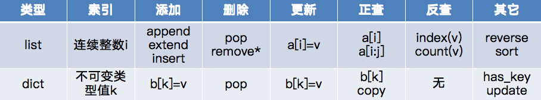

### List 数据类型
- List 数据类型各种操作（interface）的实现方法有很多，如何选择
具体采用哪种实现方法？
- 总的方案就是，让最常用的操作性能最好，牺牲不太常用的操作
  - 80/20 准则：80% 的功能其使用率只有 20%
- 我们来看一些常用的 List 操作
- 最常用的是：按索引取值和赋值（v= a[i], a[i]= v）
  - 由于列表的随机访问特性，这两个操作执行时间与列表大小无关，均
为 O(1)
- 另一个是列表增长，可以选择 append() 和 __add__()
  - lst.append(v)，不改变 lst 的 id 值，执行时间是 O(1)
  - lst= lst+ $[v_1, v_2, \ldots, v_k]$，执行时间是 O(n+k)，k 是被加的列表长度
  - 如何选择具体方法，决定了程序的性能

#### 4 种生成前 n 个整数列表的方法

- 第一种方法是用循环连接列表（+）方 式生成
- 然后是用 append() 方法来添加元素生 成
- 接着用列表推导式（List Comprehension）来做
- 最后是 range 函数调用转成列表

```python
n = 10_000
def test1():
  l = [] 
  for i in range(n):
    l = l + [i]

def test2():
  l = [] 
  for i in range(n):
    l.append(i)

def test3():
  l = [i for i in range(n)]

def test4():
  l = list(range(n))
```
- 使用 timeit 模块对函数计时
  - 对于每个函数具体的执行时间，timeit 模块提供了一种在一致的运 行环境下可以反复调用并计时的机制
  - timeit 计时的使用方法
    - 首先创建一个 Timer 对象，需要两个参数，第一个是需要反复运行的语句，第二个是为了建立运行环境而只需要运行一次的“安装语句”
    - 然后调用这个对象的 timeit 方法，其中可以指定反复运行多少次，计时完毕后返回以秒为单位的时间

```python
from timeit import Timer

t1 = Timer("test1()", "from __main__ import test1")
print("concat in {} seconds". format(t1.timeit(number=1000)))

t2 = Timer("test2()", "from __main__ import test2")
print("append in {} seconds".format(t2.timeit(number=1000)))

t3 = Timer("test3()", "from __main__ import test3")
print("comprehension in {} seconds".format(t3.timeit(number=1000)))

t4 = Timer("test4()", "from __main__ import test4")
print("concat in {} seconds".format(t4.timeit(number=1000) ))
```

4 种生成前 n 个整数列表的方法计时

- 我们看到，4 种方法运行时间差别很大
  - 列表连接（concat）最慢，List range 最快，速度相差近 200 倍。
  - append 也要比 concat 快得多
  - 另外，我们注意到列表推导式速度是 append 两倍的样子
- 当然，如果仔细分析，严格来说，上述时间除了具体列表操作的耗时，应该还包括函数调用的时间在内。
  - 但函数调用花销的时间是常数
  - 可以通过调用空函数来确定
  - 并从上述时间减除掉函数调用时间

#### List 基本操作的大 O 数量级

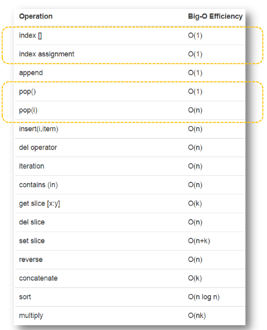

- 我们注意到 pop 这个操作
  - pop() 从列表末尾移除元素， O(1)
  - pop(i) 从列表中部移除元素， O(n)
- 原因在于 Python 这里采用的存储结构为顺序表，类似于食堂排队
  - 从中部移除元素的话，要把 移除元素后面的元素全部向 前挪位复制一遍
  - 这个看起来有点笨拙
  - 但后面章节我们会看到这种 实现方法能够保证列表按索 引取值和赋值的操作很快， 达到 O(1)
  - 这也算是一种对常用操作和 不常用操作的折衷方案

#### list.pop 的计时试验

- 为了验证表中的大 O 数量级，我们把两种情况下的 pop 操作来实 际计时对比，相对同一个大小的 list，分别调用 pop() 和 pop(0)
- 并对不同大小的 list 做计时试验，我们期望的结果是
  - pop() 的时间不随 list 大小变化，pop(0) 的时间随着 list 变大而变长
- 首先我们看对比
  - 对于长度 2 百万的列表，执行 1000 次
  - pop() 时间是 0.0007 秒
  - pop(0) 时间是 0.8 秒
  - 相差 1000 倍
```python
import timeit
popzero = timeit.Timer("x.pop(0)", "from __main__ import x")
popend = timeit.Timer("x.pop()",  "from __main__ import x")

x = list(range(2000000))
print(f"pop from 0 cost time {popzero.timeit(number=1000)}")
x = list(range(2000000))
print(f"pop from end cost time {popend.timeit(number=1000)}")
```

- 我们通过改变列表的大小来测试两个操作的增长趋势
```python
print("      pop(0)        pop()")
for i in range (1_000_000, 100_000_001, 1_000_000) :
  x = list(range(i))
  pt = popend.timeit(number=1000)
  x = list(range(i))
  pz = popzero.timeit(number=1000)
  print(f"{pz:15.5f}, {pt:15.5f}")
```

- 通过将试验数据画成图表，可 以看出增长趋势
  - pop() 是平坦的常数
  - pop(0) 是线性增长的趋势
- 其中散落的点是误差导致
  - 系统中其它进程调度
  - 资源占用等
- list 是 Python 编程中最常用的 数据类型，用好它至关重要！

```python
import timeit
import matplotlib.pyplot as plt

# ======================
# 输入规模
# ======================

sizes = list(range(10_000_000, 90_000_000, 10_000_000))

t1 = []
t2 = []

# ======================
# 测试运行时间
# ======================

for n in sizes:
    x = list(range(n))
    t = timeit.timeit("x.pop(0)", "from __main__ import x", number=10)/10
    t1.append(t)

    x = list(range(n))
    t = timeit.timeit("x.pop()", "from __main__ import x", number=10)/10
    t2.append(t)

# ======================
# 画图
# ======================

plt.plot(sizes, t1, marker='o', label="pop0")
plt.plot(sizes, t2, marker='s', label="pop")

plt.xlabel("list size (n)")
plt.ylabel("Running time (seconds)")
plt.title("Algorithm Runtime Comparison")

plt.legend()
plt.grid(True)

plt.show()

```
### 字典 Dictionary

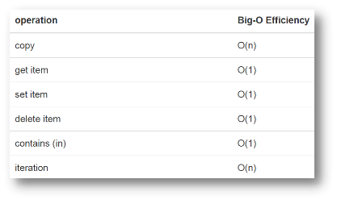

- 字典与列表不同，它可以根据关键码（key）来找到数据项，而列表 是根据位置（index）来找到数据项
- 后面的课程会介绍字典的几种不同实现方法
- 最常用的取值 get item 和赋值 set item 操作，其性能为 O(1)
- 另一个重要操作是判断字典中是否存在某个关键码（key），这个性 能也是 O(1)
- 某些罕见的情况下性能会劣化
  - set/get/contains -> O(n)
  - 后面讲到实现的时候会分析

#### List 和 Dictionary 的 in 操作对比

- 设计一个性能试验，来对比从不同的容器 List 与 Dictionary 中，检 索一个值花的时间。
  - 把 [0..N-1] 放到一个 List 中，同时把它作为 Key 放到一个字典中，N 等于容器的大小，看作问题的规模。
  - 从容器中检索不同的 r 值往往花不同的时间。有最好的情况，也有最 坏的情况，我们随机产生一些 r 来检验，估计出一个“平均”时间。
  - 我们安排 N 进行等差增长，取得每一个 N 下容器 in 操作的“平均”时 间，进行比较。

```python
import timeit
import random

sizes = list(range(10000, 200001, 20000))
t1, t2 = [], []

for i in sizes:
  t = timeit.Timer("random.randrange({N}) in x".format(N=i),
                    "from __main__ import random, x")
  x = list(range(i))
  lst_time = t.timeit(number=1000)
  t1.append(lst_time)

  x = {j:None for j in range(i)}
  d_time = t.timeit(number=1000)
  t2.append(d_time)

  print("{:>6}, {: >10.4f}, {: >10.4f}".format(i, lst_time, d_time))

# ======================
# 画图
# ======================

import matplotlib.pyplot as plt

plt.plot(sizes, t1, marker='o', label="in_list")
plt.plot(sizes, t2, marker='s', label="in_dict")

plt.xlabel("list/dict size")
plt.ylabel("Running time (seconds)")
plt.title("Algorithm Runtime Comparison")

plt.legend()
plt.grid(True)

plt.show()

```
* 可见字典的执行时间与字典规模大小无关，是常数
* 而列表的执行时间则随着列表的规模加大而线性上升

- 使用 timeit 来作算法计量，需要考虑到的问题
  - 同一台计算机，CPU 负载波动影响算法 F 的运行时间。
  - 问题 F 在规模为 N 的情况下重复 number 次： F(N) * number
    - 减少计算机负载波动带来的测量误差。
    - F(N) 可能有内部的 cache 机制：第一遍运行花时间，以后的运行可以是瞬间完成。所以需要在每次运行时加入一定的随机性，破坏掉 cache。见前面的”in” 操作对比。
  - 如果 N 超出了计算机内存的规模，运行效率会产生新的问题
    - 使用硬盘缓存、内存频繁扇入扇出，造成颠簸。
    - 扩大内存，也会显著提高计算机性能。

```python

```
