# Ch04. 线性表

[Home]( README.md )

## 本章目标

- 了解抽象数据类型：栈 stack、队列 queue、双端队列 deque 和列 表 list；
- 能够采用 Python 列表数据类型来实现 stack/queue/deque 等抽象 数据类型；
- 了解基本线性数据结构各种具体实现算法的性能；
- 了解前缀、中缀和后缀表达式；
- 采用 stack 对后缀表达式进行求值；
- 采用 stack 将中缀表达式转换为后缀表达式；
- 采用 queue 进行基本的点名报数模拟；
- 能够识别问题属性，选用 stack、queue 或者 deque 中更为合适的数据结构；
- 能够通过结点和结点引用的模式，采用链表来实现抽象数据类型list；
- 能够比较链表实现与 Python 的 list 实现之间的算法性能。

### 重温基本概念

- 数据结构：是相互之间存在一种或多种特定关系的数据元素的集合。
  - 包括逻辑结构和物理结构，集合上定义了相关运算。
  - 逻辑结构：只关心“关系”，不关心实现
  - 物理结构：数据在内存里“怎么放”
- 数据类型：是一个值的集合和定义在这个值集上的一组操作的总称。
  - 它总是与具体的程序设计语言联系在一起。
- 抽象数据类型：是指一个数学模型以及定义在该模型上的一组操作。
  - 它的定义仅取决于它的一组逻辑特性，而与其在计算机内部如何表示和实现无关。
  - 关心模型的“功能”，定义“接口 + 行为”
- 不同的概念经常使用相同的名字，注意区分
  - 栈/stack 是数据结构？还是数据类型？还是抽象数据类型？
  - 但是顺序表只能是数据结构（物理结构），不太可能有其他的含义

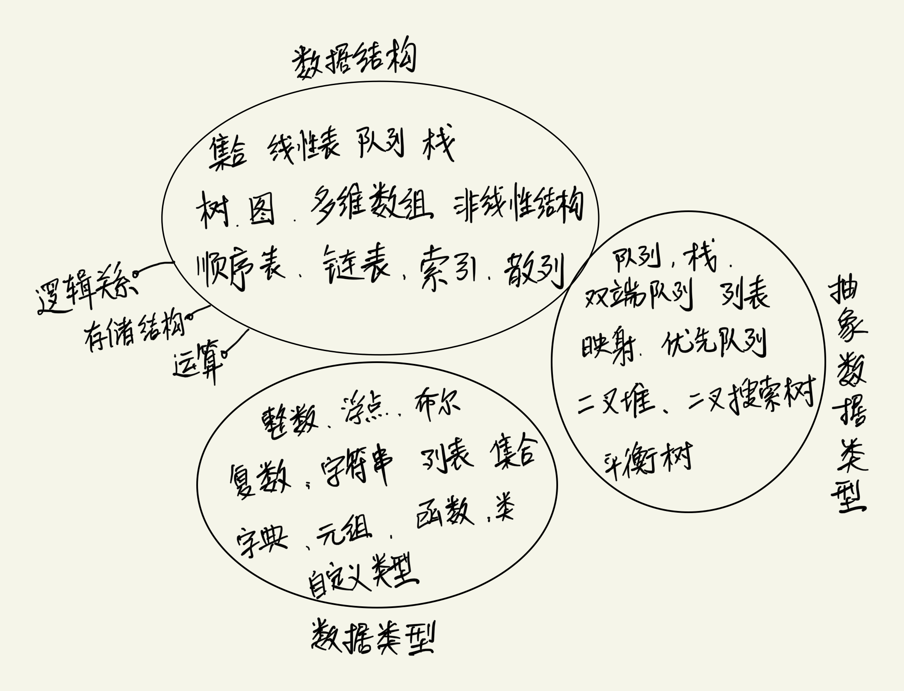

```python
x = 10
y = "Hello"
z = [1, 2, 3]

def foo():
    print("hello, world!")
class A:
    def __init__(self):
        self.x = 0
a=A()
```

- Python之中，万物皆对象，类型也是对象；`Object`是所有类型的父类。
  1. `type()` —— 查“精确类型”
  2. `isinstance()` —— 查“是不是这一类”
  3. `issubclass()` —— 查“类与类之间关系”

```python
type(x), type(y), type(z), type(foo), type(A), type(a)
```

```python
isinstance(x,int), isinstance(A, type), isinstance(a, A), isinstance(object, type), isinstance(type, object)
```

```python
issubclass(A, object), issubclass(int, object), issubclass(type, object)
```

## 什么是线性结构

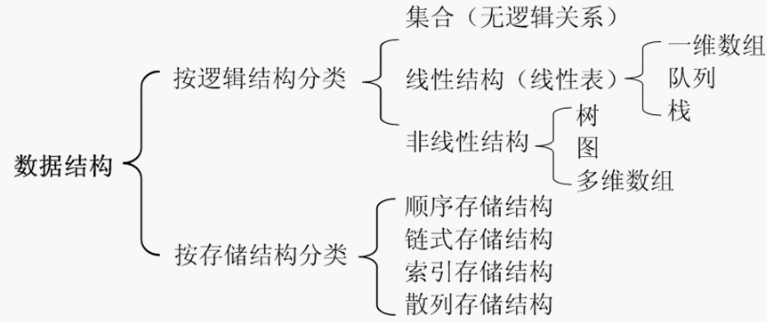

- 我们从 4 个最简单但功能强大的结构入手，开始研究数据结构
- 栈 Stack，队列 Queue，双端队列 Deque 和列表 List
  - 这些数据集的共同点在于，数据项之间只存在先后的次序关系
  - 新的数据项加入到数据集中时，只会加入到原有某个数据项之前或 之后
  - 每个数据项“直接” 的前面，或者后面，都最多有另一个数据项。
  - 具有这种性质的数据集，就称为线性数据结构。
- 线性结构总有两端，在不同的情况下，两端的称呼也不同
  - 有时候称为“左”“右”端、“前”“后”端、“顶”“底”端
- 两端的称呼并不是关键，不同线性结构的关键区别在于数据项增减 的方式
  - 有的结构只允许数据项从一端添加，而有的结构则允许数据项从两端移除
- 这些线性结构是应用最广泛的数据结构，它们出现在各种算法中，用来解决大量重要问题

### 线性结构的数学定义

- 线性表是 n 个数据元素的有限序列，可以记为 L=($a_0, a_2,…a_{n−1}$)
  - 数据元素之间的关系：$a_{i−1}$ 领先于 $a_i$
  - $a_{i-1}$是$a_i$的直接前驱元素，$a_i$是$a_{i-1}$的直接后继元素
  - 除 $a_0$ 外，每个元素有且仅有一个直接前驱元素
  - 除 $a_{n−1}$ 外，每个元素有且仅有一个直接后继元素
  - n 称为线性表长度
  - n=0 为空表
- 这里定义的是它的逻辑结构

### 线性结构常用的存储结构

- 顺序表
  - 按索引值从小到大存放在一片相邻的连续区域，例如数组
  - 紧凑结构，存储效率为 100%


* 链表
  * 单链表
  * 双链表
  * 循环链表
  * 用额外的空间存储指针
  * 一般使用非连续的空间，也可以使用连续空间

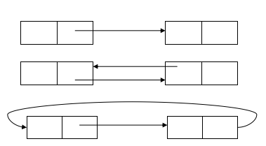

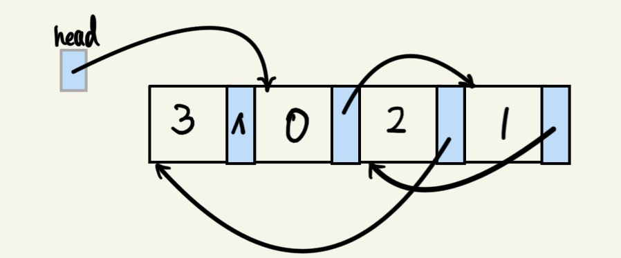

#### 顺序表 Array

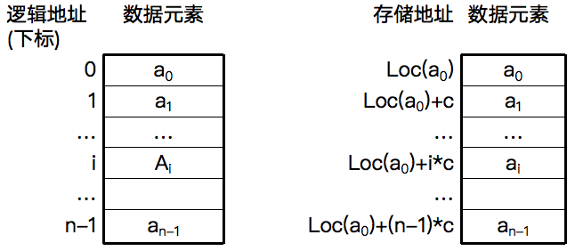

- 元素地址计算如上所示（等差数列）：
- 每个元素的类型一样，至少大小一样。
- Python 的列表list是最像顺序表的，具有很多顺序表的特性，但又不完全是。
    > id():Return the identity of an object, which equals its memory
    > address in CPython

```python
# 创建一个顺序表（列表）
my_list = [10, 20, 30]

print("列表元素的内存地址演示：")
for i, val in enumerate(my_list):
    # id(val) 获取该元素的内存地址
    # hex() 转换为十六进制（通常内存地址的表达方式）
    print(f"索引 {i} | 值: {val} | 内存地址: {hex(id(my_list[i]))}")

# 验证：如果修改元素，地址会变，因为 Python 重新指向了新对象
my_list[0] = 11
print(f"修改后索引 0 的地址: {hex(id(my_list[0]))}")
```

```python
import array
import ctypes

# 创建一个存储整型(i)的连续数组
arr = array.array('i', [10, 20, 30])

# 获取数组首元素的基地址
base_addr = arr.buffer_info()[0]

print("原生数组（顺序表）的物理连续地址演示：")
for i in range(len(arr)):
    # 理论地址 = 基地址 + 索引 * 元素大小(int通常是4字节)
    offset_addr = base_addr + i * arr.itemsize
    print(f"索引 {i} | 值: {arr[i]} | 物理地址: {hex(offset_addr)}")
```

#### 单链表（singly linked list）

- 简单的单链表
  - 整个单链表：head 头指针
  - 第一个结点：head
  - 空表判断：head == NULL
  - 当前结点 $a_1$：curr
  - 尾指针（有的话）：tail
- 从当前一个元素很容易找到下一个元素，反之很麻烦
  - 顺序表正反都很容易
- 如果要在 curr 之前插入一个元素怎么办？

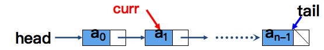

* 带“空的”头结点的单链表（“空的”两字习惯性省略）
  - 整个单链表：head
  - 第一个结点：head.next，head 恒不为空
  - 空表判断：head.next == NULL
  - 当前结点：fence.next (fence: 篱笆；curr 隐含)
* 带头结点的单链表，不论删除和插入的位置如何，不需要修改head 的值，不带头结点的单链表则需要修改 head 的值。
* 用额外的空间开销，交换代码的简洁性

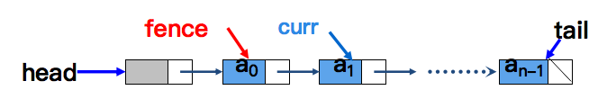

* 单链表的插入
  - 创建新结点
  - 新结点指向右边的结点
  - 左边结点指向新结点

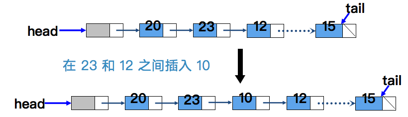

* 单链表的插入：在指定结点后面插入新结点

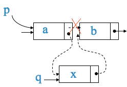

* 单链表的删除：删除指定结点后面的结点


##### 例题：单链表的反转
- 直接用结点表示链表
- 复制一个单链表进行反转

```python
class Node:
    def __init__(self, payload, next=None) :
        self.data = payload
        self.next = next

class Solution:
    def reversed (self, header):
        """
        反转单链表
        请在这里填写你的代码：
        """

    def myprint (self, header):
        nodes = []
        curr = header
        while curr:
            nodes.append(f"[{curr.data}]")
            curr = curr.next
        print(" -> ".join(nodes) + " -> None")

header = None
for i in range(7):
    header = Node (i, header)

sol = Solution()
sol.myprint(header)
sol.myprint(sol.reversed(header))
```
<details>
<summary>答案</summary>

- 反转单链表，
```
class Solution:
    def reversed (self, header):
        """
        反转单链表
        """
        res, curr = None, header
        while curr :
            res = Node(curr.data, res)
            curr = curr.next
        return res

    def myprint (self, header):
        nodes = []
        curr = header
        while curr:
            nodes.append(f"[{curr.data}]")
            curr = curr.next
        print(" -> ".join(nodes) + " -> None")
```
</details>

##### 例题：LinkList类反转

- 在 Node 外面另外包了一个 LinkList 类
- 在原对象上面反转链表结点

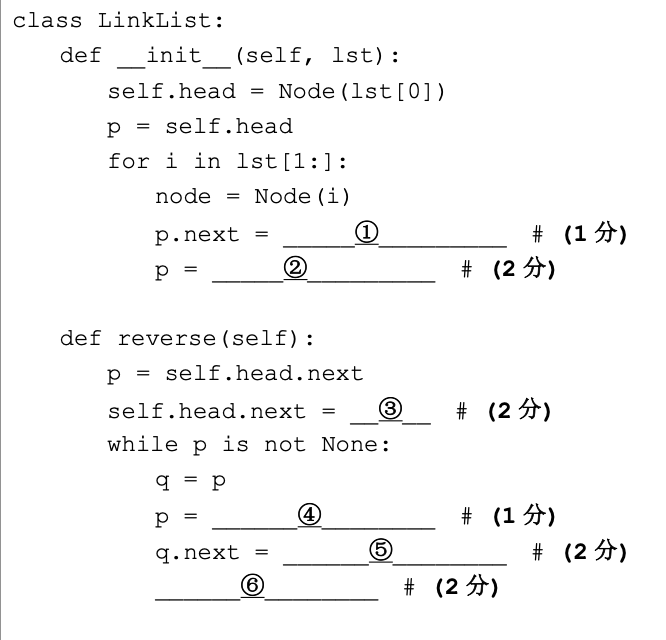
<details>
<summary>答案</summary>

- 反转单链表，

```
class Node:
    def __init__(self, payload, next=None) :
        self.data = payload
        self.next = next

class LinkList:
  def __init__(self, lst):
    self.head = Node (lst[0])
    p = self.head
    for i in lst [1:]:
      node = Node(i)
      p.next = node
      p = p.next

  def reverse (self) :
    p = self.head.next
    self.head.next = None
    while p is not None:
      q = p
      p = p.next
      q.next = self.head
      self.head = q

lnk = LinkList([1, 2, 3])
lnk.reverse()
```
</details>


##  栈Stack

- 栈Stack：什么是栈？ 
  - 栈Stack是一种有次序的数据项集合，在栈中，数据项的加入和移除都仅发生在同一端
    - 这一端通常叫做栈“顶top”，另一端就叫做栈“底base”
  - 距离栈底越近的数据项，留在栈中的时间就越长，而最新加入栈的数据项会被最先移除
  - 这种次序通常称为“后进先出LIFO”：Last in First out，这是一种基于数据项保存时间的次序，时间越短的离栈顶越近，而时间越长的离栈底越近
  - 日常生活中有很多栈的应用
    - 盘子、托盘、书堆等等


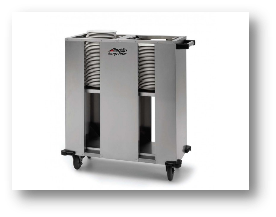

- 栈的特性：反转次序 
  - 左下图的栈里面混合了几种 python 原生数据类型
    - 进栈和出栈的次序正好相反
  - 这种访问次序反转的特性，我们在某些计算机操作上碰到过
    - 浏览器的“后退 back”按钮，最先 back 的是最近访问的网页
    - Word 的“Undo”按钮，最先撤销的是最近的操作

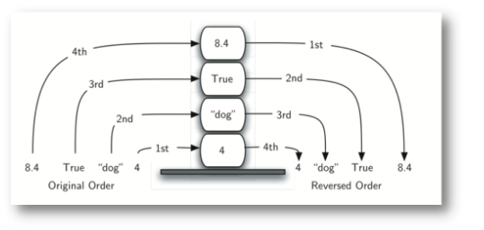
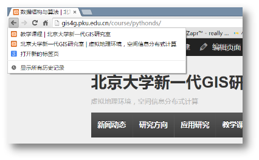

### 抽象数据类型 Stack

- 抽象数据类型“栈”是一个有次序的数据集，每个数据项仅从“栈顶” 一端加入到数据集中、从数据集中移除，栈具有后进先出 LIFO 的 特性
- 定义抽象数据类型“栈”，包含如下的操作
  - Stack()：创建一个空栈，其中不包含任何数据项
  - push(item)：将 item 数据项加入栈顶，无返回值
  - pop()：将栈顶数据项移除，返回栈顶的数据项，栈被修改
  - peek()：“窥视”栈顶数据项，返回栈顶的数据项但不移除，栈不被修改
  - isEmpty()：返回栈是否为空栈
  - size()：返回栈中有多少个数据项

* 操作样例
 
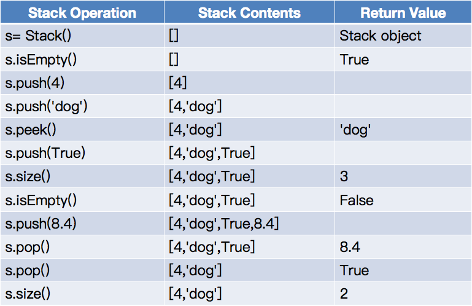

#### 用 Python 实现 ADT Stack
- Python 没有专门的内置栈数据类型
- 在清楚地定义了抽象数据类型 Stack 之后，我们看看如何用Python 来实现它
- Python 的面向对象机制，可以用来实现用户自定义类型
  - 将 ADT Stack 实现为 Python 的一个 Class
  - 将 ADT Stack 的操作实现为 Class 的方法
  - 内部选用最常用的数据类型 list 来实现
- 一个细节：Stack 的两端设置，栈顶和栈底
  - 可以将 List 的任意一端（index=0 或者-1）设置为栈顶
  - 我们选用 List 的末端（index=-1）作为栈顶（想想为什么？）
  - 这样栈的操作就可以通过对 list 的 append 和 pop 来实现，很简单！

```python
class Stack:
  def __init__(self):
    self.items = []

  def isEmpty(self):
    return self.items == []

  def push (self, item):
    self.items.append(item)

  def pop (self):
    return self.items.pop()

  def peek(self):
    return self.items[len(self.items)-1]

  def size(self):
    return len(self.items)
```

- 实现了之后就不再“抽象”，变成“自定义数据类型”

* Stack 测试代码


```python
s=Stack()
print(s.isEmpty())
```

```python
s.push (4)
s.push(' dog')
print(s.peek())
```

```python
s.push(True)
print (s.size())
print(s.isEmpty())
```

```python
s.push(8.4)
print(s.pop())
print (s.pop())
print (s.size())
```

```python

```

#### 例题

- 数字1、2、3、4、5、6依次入栈，最终全部出栈，得到的序列有多少种可能？
  - 卡特兰数：观察`1`在出栈队列中的位置，它把其他的数进行了分割。
$$ c_0=1,  c_{n+1} = \sum_{i=0}^n{}c_{i}c_{n-i} $$

- 下面的序列哪些是正确的，哪些是错误的？
```
                 A) 1、2、3、4、5、6
                 B) 6、5、4、3、2、1
                 C) 3、4、1、2、5、6
                 D) 4、3、2、5、1、6
```

#### ADT Stack 的另一个实现

- 如果我们把 List 的另一端（首端 index=0）作为 Stack 的栈顶，同样也可以实现 Stack。（左下图）
- 不同的实现方案保持了 ADT 接口的稳定性
  - 但性能有所不同，栈顶首端的版本（左），其 push/pop 的复杂度为O(n)，而栈顶尾端的实现（右），其 push/pop 的复杂度为 O(1)
  - 没有特别说明，一般指效率较高的栈顶尾端实现

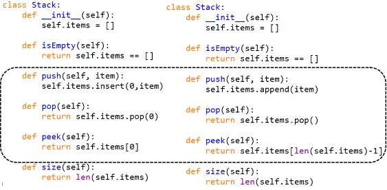

### 栈的应用：括号匹配

- 简单括号匹配
  - 我们都写过这样的表达式：(5 + 6) × (7 + 8)/(4 + 3)
    - 这里的括号是用来指定操作符的计算优先级
  - 有些函数式语言，如 Lisp，在函数定义的时候会用到大量的括号比如：

  ```
  (defun square(n) (* n n))
  ```

    - 这个语句定义了一个计算平方值的函数
  - 当然，括号的使用必须遵循一定的“平衡”规则
    - 首先，每个开括号要恰好对应一个闭括号；
    - 其次，每对开闭括号要正确的嵌套
    - 再次，先有开括号，后有闭括号
    - 正确的括号：(()()()())，(((())))，(()((())()))
    - 错误的括号：((((((())，()))，(()()(()，)))(((

- 对括号是否正确匹配的识别，是很多语言编译器的基础算法
- 下面分析下如何构造这个括号匹配识别的算法
  - 从左到右扫描括号串，最新打开的左括号，应该匹配最先遇到的右括号
  - 这样，第一个左括号（最早打开），就应该匹配最后一个右括号（最后遇到）
  - 从右括号的角度看，每个右括号都应该匹配刚最后出现的左括号
  - 这种次序反转的识别，正好符合栈的特性！

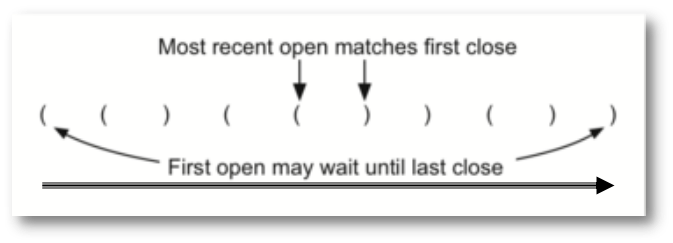

#### 括号匹配的栈算法
- 从左至右扫描变量字符串中的每一个字符。
- 如果扫描到的字符是左括号’(’, 则把该字符压入堆栈
- 如果扫描到的是右括号’)’，那么如果此时堆栈为空，表示括号字符串不匹配：有多余的右括号
- 如果扫描到的是右括号，并且堆栈不为空，那么弹出堆栈顶部的字符’(’，匹配掉一对括号。
- 当每个括号字符都扫描完毕后，
  - 堆栈不为空(，那么字符串中的括号不匹配：有多余的左括号；
  - 如果堆栈为空，那么字符串中的括号就匹配。

```python
#括号匹配
def parChecker(symbolString):
  s = Stack()
  for c in symbolString:
    if c=='(':
      s.push(c)
    else:
      assert c==')'
      if s.isEmpty(): 
        return False
      else:
        s.pop ()
  else:
    return s. isEmpty()
```
> assert 是 Python 里一个调试用的断言语句，用来“强行检查某个条件必须成立”。
> 可以把它理解为一句话：“我认为这里一定是对的，如果不是，就直接报错。”
```python
print(parChecker("((()))"))
print(parChecker("(()"))
print(parChecker("())"))
```

```python

```

#### 多种括号的匹配

- 在实际的应用里，我们会碰到更多种括号，如 python 中列表所用的方括号“[]”，字典所用的花括号“{}”, 元组和表达式所用的圆括号“()”
- 这些不同的括号有可能混合在一起使用，由此就要注意各自的开闭匹配情况
- 下面这些是匹配的
  - `{ { ( [ ] [ ] ) } ( ) }`
  - `[ [ { { ( ( ) ) } } ] ]`
  - `[ ] [ ] [ ] ( ) { }`
- 下面这些是不匹配的
  - `( [ ) ] ( ( ( ) ] ) )`
  - `[ { ( ) ]`

* 通用括号匹配代码
  - 需要改进的地方
    - 碰到各种左括号仍然入栈
    - 碰到各种右括号的时候需要判断栈顶的左括号是否跟右括号属于同一种类

```python
#多种括号匹配(),[],{}
pars={'(':')', '[':']','{':'}'} 

def parChecker(symbolString):
  s = Stack()
  for c in symbolString:
    if c in pars: 
      s.push(c)
    else:
      if s.isEmpty(): 
        return False
      elif pars[s.peek()] == c:
        s.pop()
      else:
        return False
  else:
    return s.isEmpty()
```
```python
print(parChecker('{{([][])}()}')
print(parChecker('[[{{(())}}]]')
print(parChecker('[][][](){}')
print(parChecker('([)]((()]))')
print(parChecker('[{()]')
```

### 栈的应用：进制转换

#### 十进制转换为二进制
- 二进制是计算机原理中最基本的概念，作为组成计算机最基本部件的逻辑门电路，其输入和输出均仅为两种状态：0 和 1
- 但十进制是人类传统文化中最基本的数值概念，如果没有进制之间的转换，人们跟计算机的交互会相当的困难
- 整数是最通用的数据类型，我们经常需要将整数在二进制和十进制之间转换
  - 如：$(233)_{10}$的对应二进制数为$(11101001)_{2}$，具体是这样：
   $$(233)_{10}=2\times{}10^2+3\times{}10^1+3\times{}10^0$$
   $$(11101001)_2=1\times{}2^7+1\times{}2^6+1\times{}2^5+0\times{}2^4+1\times{}2^3+0\times{}2^2+0\times{}2^1+1\times{}2^0$$
- 十进制转换为二进制，采用的是“除以 2”的算法
  - 将整数不断除以 2，每次得到的余数就是由低到高的二进制位

* “除以 2”的过程，得到的余数是从低到高的次序，而输出则是从高到低，所以需要一个栈来反转次序

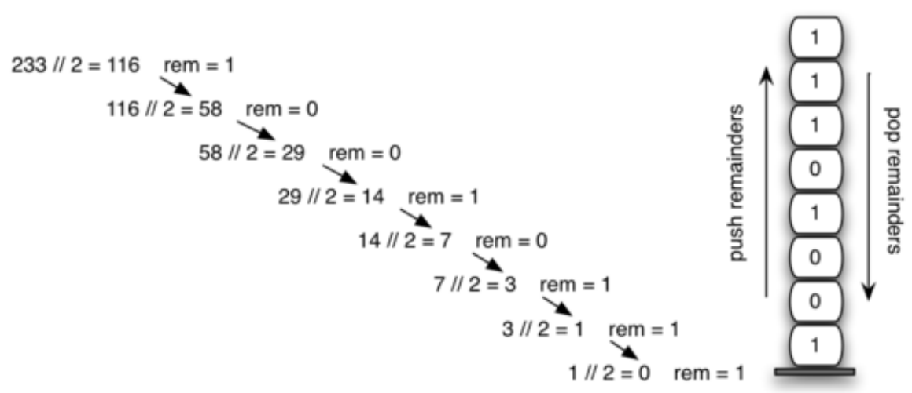

* 十进制转换为二进制：代码

```python
# 十进制转二进制
# rem:remainder 余数
def bin0fDec(decNumber):
  remStack = Stack()
  while decNumber > 0:
    decNumber, rem = divmod(decNumber, 2)
    remStack.push(rem)

  binString = ''
  while remStack.size() > 0: #反转取数
    binString = binString + str(remStack.pop())
  return binString

print(bin0fDec(47))

```

#### 扩展到更多进制转换

- 十进制转换为二进制的算法，很容易可以扩展为转换到任意进制，只需要将“除以 2”算法改为“除以 N”算法就可以
- 计算机中另外两种常用的进制是八进制和十六进制
    - $(233)_{10}$等于$(351)_8$和$(E9)_{16}$
             $$(351)_8=3×8^2+5×8^1+1×8^0$$
             $$(E9)_{16}=14×16^1+9×16^0$$
- 主要的问题是如何表示八进制及十六进制
  - 二进制有两个不同数字 0、1
  - 十进制有 10 个不同数字 0、1、2、3、4、5、6、7、8、9
  - 八进制可用 8 个不同数字 0、1、2、3、4、5、6、7
  - 十六进制的 16 个数字则是 0、1、2、3、4、5、6、7、8、9、A、B、C、D、E、F

```python
# 十进制转十六以下任意进制
def baseConverter(decNumber, base)->str:
  digits = "0123456789ABCDEF"
  remStack = Stack()
  while decNumber > 0:
    decNumber, rem = divmod(decNumber, base)
    remStack.push(rem)      

  newString =""
  while remStack.size() > 0:   #反转取数
    newString = newString + digits[remStack.pop()]
  return newString

print(baseConverter(25, 2))
print(baseConverter (25, 16))
```

```python

```

### 栈的应用：表达式

#### 前缀、中缀和后缀表达式

- 表达式是计算机中基础且重要的应用
  - 相关内容繁多：中缀、前缀、后缀、全括号、表达式树、求值

##### 中缀表达式

- 我们习惯中表达式的样子：`B*C`，很容易知道这是 B 乘以 C
- 这种操作符（operator）介于操作数（operand）中间的表示法，称为“中缀”表示法
- 但有时候“中缀”表示法会引起混淆，如`A+B*C`，是 A+B 然后再乘以 C，还是 `B*C` 然后再去加 A？
  - 人们引入了操作符“优先级”的概念来消除混淆，规定高优先级的操作符先计算，相同优先级的操作符从左到右依次计算
    - 这样 `A+B*C` 就没有歧义：是 A 加上 B 与 C 的乘积
  - 同时引入了括号来表示强制优先级，括号的优先级最高，而且在嵌套的括号中，内层的优先级更高
    - 这样 `(A+B)*C` 就是 A 与 B 的和再乘以 C

* 全括号中缀表达式
  - 虽然人们已经习惯了这种表示法，但交给计算机处理，额外的规则越少越好。
  - 全括号表达式：在所有的表达式项两边都加上括号
    - 表达式项：由操作符和它操作的对象组成，对象可以是操作数，也可以是其他的表达式项（子表达式）
    - `A+B*C+D`，应表示为 `((A+(B*C))+D)`
  - 或者...表达式中的操作符一定要放在操作数的中间吗？

##### 前缀和后缀表达式

- 例如中缀表达式 A+B，将操作符移到前面，变为“+AB”，或者将操作符移到最后，变为“AB+”
- 我们就得到了表达式的另外两种表示法：“前缀”和“后缀”表示法
  - 以操作符相对于操作数的位置来定义
- 这样 `A+B*C` 将变为前缀的`+A*BC`，后缀的`ABC*+`
    
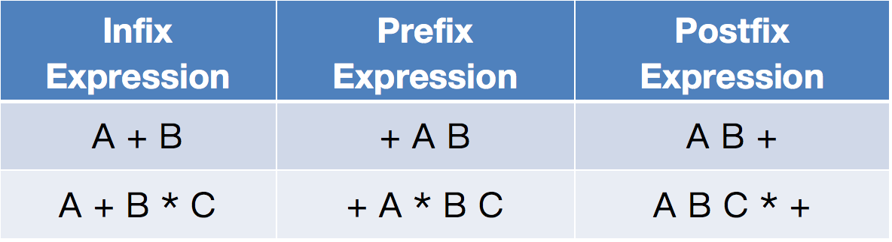

- 再来看中缀表达式`(A+B)*C`，按照转换的规则，前缀表达式是`*+ABC`，而后缀表达式是`AB+C*`
- 神奇的事情发生了，在中缀表达式里必须的括号，在前缀和后缀表达式中消失了？
- 在前缀和后缀表达式中，操作符的次序完全决定了运算的次序，不再有混淆
  - 所以在计算机中表达式尽量避免使用复杂的中缀形式

* 下面看更多的例子

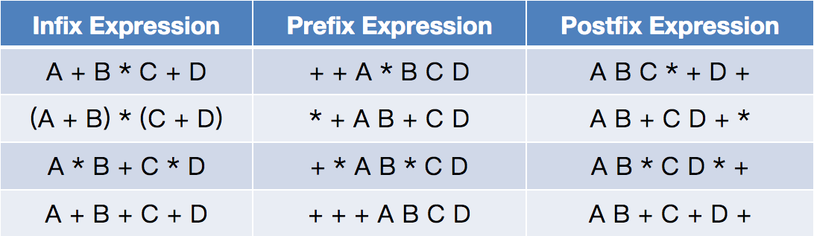

##### 中缀转前缀和后缀形式

- 目前为止我们仅手工转换了几个中缀表达式到前缀和后缀的形式，那么一定得有个算法来转换任意复杂的表达式
- 我们先尝试一个简单点的问题：如何把全括号表达式转换为前缀和后缀形式
- `A+B*C`，如果写成全括号形式：`(A+(B*C))`，显式表达了计算次序
- 我们注意到每一对括号，都包含了一组完整的操作符和操作数
- 看子表达式 `(B*C)` 的右括号，如果把操作符`*` 移到右括号的位置，替代它，再删去左括号，得到 `BC*`，这个正好把子表达式转换为后缀形式
  - 进一步再把更多的操作符移动到相应的右括号处替代之，再删去左括号，那么整个表达式就完成了到后缀表达式的转换

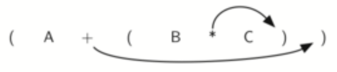

- 同样的，如果我们把操作符移动到左括号的位置替代之，然后删掉所有的右括号，也就得到了前缀表达式

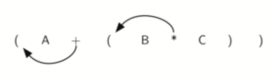

* 复杂的表达式转换成前缀或者后缀形式，只需要两个步骤
  - 将中缀表达式转换为全括号形式
  - 把操作符移动到子表达式所在的左括号（前缀）或者右括号（后缀）处，再删除括号；
  - 在括号匹配算法代码的基础上实现

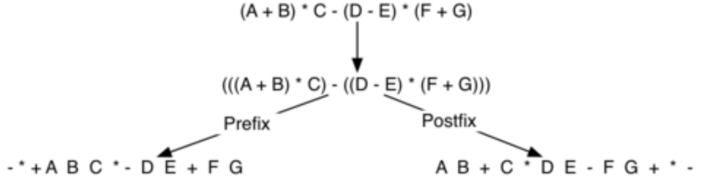

* 全括号表达式天然是一个树结构
    `(左表达式项 运算符 右表达式项)`
  - 可以轻松的使用递归调用:
    `convert = lambda expr: convert(left)+convert(right)+op`

##### 前缀、后缀转全括号中缀
- 前缀转中缀，从左往右扫描，每次看到一个操作符和两个操作数，就替换为一个带括号的“操作数”，不断进行，直到全部变成中缀表达式
- 后缀转中缀，从左往右扫描，每次看到两个操作数和一个操作符，就替换为一个带括号的“操作数”，不断进行，直到全部变成中缀表达式

#### 调度场算法

Shunting Yard Algorithm（调度场算法, Edsger W. Dijkstra），算法的名字来自火车调度场的比喻：

```
输入表达式 = 一列火车
运算符栈 = 调度轨道
输出队列 = 排好顺序的车厢
```
中缀表达式中的运算符根据优先级被“调度”到正确位置，从而得到我们需要的后缀表达式。

##### 算法思路

- 首先我们来看中缀表达式 `A+B*C`，其对应的后缀表达式是 `ABC*+`
  - 操作数 ABC 的顺序没有改变。
  - 后缀表达式中操作符的出现顺序与运算次序一致。
  - 由于`*` 的优先级比 + 高，操作符的出现顺序，在后缀表达式中反转了，
- 在中缀表达式转换为后缀形式的处理过程中，操作符比操作数要晚输出；
  - 由于操作符有优先级，即使在后面的操作数输出之后，操作符仍不能马上输出，而需要等一个优先级不高于自己操作符；
  - 在此之前要把操作符先保存起来。
  - 在 `A+B*C` 中，+ 虽然先出现，但优先级比后面这个`*` 要低，所以它必须要等。
    - 等一个不优先于自己的操作符
    - 或者：等表达式结束，暂存的所有操作符都要输出
- 如果操作符优先级一个比一个高的话，都不能输出，只能把它们暂存起来。
- 这个优先级严格递增的操作符序列最后会被反转输出，这种特性使得我们考虑用栈来保存它们

- 再看看括号的作用：`(A+B)*C`，对应的后缀形式是 `AB+C*`。
  - 这一次，+ 的输出比 `*` 要早，主要是因为括号使得 + 的优先级提升，高于括号之外的`*`
- 回顾上节的“全括号”技术，后缀表达式中操作符应该出现在左括号对应的右括号位置
- 所以遇到左括号，要标记下，其后出现的操作符优先级提升了，一旦扫描到对应的右括号，就可以马上输出这个操作符
- 也可以理解为：括号里面的内容构成了一个子表达式，右括号意味着子表达式的结束

> 总结
> - 在从左到右扫描逐个字符扫描中缀表达式的过程中，采用一个栈来暂存未处理的操作符，
> - 这样，栈顶的操作符就是最近暂存进去的，当遇到一个新的操作符，就需要跟栈顶的操作符比较下优先级，再行处理。
> - 后面的算法描述中，约定中缀表达式是由空格隔开的一系列单词（token）构成，操作符单词包括`*/+-()`，而操作数单词则是单字母标识符 A、B、C 等。

##### 算法流程

- 创建空栈 opstack 用于暂存操作符，空列表用于输出后缀表达式
- 用 split 方法，将中缀表达式转换为单词（token）的列表
- 从左到右扫描中缀表达式单词列表
  - 如果单词是一个操作数，则直接添加到后缀表达式列表的末尾
  - 如果单词是一个左括号“(”，则压入 opstack 栈顶
  - 如果单词是一个右括号“)”，则反复弹出 opstack 栈顶的操作符，加入到输出列表末尾，直到碰到左括号
  - 如果单词是一个操作符`*/+-`，则压入 opstack 栈顶。
    - 但在压入之前，要比较其与栈顶操作符的优先级，
    - 如果栈顶的高于或等于它，就要反复弹出栈顶操作符，加入到输出列表末尾，
    - 直到栈顶的操作符优先级低于它
- 中缀表达式单词列表扫描结束后，把 opstack 栈中的所有剩余操作符依次弹出，添加到输出列表末尾
- 把输出列表再用 join 方法合并成后缀表达式字符串，算法结束。

* 实例

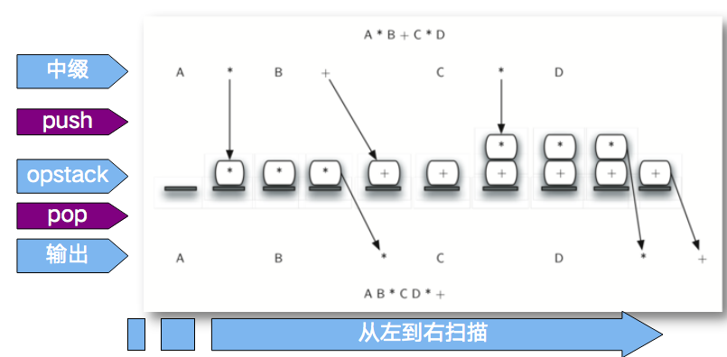

* 中缀转后缀代码

```python
#中缀转后缀代码
prec = {"*":3, "":3, "+":2, "-": 2, "(": 1}    #用字典记录操作符优先级

def infixToPostfix(infixexpr):
  opStack, postfixList = Stack(), []           #变量初始化
  tokenList = infixexpr.split()                #把中缀解析成单词列表
  for token in tokenList:
    if token in "ABCDEFGHIJKLMNOPQRSTUVWXYZ" or token in "0123456789":
      postfixList.append (token)               #操作数
    elif token == '(':                         #标记子表达式开始
      opStack.push(token)
    elif token == ')':                         #子表达式结束
      while opStack.peek() != '(':             #清空子表达式中的在栈操作符
        postfixList.append(opStack.pop())
      else:
        opStack.pop()                          #弹出"（'
    else:                                      #操作符
      while (opStack.size()>0 and prec[opStack.peek()] >= prec[token]):
        postfixList.append(opStack.pop())      #弹出栈中的优先操作符
      opStack.push(token)                      #当前操作符进栈等待

  while opStack.size()>0:                      #输入结束，清空栈中操作符
    postfixList.append(opStack.pop())

  return " ".join(postfixList)

print(infixToPostfix("A + B * 5"))
print(infixToPostfix("( A + B ) * 5"))
```

#### 后缀表达式求值
- 作为栈结构的结束，我们来讨论“后缀表达式求值”问题
- 跟中缀转换为后缀问题不同，在对后缀表达式从左到右扫描的过程中，由于操作符在操作数的后面，所以要暂存操作数，在碰到操作符的时候，再将暂存的两个操作数进行实际的计算
  - 仍然是栈的特性：操作符只作用于离它最近的两个操作数

* 如`4 5 6 * +`，我们先扫描到 4、5 两个操作数，但还不知道对这两
个操作数能做什么计算，需要继续扫描后面的符号才能知道
* 继续扫描，又碰到操作数 6，所以还不能知道如何计算，继续暂存入栈，直到`*`，现在知道是栈顶两个操作数 5、 6 做乘法，我们弹出两个操作数，计算得到结果 30
  - 需要注意：先弹出的是右操作数，后弹出的是左操作数，这个对于’-’和’/’ 很重要！
* 为了继续后续的计算，需要把这个中间结果 30 压入栈顶
* 当所有操作符都处理完毕，栈中只留下 1 个操作数，就是表达式的值

- 算法实例

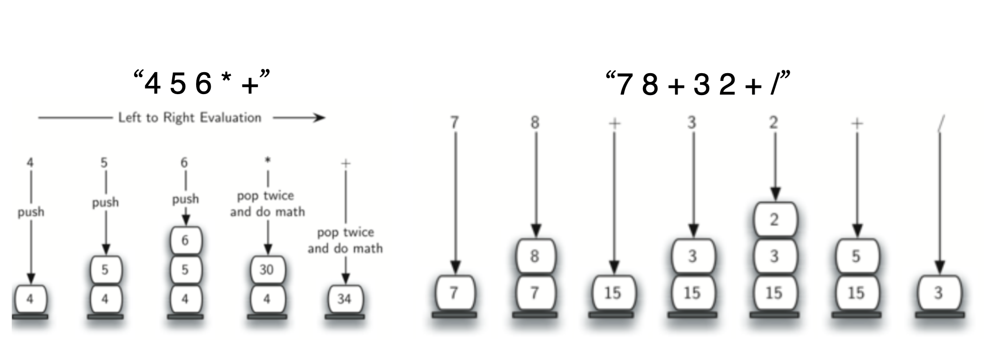

- 流程
  - 创建空栈 operandStack 用于暂存操作数
  - 将后缀表达式用 split 方法解析为单词（stoken）的列表
  - 从左到右扫描单词列表
    - 如果单词是一个操作数，将单词转换为整数 int，压入 operandStack栈顶
    - 如果单词是一个操作符`*/+-`，就开始求值
      - 从栈顶弹出 2 个操作数，先弹出的是右操作数，后弹出的是左操作数，
      - 计算后将值重新压入栈顶
  - 单词列表扫描结束后，表达式的值就在栈顶
  - 弹出栈顶的值，返回。

* 代码
```python
def postfixEval(postfixExpr):
    operandStack = Stack()
    tokenList = postfixExpr.split()

    for token in tokenList:
        if token in "0123456789":
            operandStack.push(int(token))
        else:
            operand2 = operandStack.pop()
            operand1 = operandStack.pop()
            result = doMath(token, operand1, operand2)
            operandStack.push(result)
    return operandStack.pop()

def doMath(op, op1, op2):
    if op == "*":
        return op1 * op2
    elif op == "/":
        return op1 / op2
    elif op == "+":
        return op1 + op2
    else:
        return op1 - op2

if __name__ == "__main__":
  print(postfixEval("7 5 + 5 *"))
```

## 队列 Queue

什么是队列?

- 队列是一种有次序的数据集合，其特征是，新数据项的添加总发生在一端（通常称为“尾 rear”端），而现存数据项的移除总发生在另一端（通常称为“首front”端）
  - 当数据项加入队列，首先出现在队尾，随着队首数据项的移除，它逐渐接近队首。
- 新加入的数据项必须在数据集末尾等待，而等待时间最长的数据项则是队首。这种次序安排的原则称为（FIFO:First-in first-out）先进先出，或者叫“先到先服务 first-come first-served”
- 队列的例子出现在我们日常生活的方方面面：排队
- 队列仅有一个入口和一个出口，不允许数据项直接插入队中，也不允许从中间移除数据项

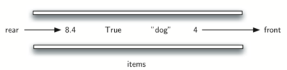

- 现实中有很多队列的例子
  - **打印队列** 当一台打印机面向多个用户提供服务时，由于打印速度比打印请求提交的速度要慢得多，所以有任务正在打印时，后来的打印请求就要排成队列，以 FIFO 的形式等待被处理。
  - **进程调度** 操作系统核心采用多个队列来对系统中同时运行的进程进行调度，由于 CPU 核心数总少于正在运行的进程数，将哪个进程放到 CPU 的哪个核心去运行多长的一段时间，是进程调度需要决定的事情，而调度的原则是综合了“先到先服务”及“资源充分利用”两个出发点。
  - **键盘缓冲** 有时候键盘敲击并不马上显示在屏幕上，需要有个队列性质的缓冲区，将尚未显示的敲击字符暂存其中，队列的先进先出性质则保证了字符的输入和显示次序一致性。

### 抽象数据类型 Queue

- 抽象数据类型 Queue 是一个有次序的数据集合，数据项仅添加到“尾 rear”端，而且仅从“首 front”端移除，Queue 具有 FIFO 的操作次序
- 抽象数据类型 Queue 由如下操作定义：
  - Queue()：创建一个空队列对象，返回值为 Queue 对象；
  - enqueue(item)：入队，将数据项 item 添加到队尾，无返回值；
  - dequeue()：出队，从队首移除数据项，返回值为队首数据项，队列被修改；
  - isEmpty()：测试是否空队列，返回值为布尔值；
  - size()：返回队列中数据项的个数。

* 队列操作

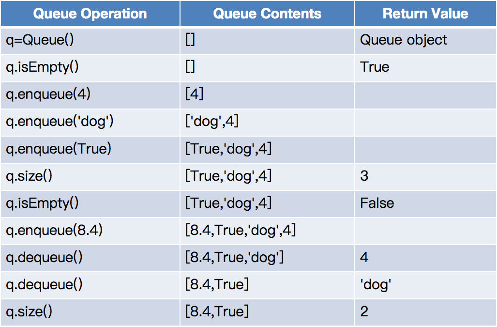

#### ADT：列表实现

- 采用 Python List 来容纳Queue 的数据项
- 将 List 的首端作为队列尾端, List 的末端作为队列首端
  - 倒过来也可以，入队/出对操作的复杂度也会倒过来
- **enqueue() 复杂度为 O(n)** 😭
- dequeue() 复杂度为 O(1)
- size() 的复杂度为 O(1)

```python
class Queue:
  def __init__ (self):
    self.items = []

  def isEmpty(self):
    return self.items == []

  def enqueue (self, item):
    self.items.insert (0,item)

  def dequeue (self):
    return self.items.pop()

  def size(self):
    return len (self.items)
```

#### ADT实现：环形队列
```python
class CircularQueue:
    def __init__(self, k):
        self.capacity = k + 1  # 实际空间多给1个，用于区分空和满
        self.queue = [None] * self.capacity
        self.head = 0
        self.tail = 0

    def isEmpty(self):
        # 首尾指向同一个地方，就是空的
        return self.head == self.tail

    def isFull(self):
        # tail的下一个位置如果是head，就是满了
        return (self.tail + 1) % self.capacity == self.head

    def size(self):
        # 环形队列算长度的通用公式
        return (self.tail - self.head + self.capacity) % self.capacity

    def enqueue(self, item):
        if self.isFull():
            return "Full"
        self.queue[self.tail] = item
        self.tail = (self.tail + 1) % self.capacity
        return True

    def dequeue(self):
        if self.isEmpty():
            return "Empty"
        item = self.queue[self.head]
        self.head = (self.head + 1) % self.capacity
        return item

```

- head (队首)：用于执行 dequeue（出队）
  - head指向队首元素
- tail (队尾)：用于执行 enqueue（入队）
  - 新元素放到tail指向位置
- pro: enqueue() 和 dequeue() 的复杂度都为 O(1)
- con: 队列有容量限制
- 增加方法 isFull()：测试是否满了，返回值为布尔值
- 增加 head 和 tail 指针（下标）
  - enqueue(): tail = (tail+1) % capacity
  - dequeue(): head = (head+1) % capacity
- 判断队列是否为空：head == tail
- 判断队列是否满：(tail+1) % capacity == head
- 实际可用容量：capacity - 1
- 队列的大小如何计算？

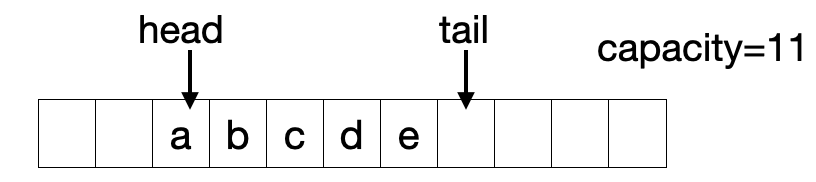

#### ADT：单链表实现
```python
class Node:
    """定义链表节点"""
    def __init__(self, value):
        self.value = value
        self.next = None

class LinkedQueue:
    def __init__(self):
        self.head = None  # 对应队首，用于出队
        self.tail = None  # 对应队尾，用于入队
        self._size = 0    # 记录队列长度

    def isEmpty(self):
        return self.head is None

    def size(self):
        return self._size

    def enqueue(self, item):
        """入队：在链表尾部添加"""
        new_node = Node(item)
        if self.isEmpty():
            self.head = new_node
            self.tail = new_node
        else:
            self.tail.next = new_node  # 旧尾部指向新节点
            self.tail = new_node       # 更新尾部指针
        self._size += 1

    def dequeue(self):
        """出队：从链表头部移除"""
        if self.isEmpty():
            return "Queue is Empty"

        item = self.head.value
        self.head = self.head.next  # 头部指针后移

        # 如果出队后变空了，tail 也要置空
        if self.head is None:
            self.tail = None

        self._size -= 1
        return item
```
* --- 测试代码 ---

```python
q = LinkedQueue()
q.enqueue("Python")
q.enqueue("Java")
q.enqueue("C++")

print(f"当前长度: {q.size()}")       # 输出: 3
print(f"出队元素: {q.dequeue()}")    # 输出: Python
print(f"出队后长度: {q.size()}")     # 输出: 2
```

使用单链表实现队列（Linked Queue）是一个非常经典的做法。
- 相比于顺序表（数组），它的优势在于不需要预先分配固定空间，
- 且入队和出队操作都是严格的 $O(1)$ 复杂度。在单链表实现中，
- 我们维护两个指针：
  - head (队首)：用于执行 dequeue（出队），即删除节点。
  - tail (队尾)：用于执行 enqueue（入队），即添加节点。

### 模拟算法：热土豆问题
- “击鼓传花”的西方版本，传烫手热土豆，鼓声停的时候，手里有土豆的小孩就要出列。
- 如果去掉鼓，改为传过固定人数，就成了“现代版”的约瑟夫问题
  - 约瑟夫问题是传说犹太人反叛罗马人，落到困境，约瑟夫和 39 人决定自杀，坐成一圈儿，报数 1～7，报到 7 的人出列自杀，结果约瑟夫给自己安排了个位置，最后活下来，投降了罗马…😓
  - 把题泛化：报数从 1～K(ill)

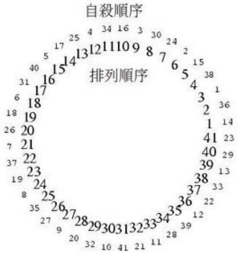
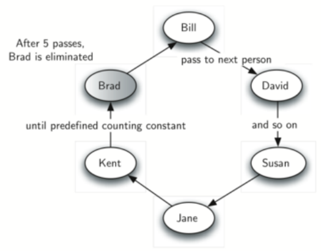

- 用队列来实现热土豆问题的算法，
  - 输入参加游戏的人名列表，以及传土豆次数 num，
  - 算法返回最后剩下的人名
- 模拟程序采用队列来存放所有参加游戏的人名，按照传递土豆的方向从队首排到队尾，游戏开始时持有土豆的人在队首
- 模拟游戏开始，只需要将队首的人出队，马上再到队尾入队，算是土豆的一次传递，这时土豆就在队首的人手里
- 传递了 num 次后，将队首的人移除，不再入队
- 如此反复，直到队列中剩余 1 人

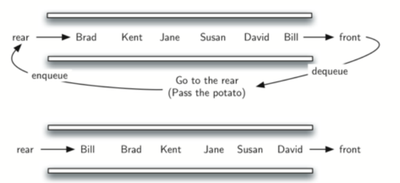

```python
def hotPotato(namelist, num):
  que = Queue ()
  for name in namelist: 
    que.enqueue(name) 
  while que.size() > 1:
    for i in range (num):
      que.enqueue(que.dequeue())          # 传递热土豆
    que.dequeue()                   # 去掉当前拿土豆的
  return que. dequeue ()

namelist=["Bill","David", "Susan","Jane", "Kent", "Brad"]
print(hotPotato(namelist,7))
```
- 也可以根据递推公式来做：当游戏人数t（序号$1\sim{}t$），传土豆报数1～n时，最后剩余人的序号为S

$$
S(t,n)=\begin{cases}
  1,      & \text{if $t=1$}\\
  (S(t-1,n)+n-1) \bmod t+1, & \text{other}
\end{cases}
$$

### 模拟仿真：打印任务
- 多人共享一台打印机，采取“先到先服务”的队列策略来执行打印任
务，在这种设定下，一个首要的问题就是，这种打印作业系统的容
量有多大？在能够接受的等待时间内，系统能容纳多少用户以多高
频率提交多少打印任务？
- 一个具体的实例配置如下：一个实验室，在任意的一个小时内，大
约有 10 名学生在场，这一小时中，每人会发起 2 次左右的打印，
每次 1～20 页，打印机的性能是：以草稿模式打印的话，每分钟 10
页，以正常模式打印的话，打印质量好，但速度下降为每分钟 5 页
- 问题是：怎么设定打印机的模式，让大家都不会等太久的前提下尽
量提高打印质量？
- 我们要用一段程序来模拟这种打印任务场景，然后对程序运行结果
进行分析，以支持对打印机模式设定的决策。

#### 如何对问题建模

- 首先对问题进行抽象，确定相关的对象和过程
  - 抛弃那些对问题实质没有关系的学生性别、年龄、打印机型号、打印内容、纸张大小等等众多细节
- 对象：打印任务、打印队列、打印机
  - 打印任务的属性：提交时间、打印页数
  - 打印队列的属性：具有 FIFO性质的打印任务队列
  - 打印机的属性：打印速度、是否忙

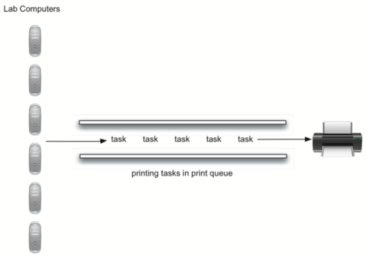

- 过程：生成和提交打印任务
  - 确定生成概率：实例为每小时会有 10 个学生提交的 20 个作业，这样，概率是每 180 秒会有 1 个作业生成并提交，概率为每秒1/180。
  - 确定打印页数：实例是 1～20 页，那么就是 1～20 页之间概率相同。
  - 把所有学生抽象成一个整体看待
- 过程：实施打印
  - 当前的打印作业：正在打印的作业
  - 打印结束倒计时：新作业开始打印时开始倒计时，回 0 表示打印完毕，可以处理下一个作业
- 模拟时间，用一个 loop 来代表一秒：
  - 统一的时间框架：以最小单位均匀流逝的时间，设定结束时间
  - 同步所有过程：在一个时间单位里，对生成打印任务和实施打印两个过程各处理一次

#### 模拟流程

- 创建打印队列对象
- 时间按照秒的单位流逝
  - 按照既定概率 1/180 产生打印任务，如果有任务产生，则记录任务时间戳，加入打印队列。
  - 如果打印机空闲，打印队列中还有打印任务，则：
    - 从打印队列中移除队首打印任务，交给打印机开始打印。
    - 将打印任务的生成时间戳与当前时间对比，得到该任务的等待时间
    - 记录这个任务的等待时间
    - 根据打印任务的页数，决定需要的打印时间
  - 如果打印机忙，就进行 1 秒的打印
  - 如果打印机中的任务打印完成，打印机就进入空闲状态
- 时间用尽，开始统计平均等待时间

* printer代码

```python
import random 
class Task:
  def __init__(self, time):
    self.arrive_time = time    #到达时间
    self.pages = random.randrange(1,21)

  def waitTime(self, current_time) :
    return current_time - self.arrive_time

class Printer:
  def __init__(self, ppm) :
    self.pagerate = ppm #打印速度，每分钟几页
    self.currentTask = None
    self.timeRemaining = 0 #任务完成倒计时

  def tick(self):        #打印1秒
    if self.currentTask != None:
      self.timeRemaining -= 1
      if self.timeRemaining <= 0:
        self.currentTask = None

  def busy (self):
    return self.currentTask != None

  def idle(self):
    return self.currentTask == None

  def startNext (self, newtask):
    self.currentTask = newtask
    self.timeRemaining = newtask.pages * 60 / self.pagerate
```

* 模拟主程序

```python
def newPrintTask():                       #是否产生一个新任务
  return random.randrange(1,181) == 180

def simulation(numSeconds, pagesPerMinute):
  """
  参数：
       numSeconds：模拟进行时间/s；
       pagesPerMinute：打印机每分钟输出页数
  """

  labprinter = Printer(pagesPerMinute)
  printQueue = Queue()
  waitingtimes = []

  for currentSecond in range(numSeconds):          #时间流逝
    if newPrintTask():                ＃随机产生任务放入队列
      printQueue.enqueue(Task(currentSecond))
    if labprinter.idle() and printQueue.size()>0:
      nexttask = printQueue.dequeue()
      waitingtimes.append(nexttask.waitTime(currentSecond))
      labprinter.startNext(nexttask)
    labprinter.tick()                          #打印机走一秒

  #模拟结束，统计结果
  averagewait = sum(waitingtimes)/len(waitingtimes)
  print ("Average Wait {:.3f} secs {} tasks remaining.".format
    averageWait, printQueue.size()))

for i in range (10):
  simulation (7200,10)
```

* 运行和分析
  - 按照 5PPM、1 小时的设定，模拟运行 10 次，结果如图
  - 总平均等待时间 93.1 秒，最长的平均等待 164 秒，最短的平均等待 26 秒
  - 有 3 次模拟，最后还有作业没开始打印

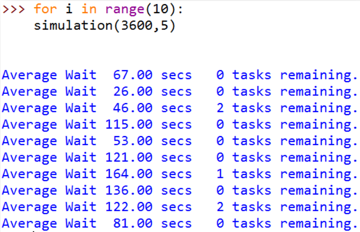

* 运行和分析二
  - 提升打印速度到 10PPM、1 小时的设定，模拟运行 10 次，结果如图
  - 总平均等待时间 12 秒，最长的平均等待 35 秒，最短的平均等待 0 秒，
  - 也就是提交的时候就立即打印了而且，所有作业都打印了

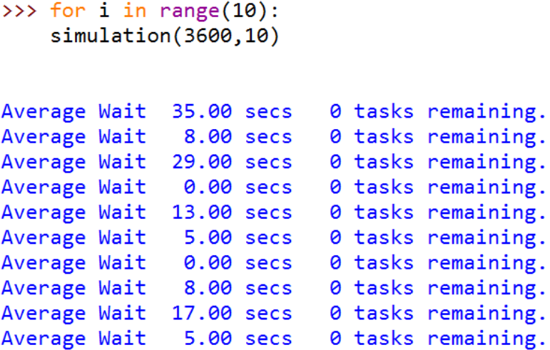

#### 问题讨论

- 为了对打印机打印模式设置进行决策，我们写了一个模拟程序来评估在一定概率下的打印情况及任务等待时间
- 通过两种情况模拟仿真结果的分析，我们认识到，如果有那么多学生要拿着打印好的程序源代码赶去上课的话，那么，必须得牺牲打印质量，提高打印速度。
- 模拟系统看似 Naive，能在不耗费现实资源的情况下预测事情的结果，来帮助我们进行决策
- 它可以逐步细化设定多次模拟，得到非常准确的结果
  - 例如早高峰的地铁发车间隔为 5 分钟时，车站会滞留多少乘客，每个乘客滞留时间？2 分钟呢？
  - 车站的客容量是有限的（假设 2000 人），过载会出现安全事故，会怎么影响发车间隔？

* 打印任务模拟程序还可以加进不同设定，来进行更丰富的模拟
  - 学生数量加倍了会怎么样？
  - 如果在周末，学生不需要赶去上课，能接受更长等待时间，会怎么样？
  - 如果改用 Python 编程，源代码大大减少，打印的页数减少了，会怎么样？
* 更真实的模拟，来源于对问题的更精细建模，以及以真实数据进行设定和运行
* 数学方法（比如递推公式）处理简单模型可能很高效，但模型逐步精细时，数学方法就会面临极大的困难。

## 双端队列Deque

什么是 Deque？
- 双端队列 Deque 是一种有次序的数据集，跟队列相似，其两端可以称作“首”“尾”端，但 deque 中数据项既可以从队首加入，也可以从队尾加入；数据项也可以从两端移除。
  - 某种意义上说，双端队列集成了栈和队列的能力。
- 但双端队列并不具有内在的 LIFO 或者 FIFO 特性，如果用双端队列来模拟栈或队列，需要由使用者自行维护操作的一致性

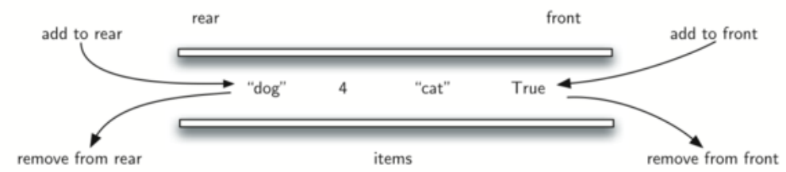

### 抽象数据类型Deque

- 抽象数据类型 Deque 是一个有次序的数据集，数据项可以从两端加入或者移除
- deque 定义的操作如下：
  - Deque()：创建一个空双端队列
  - addFront(item)：将 item 加入队首
  - addRear(item)：将 item 加入队尾
  - removeFront()：从队首移除数据项，返回值为移除的数据项
  - removeRear()：从队尾移除数据项，返回值为移除的数据项
  - isEmpty()：返回 deque 是否为空
  - size()：返回 deque 中包含数据项的个数

* 操作演示

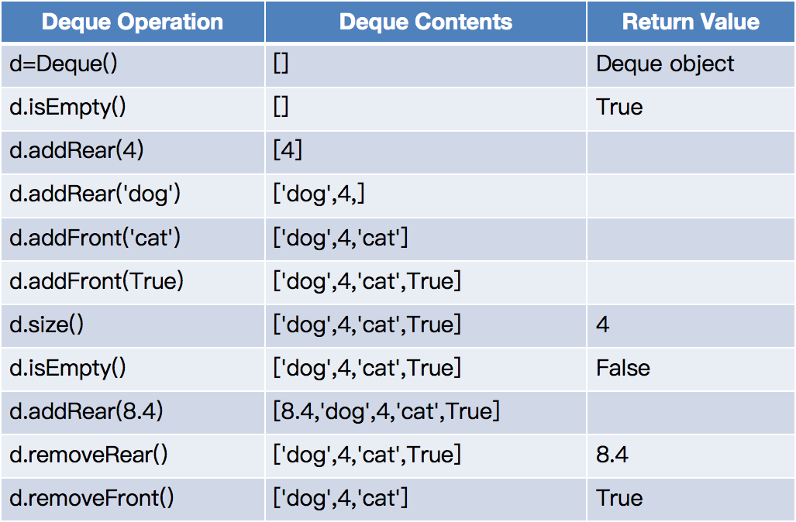

#### ADT实现

- 采用 Python List 保存数据项
- List 首端作为 deque 的尾
- List 末端作为 deque 的首
- addFront/removeFront O(1)
- addRear/removeRear O(n)

```python
class Deque:
    def __init__(self):
        self.items = []
        
    def isEmpty(self):
        return self.items == []

    def addFront(self, item):
        self.items.append(item)

    def addRear(self, item):
        self.items.insert(0, item)

    def removeFront(self):
        return self.items.pop()

    def removeRear(self):
        return self.items.pop(0)

    def size(self):
        return len(self.items)
```

### 应用：“回文词” 判定

- “回文词”指正读和反读都一样的词，如radar、madam、toot 等
  - “上海自来水来自海上”
- 用双端队列很容易解决“回文词”的判定问题
  - 先将需要判定的词从队尾加入 deque
  - 再从两端同时移除字符判定是否相同，
  - 直到 deque 中剩下 0 个或 1 个字符

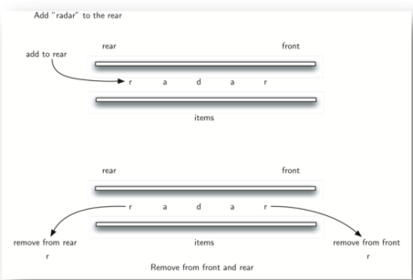

* 代码实现
```python
def isPalindromic(str):
  dq = Deque()
  for c in str:
    dq.addRear(c)

  while dq.size()>1 :
    if dq.removeFront() != dq.removeRear():
      return False
  return True

if __name__ = "__main__":
  print(f"lsdkjfskf is {isPalindromic("lsdkjfskf")})
  print(f"radar is {isPalindromic("radar")})
```

###  Python数据类型deque

Python中的collections.deque实现了ADT Deque，方法的名称稍有不同。

在Python 实际开发中，不需要自己实现队列。
- collections.deque：Python 内置的双端队列已经高度优化。
- 它在底层由双向链表（或块列表）实现，
- 与Python列表相比
  - deque首尾两端增删都是 $O(1)$，且不限制容量。
  - list能够随机访问中间元素

#### `deque` 的常用方法

| 方法 | 说明 |
| :--- | :--- |
| `append(x)` | 在右侧（末尾）添加元素 |
| `appendleft(x)` | 在左侧（头部）添加元素 |
| `pop()` | 移除并返回右侧元素 |
| `popleft()` | 移除并返回左侧元素 |
| `extend(iterable)` | 在右侧扩展多个元素 |
| `extendleft(iterable)` | 在左侧扩展多个元素（注意：顺序会反过来） |
| `rotate(n)` | 循环移位。`n>0` 向右移，`n<0` 向左移 |
| `maxlen` | 属性，返回创建时定义的队列最大长度 |


####  程序例子

下面的例子展示了如何使用 `deque` 实现一个“最近通话记录”功能（利用其 `maxlen` 特性），以及基本的操作演示。

```python
from collections import deque

# 1. 创建一个固定长度的 deque
# 当新元素加入且队列已满时，最老的元素会自动从另一端被挤出
history = deque(maxlen=3)

print("--- 1. 自动挤出特性演示 ---")
history.append("10086")
history.append("10010")
history.append("12315")
print(f"当前记录: {list(history)}")

history.append("110") # 10086 将被自动挤出
print(f"新增 110 后: {list(history)}")


print("\n--- 2. 双端操作演示 ---")
dq = deque(['b', 'c', 'd'])

# 头部添加
dq.appendleft('a')
# 尾部添加
dq.append('e')
print(f"添加后: {dq}") # deque(['a', 'b', 'c', 'd', 'e'])

# 头部弹出
first = dq.popleft()
print(f"弹出头部: {first}, 剩余: {dq}")


print("\n--- 3. 旋转(Rotate)演示 ---")
# rotate(1) 相当于：d.appendleft(d.pop())
dq.rotate(1)
print(f"向右旋转 1 位: {dq}")
dq.rotate(-1)
print(f"向左旋转 1 位（回到原位）: {dq}")
```

## 列表List

什么是列表？
- 在前面基本数据结构的讨论中，我们采用 Python List 来实现了多种线性数据结构。
- 列表 List 是一种简单强大的数据结构，提供了丰富的操作接口。但并不是所有的编程语言都提供了 List 数据类型，有时候需要程序员自己实现。
- 如果数据项按照相对位置存放，它的位置与数据的大小无关，这种数据集称为“无序表”(unordered list)，其中数据项只按照存放位置来索引，如第 1 个、第 2 个、……、最后一个等。
  - 为了简单起见，先假设列表中不存在重复数据项
- 如一个考试分数的集合“54, 26, 93, 17, 77 和 31”，如果用 PythonList 来表示，就是 [54, 26, 93, 17, 77, 31]
- 接着我们用单链表来实现两种 ADT 列表

### ADT: 无序表List
- 无序表是一种元素线性排列的数据集合，但排列并不按特定顺序
- 无序表的操作如下：
  - List()：创建一个空列表
  - add(item)：添加一个数据项到列表中，假设它原先并不存在
  - remove(item)：从列表中移除 item，列表被修改，item 原先应存在于表中
  - search(item)：在列表中查找 item，返回布尔类型值
  - isEmpty()：返回列表是否为空
  - size()：返回列表包含了多少数据项
  - append(item)：添加一个数据项到表末尾，假设 item 原先不存在于列表中
  - index(item)：返回数据项在表中的位置
  - insert(pos, item)：将数据项插入到位置 pos，假设 item 原先不存在与列表中，同时原列表具有足够多个数据项，能让 item 占据位置pos
  - pop()：从列表末尾移除数据项，假设原列表至少有 1 个数据项
  - pop(pos)：移除位置为 pos 的数据项，假设原列表存在位置 pos

#### 采用链表实现无序表

- 为了实现无序表 ADT，可以采用链接表的方案。
- 虽然列表数据结构要求保持数据项的前后相对位置，但这种前后位置的保持，并不要求数据项依次存放在连续的存储空间
- 如下图，数据项存放位置并没有规则，但如果在数据项之间建立链接指向，就可以保持其前后相对位置
  - 第一个和最后一个数据项需要显式标记出来，一个是队首，一个是队尾，后面再无数据了。

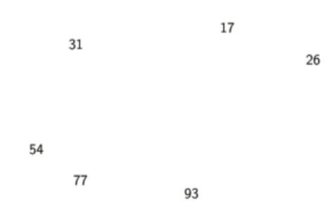
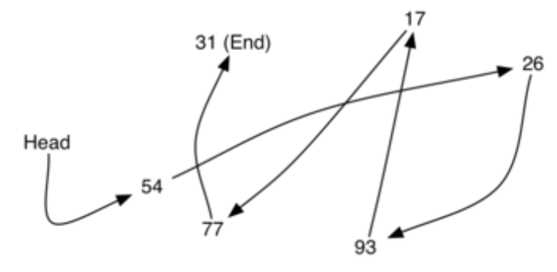

* 链表结点Node
  - 链表实现的最基本元素是结点Node，每个结点至少要包含2 个信息：
    - 数据项本身，以及指向下一个结点的引用信息
    - next 为 None 表示没有下一个结点了

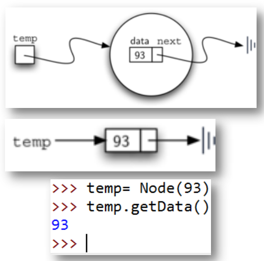

- Node代码
```python
class Node:
  def __init__(self, initdata=None):
    self.data = initdata
    self.next = None

  def getData(self): 
    return self.data

  def getNext(self):
    return self.next

  def setData(self, newdata):
    self.data = newdata

  def setNext(self, newnext):
    self.next = newnext

if __name__ == "__main__":
  temp = Node(93)
  print(temp.getData())
```

- 我们可以采用链接结点的方式构建数据集来实现无序表
- 经过分析表明，链表的第一个和最后一个结点最重要。如果想访问到链表中的所有结点，就必须从第一个结点开始沿着链接遍历下去
- 所以无序表必须要有对第一个结点的引用信息
  - 设立一个属性 head，保存对第一个结点的引用
  - 空表的 head 为 None

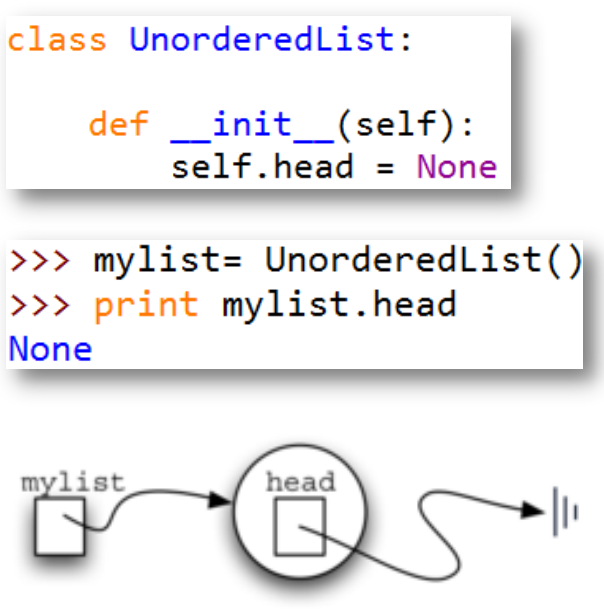

- 随着数据项的加入，无序表的 head 始终指向链条中的第一个结点
  - 需要注意的是，无序表 mylist 本身并不包含数据项
  - 其中包含的 head 只是对首个结点 Node 的引用
  - 判断空表的 isEmpty() 很容易实现
    - `return self.head == None`

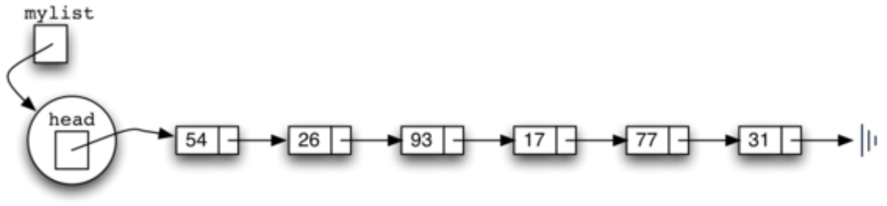

- 接下来，考虑如何实现向无序表中添加数据项，实现 add 方法。
- 由于无序表并没有限定数据项之间的顺序，所以新数据项可以加入到原表的任何位置，按照实现的性能考虑，应添加到最容易加入的位置上。
- 由链表结构我们知道，要访问到整条链上的所有数据项，都必须从表头 head 开始，沿着 next 链接逐个向后查找。
- 所以添加新数据项最快捷的位置是表头，整个链表的首位置。

* add 方法：按照右图的代码调用，形成的链表如下图
  - 31 是最先被加入的数据项，所以成为链表中最后一个项
  - 而 54 是最后被加入的，是链表第一个数据项

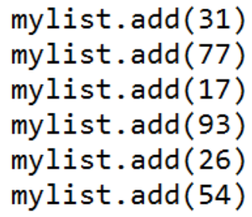
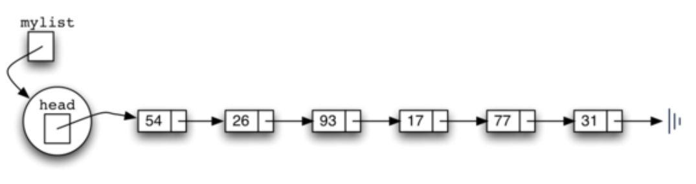

- 链接的次序至关重要！
  - 需要先把 head 的内容交给temp.next，才能再对他进行赋值。

```python
1     def add(self, item):
2       temp = Node(item)
3       temp.setNext (self.head)
4       self.head = temp
```
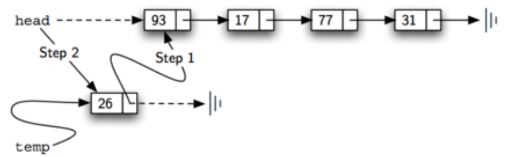
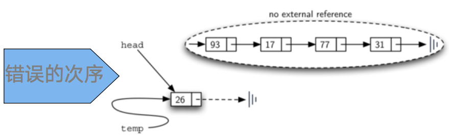

* size方法：从链条头 head 开始遍历到表尾同时用变量累加经过的结点个数。

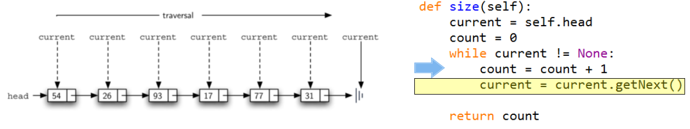

```python
def size(self):
  current = self.head
  count = 0
  while current != None:
    count = count + 1
    current = current.getNext()

  return count
```

* search方法：也是从链表头 head 开始遍历到表尾，同时判断当前结点的数据项是否正查找的这个，如果到表尾都没找到，则返回 False

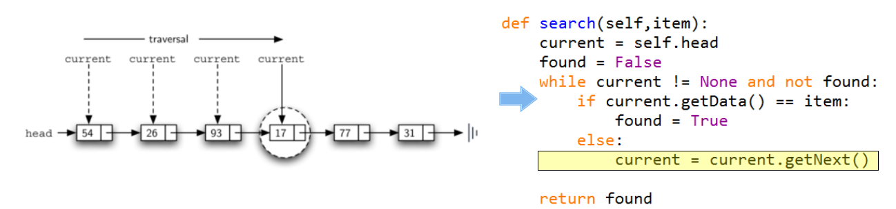

```python
def search (self, item):
  current = self.head
  while current != None :
    if current.getData() == item:
      return True
    else:
      current = current.getNext()

  return False
```

* **remove(item)**，首先要在链表上找到 item，这个过程跟 search一样，但在删除这个结点时，需要特别的技巧
  - current 指向的是当前匹配数据项的结点
  - 而删除需要把前一个结点的 next 指向 current 的下一个结点
  - 所以我们在 search current 的同时，还要维护前一个（previous）结点的引用

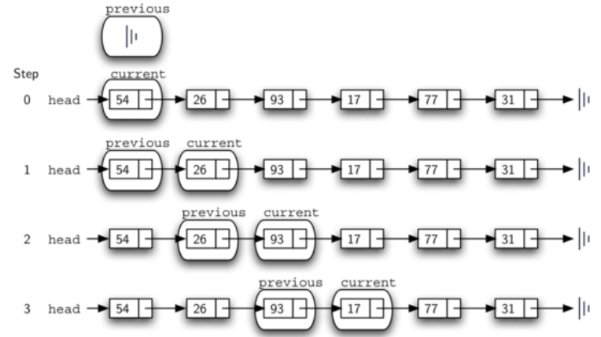

- 找到 item 之后，current 指向 item 结点，previous 指向前一个结点，开始执行删除，需要区分两种情况：
  - current 是首个结点；
  - 或者是位于链条中间的结点。
- 这种叫“边界情况”，忽视处理边界情况是程序中最常见的 bug 之一

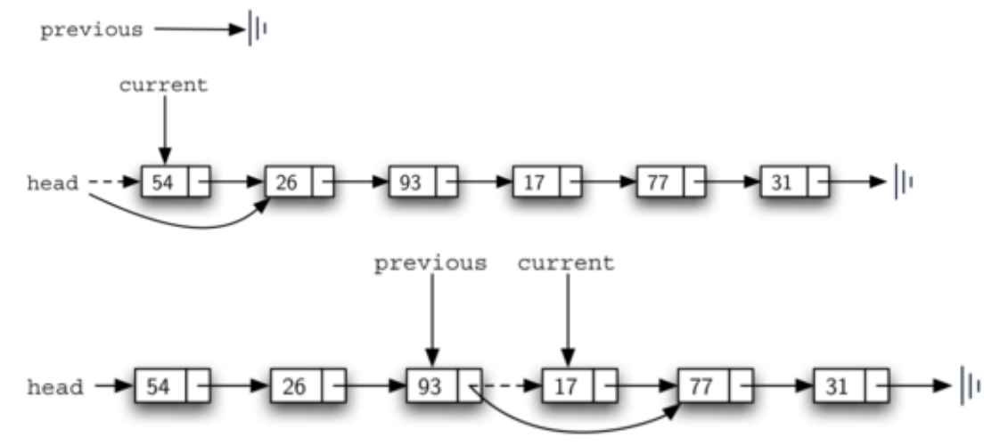

```python
1     def remove(self, item):
2       current = self.head
3       previous = None
4
5       while current != None:
6         if current.getData() == item:
7           break
8         previous = current
9         current = current.getNextO)
10      else:
11        return
12
13      if previous == None:
14        self.head = current.getNext()
15      else:
16        previous.setNext(current.getNext())
```

### ADT: 有序表 OrderedList

- 有序表是一种数据项依照其某可比性质（如整数大小）来决定在列表中的位置，越“小”的数据项越靠近列表的头
  - 由于 Python 的可扩展性，每种数据类型可以定义特殊方法 
    - `def __lt__(self, y)`，
    - 返回 True 视为比 y“小”，排在前，
    - 而返回 False 视为比 y“大”，排在后
  - 任何自定义类都可以使用 `x<y` 这样的比较，只要类定义中定义了less_than 特殊方法 `__lt__`

#### less_than特殊方法

- 例子：Student
  - 姓名，成绩
- 按照成绩排序
  - 由高到低
- 用内置 sort

```python
class Person:
  def __init__(self, name):
    self.name = name

class Student(Person):
  def __init__(self, name, grade): 
    super().__init__(name)
    self.grade = grade

  # 内置sort函数，引用＜比较符来判断前后
  def __lt__(self, other):
    # 成绩高的排前面
    return self.grade > other.grade

  # Student的易懂字符串表示
  def __str__(self):
    return f"({self.name},{self.grade})"

  # Student的正式字符串表示，与易懂表示相同
  __repr__ = __str__
```
> - 子类如何调用父类的同名函数

* 测试less_than特殊函数
  - 我们构造一个 Python 列表
  - 在列表中加入 Student 对象
  - 直接调用列表的 sort 方法
  - 可以看到已经根据 `__lt__` 定义排序，直接检验 Student 对象的大小

```python
if __name__ == "__main__":
  # 构造一个Python List对象
  s = []
  # 添加5个Student对象到List中
  s.append(Student ("Jack", 80))
  s.append(Student ("Jane", 75))
  s.append(Student("Smith", 82))
  s.append(Student ("Cook", 90))
  s.append(Student("Tom", 70))

  print("Original:", s)
  # 对List进行排序，注意这是内置sort方法
  s.sort()
  # 查看排序结果：按成绩高低排序
  print("Sorted:", s)

```

- 我们可以把 `__lt__` 方法重新定义，改为比较姓名
- 这样 sort 方法就能按照姓名来排序

```python
class Student(Person):
  def __init__(self, name, grade): 
    super().__init__(name)
    self.grade = grade

  # 内置sort函数，引用＜比较符来判断前后
  def __lt__(self, other):
    # 按照名字进行字典排序
    return self.name < other.name

  # Student的易懂字符串表示
  def __str__(self):
    return f"({self.name},{self.grade})"

  # Student的正式字符串表示，与易懂表示相同
  __repr__ = __str__
```

```python

```

#### ADT定义

- 抽象数据类型 OrderedList 所定义的操作如下：
  - OrderedList()：创建一个空的有序表
  - add(item)：在表中添加一个数据项，并保持整体顺序，此项原不存在
  - remove(item)：从有序表中移除一个数据项，此项应存在，有序表被修改
  - search(item)：在有序表中查找数据项，返回是否存在的布尔值
  - isEmpty()：是否空表
  - size()：返回表中数据项的个数
  - index(item)：返回数据项在表中的位置，此项应存在
  - pop()：移除并返回有序表中最后一项，表中应至少存在一项
  - pop(pos)：移除并返回有序表中指定位置的数据项，此位置应存在

#### 有序表 OrderedList 实现

- 在实现有序表的时候，需要记住的是，数据项的相对位置，取决于它们之间的“大小”比较
- 由于 Python 的扩展性，下面对数据项的讨论并不仅适用于整数，可适用于所有定义了比较方法的数据类型
  - 以整数数据项为例，(17, 26, 31, 54, 77, 93) 的链表形式如图

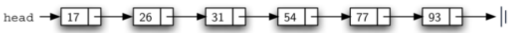

- 同样采用链表方法实现，Node 定义相同，OrderedList 也设置一个head 来保存链表表头的引用（复用 UnorderedList 的代码）
- 对于其它方法而言，isEmpty/size/remove 这些方法，与结点的次序无关，所以其实现跟 UnorderedList 是一样的。
- search/add 方法则需要有修改

```python
class OrderedList(UnorderedList):
  pass
```

* OrderedList 实现：search 方法
  - 在无序表的 search 中，如果需要查找的数据项不存在，则会搜遍整个链表，直到表尾
  - 对于有序表来说，可以利用链表结点有序排列的特性，来为search节省不存在数据项的查找时间
    - 一旦当前结点的数据项大于所要查找的数据项，则说明链表后面已经不可能再有要查找的数据项，可以直接返回 False
  - 如我们要在下图查找数据项 45

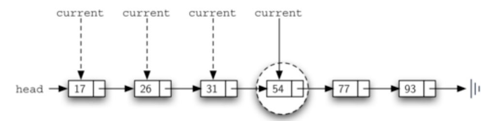

*  search代码实现
```python
class OrderedList(UnorderedList):
  def search (self, item):
    current = self.head
    while current != None :
      if current.getData() == item:
        return True
      elif current.getData() > item:               #  提前返回
        return False
      else:
        current = current.getNext()

    return False
```

* OrderedList 实现：add 方法
  - 相比无序表，改变最大的方法是 add，因为 add 方法必须保证加入的数据项添加在合适的位置，以维护整个链表的有序性
    - 比如在 (17, 26, 54, 77, 93) 的有序表中，加入数据项 31，我们需要沿着链表，找到第一个比 31 大的数据项 54，将 31 插入到 54 的前面
  - 由于涉及到的插入位置是当前结点之前，而链表无法得到“前驱”结点的引用，
    - 所以要跟 remove 方法类似，引入一个 previous 的引用，跟随当前结点 current，一旦找到首个比 31 大的数据项，previous 就派上用场了

  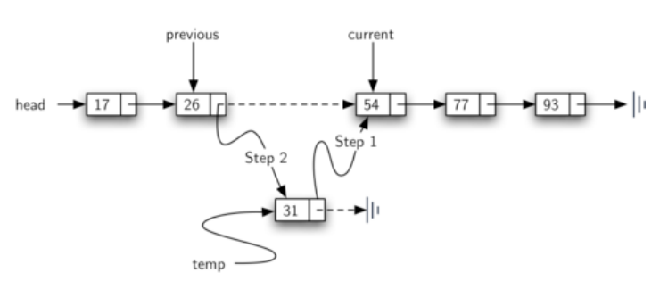

*  add代码实现

```python
class OrderedList(UnorderedList):
  def add(self, item):
    current = self. head
    previous = None
    while current != None:
      if current.getData() > item:
        #发现了插入位置，在current之前
        break
      previous = current
      current = current.getNext()

    temp = Node(item)
    if previous = None:
      #插在表头
      temp.setNext(self.head)
      self.head = temp
    else:
      #插在表中
      temp.setNext(current)
      previous.setNext(temp)
```
> 代码中有没有考虑到“插在表尾”的情况？

#### 如何避免链表操作的bug

- 链表数据结构的不变量
  - 是我们可以利用的条件，也是对我们操作的约束。
  - 破坏不变量是一种常见的 bug 原因，所以写代码时我们要细心，反复检查有没有破坏不变量。
    - 单链表：head 为 None 表示空表；最后一个元素的 next 为None
    - 带头结点的单链表：head.next 为 None 表示空表；最后一个元素的next 为None
    - 双链表：head 和 tail 同时为 None 表示空表；第一个元素的 prev、最后一个元素的 next 为 None
  - 检查下面双链表的 remove() 方法，找代码 bug

```python
def remove(self, item):
  current = self.head
  for i in range(1, self. size()+1):      # 遍历链表
    if current. getData() == item:        # 如果当前节点对应的元素是给定的元素，就跳出循环
      break
    current = current.next                # 如果不是，就将当前节点设置为下一个节点

  if current.prev == None :               #如果待删除元素的节点的前一个节点是空，即是头节点，就将这个元素删除
    self.head = current.next
    current.next.prev = self.head
  elif curcent.next == None:              #如果待删除元素的节点的后一个节点是空，即是尾节点，就将这个元素删除
    current.prev.next = current.next
    current.prev = self.tail
  else:     # 如果待删除元素不是第一个和最后一个元素，就将待删除元素的前一个节点与后一个节点连接，实现元素册除
    current.prev.next = current.next
    current.next.prev = current.prev
```

<details>
<summary>答案</summary>

有两种特殊情况没有考虑到：
1. 没有找到待删除结点，current为None
2. 待删除结点是唯一结点

一种链表操作失误:
- 首结点的prev应为空
</details>

### 链表实现的算法分析

- 对于链表复杂度的分析，主要是看相应的方法是否涉及到链表的遍
历 traversal
- 对于一个包含结点数为 n 的链表
  - isEmpty() 是 O(1)，因为仅需要检查 head 是否为 None
  - size 是 O(n)，因为除了遍历到表尾，没有其它办法得知结点的数量
  - 无序表的 add 方法是 O(1)，因为仅需要插入到表头
  - search/remove 以及有序表的 add 方法，则是 O(n)，因为涉及到链表的遍历，按照概率其平均操作的次数是 n/2
- 链表实现的 List，跟 Python 内置的列表数据类型，性能上还有差距，主要是因为 Python 内置的列表数据类型是基于数组来实现的，并进行了优化。
- 例题2023：若某线性表常用操作是在表尾插入或者删除元素，则时间开销最小的存储方式是 ( )
    ```
    A: 单链表 B: 仅有头指针的单循环链表
    C: 顺序表 D: 仅有尾指针的单循环链表
    ```

    <details>
    <summary>答案</summary>

    - 答案是C，对于删除操作，ABD都不方便。

    </details>

### 线性表的实现效率

- 对称的两种情况只考虑一种；remove 不包括 search 的时间

  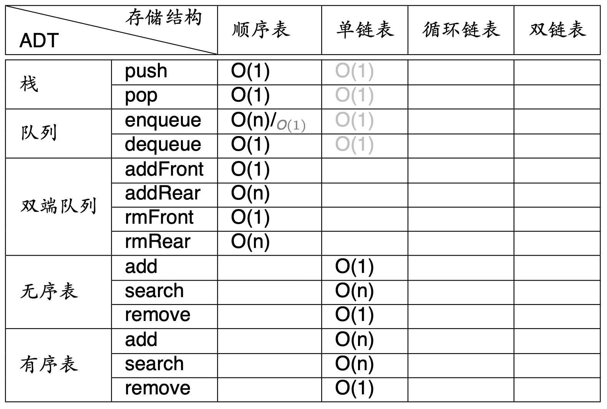

## 线性表上的双指针、三指针算法

在线性表（通常就是数组 / 列表）中，“双指针、三指针”本质是用多个索引变量协同移动，用空间换时间，避免重复扫描。这类技巧非常核心，尤其在算法优化里几乎是必备。

### 双指针（Two Pointers）

- 核心思想：用两个指针在数组中“配合移动”，达到：
  - 减少时间复杂度（常从 O(n²) → O(n)）
  - 避免重复遍历

- 例题：[装水容器问题]( https://leetcode.com/problems/container-with-most-water/description/ )

### 三指针（Three Pointers）

- 三指针通常是在双指针基础上再加一层控制。

* 例题： 找出数组中和等于0的三个数
  - 读入一个大小为n的数组nums
  - 从数组中选出三个元素，满足:
    - nums[i]+nums[j]+nums[k] == 0

#### 暴力法
```python
nums = list(map(int, input().split()))
n = len(nums)
for i in range(n):
  for j in range(i+1, n):
    for k in range(j+1, n):
      if nums[i] + nums[j] + nums[k] == 0:
        print(nums[i], nums[j], nums[k])
        return True
```

三重循环直接试所有组合：
- 特点：
  - 纯brute force
  - 复杂度 O(n³)
  - 没有技巧

#### 枚举法（优化）

你仍然是“枚举”三元组，但可以：
- 排序后固定一个数 + 双指针（变成 O(n²)）
- 或者剪枝：如果最小三数都 >0 就停止

这仍然是“枚举”所有可能三元组，但更高效、有技巧，不算“暴力”。
```python
def three_sum_smart(nums):
  nums.sort()
  n = len(nums)

  for i in range(n):
    # 剪枝1：如果最小的三个数都 > 0，那肯定不存在三数和为0
    if nums[i] > 0:
      break

    left, right = i + 1, n - 1
    while left < right:
      s = nums[i] + nums[left] + nums[right]
      if s == 0:
        return True
      elif s < 0:
        left += 1  # 和太小，需要增大
      else:
        right -= 1 # 和太大，需要减小
  return False
```
核心步骤：
1. 排序：算法复杂度O(nlog(n))
1. 固定一个元素a[i]：循环O(n)次
1. 用“双指针”在右侧数组中寻找target = -a[i]
  - 算法复杂度O(n)

这样就不需要三重循环了，算法复杂度变成了O($n^2$)

## 本章小结

- 线性数据结构 Linear DS 将数据项以某种线性的次序组织起来
- 栈 Stack 维持了数据项后进先出 LIFO 的次序
  - stack 的基本操作包括 push, pop, isEmpty
- 队列 Queue 维持了数据项先进先出 FIFO 的次序
  - queue 的基本操作包括 enqueue, dequeue, isEmpty
- 书写表达式的方法有前缀 prefix、中缀 infix 和后缀 postfix 三种
  - 由于栈结构具有次序反转的特性，所以栈结构适合用于开发表达式求值和转换的算法
- “模拟系统”可以通过一个对现实世界问题进行抽象建模，并加入随机数动态运行，为复杂问题的决策提供各种情况的参考
  - 队列 queue 可以用来进行模拟系统的开发
- 双端队列 Deque 可以同时具备栈和队列的功能
  - deque 的主要操作包括 addFront, addRear, removeFront, removeRear, isEmpty
- 列表 List 是数据项线性排列的数据集
- 用链表实现列表 List，不需要连续的存储空间
- 链表实现时，其各种方法，对链表头部 head 需要特别的处理
