---
jupyter:
  jupytext:
    cell_metadata_filter: -all
    main_language: python
    text_representation:
      extension: .md
      format_name: markdown
      format_version: '1.3'
      jupytext_version: 1.18.1
  kernelspec:
    display_name: Python 3 (ipykernel)
    language: python
    name: python3
---

# Ch05. 递归与动态规划

[Home]( README.md )

## 本章目标

- 了解某些难解的问题具有简单的递归解决法；
- 了解和应用递归的“三定律”；
- 学会如何用递归方式写程序；
- 动态规划与递归的比较

## 什么是递归

### 递归的归纳法思想

- lambda 函数
```python
f = lambda x, y: x**2 + y**2
f(3, 4)
```
- 当问题规模很小的时候，答案显而易见。
- 如果较小规模 (n) 的问题解决了，较大规模 (n+1) 的问题很容易就能解决。
- 一行代码实现阶乘运算（递归 +lambda 函数）：

```python
fact = lambda n : 1 if n < 2 else n * fact(n-1)
fact(5)
```

### 什么是递归 Recursion？

- 递归是一种解决问题的方法，其精髓是将问题分解为一个或多个规模更小的相同问题；分解可以持续进行，直到问题规模小到可以用非常简单直接的方式来解决。
- 递归的问题分解方式非常独特，其算法方面的明显特征就是：在算法流程中 **调用自身**。
- 递归为我们提供了一种对复杂问题的优雅解决方案，精妙的递归算法常会出奇简单，令人赞叹。

#### 例子：数列求和

```python
def listsum(numlist):
  theSum = 0
  for i in numList:
    theSum = theSum + i
  return theSum

print(listsum([1, 3, 5, 7, 9]))
```
从简单问题开始认识递归：
- 问题：给定一个列表，返回列表中所有数的和
  - 列表中数的个数不定，需要一个循环和一个累加变量来迭代求和
- 程序很简单，但假如没有循环语句？
  - 既不能用 for，也不能用 while
  - 还能对不确定长度的列表求和么？
- 我们认识到求和实际上最终是由一次次的加法实现的，而加法函数恰有两个参数，这个是确定的。
- 看看怎么想办法，将问题规模较大的列表求和，分解为规模较小而且固定的两个数求和（加法）？
  - 同样是求和问题，但规模发生了变化，符合递归解决问题的特征！

* 我们换一个方式来表达数列求和：全括号表达式
  - (1+(3+(5+(7+9))))
* 上面这个式子，最内层的括号 (7+9)，这是无需循环即可计算的，
  - 实际上整个求和的过程是这样：

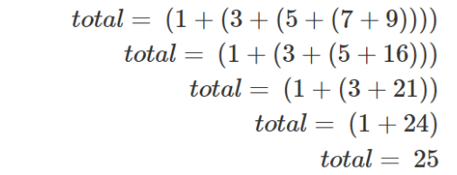

* 观察上述过程中所包含的重复模式，可以把求和问题归纳成这样：
  - 数列的和=“首个数”+“余下数列”的和

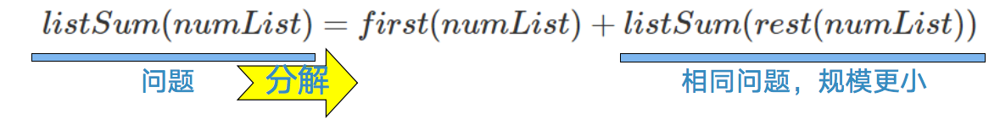

* 上面的递归算法变成程序

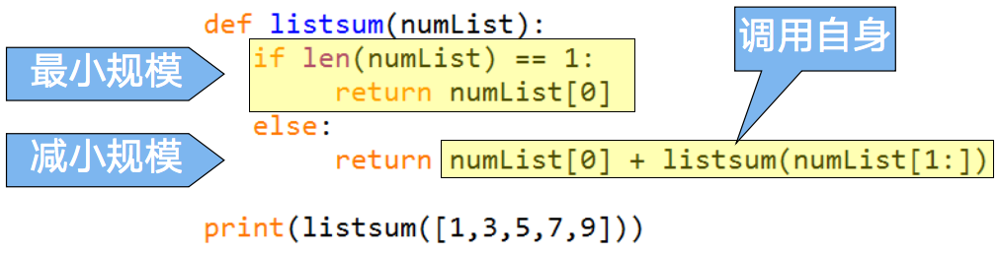

* 上面程序的要点：
  - 问题分解为更小规模的相同问题，并表现为“调用自身”
  - 对“最小规模”问题的解决：简单直接

```python
def listsum(numList):
  if len (numList) == 1:
    return numList[0]
  else:
    return numList[0] + listsum(numList[1:])

print(listsum([1,3,5,7,9]))
```
- [可视化]( https://pythontutor.com/visualize.html#mode=display )

### 递归程序如何被执行？

- 递归函数调用和返回过程的链条（隐含的空间开销：调用栈）
- 递归调用：递归函数（直接或间接）对自身的调用
- 递归函数在栈中出现的帧数比递归调用数多一
  - 严格来说caller对递归函数的普通调用，只是启动递归，没有发生“自己调用自己”。
  - 常用的统计口径把这一次调用也算作 **递归调用**了。

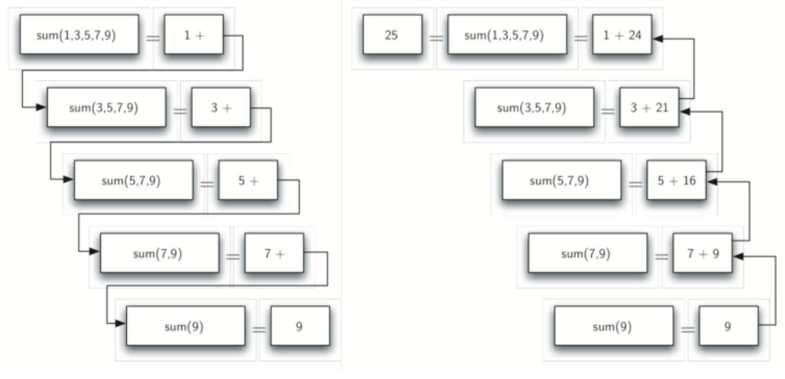

### 递归三定律

为了致敬阿西莫夫的“机器人三定律”，递归算法也总结出“三定律”
1. 递归算法必须有一个基本结束条件（最小规模问题的直接解决）
2. 递归算法必须能改变状态向基本结束条件演进（减小问题规模）
3. 递归算法必须调用自身（解决减小了规模的相同问题）

* 数列求和问题中的“递归三定律”
  - 基本结束条件：当列表长度为 1 的时候，直接输出它唯一的元素
  - 减少问题规模：求和的对象是列表，每次递归调用列表长度减一
  - 调用自身是递归算法中最难理解的部分，我们可以理解为“问题规 模缩小了，但问题不变”：在数列求和算法中，就是“更短数列的求和问题”。

### 递归的应用：整数转换为任意进制字符串表示
- 这个在数据结构栈里讨论过的算法，又回来了！
  - 递归和栈，一定有关联
- 如果上次你被“入栈/出栈”搞得挺晕乎的话，递归算法让人感到简单明白
  - 而且这次我们要解决从二进制到十六进制的任意进制转换

* 我们用最熟悉的十进制分析下这个问题
  - 十进制有十个不同数字符号：convString = ”0123456789”
  - 基本结束条件：
    - 比十小的整数，转换成十进制，直接查表就可以了：convString[n]
  - 减少问题规模：
    - 比十大的整数，用十整除得到商和余数，把它拆成了两部分
    - 比方说 769，得到 76 和 9；9 查表得“9”，对 76 继续转换，最后把它的结果和“9”粘接在一起
    - 从 769 到76，问题的规模减少了
  - 拆解整数的过程就是向“基本结束条件”演进的过程

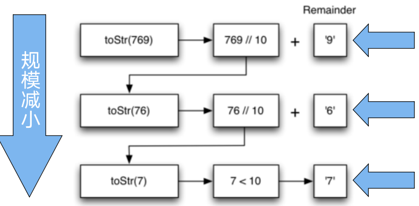

* 对于任意进制，我们则使用不同的进制基数
  - 除以“进制基 base”，和对“进制基”求余数
* 问题就分解为：
  - 余数总小于“进制基 base”，是“基本结束条件”，可直接进行查表转换
  - 整数商成为“更小规模”问题，通过递归调用自身解决

* 下面就是递归算法的代码
```python
def toStr(n, base) :
  convertString = "0123456789ABCDEF"
  if n < base:
    return convertString[n]
  else:
    return toStr(n//base,base) + convertString[n%base]

print(toStr(1453,16))
```

## 递归调用的实现
- 当一个函数被调用的时候，系统会把调用时的现场（包括所有的局部变量，以及返回地址）压入到调用栈 Call Stack
  - 每次调用，压入栈的现场数据称为 Stack Frame 栈帧
- 当函数执行完成，返回时，要从调用栈的栈顶取得返回地址，把返回值放到栈顶，恢复现场，弹出栈帧，按地址返回。

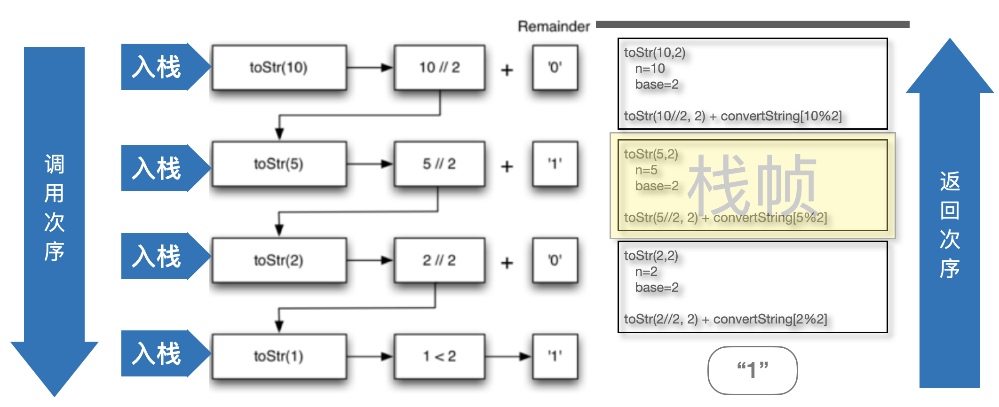

### 随堂思考
- 编写将字符串反转的递归函数
```python
def revString(s):
  """
  在这里填写你的代码
  """
  pass

revString("hakuna matata")
```
- 编写回文词判断的递归函数
```python
def palcheck(s):
  """
  在这里填写你的代码
  """
  pass

palcheck('nolemonnomelon')
```

<details>
<summary>答案</summary>

```
def revString(s):
  """
  在这里填写你的代码
  """
  if len(s) == 1:
    return(s)
  else:
    return revString(s[1:]) + s[0]

def palcheck(s):
  """
  在这里填写你的代码
  """
  if len(s) < 2:
    return True
  else:
    return s[0] == s[-1] and palcheck(s[1:-1])

```


</details>

## 递归的可视化

- 前面的种种递归算法展现了其简单而强大的一面，但还是难有个直观的概念
- 下面我们通过递归作图来展现递归调用的视觉影像
- Python 的海龟作图系统 turtle module
  - Python 内置，随时可用
  - 以 LOGO 语言的创意为基础其意象为模拟海龟在沙滩上爬行而留下的足迹
    - 爬行：forward(n); backward(n)
    - 转向：left(a); right(a)
    - 笔触：penup(); pendown(); pensize(); pencolor(c)
- 参考：https://docs.python.org/3/library/turtle.html

* 使用方法
  - 代码
```console
#code/turtle1.py
import turtle          # 导入模块
t= turtle.Turtle()     # 生成一只海龟
w= turtle.Screen()     # 获取屏幕对象，用于最后的点击自动关闭窗口
t.forward(100)         # 指挥海龟作图
w.exitonclick()        # 作图完毕，欣赏结束后可以点击关闭窗口
```
  - 运行
```bash
python code/turtle1.py
```

### 更多例子

- 画正方形
```console
% cat code/turtle_4.py
import turtle
t = turtle.Turtle()
w = turtle.Screen()

for i in range(4):
    t.forward(100)
    t.right(90)
w.exitonclick()
```
```bash
python code/turtle_4.py
```
- 画五边形
```console
 % cat code/turtle_5.py
import turtle
t = turtle.Turtle()
w = turtle.Screen()

for i in range(5):
    t.forward(100)
    t.right(72)
w.exitonclick()
```
```bash
python code/turtle_5.py
```
- 画六边形
```console
 % cat code/turtle_6.py
import turtle
t = turtle.Turtle()
w = turtle.Screen()

for i in range(6):
    t.forward(100)
    t.right(60)
w.exitonclick()
```
```bash
python code/turtle_6.py
```
- 画五角星
```console
 % cat code/turtle_5star.py
import turtle
t = turtle.Turtle()
w = turtle.Screen()

for i in range(5):
    t.forward(100)
    t.right(144)
w.exitonclick()
```

```bash
python code/turtle_5star.py
```

### 递归作图：螺旋


```console
% cat code/turtle_spiral.py
import turtle
t = turtle.Turtle()
w = turtle.Screen()

def drawSpiral(myTurtle, lineLen):
    if lineLen > 0:
        myTurtle.forward(lineLen)
        myTurtle.right(90)
        drawSpiral(myTurtle, lineLen - 15)

t.penup()
t.goto(-150, 150)
t.pendown()
drawSpiral(t, 300)
w.exitonclick()
```

```bash
python code/turtle_spiral.py
```

### 分形—自相似图形

- 分形 Fractal，是 1975 年由 Mandelbrot 开创的新学科
- 通常被定义为“一个粗糙或零碎的几何形状，可以分成数个部分，且每一部分都（至少近似地）是整体缩小后的形状”，即具有自相似的性质。
- 自然界中能找到众多具有分形性质的物体
  - 海岸线、山脉、闪电、云朵、雪花、树
  - http://paulbourke.net/fractals/googleearth/
  - http://recursivedrawing.com/

- 晶体结构


- 河流与水体


### 分形树作图

- 分形特性在自然界中广泛存在，使得计算机可以通过分形算法生成非常逼真的自然场景（电脑游戏），下面我们以树为例做一个粗糙的近似
- 分形是在不同尺度上都具有相似性的事物，将这种观点放在对树的观察上，我们就能看出，一棵树的每个分叉和每条树枝，实际上都具有整棵树的外形特征（也是逐步分叉的）
- 这样，我们可以把树分解为三个部分：树干、左边的小树、右边的小树
  - 这样的分解，正好符合递归的定义：对自身的调用


- 作图代码

```python
import turtle

def tree(branchLen, t):
    if branchLen > 5:
        t.forward(branchLen)       #画树干
        t.right(20)                #右倾20度
        tree(branchLen-15, t)      #规模减少15画右子树
        t.left(40)                 #回正再左倾20度
        tree(branchLen-15, t)
        t.right(20)                #回正
        t.backward(branchLen)      #回到起始点

if __name__ == "__main__":
    t = turtle.Turtle()
    myWin = turtle.Screen()
    t.left(90)                     #树的起始方向、位置
    t.up()
    t.backward(100)
    t.down()
    t.color("green")               #树的颜色
    tree(75, t)
    myWin.exitonclick()
```

```bash
python code/turtle_tree.py
```

```bash
python code/turtle_tree1.py
```

```bash
python code/turtle_tree2.py
```

### 谢尔宾斯基三角形

- 一种分形构造，平面称谢尔宾斯基三角形，立体称谢尔宾斯基金字塔（自然界晶体）
  - 实际上，真正的谢尔宾斯基三角形是完全不可见的，其面积为 0，但周长无穷，是介于一维和二维之间的分数维（约 1.585 维）构造。
  - degree 每加一，面积乘 3/4，周长乘 3/2
  - degree->$\infty$

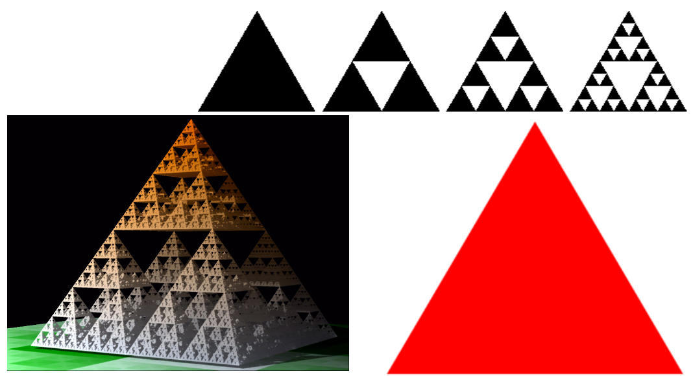

#### 作图思路
- 首先，根据自相似特性，谢尔宾斯基三角形是由 3 个相同的谢尔宾斯基三角形按照品字形拼叠而成。
- 由于我们无法真正做出谢尔宾斯基三角形（degree->∞），只能做degree 有限的近似图形。
- 在 degree 有限的情况下，一个n度的三角形，是由 3 个n-1度的三角形按照品字形拼叠而成，同时，它们的边长均为n度三角形的一半。
  - 当 degree=0，则就是一个等边三角形，这是递归基本结束条件
- 为了便于演示，degree>0 时我们也画上各种颜色

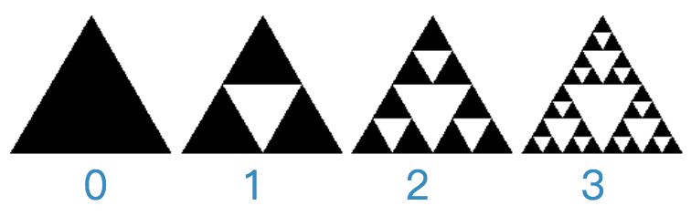

#### 代码

- 递归画谢尔宾斯基三角形

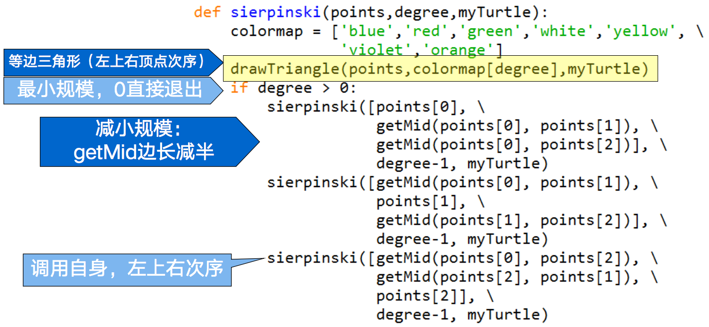

- 主程序

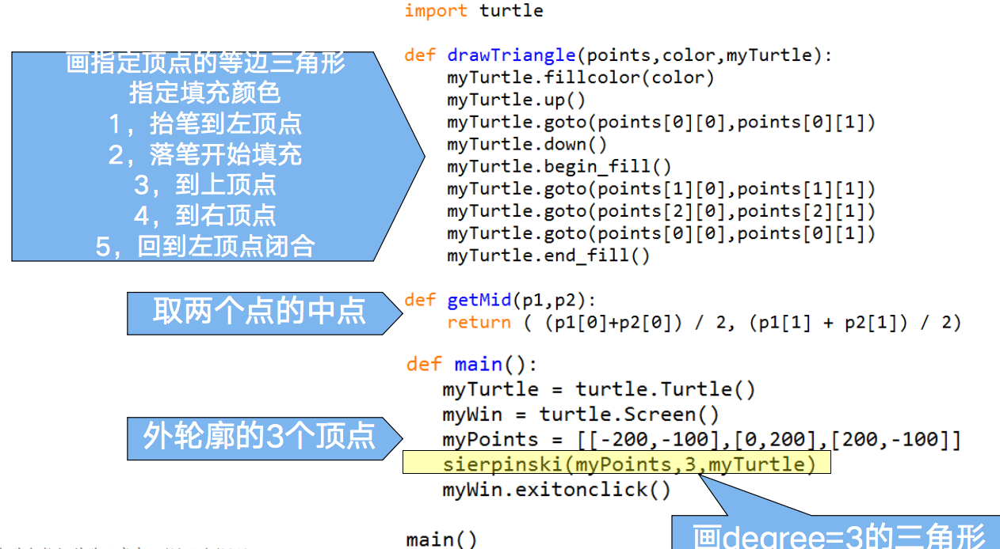

#### 递归调用过程

```bash
python code/turtle_sierp.py
```

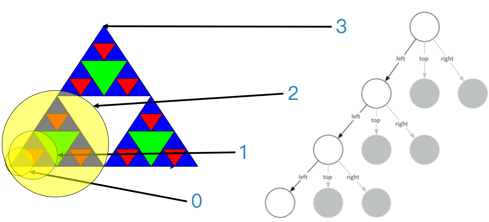

## 复杂递归问题

### 河内塔问题
- 河内塔问题(Tower of Hanoi)是法国数学家 Edouard Lucas 于 1883年，根据传说提出来的。又名 Lucas 塔，梵天塔。
- 传说在一个印度教寺庙里，有 3 根柱子，其中一根套着 64 个由小到大的黄金盘片，僧侣们的任务就是要把这一叠黄金盘从一根柱子搬到另一根，但有两个规则：
  - 一次只能搬 1 个盘子
  - 大盘子不能叠在小盘子上
- 神的旨意是说，一旦这 64 个盘子完成迁移：
  - 寺庙将会坍塌
  - 世界将会毁灭⋯⋯
- 看似危言耸听，实则千真万确。


- 虽然这些黄金盘片跟世界末日有着神秘的联系，但我们却不必太担心，据计算，要搬完这 64 个盘片：
  - 需要的移动次数为 $2^{64}−1$=18,446,744,073,709,551,615 次
  - 如果每秒钟搬动一次，则需要 584,942,417,355（五千亿）年！
  - 现有宇宙年龄的 40 倍。
- 问题如何分解为递归形式？
- 为什么要 3 个柱子？

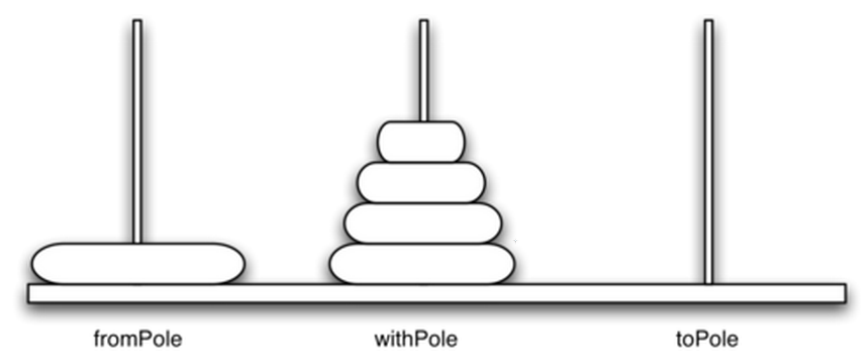

#### 问题分析

- 我们还是从递归三定律来分析河内塔问题
  - 基本结束条件（最小规模问题），如何减小规模，调用自身
- 假设我们有 5 个盘子，穿在 1# 柱，需要挪到 3# 柱
  - 可以先如果能把上面的一摞4个盘子统统挪到 2# 柱，那问题就好解决了：
  - 把剩下的最大号盘子直接从 1# 柱挪到 3# 柱，再用同样的办法把2#柱上的那一摞4个盘子挪到3#柱，就完成了整个移动
  - 最大的盘子始终在最底下，不影响其他盘子的移动。
- 我们的问题变成了4个盘子怎么从1#挪到2#柱子？(后面还要把它们从2#再挪到3#柱子)
  - 此时问题规模已经减小！
  - 同样是想办法把上面的一摞3个盘子挪到3#柱，把剩下最大号盘子从1#挪到2#柱，再想办法把一摞3个盘子从3#挪到2#柱
- 这样我们得到了一个挪3个盘子的问题；
- 这个过程可以反复进行：直到我们只需要挪动一个盘子。
  - 直接挪动就行了

#### 递归思路
- 将盘片塔从开始柱，经由中间柱，移动到目标柱：
  - 首先将上层 N-1 个盘片的盘片塔，从开始柱，经由目标柱，移动到中间柱；
  - 然后将第 N 个（最大的）盘片，从开始柱，移动到目标柱；
  - 最后将放置在中间柱的 N-1 个盘片的盘片塔，经由开始柱，移动到目标柱。
- 基本结束条件，也就是最小规模问题是：1 个盘片的移动问题
- 上面的思路用 Python 写出来，几乎跟语言描述一样：

```python
def moveTower(height, fromPole, toPole, withPole):
  if height >= 1:
    moveTower(height-1, fromPole, withPole, toPole)
    moveDisk(fromPole, toPole)
    moveTower(height-1, withPole,toPole, fromPole)

def moveDisk(fp, tp):
  print(f"moving disk from {fp} to {tp}")

moveTower(3, 'A', 'B', 'C')
```
##### 算法分析

- 河内塔递归算法的时间复杂度：
    $$ T(1) = 1$$
    $$ T(n) = 2\times T(n-1) + 1$$
    $$ T(n) = 2^{n} - 1 $$

- 河内塔递归算法的空间复杂度
  - 递归栈的最大深度？

- 思考：找到该问题的非递归解法，试着看懂它。

<details>
<summary>答案</summary>

- 栈实现，非递归算法

```python

def moveTower(height, fromPole, toPole, withPole):
  st = []
  st.append((height, fromPole, toPole, withPole))
  while st:
    h, f, t, w = st.pop()
    if h==1:
      print(f"moving disk from {f} to {t}")
      continue
    st.append((h-1, w, t, f))
    st.append((1, f, t, w))
    st.append((h-1, f, w, t))

moveTower(3, 'A', 'B', 'C')
```

</details>

### 迷宫问题

古希腊的迷宫
- 克里特岛的国王-米诺斯养的宠物
- 牛头人身怪物-米诺陶洛斯，住在迷宫里
  - 雅典因战败被迫向克里特岛进贡：每九年要送7对童男童女给米诺陶洛斯吃。
- 雅典王子忒修斯主动请缨作为牺牲者前往克里特
  - 阿里阿德涅之线：克里特公主阿里阿德涅对他一见钟情，她给了忒修斯一个线团和一把短剑。
- 忒修斯把线头系在迷宫门口，一路放线进入深处，杀死了怪兽，并顺着线走出了那座“进得去出不来”的迷宫。


圆明园的黄花阵

- 位于圆明园西洋楼景区

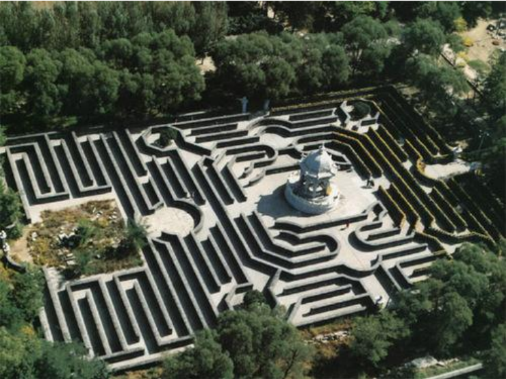

- 我们将海龟放在迷宫中间，看它如何能找到出口

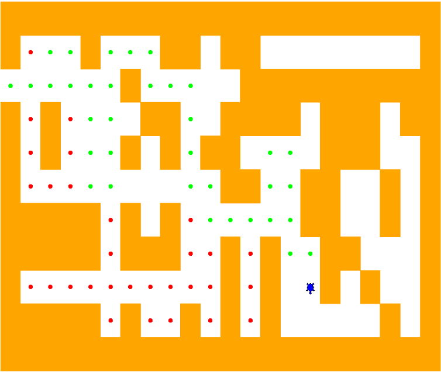

#### 迷宫的数据结构

- 首先，我们将整个迷宫的空间（矩形）分为行列整齐的方格，区分出墙壁和通道。
  - 给每个方格具有行列位置，并赋予“墙壁”、“通道”的属性
- 考虑用矩阵方式来实现迷宫数据结构
  - 采用“数据项为字符列表的列表”这种两级列表的方式来保存方格内容
  - 采用不同字符来分别代表“墙壁”、“通道”、“海龟”
    - +：墙壁
    - 空格：通道
    - S：海龟
  - 从一个文本文件逐行读入迷宫数据

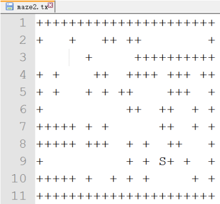

- Maze Class

```python
class Maze:
    def __init__(self, mazeFileName):
        self.mazelist = []
        self.columnsInMaze = 0
        mazeFile = open(mazeFileName, 'r')
        for line in mazeFile:
            rowList = []
            for col, ch in enumerate(line[:-1]):
                """
                1. line[-1]=='\n'
                2. 用enumerate实现循环计数器
                """
                rowList.append(ch)                 
                if ch == 'S':
                    self.startRow = len(self.mazelist)
                    self.startCol = col
            self.mazelist.append(rowList)
            if self.columnsInMaze == 0 :
                self.columnsInMaze = len(rowList)
            else:                            # 对输入数据进行检查
                assert self.columnsInMaze == len(rowList)
        self.rowsInMaze = len(self.mazelist)

if __name__ == "__main__":
    maze = Maze("code/maze.txt")
    print(maze.mazelist)
```

- Maze Class 的成员
  - mazelist：保存矩阵
  - rowsInMaze：矩阵的行数
  - columnsInMaze：矩阵的列数
  - startRow，startCol：海龟的起始位置
- 读入数据文件成功后
  - mazelist 如下图示意
  - mazelist\[row]\[col]==’+’

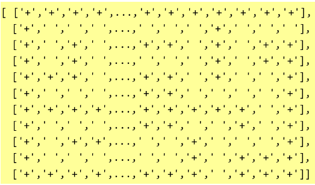

#### 算法思路

- 确定了迷宫数据结构之后，我们知道，对于海龟来说，其身处某个方格之中
  - 它所能移动的方向（东南西北），必须是向着通道的方向
  - 如果某个方向是墙壁方格，就要换一个方向移动
- 这样，探索迷宫并找到出口的递归算法思路如下：
  - 将海龟从原位置向北移动一步，然后以海龟的新位置递归调用探索迷宫寻找出口；
  - 如果上面的步骤找不到出口，那么将海龟从原位置向南移动一步，然后以海龟的新位置递归调用探索迷宫寻找出口；
  - 如果向南还找不到出口，那么将海龟从原位置向西移动一步，然后以海龟的新位置递归调用探索迷宫寻找出口；
  - 如果向西还找不到出口，那么将海龟从原位置向东移动一步，然后以海龟的新位置递归调用探索迷宫寻找出口；
  - 如果上面四个方向都找不到出口，那么这个迷宫没有出口！
  - 在方向上我们采取了“北-南-西-东”的探索顺序

* 上面这个思路看起来很完美，但有些细节是至关重要：
  * 如果我们向某个方向（如北）移动了海龟，那么如果新位置的北正好是一堵墙壁，那么在新位置上的递归调用就会让海龟向南尝试
  * 可是新位置的南边一格，正好就是递归调用之前的原位置
  * 这样就陷入了无限递归的死循环之中
* 所以需要有个机制来记录海龟所走过的路径
  * 沿途洒“面包屑”，一旦前进的方向发现“面包屑”，就不能再踩上去，而必须换下一个方向尝试
  * 对于递归调用来说，就是某方向的方格上发现“面包屑”，就立即从递归调用返回上一级。

- 这样，我们对递归调用的“基本结束条件”归纳如下：
  - 海龟碰到了“墙壁”方格，递归调用结束，返回失败；
  - 海龟碰到了“面包屑”方格，表示此方格已访问过，递归调用结束，返回失败；
  - 海龟碰到了“出口”方格，即“位于边缘的通道”方格，递归调用结束，返回成功！
  - 海龟在四个方向上探索都失败，递归调用结束，返回失败
- 为了让海龟在迷宫图里跑起来，我们给迷宫数据结构 Maze Class添加一些成员和方法
  - t：一个作图的海龟，设置其 shape 为海龟的样子（缺省是一个箭头）
  - drawMaze()：绘制出迷宫的图形，墙壁用实心方格绘制
  - updatePosition(row, col, val)：更新海龟的位置，并做标注
  - isExit(row, col)：判断是否“出口”

#### 算法代码

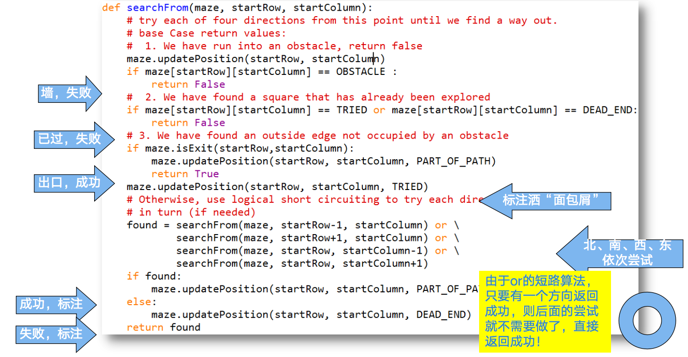

<details>
<summary> 完整代码 </summary>

- 可执行完整代码


    ```python
    import turtle
    OBSTACLE = '+'
    TRIED = '#'
    DEAD_END = '$'
    PART_OF_PATH = '*'
    TURTLE = 'S'
    class Maze(list):
        def __init__(self, mazeFileName):
            self.columnsInMaze = 0
            mazeFile = open(mazeFileName, 'r')
            for line in mazeFile:
                rowList = []
                for col, ch in enumerate(line[:-1]):
                    rowList.append(ch)
                    if ch == 'S':
                        self.startRow = len(self)
                        self.startCol = col
                self.append(rowList)
                if self.columnsInMaze == 0 :
                    self.columnsInMaze = len(rowList)
                else:  #对输入数据进行检查
                    assert self.columnsInMaze == len(rowList)
            self.t = turtle.Turtle()
            self.w = turtle.Screen()

        def updatePosition(self, row, col, what):
            self[row][col] = what
            self.draw_cell(row, col)

        def draw_cell(self, row, col, size=40):
            what = self[row][col]
            if what == OBSTACLE:
                self.drawSquare((col*size, row*size), size, "orange")
            elif what == TURTLE:
                self.drawSquare((col*size, row*size), size, "white")
                self.drawSquare((col*size+10, row*size+10), 20, "green")
            elif what == TRIED:
                self.drawSquare((col*size, row*size), size, "white")
                self.drawSquare((col*size+15, row*size+15), 10, "blue")
            elif what == DEAD_END:
                self.drawSquare((col*size, row*size), size, "white")
                self.drawSquare((col*size+15, row*size+15), 10, "black")
            elif what == PART_OF_PATH:
                self.drawSquare((col*size, row*size), size, "white")
                self.drawFlag((col*size+15, row*size+15), 10, "red")
            else:
                self.drawSquare((col*size, row*size), size, "white")

        def isExit(self, row, col):
            return row == 0 or row == len(self)-1 \
                    or col == 0 or col == self.columnsInMaze-1
        def drawMaze(self):
            for row in range(len(self)):
                for col in range(self.columnsInMaze):
                    self.draw_cell(row, col)
            return True
        def t_goto(self, x, y):
            self.t.goto(x-200, 200-y)

        def drawFlag(self, start, size, color):
            self.t.fillcolor(color)
            self.t.up()
            self.t_goto(start[0], start[1])
            self.t.down()
            self.t.begin_fill()
            self.t_goto(start[0]+size, start[1])
            self.t_goto(start[0], start[1]+size)
            self.t_goto(start[0], start[1])
            self.t.end_fill()
            self.t.right(90)
            self.t.forward(size/3)
            self.t.backward(size/3)
            self.t.left(90)

        def drawSquare(self, start, size, color):
            self.t.fillcolor(color)
            self.t.up()
            self.t_goto(start[0], start[1])
            self.t.down()
            self.t.begin_fill()
            self.t_goto(start[0]+size, start[1])
            self.t_goto(start[0]+size, start[1]+size)
            self.t_goto(start[0], start[1]+size)
            self.t_goto(start[0], start[1])
            self.t.end_fill()

        def search_exit(self):
            self.searchFrom(self.startRow, self.startCol)

        def searchFrom(self, startRow, startColumn):
            if self[startRow][startColumn] == OBSTACLE :
                return False
            if self[startRow][startColumn] == TRIED or self[startRow][startColumn] == DEAD_END :
                return False
            self.updatePosition(startRow, startColumn, TURTLE)
            if self.isExit(startRow, startColumn):
                #self.updatePosition(startRow, startColumn, PART_OF_PATH)
                return True
            self.updatePosition(startRow, startColumn, TRIED)
            found = self.searchFrom(startRow-1, startColumn) or \
                self.searchFrom(startRow+1, startColumn) or \
                self.searchFrom(startRow, startColumn-1) or \
                self.searchFrom(startRow, startColumn+1) 
            if found:
                self.updatePosition(startRow, startColumn, PART_OF_PATH)
            else:
                self.updatePosition(startRow, startColumn, DEAD_END)
            return found
        def exit(self):
            self.w.exitonclick()

    import sys

    if __name__ == "__main__":
        #mazefile = input("Pls input maze filename")
        mazefile = sys.path[0]+"/maze.txt"
        maze = Maze(mazefile)
        maze.drawMaze()
        maze.search_exit()
        maze.exit()
    ```
</details>

- 地图文件
```bash
cat code/maze.txt
```

- 运行迷宫探索程序

```bash
python code/maze.py
```

## 动态规划

动态规划 Dynamic Programming
> program: arrange according to a plan or schedule 

- 计算机科学中许多程序都是为了找到某些问题的最优解，例如：
  - 两个点之间的最短路径
  - 能最好匹配一系列点的直线
  - 满足一定条件的最小集合
- 人们会采用各种策略来解决这些问题，我们这里介绍其中的一种策略：动态规划

### 硬币找零问题
- 优化问题的一个经典的案例是“最少硬（纸）币数找零” 问题
  - 假设你为一家自动售货机厂家编程序，自动售货机要每次找给顾客最少数量的硬币；
  - 假设某次顾客投进\$1 纸币，买了¢37 的东西，要找¢63，那么最少数量就是：两个 quarter（¢25）、一个 dime（¢10）和三个 penny（¢1），一共 6 个
  - 一般我们这么做：重复“选择不大于找零余额的最大硬币找给顾客”，直至余额为零。

#### 贪心法

- 这种方法称为“贪心法 Greedy Method”
  - 朝着解决问题的方向，每一步都迈出最大可能的步子。
    - 实际上，每一步的选择会影响到后面步子的选择空间
    - 下棋时“贪吃”，只顾眼前利益，多数情况是输的
- “贪心法”在美元硬币体系（25/10/5/1）下表现尚好
- 但如果出现一种¢21 的硬币会怎么样呢？
  - 按照“贪心法”，找零¢63 还是原来的 6 个硬币
  - 但实际上最优解是 3 个
- “贪心法”失效了。

#### 递归解法

- 我们来找一种肯定能找到最优解的方法，既然本章是介绍递归，那这个解法肯定是递归的
- 首先是确定基本结束条件，兑换硬币这个问题最简单直接的情况就是，需要兑换的找零，其面值正好等于某种硬币
  - 如找零 25 分，答案就是 1 个硬币！
- 其次是减小问题的规模，在美元硬币体系里，每次找出一枚硬币可以有 4 种尝试：
  - 找零减去 1 分 (penny) 后，求兑换硬币最少数量的解；
  - 找零减去 5 分 (nikel) 后，求兑换硬币最少数量的解；
  - 找零减去 10 分 (dime) 后，求兑换硬币最少数量的解；
  - 找零减去 25 分 (quarter) 后，求兑换硬币最少数量的解；
- 上述 4 项中选择最小的一个，再加上 1。
                  $$ minCoins=1+min\left.
                  \begin{cases}
                    minCoins(originalamount-1)\\
                    minCoins(originalamount-5)\\
                    minCoins(originalamount-10)\\
                    minCoins(originalamount-25)\\
                  \end{cases}\right. $$
```python
rec_cnt = 0

import sys
def recMC(coinValueList, change):
    global rec_cnt
    rec_cnt += 1
    if change in coinValueList:
        return 1       # 最小规模,直接返回
    # 减小规模:依次尝试减去一种硬币面值,再调用自身
    ntry = [recMC(coinValueList, change-c) for c in coinValueList if c <= change]
    # 挑选出最优方案,再加一
    return 1+min(ntry, default=sys.maxsize)

print(recMC([1,5,10,25], 63))
print(rec_cnt)
```

##### 递归解法分析

- 递归解法虽然能解决问题，但其最大的问题是：极！其！低！效！
  - 对 63 分的兑换硬币问题，需要进行 67,716,925 次递归调用！
  - 在一台笔记本电脑上花费了半分钟时间得到解：6 个硬币
- 以 26 分兑换硬币为例，看看递归调用过程。只观察上面3层的递归调用，就发现大量的重复计算！
  - 结点是剩余的找零数额，边上标记了所取用的硬币面值
  - 例如对 15 分的求解，在这里出现了 3 次！浪费 2 次
  - 而求解 15 分底下还要 52 次递归调用，所以总共浪费 104 次调用

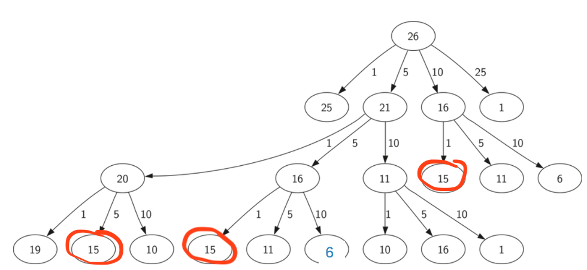

##### 递归解法改进

- 对这个递归解法进行改进的关键就在于消除重复计算
  - 我们可以用一个表将计算过的中间结果保存起来，在计算之前查表看看是否已经计算过
- 这个算法的中间结果就是部分找零的最优解，在递归调用过程中已经得到的最优解被记录下来
  - 在递归调用之前，先查找表中是否已有部分找零的最优解
  - 如果有，直接返回最优解而不进行递归调用
  - 如果没有，才进行递归调用
- 改进后的解法，极大减少了递归调用的次数
  - 对 63 分的兑换硬币问题，仅仅需要 221 次递归调用，是改进前的三十万分之一，瞬间返回！
```python
rec_cnt = 0

import sys
def recMC(coinValueList, change, knownResults):
    """
    用函数值缓存递归法求解最小硬币数问题，
    返回值不小于sys.maxsize表示无解;
    knownResults列表中的0表示缓存空洞
    """
    global rec_cnt
    rec_cnt += 1
    if knownResults[change] > 0:   
        return knownResults[change] #查表命中直接返回
    elif change in coinValueList:
        knownResults[change] = 1    #最小规模先记录结果
        return 1                    #再返回
    # 减小规模:依次尝试减去一种硬币面值,再调用自身
    ntry = [recMC(coinValueList, change-c, knownResults) for c in coinValueList if c <= change]
    # 挑选出最优方案,再加一;记录结果并返回                
    knownResults[change] = 1+min(ntry,default=sys.maxsize) 
    return knownResults[change]

print(recMC([2,5,10,25], 63, [0]*64))
print(rec_cnt)
```

- Python已经为我们实现了这种优化，叫做函数值缓存

```python
rec_cnt = 0

import sys
from functools import lru_cache

@lru_cache(maxsize=None)
def recMC(coinValueList, change):
    """
    用函数值缓存递归法求解最小硬币数问题，
    返回值不小于sys.maxsize表示无解;
    knownResults列表中的0表示缓存空洞
    """
    global rec_cnt
    rec_cnt += 1

    if change in coinValueList:
        return 1                    #再返回
    # 减小规模:依次尝试减去一种硬币面值,再调用自身
    ntry = [recMC(coinValueList, change-c) for c in coinValueList if c <= change]
    # 挑选出最优方案,再加一;记录结果并返回                
    return 1+min(ntry,default=sys.maxsize) 

print(recMC([1,5,10,25], 63))
print(rec_cnt)
```

```python
rec_cnt = 0

import sys
from functools import lru_cache

@lru_cache(maxsize=None)
def recMC(change):
    """
    用函数值缓存递归法求解最小硬币数问题，
    返回值不小于sys.maxsize表示无解;
    knownResults列表中的0表示缓存空洞
    """
    global rec_cnt
    rec_cnt += 1

    if change in coinValueList:
        return 1                    #再返回
    # 减小规模:依次尝试减去一种硬币面值,再调用自身
    ntry = [recMC(change-c) for c in coinValueList if c <= change]
    # 挑选出最优方案,再加一;记录结果并返回                
    return 1+min(ntry,default=sys.maxsize) 

coinValueList = [2, 5, 10, 25]
print(recMC(63))
print(rec_cnt)
```

#### 动态规划解法
- 动态规划算法采用了一种更有条理的方式来得到问题的解
- 兑换硬币的动态规划算法从最简单的“1 分钱找零”的最优解开始，逐步递加上去，直到我们需要的找零钱数
- 在找零递加的过程中，设法保持每一分钱的递加都是最优解，一直加到求解找零钱数，自然得到最优解
- 递加的过程能保持最优解的关键是，其依赖于更少钱数最优解的简单计算，而更少钱数的最优解已经得到了。
- 还是归纳法：a(1) 显而易见；在 a(i) 1≤i≤n−1 已知的情况下，求解a(n)
- “规划”名字的来由
  - 递归算法：自顶向下，碰到什么计算什么
  - 动规：从小到大、自底向上按事先规划计算

* 找零问题，动态规划是怎么开始“规划” 的？
  - 从1分钱兑换开始
  - 逐步建立一个最优兑换表
    - 2/3/4分钱只能使用1分钱硬币找零
  - 到 5 分钱兑换有两个选择：
    - 5 个 1 分或者 1 个 5 分硬币
    - 显然 1 个是最优解
    - 所以将 1 填入表中
  - 那么更多的钱数是如何得到解？
    - 下面我们看 11 分钱的过程

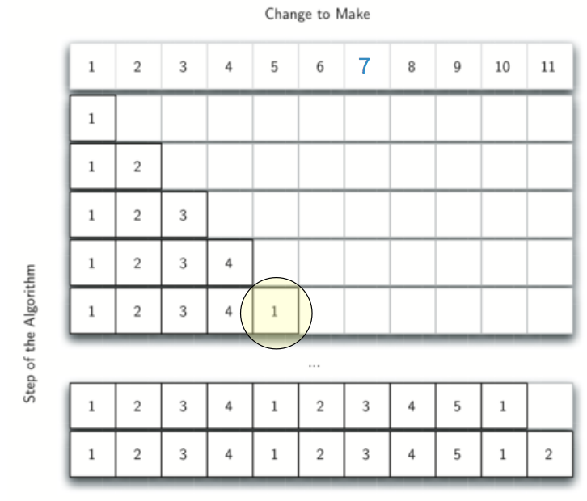

* 没有 11 分钱的硬币，它肯定需要由小于 11 分钱的多枚硬币加起来。我们可以假设里面有一枚n分钱的硬币，n可以是1、5、10。于是计算 11 分钱的
兑换法分如下几步：
  1. 首先 11 分钱减去 1 个 1 分钱的币值，剩下 10 分钱，查表，10 分钱的最优解是 1
  1. 然后 11 分钱减去 1 个 5 分钱的币值，剩下 6 分钱，查表，6 分钱的最优解是 2
  1. 最后 11 分钱减去 1 个 10 分钱的币值，剩下 1 分钱，查表，1 分钱的最优解是 1
* 这样，第 1、3 步我们都可以得到 11 分钱的最优解：2 个硬币

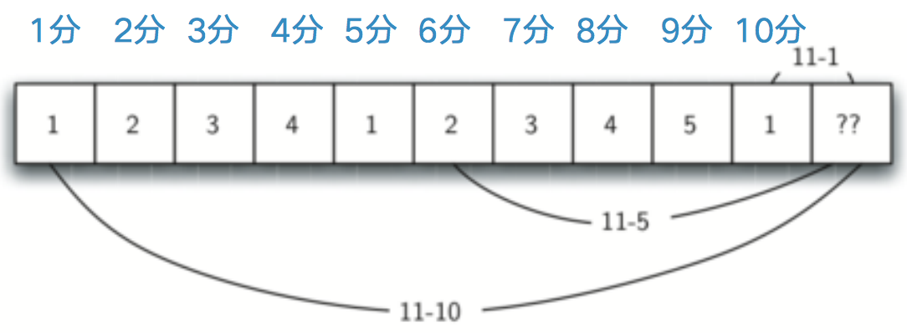

```python
import sys

def dpMC(coinValueList, change):
    """
    动态规划法硬币找零,无解时返回为None;
    """
    minCoins=[0]*(change+1)
    # 计算从一分到所需找零，零分找零为零，无需计算
    for cents in range(1, change+1):
        # 依次减去一种硬币面值,查表而不是递归来获得部分最优解
        ntry = [minCoins[cents-c] for c in coinValueList if c <= cents]
        # 部分最优解取最小值,再加一得到最优解
        minCoins[cents] = 1+min(ntry, default=sys.maxsize)
    # 循环结束，对最优解进行判断并返回
    return minCoins[change] if minCoins[change]<sys.maxsize else None

print(dpMC([1,5,10,25], 63))
```

#### 动态规划算法扩展

- 我们注意到动态规划算法的 dpMakeChange 并不是递归函数，虽然这个问题是从递归算法开始解决，但最终我们得到一个更有条理的高效非递归算法
  - 动态规划计算最优找零，对于找零金额，从最简单情况开始到达目标金额，每一步都依靠以前的最优解来得到本步骤的最优解，直到得到答案。
- 前面的算法已经得到了最少硬币的数量，但没有返回硬币如何组合
  - 扩展算法的思路很简单，只需要在生成最优解列表同时跟踪记录所选择的那个硬币币值即可
  - 在得到最后的解之后，减去选择的硬币币值，回溯到表格之前的部分找零，就能逐步得到每一步所选择的硬币币值

```python
import sys

def dpMC(coinValueList, change):
    """
    动态规划法硬币找零,返回最少找零数和部分最优解对应的硬币
    当无解时最少找零数为None;
    """
    minCoins = [0]*(change+1)
    coinsUsed = [0]*(change+1)
    for cents in range(1, change+1):
        # 依次尝试减去一种硬币面值,通过查表而不是递归来获得部分最优解
        # 当时使用的硬币也一起记录下来
        ntry = [(1+minCoins[cents-c],c) for c in coinValueList if c <= cents]
        # 挑选部分最优解中最小的
        minCoins[cents], coinsUsed[cents] = min(ntry, key=lambda x:x[0], default=(sys.maxsize, None))
    return minCoins[change] if minCoins[change]<sys.maxsize else None, coinsUsed 
    
def printCoins(coinsUsed, change):
    buff = []
    while change > 0:    #查表知道最优解首先使用的硬币
        thisCoin = coinsUsed[change]
        buff.append(str(thisCoin))
        change -= thisCoin
    print(' '.join(buff))
    
if __name__ == "__main__":
  change = 63
  mincoin,coinsUsed = dpMC([1, 5, 10,21,25]，change)  #增加了硬币奇葩21
  print("Making change for {} penny requires {} coins".format(change, minCoin))
  print("They are: ", end='")
  printCoins(coinsUsed, change)
  print("UsedCoins table is as follows:")
  print(coinsUsed)
```

## 递归与动态规划的比较

使用两个比较简单的例子。

### 最短路径数问题

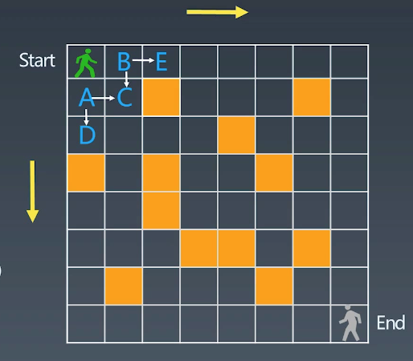

- 递归解法思路

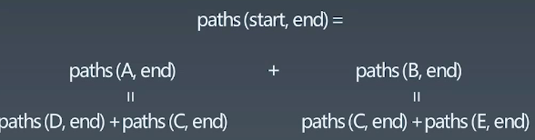

```python
def paths(row, col, M, N):
  if row==M or col==N: 
    return 1 
  else:
    return paths(row+1, col, M, N) + paths(row, col+1, M, N)
```

- 动态规划：最下一行和最右一列都是 1，然后往左、往上计算。

```python
def pathsDP(M, N):
  paths = [[0]*N+[1] for _ in range(M)]
  paths.append([1]*(N+1))

  for j in range(M-1, -1, -1):
    for i in range(N-1, -1, -1):
      paths[j][i] = paths[j+1][i] + paths[j][i+1]
  return paths[0][0]

if __name__ == "__main__":
  print(paths(0, 0, 4, 5))
  print(pathsDP(4, 5))
```

### 列车编组问题

- 一列火车有若干个车厢，从 A 点通过一个道岔 C 后，对车厢进行重新编组。
- 到达 B 点后，车厢有多少种排列方式？
- 题目有多种解法

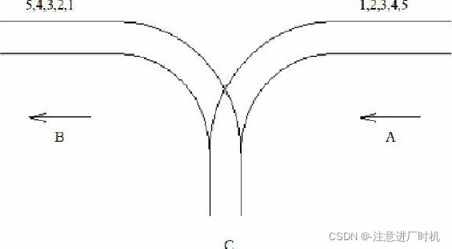

求出栈序列数：
- 蛮力法：对车厢进行全排列，再通过栈一一验证。
- 抽象法：把入栈/出栈操作抽象为平面上点的移动，转化为最短路径数问题。

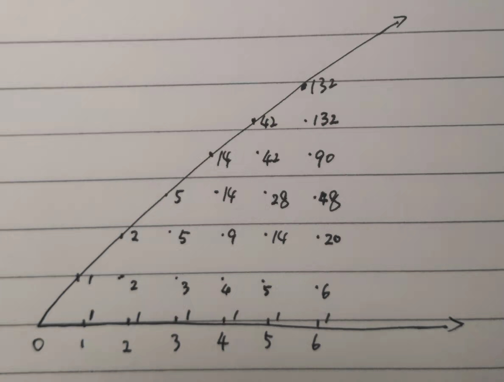

#### 归纳法思想
- 车厢数为 N 的时候，通过栈重新编组后的排列数为 T(N)
- 找 N 与 N− 1 的关系，或者 N 与 1, 2, . . . , N−1 的关系
- 考虑 N=6 的时候，车厢 1 在 B 中出现在第 3 位的排列数
  - ? - ? - 1 - ? - ? - ?
  - {2, 3} - 1 - {4, 5, 6} 排列情况: T(2) \* T(3)
- 车厢 1 的新位置还可能是 1，2，4，5，6，它们对应的排列数为T(i) * T(5−i)；
- 考虑车厢 1 在位置为 1 或 6 的情况，为了简化公式令 T(0) = 1 得到递推公式
                $$T(n) = \sum{}_{i=0}^{n-1}{T_{i}*T_{n-1-i}}$$
- 数学解法：根据递推公式求通项

* 利用递推公式编程解决

```python
# 车厢编组问题
def T(n): 
  return 1 if n<=1 else sum(T(i)*T(n-1-i) for i in range(n))

def Tdp(n):
  t=[1]*(n+1)
  for i in range(2,n+1):
    t[i] = sum(t[j]*t[i-1-j] for j in range(i))
  return t[n]

if __name__ == "__main__":
  print (T(6))
  print (Tdp(6))
```

### 最优子结构

- 通过子问题的最优解，能够轻易的构造出原问题的最优解
  - 子问题的规模，小于原问题
  - 子问题的数量是有限的

* 递归与动态规划算法后面都存在着最优子结构
* 动态规划按照计算的依赖关系，对它们的顺序进行了主动重排
  - 如果 A 依赖于B, 先于 A 把 B 计算好，而不是等 A 的调用。
* 如果不同的子问题之间出现重叠 overlap，即有相同的“孙”问题时，动规的效率更高

### 运行效率比较

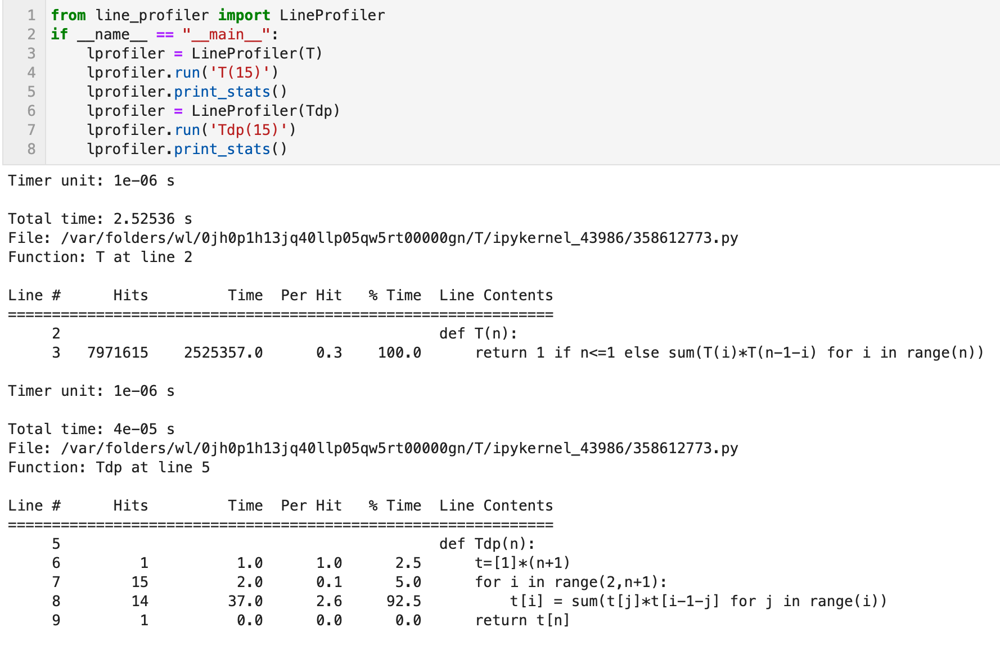

## DP 的一般套路

**得DP者，得数算。**

- 把原问题扩展为具有最优子结构的问题 Q。
  - 一维情景：Q = Q(n) ，复杂度O(n)
  - 二维情景：Q = Q(n, m)，复杂度O($n^2$)
  - 三维场景：见的比较少，复杂度O($n^k$)
- 找到 Q 的递归推导式：
  - 一维情景：
                $$Q(n) = F(Q(n_1),Q(n_2),\ldots,Q(n_i)), n_1,n_2,\ldots,n_i<n$$
  - 二维情景：
                $$Q(n, m) = F(Q(n_i,m_j),\ldots), (n_i<n \land{}m_j\leq{}m)\vee(n_i\leq n \land m_j<m) $$
  - 当 n 和 m 很小的时候，Q 易得

- 算法实现
  - 动态规划：用一个数组 dp 存储 Q 的结果，从“前” 往“后” 算
  - 递归：用递归函数“原则”上也可以

### DP习题

跟着套路“按图索骥”

#### 博物馆大盗问题

- 大盗潜入博物馆，面前有 5 件宝物，分别有重量和价值，大盗的背包仅能负重 20 公斤，请问如何选择宝物，总价值最高？

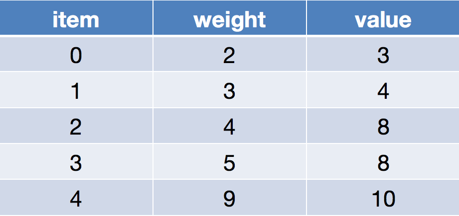

- 博物馆每种宝物只有一件！如果有很多件的话，则变成“超市零元购”问题。

#### 单词最小编辑距离问题

- 任意两个单词之间的变换，长度可以不同。
  - 从源单词每复制一个字母到目标单词，计 5 分
  - 从源单词每删除一个字母，计 20 分
  - 在目标单词每插入一个字母，计 20 分
- 例如从单词“algorithm”变为“alligator”

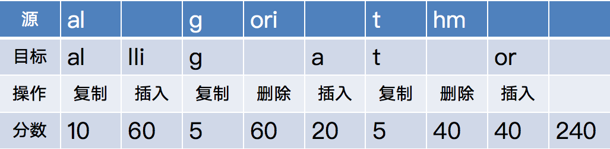

* 求多种操作方案中，分数最低的一种方案（编辑距离最小）

#### 最长公共子序列问题 LCS

- 定义一些线性表中的概念
  - 子序列：从原序列 A 中去除某些元素但不破坏余下元素的相对位置（在前或在后）而形成的新序列 L。
  - 子串：如果 L 在 A 中是连续的，即 L 中的前驱/后继关系在 A 中也是，则称 L 为 A 的子串。
  - 前缀：子串 L 在 A 的开始位置出现。
  - 后缀：子串 L 在 A 的末端出现。
- 问题描述：给定两个序列：$X[1\ldots m]$ 和 $Y[1\ldots n]$，求在两个序列中同时出现的最长子序列的长度。
  - 假设 X 和 Y 的序列如下：
    - $X[1\ldots m] = \{A, B, C, B, D, A, B\}$
    - $Y[1\ldots n] = \{B, D, C, A, B, A\}$
  - 可以看出，X 和 Y 的最长公共子序列有“BDAB”、“BCAB”、“BCBA”，即长度为 4。

#### 最长公共子串问题

问题描述：给定两个序列：$X[1\ldots m]$ 和 $Y[1\ldots n]$，求在两个序列中同时出现的最长子串的长度。

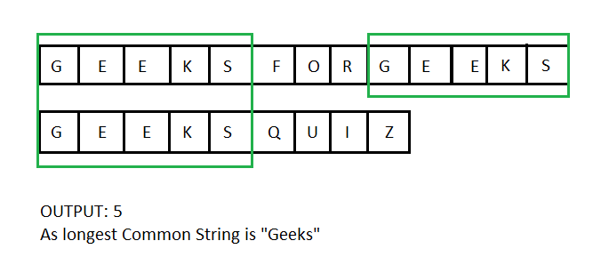

#### 最长公共前后缀问题

- 问题描述：给定序列：$A[1\ldots m]$，不等于 A 的 L 满足：L 同时是 A 的前缀和后缀，求 L 的最大长度。
- 力扣 1392《最长快乐前缀》
  - “快乐前缀” 是在原字符串中既是前缀也是后缀（不包括原字符串自身）的字符串。
  - 给你一个字符串 s，请你返回它的最长快乐前缀。如果不存在满足题意的前缀，则返回一个空字符串 ”” 。

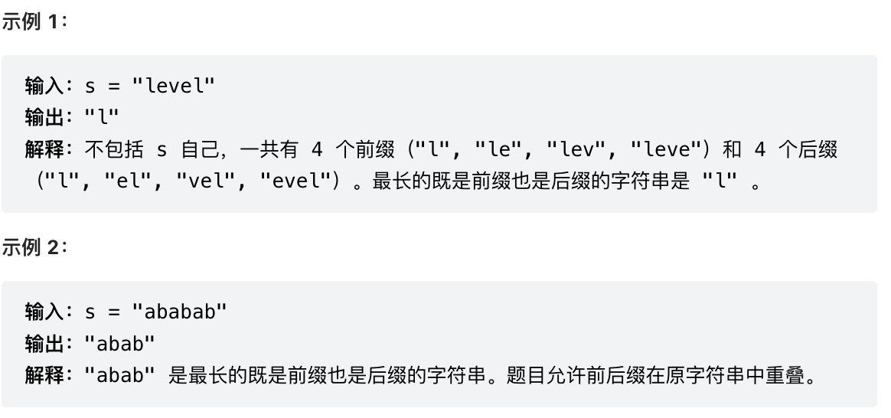

## 本章小结

- 在本章我们研究了几种递归算法，表明了递归是解决某些具有自相似性的复杂问题的有效技术
- 递归算法“三定律”
  - 递归算法必须具备基本结束条件
  - 递归算法必须要减小规模，改变状态，向基本结束条件演进
  - 递归算法必须要调用自身
- 某些情况下，递归与迭代循环（DP）可以互相替代
- 递归算法通常能够跟问题的表达很自然地契合
- 递归不总是最合适的算法，有时候递归算法会引发巨量的重复计算
- 算法课程中能学到的是用计算机解决一类问题的固定方法及套路；
- 在这之前先要分析问题，所需的逻辑、归纳、推理能力，则来源于长期的数学训练。
