---
jupyter:
  jupytext:
    cell_metadata_filter: -all
    split_at_heading: true
    text_representation:
      extension: .md
      format_name: markdown
      format_version: '1.3'
      jupytext_version: 1.18.1
  kernelspec:
    display_name: Python 3 (ipykernel)
    language: python
    name: python3
---

# Ch051. KMP算法

[Home]( README.md )

## 问题的提出

- 问题的定义：从一个较长的字符串 S(string，长度 n) 中, 查找一个较短的字符串P(pattern，长度 m)有没有出现，如果有的话，返回P 在 S中出现的位置。
- 计算机上使用最多的操作之一
- 首先想到一个朴素的查找算法 (baseline)
  - 把 S 和 P 左对齐，逐字比较 S 和 P
  - 碰到二者不匹配的地方，把 P 向右移动一格再重新开始
  - 直到发现 P 在 S 中出现了一处完全匹配

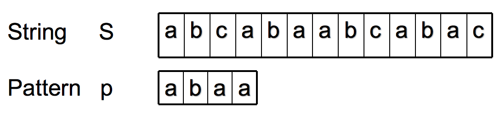

## 朴素算法

- 从头开始，逐一比对

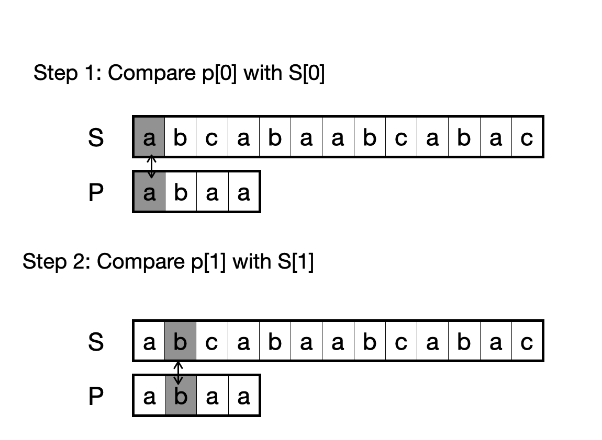

- 发现不同，右移一位，从头开始

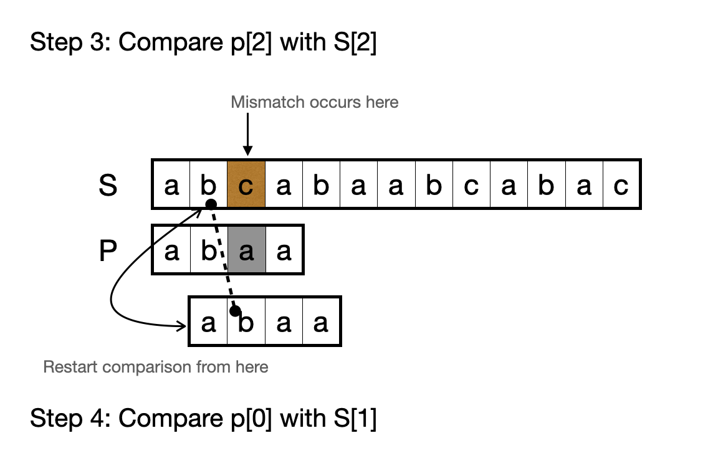

- 匹配完成

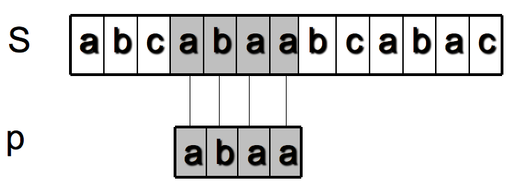

- P 经历了三次右移之后，在 S 中找到了一处它的完全匹配
- 在最坏的情况下，P 可能经历n-m次移动，共进行了 n-m+1 轮比较，每轮比较 m 个字符，所以复杂度为 O(mn)
  - 如何去构造这种 **最坏情况** ？

* 实现代码
```python
def indexOmn(S, P, pos=0):
    i=0                     #P的读写头
    j=pos                     #S的读写头
    while i<len(P) and j<len(S):
        if P[i] == S[j]:    #两个读写头下的字符相等
            i += 1
            j += 1
        else:               #不等
            j = j - i + 1   #把P右移一格，重新比较
            i = 0
    else:
        if i == len(P):     #找到了一个匹配
            return j-i
        else:
            return None

print(indexOmn("baababababacaca", "ababaca"))
print(indexOmn("baababababacaca", "ababaxa"))
```

## The Knuth-Morris-Pratt Algorithm(KMP)

**KMP 算法**（Knuth-Morris-Pratt 算法）是计算机科学中极其经典的**字符串匹配算法**。

### 算法作者

KMP 算法由 **Donald Knuth**、**James H. Morris** 和 **Vaughan Pratt** 在 1977 年共同发布。这三位都是计算机科学界的泰斗。

- 1. Donald Knuth（高德纳） 被誉为“现代计算机科学的鼻祖”。
  * **《计算机程序设计艺术》（TAOCP）：** 这部著作被公认为计算机科学的“圣经”，他为了写这部书甚至发明了 **TeX** 排版系统。
  * **算法分析：** 他是算法分析领域的奠基人，严格化了算法复杂度的评估方法。
  * **图灵奖得主：** 1974 年因其在算法和程序设计语言领域的卓越贡献获奖。

- 2. James H. Morris（詹姆斯·莫里斯） 卡内基梅隆大学（CMU）的名誉教授，在软件工程和编程语言领域贡献巨大。
  * **模块化编程：** 他在早期对模块化概念和信息隐藏原则的研究，对现代编程语言的设计产生了深远影响。
  * **拉链操作（Lazy Evaluation）：** 他在函数式编程和惰性求值逻辑方面也有重要的理论贡献。
  * **教育领导力：** 曾长期担任 CMU 计算机学院院长，推动了人机交互（HCI）等新兴学科的发展。

- 3. Vaughan Pratt（沃恩·普拉特）斯坦福大学名誉教授，是一位博学多才的科学家。
  * **普拉特解析法（Pratt Parser）：** 一种非常高效的自顶向下算符优先解析算法，广泛应用于现代编程语言（如 Rust, Swift）的编译器设计中。
  * **工作站先驱：** 他在 Sun Microsystems 的早期设计中发挥了关键作用，参与了早期工作站架构的研发。
  * **素数测试：** 他证明了素数测试属于 **NP** 问题（Pratt证书），这在计算复杂性理论中是一个里程碑。

### 算法思路

- 改进上面的朴素算法，Knuth, Morris 和 Pratt 设计了一个线性时间算法。
- 新算法获得了 O(n+m) 的复杂度：
   > 当一次不匹配出现在 P[j] 与 S[i] 之间时， P[:j] 与 S[i-j:i] 应该是已匹配的。
   > 通过事先对 P 进行计算，来实现P的高速右移（不再是一格），来去除大量的无用比较。

- 我们通过一些 S 和 P 的例子来进行说明：

  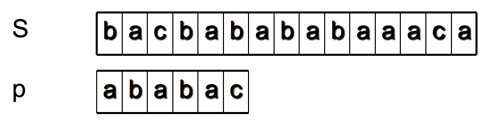

- `i` 和 `j` 分别用作 S 和 P 的读取下标

#### 过程示例

- 我们观察到，有时 P 移动的步子可以“大” 一些。

  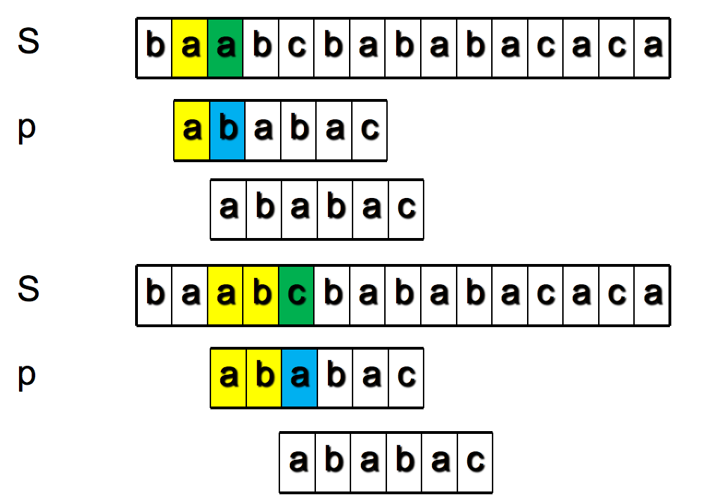

- 关键：每次比较失败以后，P应该往前挪多少？
- 这取决于 P 长成什么样子

  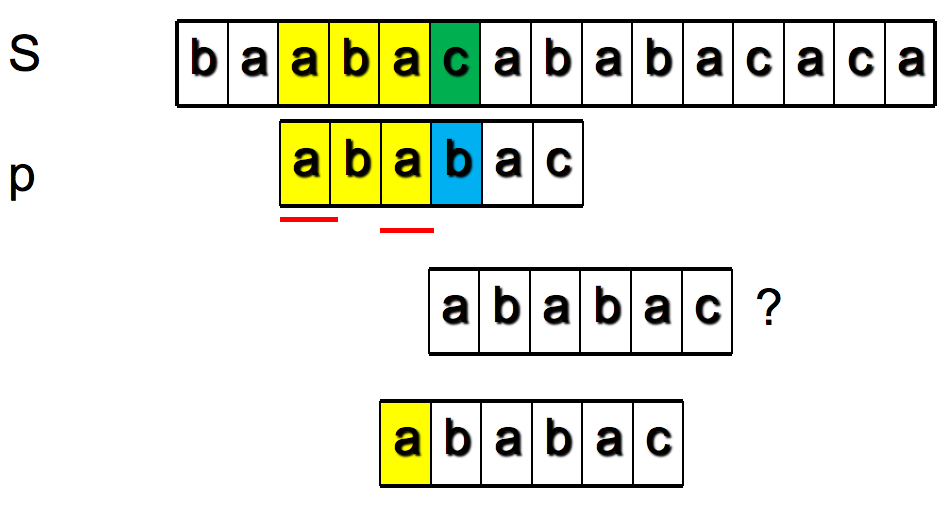

- 关键是黄色的已匹配部分 P[:j] (j=5) 有多少前缀和后缀是相同的
- P 右移后让它的前缀占据原来后缀的位置，从它前缀的后继字符开始与不匹配字符（绿色的`b`）继续比较
  - 如果它没有相同的前后缀，则把P全部右移，用它的首字符与不匹配字符继续比较
  - P[:j]的公共前后缀可能有多个：最长的lps，次长的lps'，次次长的lps''，
    - 哪个带来的移动快？
    - 我们采用哪个？
- 如果已匹配部分是空串 (j=0)，则把 P 右移一格，从它的首字符开始比较。
- 在代码中，移动操作都是通过修改 S 和 P 的读取下标来实现的

  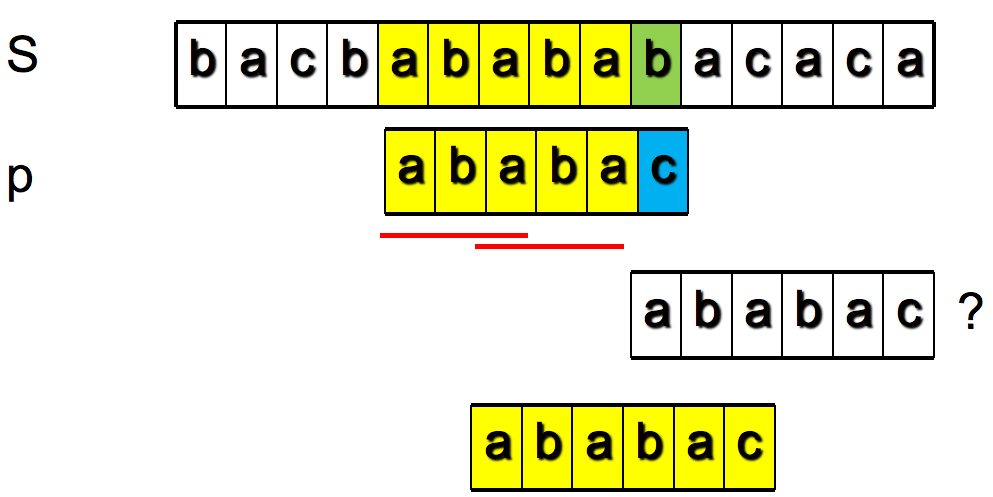

### 最长公共前后缀lps的计算

在动态规划例题中已经讲过了。直接上代码

```python
def lps(P):
  nxt = [-1] * (len(P)+1)
  for i in range(0, len(P)):
    j = nxt[i]
    while j != -1 and P[i] != P[j]:
      j = nxt[j]
    else:
      nxt[i+1] = 0 if j == -1 else j+1
  return nxt  

if __name__ == "__main__":
  print(lps("ababaca"))
  print(lps("aaaaaaab"))
```

#### 随堂练习

- 给定长度为 8 的 pattern = ’aaaaaaab’，请计算它的模式值 next？
  * A. [0, 1, 2, 3, 4, 5, 6, 0]
  * B. [0, 1, 1, 1, 1, 1, 1, 0]
  * C. [0, 0, 1, 1, 1, 1, 1, 1, 0]
  * D. [0, 1, 2, 3, 4, 5, 6, 7]

### KMP主程序

```python
def indexKMP(S, P, pos=0):
  j=0                     #P的读写头
  i=pos                   #S的读写头
  nxt=lps(P)              #计算P的next数组

  while j<len(P) and i<len(S):
    if P[j] == S[i]:      #两个读写头下的字符相等
      i += 1
      j += 1
    else:                 #不等
      if j == 0:          #P的首字符
        i += 1               #P右移一位
      else:
        j = nxt[j]        #利用lps去右移P
  else:
    if j == len(P):       #找到了一个匹配
      return i-j
    else: 
      return None

if __name__ == "__main__":
  print(indexKMP("baababababacaca", "ababaca")) 
  print(indexKMP("baababababacaca", "ababaxa"))
```

- i 是 S 的比较位置
- j 是 P 的比较位置
- 比较成功，i,j 都往后移
- 不成功
  - 如果j=0，i 加一
  - 否则 j 变为nxt[j]

### 示例

核心逻辑：根据已匹配部分的lps决定移动步长。

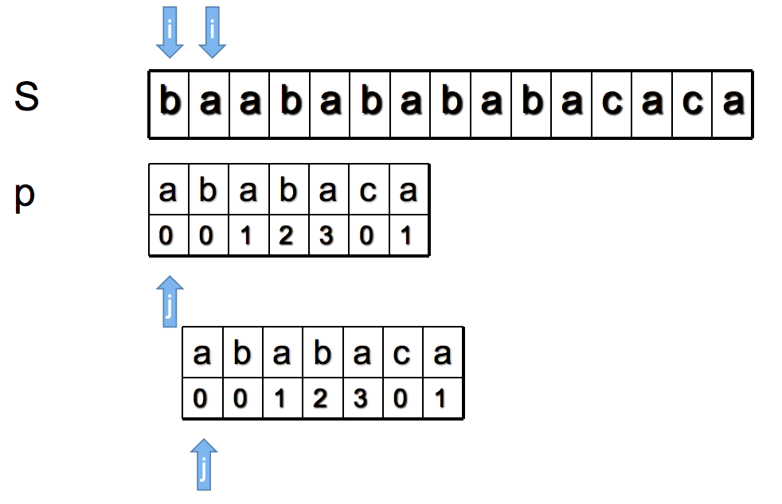

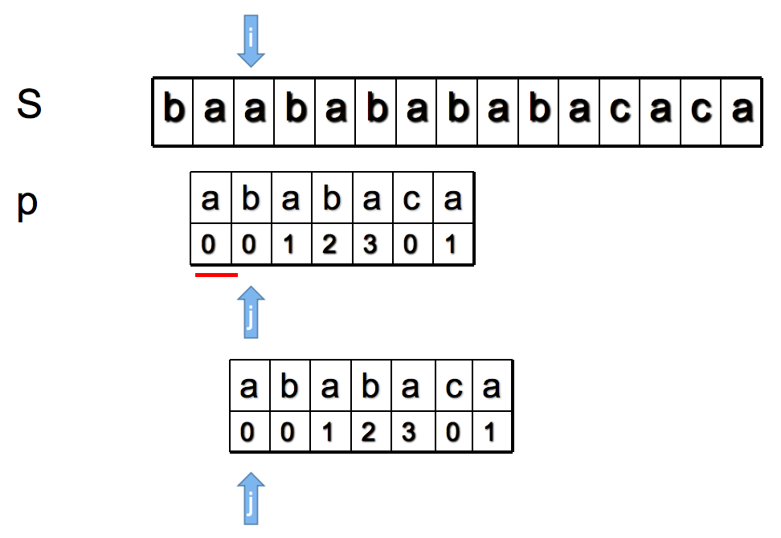

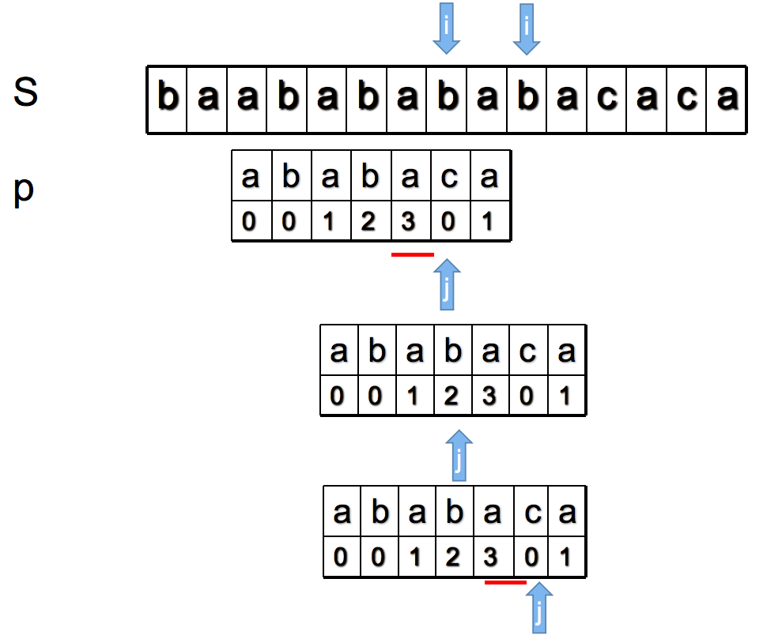

### 算法分析

假设模式串P的长度为m，目标串S的长度为n。

1. 求模式数组lps
  - 粗看lps函数中有两层循环，外层为for、内层为while。
    - 模式串的长度为m
    - 那么这里的时间复杂度为O($m^2$)?

2. KMP检索主程序
  - 不包括求lps部分
  - 算法时间复杂度O(n)?


#### 求模式数组lps

- 把原来的程序稍微改写一下

```python
def lps(P):
  nxt = [-1] * (len(P)+1)
  for i in range(0, len(P)):
    j = nxt[i]
    while j != -1 and P[i] != P[j]:
      j = nxt[j]
    else:
      nxt[i+1] = 0 if j == -1 else j+1
  return nxt  
```

```python
def lps(P):
  nxt = [-1] * (len(P)+1)
  j = -1
  for i in range(0, len(P)):
    while j != -1 and P[i] != P[j]:
      j = nxt[j]                # A
    else:
      j= nxt[i+1] = j+1         # B
  return nxt  
```

- 模式数组有一个特征：nxt[j] &lt; j
- 不管在哪一层循环中，考虑A、B语句的总执行次数
  - B语句的总执行次数为m
  - B语句的效果是把j加一；A语句的效果是把j减（至少）一
  - j的初始值是-1，最终值不小于0
  - 所以A的总执行次数必须小于B，也就是m
  - A+B &lt; 2m = O(m)

#### KMP检索主程序

```python
def indexKMP(S, P, pos=0):
  j=0                     
  i=pos                   
  nxt=lps(P)              

  while j<len(P) and i<len(S):
    if P[j] == S[i]:      
      i += 1              # X
      j += 1
    else:                 
      if j == 0:          
        i += 1            # Y   
      else:
        j = nxt[j]        # Z
  else:
    if j == len(P):     
      return i-j
    else: 
      return None

if __name__ == "__main__":
  print(indexKMP("baababababacaca", "ababaca")) 
  print(indexKMP("baababababacaca", "ababaxa"))
```

- 观察X、Y、Z三条语句，它们是循环块内执行的三个分支
  - Y语句把j增一；Z语句把j至少减一；j的初值为0，终值不小于0
    - 结论 Y >= Z
  - X、Y语句都是把i增一，有X+Y &lt;= n
  - 则 X+Y+Z &lt;= 2n = O(n)

把`j`或`i`看成某种连续可导的物理量，类似 **势能**；我们把这种分析算法复杂度的方法称为 **势能分析法（Potential Method）**。

- 两部分加起来，算法总的时间复杂度是O(m+n)

## KMP, yyds!?

- O(mn) vs O(m+n): KMP yyds!

* 实测比较一下

```python
def bin_patt():
    s = '0'*865752
    p = '0'*100+'1'
    return s, p

def read_text(fn):
    with open(fn, 'r') as file:
        return file.read().replace('\n', '')

data = read_text('code/1618824805.txt')  #红楼梦
#data = read_text('code/10-0.txt')         #圣经(旧约+新约)

#query="宝哥哥"
#query="宝玉来了"
#query="林姐姐"
query="空空道人"
#query="林妹妹"
#query="那是个最小性儿又多心的"
#query="所以到底不长命"
#query="Kings"
#query="My lord" #****
#data, query = bin_patt()

print(len(data))
print(data[100000:100200])
print("===================================")

def searchAll(S, P, fun):
    pos = 0
    while pos is not None:
        pos = fun(S, P, pos)
        if pos :
            print(S[pos:pos+20])
            pos += len(P)

from timeit import Timer
t1 = Timer("searchAll(data, query, indexKMP)", "from __main__ import data, query, searchAll, indexKMP")
print("=========indexKMP cost time is {}".format(t1.timeit(number=1)))
t2 = Timer("searchAll(data, query, indexOmn)", "from __main__ import data, query, searchAll, indexOmn")
print("=========indexOmn cost time is {}".format(t2.timeit(number=1)))
```

```python

```

* 哪个地方出了问题？

### 再谈算法复杂度

- 如果没有特别说明，复杂度就是指最坏复杂度。
  - 构造出最坏情况的：O(mn) vs O(m+n)
- 实际应用中看到的并不一定是最坏复杂度，平均复杂度更常见
- 哪些应用场景我们要考虑最坏情况复杂度？

```python

```
