---
jupyter:
  jupytext:
    cell_metadata_filter: -all
    split_at_heading: true
    text_representation:
      extension: .md
      format_name: markdown
      format_version: '1.3'
      jupytext_version: 1.18.1
  kernelspec:
    display_name: Python 3 (ipykernel)
    language: python
    name: python3
---

# Ch06. 排序与查找

[Home]( README.md )

在计算机科学中， **排序（Sorting）与查找（Searching）** 不仅仅是两个算法类别，它们构成了整个信息检索和数据处理的基石。

计算机科学巨擘 **高纳德（Donald Knuth）** 在其史诗级巨著《计算机程序设计艺术》（TAOCP）第三卷中，专门用一整卷的篇幅讨论这两个主题。

1. 排序与查找的本质意义：熵的对决
  > 从某种意义上说，计算的世界就是一场关于“秩序”的斗争。
  - 查找的意义：生存需求
    > 查找是信息处理的终极目的。无论是数据库查询、网页搜索，还是处理器指令寻找内存地址，本质上都是在海量数据中定位特定的目标。如果不能高效查找，数据就只是堆填区的垃圾。
  - 排序的意义：为查找“赋能”
    > 排序本身往往不是目的（除非你是为了打印一份精美的名单），排序是为了降低系统的熵，使原本无序的数据变得可预测。
    - 指数级的效率飞跃：在无序数据中找东西只能靠“肉眼扫视”（线性查找 $O(n)$）；而在有序数据中，你可以使用“对折砍半”（二分查找 $O(\log n)$）。对于 40 亿条数据，前者需要 40 亿次比较，而后者仅需 32 次。

2. 两者的哲学关系：先苦后甜
  > 排序与查找的关系可以用一句话总结：为了以后能“偷懒”，现在必须“勤快”。
  - 排序是投资：它在数据写入或整理阶段消耗 CPU（这是“苦”）。
  - 查找是回报：它在数据读取阶段节省时间（这是“甜”）。
  - 动态平衡：如果你的数据只查找一次，那排序就是浪费；如果你的数据要查找一万次，那不排序就是犯罪。

3. 内排序与外排序
  > 排序算法的底层逻辑高度依赖数据存取模型。

  > 简单来说，当你的机器内存足够大，能把所有数据一次性吞下时，我们用内排序；当数据量大到连你的 16GB 或 32GB 内存都装不下（比如几个 TB 的日志文件），就必须请出外排序，在磁盘上进行。

特性|内排序 (Internal Sorting)|外排序 (External Sorting)
--- | ----  | ---
数据载体|内存 (RAM)|外存 (SSD/HDD)
处理数据量|相对较小（受内存容量限制）|极大（海量数据，远超内存）
主要性能指标|CPU 运算时间 (比较和移动)|磁盘 I/O 次数 (读取和写入)
访问方式|随机访问（Random Access）|顺序访问为主（Sequential Access）
典型算法|快排、堆排、归并、冒泡|多路归并排序 (Multi-way Merge)

- 排序主要是在线性结构上进行
- 尽管链表也在内存中，但它的访问方式与磁盘更加类似。
    - 于是我们的各种内排序算法都在顺序表上进行
- 外排序不在本课程的考察范围

## 本章目标

- 了解和实现顺序查找和二分法查找；
- 了解和实现选择排序、冒泡排序、归并排序、快速排序、插入排序和希尔排序；
- 了解用散列 Hashing 实现查找的技术；
- 了解抽象数据类型：映射 Map；
- 采用散列实现抽象数据类型 Map。

## 顺序查找

- 顺序查找（Sequential Search），也称为线性查找（Linear Search），是搜索算法中最基础、最直观的一种。

- 如果数据项保存在如列表这样的集合中，我们会称这些数据项具有
线性或者顺序关系，在 Python List 中，这些数据项的存储位置称
为下标（index），这些下标都是有序的整数，通过下标，我们就可
以按照顺序来访问和查找数据项，这种技术就称为“顺序查找”

- 要确定列表中是否存在需要查找的数据项，首先从列表的第 1 个数
据项开始，按照下标增长的顺序，逐个比对数据项，如果到最后一
个都未发现要查找的项，那么查找失败。

  

- 顺序查找只能在顺序表上进行吗❓

- 实现代码一

  

- 实现代码二

```python
def sequentialSearch(seq, target):
    """
    seq: 你的线性结构
    target: 查找目标
    """
    for elem in seq:
        if elem == target:
            return True
    else:
        return False

if __name__ == "__main__":
    testlist = [1,2,32,8,17,19,42,13,0]
    print(sequentialSearch(testlist, 3))
    print(sequentialSearch(testlist, 13))
```

### 算法分析

- 要对查找算法进行分析，首先要确定其中的基本计算步骤。回顾第二章算法分析的要点，这种基本计算步骤必须要足够简单，并且在算法中反复执行
- 在查找算法中，这种基本计算步骤就是进行数据项的比对
  - 当前数据项等于还是不等于要查找的数据项，比对的次数决定了算法复杂度
- 在顺序查找算法中，为了保证是讨论的一般情形，需要假定列表中的数据项并没有按值排列顺序，而是随机放置在列表中的各个位置
  - 换句话说，数据项在列表中各处出现的概率是相同的
- 数据项是否在列表中，比对次数是不一样的
  - 如果数据项不在列表中，需要比对所有数据项，则比对数是 n
  - 如果数据项在列表中，要比对的次数，其情况就较为复杂
    - 最好的情况，第 1 次比对就找到；最坏的情况，要 n 次比对

* 数据项在列表中，比对的一般情形如何？
  - 因为数据项在列表中各个位置出现的概率是相同的；
  - 所以平均状况下，比对的次数是 n/2；
* 所以，顺序查找的算法复杂度是 O(n)

  

* 这里我们假定列表中的数据项是无序的，那么如果数据项排了序，顺序查找算法的效率又如何呢？

- 实际上，我们在第三章的有序表 Search 方法实现中介绍过顺序查找
  - 当数据项存在时，比对过程与无序表基本相同
  - 不同之处在于，如果数据项不存在，比对可以提前结束
    - 如下图中查找数据项 50，当看到 54 时，可知道后面不可能存在 50，可以提前退出查找

  

- 实现代码：顺序查找有序表

```python
def orderedSequentialSearch(ordered, target):
    for elem in ordered:
        if elem == target:
            return True
        elif elem > target:
            return False
    else:
        return False

if __name__ == "__main__":
  testlist = [0,1,2,8, 13, 17, 19, 32, 42 ]
  print(orderedSequentialSearch(testlist, 3))
  print(orderedSequentialSearch(testlist, 13))
```

```python

```

### 算法分析（有序表）

- 顺序查找有序表的各种情况分析

  

- 实际上，就算法复杂度而言，仍然是 O(n)
- 只是在数据项不存在的时候，有序表的查找能节省一些比对次数， 但并不改变其数量级。

## 二分查找

- 那么对于有序表，有没有更好的查找算法？
- 在顺序查找中，如果第 1 个数据项不匹配查找项的话，那最多还有n-1 个待比对的数据项
- 那么，有没有方法能利用有序表的特性，迅速缩小待比对数据项的范围呢？

  

- 我们从列表中间开始比对！
  - 如果列表中间的项匹配查找项，则查找结束
  - 如果不匹配，那么就有两种情况：
    - 列表中间项比查找项大，那么查找项只可能出现在前半部分
    - 列表中间项比查找项小，那么查找项只可能出现在后半部分
  - 无论如何，我们都会将比对范围缩小到原来的一半：n/2
- 继续采用上面的方法查找
  - 每次都会将比对范围缩小一半

  

- 代码

```python
def binarySearch(alist, item):
    first, last = 0, len(alist)-1
    while first <= last:
        midpoint = (first + last) //2
        if alist[midpoint] == item:
            return True
        elif alist[midpoint] > item:
            last = midpoint -1
        else:
            first = midpoint + 1
    else:
        return False

if __name__ == "__main__":
    testlist = [0,1,2,8, 13, 17, 19, 32, 42 ]
    print(binarySearch(testlist, 3))
    print(binarySearch(testlist, 13))
```

- 同前面的顺序搜索相比较，二分搜索作用的对象有什么不同？
  - 在逻辑结构上，必须是有序（线性）表
  - **在存储结构上，必须是顺序表**

```python

```

### 分而治之（Divide & Conquer）

- 二分查找算法实际上体现了解决问题的另一个典型策略：分而治之
  - 将问题分为若干更小规模的部分
  - 通过解决每一个小规模部分问题，并将结果汇总得到原问题的解
- 显然，递归算法就是一种典型的分而治之策略，二分法也可以用递归算法来实现
- **slice 操作的复杂度是 O(N) 的，放在 O(logN) 的二分查找算法里面，整体复杂度也变成❓。实际使用中严重不可取！**

```python
def binarySearchRc(alist, item):
    if not alist:
        return False
    midpoint = len(alist) // 2
    if alist[midpoint] == item:
        return True
    elif alist[midpoint] > item:
        return binarySearchRc(alist[:midpoint], item)
    else:
        return binarySearchRc(alist[midpoint+1:], item)
```

### 算法分析

- 由于二分查找每次比对都将下一步的比对范围缩小一半
- 每次比对后剩余数据项如下表所示

  

- 当比对次数足够多以后，比对范围内就会仅剩余 1 个数据项
- 无论这个数据项是否匹配查找项，比对最终都会结束，解下列方程：
    $$
    \frac{n}{2^i}=1 \Rightarrow  i=log_2{}(n)
    $$
- 所以二分法查找的算法复杂度是 O(log n)

### 主定理

  

- 可分解为子问题的问题复杂度
  - 规模为n的问题可以分解为a个规模缩小b倍的子问题，分解成本为f(n)
- 对于二分查找问题：a=1, b=2, f(n)=O(1)
  - 套用主定理，我们可以马上知道二分查找的复杂度是 O(log n)
  - 如果在递归时使用了切片操作，则怎么运用主定理？

### 进一步的考虑

- 另外，虽然二分查找在时间复杂度上优于顺序查找
- 但也要考虑到对数据项进行排序的开销
  - 如果一次排序后可以进行多次查找，那么排序的开销就可以摊薄
  - 但如果数据集经常变动，查找次数相对较少，那么可能还是直接用无序表加上顺序查找来得经济
- 所以，在算法选择的问题上，光看时间复杂度的优劣是不够的，还需要考虑到实际应用的情况。
- “让发生的最多的事情最高效”

## 散列

- 前面我们利用数据集中关于数据项之间排列关系的知识，来将查找算法进行了提升。
  - 如果数据项之间是按照大小排好序的话，就可以利用二分查找来降低算法复杂度。
- 现在我们进一步来构造一个新的数据结构，能使得查找算法的复杂度降到 O(1)，这种概念称为“散列 Hashing”
- 能够使得查找的次数降低到常数级别，我们对数据项所处的位置就必须有更多的先验知识。
- 如果我们事先能知道要找的数据项应该出现在数据集中的什么位置，就可以直接到那个位置看看数据项是否存在即可。
- 由数据项的值来确定其存放位置，如何能做到这一点呢？

### 瑞幸想到的办法

- 根据订单号的最末一位，把咖啡放在对应的架子上！✌️
- 同学们找自己的咖啡，就方便多了。
- 进一步优化：每一格架子上的咖啡，按订单号又是一个 **有序表**

  

### 基本概念

- 散列表（hash table，又称哈希表）是一种数据集
  - 其中数据项的存储位置通过固定的映射函数获得，在查找定位时也可利用此函数获得 O(1) 的访问效率。
  - 散列表中的每一个可用于保存数据项的存储位置，称为槽（slot），每个槽用不同的编号来区别。
- 例如：一个包含 11 个槽的散列表，槽的编号分别为 0～10
  - 在插入数据项之前，每个槽的值都是 None，表示空槽
  - 实现从数据项到存储槽的转换的，称为散列函数（hash function）
  - 下面例子中，散列函数接受数据项作为参数，返回整数值 0～10，表示数据项存储的槽号

  

#### 示例

- 为了将数据项保存到散列表中，我们设计第一个散列函数
  - 数据项：54，26，93，17，77，31
- 有一种常用的散列方法是“求余数”，将数据项除以散列表的大小，得到的余数作为槽号。
  - 实际上“求余数”方法会以不同形式出现在所有散列函数里，因为散列函数返回的槽号必须在散列表大小范围之内，所以一般会对散列表size求余
  - 如果数据项不是整数怎么办？比如身份证号的最后一位有可能是’X’（非数项）
    - 字符和整数之间存在转换关系

* 本例中我们的散列函数是最简单的求余：
        $$ h(item)= item \bmod 11 $$

  

- 按照散列函数 h(item)，为每个数据项计算出存放的位置之后，就可以将数据项存入相应的槽中
- 例子中的 6 个数据项插入后，占据了散列表 11 个槽中的 6 个。
  - 槽被数据项占据的比例称为散列表的“负载因子”，这里负载因子为6/11
- 数据项都保存到散列表后，查找就变得无比简单
- 要查找某个数据项是否存在于表中，我们只需要使用同一个散列函数进行计算，用得到的槽号看对应的槽中是否是要我们要找的
  - 实现了 O(1) 时间复杂度的查找算法。
- 天底下没有免费的午餐，想想我们的代价是什么？

  

- 不过，你可能也看出这个方案的问题所在，这组数据相当凑巧，各自占据了不同的槽
- 假如再来一个数 44，h(44)=0，它跟 77 被分配到同一个 0# 槽中，这种情况称为“冲突 collision（碰撞）”，我们后面会讨论到这个问题
的解决方案。

### 完美散列函数：Perfect Hash Function

- 散列函数是一种离散函数
  - 定义域的大小 N；
  - 值域的大小 M，也等于散列表的容量；
  - 函数实际的输入个数 k，也等于散列表中存储的不同元素个数。
- 给定一组数据项，如果一个散列函数能把每个数据项映射到不同的槽中，那么这个散列函数就可以称为“完美散列函数”
  - 对于固定的一组数据 (k &lt; M)，总是能想办法设计出完美散列函数
  - 数据很少变动，且极为看重搜索效率的场合
- 但如果数据项经常性的变动，很难有一个系统性的方法来设计对应的完美散列函数。
  - 当然，冲突也不是致命性的问题，我们后面会有办法处理的。

* 获得完美散列函数的一种方法是扩大散列表的容量，大到等于数据项的值空间大小；用恒等函数来做散列函数，这样不同的数据项都能够占据不同的槽
* 但这种方法对于可能数据项范围过大的情况并不实用
  - 假如我们要保存手机号（11 位数字），完美散列函数得要求散列表具有百亿个槽！对于仅需要保存班级 100 名同学的手机号来说，浪费了太多空间
* 退而求其次的话，好的散列函数需要具备 3 个特性：冲突最少（近似完美）、计算难度低（额外开销小）、充分分散数据项（节约空间）

#### 近似完美散列函数

- 除了用于在散列表中安排数据项的存储位置，散列技术还用在信息处理的很多领域。
- 由于完美散列函数能够对任何不同的数据生成不同的散列值，可以把散列值用作数据的“指纹”或者“摘要”
  - 由任意长度的数据生成长度固定的“指纹”，还要求具备唯一性，这在数学上是无法做到的，但设计巧妙的“准完美”散列函数却能在实用范围内做到这一点。
  - 离散函数 y= hash(x)，如果其 N 大于 M，根据鸽笼原理，肯定存在冲突：$x_1\neq{}x_2, hash(x_1)=hash(x_2)$
  - 但如果它的定义域和值域空间都非常“广阔”，实际取的 x 个数远远小于它们，那么冲突的可能性就“没有了”。
  - 尽管 N > M，只要 $k \ll M$，在计算机领域广泛当成“完美散列函数”来用。

#### 完美散列函数应用于密码学领域

- 作为一致性校验的数据“指纹”函数还需要具备更多的特性
  - 压缩性：任意长度的数据，得到的“指纹”长度是固定的；
  - 易计算性：从原数据计算“指纹”很容易；而从指纹计算原数据实际上是不可能的；
  - 抗修改性：对原数据的微小变动，都会引起“指纹”的大改变；
  - 抗冲突性：
    - 弱抗冲突性：给定 Hashing 函数和一个数据项，很难找到另一个数据项，和原数据项具有相同的指纹
    - 强抗冲突性：给定 Hashing 函数，很难找到两个不同数据项，使它们具有相同的指纹
  - 讨论 Python 内置的哈希函数：hash()
    - 是不是近似完美的?
    - 满足上面的特性吗?

```python
hash(1)
```

```python
hash(18)
```

```python
hash('作为一致性校验的数据“指纹”函数还需要具备更多的特性')
```

```python
hash(-1), hash(-2), hash(True), hash(1)
```

```python
d = {-1: 'a', -2: 'b'}
print(d[-1], d[-2])
```

- Python 内置 `hash()` 函数返回值特性表

| 特性 | 描述 | 备注 |
| :--- | :--- | :--- |
| **返回类型** | `int` (有符号整数) | 始终返回 Python 的整型对象 |
| **数值范围** | 取决于机器字长（32位或64位） | 匹配底层 C 语言的 `Py_ssize_t` 类型 |
| **最大值** | `sys.maxsize` | 64位系统通常为 $2^{63}-1$ |
| **最小值** | `-sys.maxsize - 1` | 64位系统通常为 $-2^{63}$ |
| **特殊保留值** | **-1** 永远不会作为正常结果返回 | 若计算结果为 `-1`，系统会自动将其转为 `-2` |
| **稳定性（数字）** | 相同数值的数字哈希值固定且跨进程一致 | 例如 `hash(1)` 在任何时候运行都是 `1` |

##### 散列函数 MD5/SHA

- 最著名的近似完美散列函数是 MD5 和 SHA 系列函数
- MD5（Message Digest）将任何长度的数据变换为固定长为 128位（16 字节）的“摘要”
  - 128 位二进制已经是一个极为巨大的数字空间：据说是地球沙粒的数量
- SHA（Secure Hash Algorithm）是另一组散列函数
  - SHA-0/SHA-1 输出散列值 160 位（20 字节），
  - SHA-256/SHA-224 分别输出 256 位、224 位，
  - SHA-512/SHA-384 分别输出 512 位和 384 位
  - 160 位二进制相当于 $10^{48}$，地球上水分子数约为 $10^{47}$
  - 256 位二进制相当于 $10^{77}$，已知宇宙所有基本粒子大约为$10^{72\sim{}87}$ 
- 小明和小芳各从宇宙中挑一个原子，他们会不会挑到同一个原子？
- 虽然近年发现 MD5/SHA-0/SHA-1 三种散列函数，能够以极特殊的情况来构造个别碰撞（散列冲突）, 但在实用中从未有实际的威胁。
  - 王小云：提出了密码哈希函数的碰撞攻击理论，即模差分比特分析法，破解了包括 MD5、SHA-1 在内的 5 个国际通用哈希函数算法

#### Python 的散列函数库 hashlib

- Python 自带 MD5 和 SHA 系列的散列函数库：hashlib
  - 包括了 md5/sha1/sha224/sha256/sha384/sha512 等 6 种散列函数

```python
import hashlib
print(hashlib.md5(b"hello world!").hexdigest())
print(hashlib.sha1(b"hello world!").hexdigest())
print(hashlib.sha256(b"hello world!").hexdigest())   # 比特币挖矿算法中常用
```

除了对单个字符串进行散列计算之外，
还可以用 update方法来对任意长的数据分部分来计算，
这样不管多大的数据都不会有内存不足的问题。
```python
m = hashlib.md5()
m.update(b"hello world!")
m.update(b"this is part #2")
m.update(b"this is part #3")
print(m.hexdigest())
print(hashlib.md5((b"hello world!"
                  b"this is part #2"
                  b"this is part #3")).hexdigest()) # 字符串跨行语法

```

#### 散列函数MD5/SHA用于数据一致性校验

- 数据文件一致性判断
  - 为每个文件计算其散列值，仅对比其散列值即可得知是否文件内容相同；
  - 用于网络文件下载完整性校验；
  - 用于文件分享系统：网盘中相同的文件（尤其是电影）可以无需存储多次。

[winmd5下载]( https://www.winmd5.com/ )

  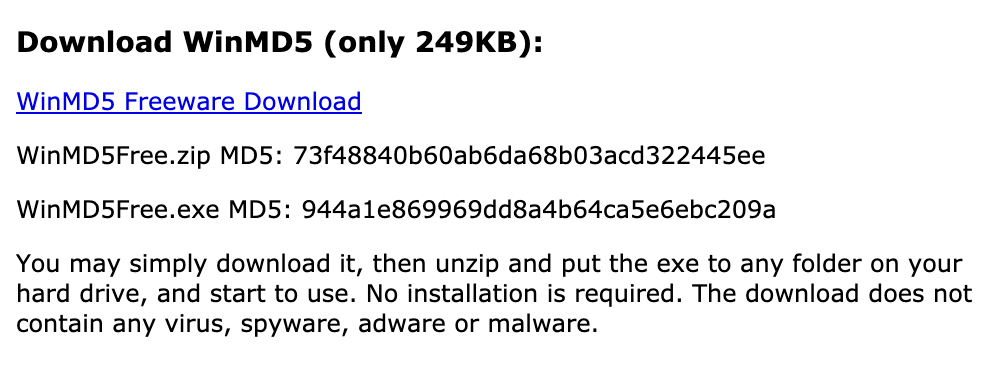

```bash
curl -O https://www.winmd5.com/download/winmd5free.zip
md5 winmd5free.zip
rm winmd5free.zip
```

- 更安全、更成熟的软件验证

```bash
codesign -dv --display --verbose=4 "/Applications/Google Chrome.app"
```

##### rsync协议

rsync（Remote Sync）不仅是一个工具，更是一种极其聪明的增量备份协议。它的核心灵魂可以用一句话概括：“只传改动的部分，不传重复的部分。”

- 核心原理：分块校验（The Rolling Checksum）这是 rsync 最著名的黑科技。它的工作流程如下：
  1. 分块（Chunking）：它将目标端（已有的旧文件）切成一个个小块。
  1. 计算指纹（Checksum）：为每一块计算两个校验码：一个简单的弱校验（快速扫描）和一个复杂的强校验（确认唯一性）。
  1. 对比与搜索：发送端扫描新文件。如果发现某一段内容的校验码和目标端的一模一样，就直接复用。
  1. 增量传输：只把那些在目标端找不到匹配的、新增加或修改过的数据块发送过去。

```bash
du -h -d 1
make install
```

### 散列函数设计

#### 折叠法 Folding Method

- 折叠法设计散列函数的基本步骤是，将数据项按照位数分为若干段，再将几段数字相加，最后对散列表大小求余，得到散列值
- 例如，对电话号码 62767255，可以两位两位分为 4 段（62、76、72、55），相加（62+76+72+55=265），散列表包括 11 个槽，那么就是 265%11=1，所以 h(62767255)=1
- 有时候折叠法还会包括一个隔数反转的步骤，比如（62、76、72、55）隔数反转为（62、 67、 72、 55），再累加（62+67+72+55=256），对 11 求余（256%11=3），所以 h’(62767255)=3
- 虽然隔数反转从理论上看来毫无必要，但这个步骤确实为折叠法得到散列函数提供了一种微调手段，以便更好符合上述的 3 个特性。（少冲突/易计算/分散）

#### 平方取中法 Mid-Square Method

- 平方取中法，首先将数据项做平方运算，然后取平方数的中间两位，再对散列表的大小求余
- 例如，对 44 进行散列，首先 44*44=1936，然后取中间的 93，对散列表大小 11 求余，93%11=5

* 下表是两种散列函数的对比
  - 两个都是完美散列函数
  - 分散度都很好
  - 平方取中法计算量稍大

  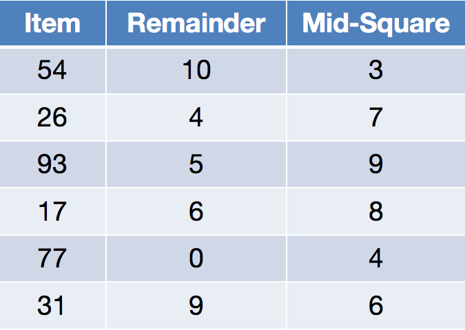

#### 成熟的 Hash 算法之一：MD5

- 使用A、B、C、D四个寄存器存放 **链接变量**
- 每次处理一个512bits的输入块，进一步切分为16个大小为32的子块，记为$M_0,M_1,\ldots,M_{15}$
- 进行了4 轮计算，分别用到四个F、G、H、I逻辑函数；
- 每轮进行16步，每一步分别使用16个子块中的某一个$M_j$
- 繁琐但计算机算起来很快
  - $\oplus ,\wedge ,\vee ,\neg $ denote the XOR, AND, OR and NOT operations respectively.

  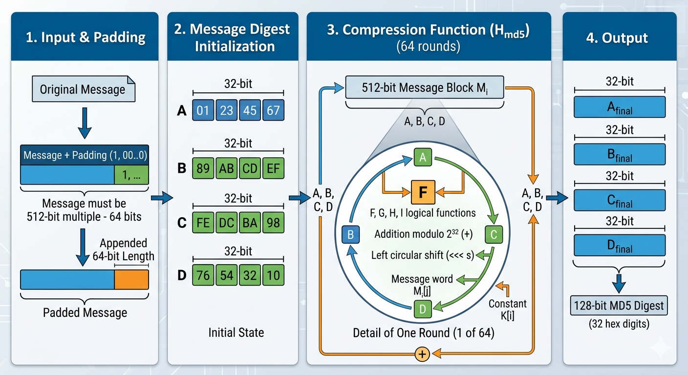

  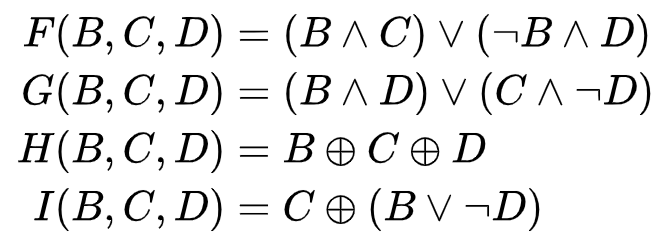

  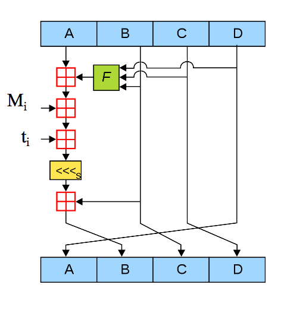
  $$
  b = b + ( (a + F(b,c,d) + M_i + K_i) \ll s)
  $$
- 参考：[Algorithm：MD5算法原理说明]( https://www.cnblogs.com/nhdlb/p/12007162.html )

硬件环境|磁盘 I/O 吞吐率|MD5 计算吞吐率 (M1 级别 CPU)|真正的瓶颈
---- | ------|   -------  | -----
现代 SSD (M1 Mac)|~2500 MB/s|~600 MB/s|CPU 计算
传统 HDD (机械硬盘)|~120 MB/s|~600 MB/s|磁盘 I/O

#### 非数项的处理

- 我们也可以对非数字的数据项（如字符串）进行散列，把字符串中
的每个字符看作 ASCII 码整数即可
  - 如 cat，ord(’c’)==99, ord(’a’)==96, ord(’t’)==116
- 再将这些整数累加，对散列表大小求余

  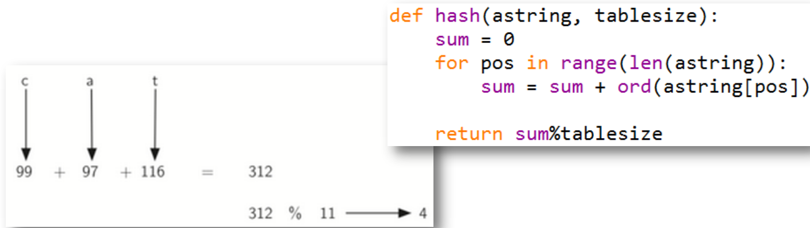

- 当然，这样的散列函数对所有的变位词都返回相同的散列值，
为了防止这一点，可以将字符串所在的位置作为权重因子，乘以 ord 值
- 我们还可以设计出更多的散列函数方法，但要坚持的一个基本出发点是，
散列函数不能成为存储过程和查找过程的计算负担，如果散列函数设计太过复杂，
去花费大量的计算资源计算槽号，可能还不如简单地进行顺序查找或者二分查找，
失去了散列本身的意义

  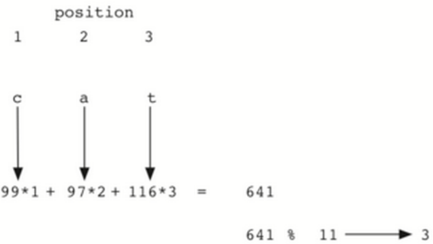

```python
def hash(astring, tablesize):
  sum = 0
  for pos in range(len(astring)):
    sum = sum + ord(astring[pos]) * (pos+1)
  return sum % tablesize

if __name__ == "__main__":
  print(hash("cat", 11))
```

```python

```

### 散列冲突的解决

#### 开地址法

- 如果两个数据项被散列映射到同一个槽，需要有一个系统化的方法在散列表中保存第二个数据项，这个过程称为“解决冲突”。
- 前面提到，如果说散列函数是完美的，那就不会有散列冲突，但完美散列函数常常是不现实的，
所以解决散列冲突成为散列方法中很重要的一部分。
- 解决散列的一种方法就是为冲突的数据项再找一个开放的空槽来保存，
其中最简单的就是从冲突的槽开始往后扫描，直到碰到一个空槽。（如果到散列表的尾部还未找到，则要从首部接着扫描）
- 这种寻找空槽的技术称为“开放定址 open addressing”，向后逐个槽寻找的方法则是开放定址技术中的“线性探测 linear probing”

##### 线性探测

- 接前例，我们把 44、55、20 逐个插入到散列表中。
  - h(44)==0，发现 0# 槽已经被 77 占据了，向后找到第一个空槽 1#，保存
  - h(55)==0，同样 0# 槽已经被占据，向后找到第一个空槽 2#，保存
  - h(20)==9，发现 9# 槽已经被 31 占据了，向后，再从头开始找到 3# 槽保存
- 采用线性探测方法来解决散列冲突的话，则散列表的查找也遵循同样的规则
  - 如果在散列位置没有找到查找项的话，就必须向后做顺序查找，直到找到查找项，或者碰到空槽（查找失败）。

  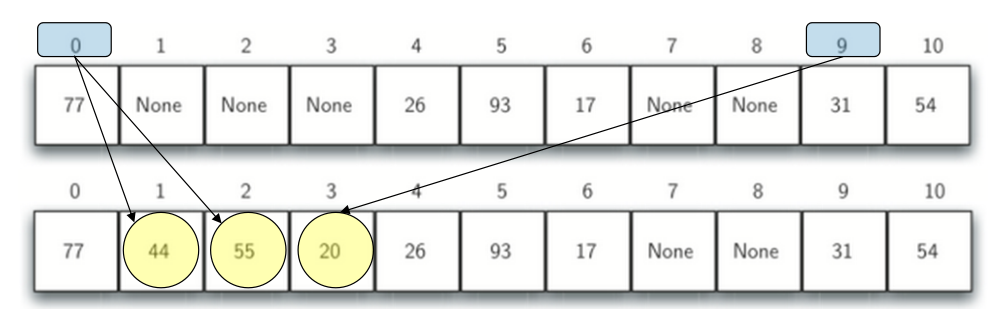

- 线性探测的改进
  - 线性探测法的一个缺点是有聚集（clustering）的趋势，即如果同一个槽冲突的数据项较多的话，这些数据项就会在槽附近聚集起来，从而连锁式影响其它数据项的插入。
  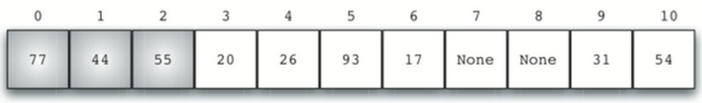
  - 避免聚集的一种方法就是将线性探测扩展，从逐个探测改为跳跃式探测
    - 下图是“+3”探测插入 44、55、20
  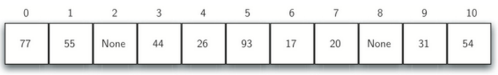

##### 再散列

- 重新寻找空槽的过程可以用一个更为通用的“再散列 rehashing”来概括，也就是说 newhashvalue= rehash(oldhashvalue)
  - 对于线性探测来说，rehash(pos)= (pos+ 1)% sizeoftable
  - “+3”的跳跃式探测则是：rehash(pos)= (pos+ 3)% sizeoftable
  - 跳跃式探测的再散列通式是：rehash(pos)= (pos+skip)% sizeoftable
- 跳跃式探测中，需要注意的是 skip 的取值，不能被散列表大小整除，否则会产生周期，造成很多空槽永远无法探测到
  - 一个技巧是，把散列表的大小设为素数，如例子的 11
- 还可以将线性探测变为“二次探测 quadratic probing”
- 不再固定 skip 的值，而是逐步增加 skip 值，如 1、3、5、7、9
- 这样槽号就会是原散列值以平方数增加：h, h+1, h+4, h+9, h+16...
- skip 的值也可以通过 key 计算得来：skip=h2(key)，这种方法被称为双散列函数探查法。

#### 拉链法

- 除了寻找空槽的开放定址技术之外，另一种解决散列冲突的方案是将容纳单个数据项的槽扩展为容纳数据项集合
（或者对数据项链表的引用）
  - 这样，散列表中的每个槽就可以容纳多个数据项，如果有散列冲突发生，只需要简单地将数据项添加到数据项集合中。
  - 查找数据项时则需要查找同一个槽中的整个集合，当然，随着散列冲突的增加，对数据项的查找时间也会相应增加。
- 与“开放地址” 相比较，“数据项链” 避免了不同槽之间的冲突可能，但是为存储指针增加了额外的空间开销。

  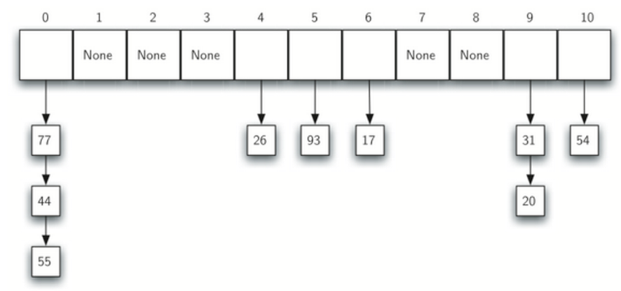

### 抽象数据类型“映射”

- Python 最有用的内置数据类型之一是“字典 Dictionary”
- 字典是一种可以保存 key-data 键值对的数据类型
- 其中关键码 key 可用于查询关联的数据值 data
- 这种键值关联的方法通常称为“映射 map”
- 通过散列表实现 map，是一种常用的高效方案

* ADT Map 的结构是键-值关联的无序集合
* 关键码具有唯一性，通过关键码可以唯一确定一个数据值
* ADT Map 定义的操作如下：
  - Map()：创建一个空映射，返回空映射对象；
  - put(key, val)：将 key-val 关联对加入映射中，如果 key 已经存在，则将 val 替换原来的旧关联值；
  - get(key)：给定 key，返回关联的数据值，如不存在，则返回 None；
  - del：通过 del map[key] 的语句形式删除 key-val 关联；
  - len()：返回映射中 key-val 关联的数目；
  - in：通过 key in map 的语句形式，返回 key 是否存在于关联中，布尔值

#### 实现 ADT Map

- 仿照 Python dict，我们自己去实现一个 Map ADT
- 大多数程序设计语言已经提供了这些功能，为什么我们还要再去实
现一遍？
  - 了解内部实现加深理解
  - Map 在计算机编程中的应用极为广泛
  - 常见的面试题：HashMap 和 TreeMap 的不同？
- 使用字典的优势在于，给定关键码 key，能够很快得到关联的数据值 data
- 为了达到快速查找的目标，需要一个支持高效查找的 ADT 实现
  - 可以采用列表数据结构加顺序查找或者二分查找。
  - 当然，更为合适的是使用前述的散列表来实现，这样查找可以达到最快 O(1) 的性能

* 下面，我们用一个 HashTable 类来实现 ADT Map，该类包含了两个列表作为成员
  - 其中一个 slot 列表用于保存 key，另一个平行的 data 列表用于保存数据项
  - 在查找到一个 key 以后，在 data 列表对应相同位置的数据项即为关联数据
  - 保存 key 的列表就作为散列表来处理，这样可以迅速查找到指定的key
  - 注意散列表的大小，虽然可以是任意数，但考虑到要让冲突解决算法能有效工作，应该选择为素数。

```python
class HashTable:
  def __init__(self, size=11):
    self.size = size
    self.slots = [None] * self.size
    self.data = [None] * self.size
```

- hashfunction 方法采用了简单求余方法来实现散列函数，冲突解决则采用线性探测“加 1”再散列函数。
```python
class HashTable:
  def __init__(self, size=11):
    self.size = size
    self.slots = [None] * self.size
    self.data = [None] * self.size

  def hashfunction(self, key):
    start = v = key % self.size
    while True:
      yield v
      v = (v+1) % self.size
      if v == start:           #rehash回到原值
        break
```
- 在python实现中，可以用把hash和rehash一起实现为一个生成器函数。

##### put 方法代码

```python
class HashTable:
  def __init__(self, size=11):
    self.size = size
    self.slots = [None] * self.size
    self.data = [None] * self.size

  def hashfunction(self, key):
    start = v = key % self.size
    while True:
      yield v
      v = (v+1) % self.size
      if v == start:           #rehash回到原值
        break

  def put(self, key, data):
    for hashvalue in self.hashfunction(key):
      if self.slots[hashvalue] == None:
        self.slots[hashvalue] = key
        self.data[hashvalue] = data
        break
      elif self.slots[hashvalue] == key:
        self.data[hashvalue] = data      #replace
        break
    else:
      raise RuntimeError(f"Hash table is full with key={key}")

if __name__ == "__main__":
  t = HashTable(11) 
  for i in range(15):
    t.put(i, None)
```

##### get方法

```python
class HashTable:
  def __init__(self, size=11):
    self.size = size
    self.slots = [None] * self.size
    self.data = [None] * self.size

  def hashfunction(self, key):
    start = v = key % self.size
    while True:
      yield v
      v = (v+1) % self.size
      if v == start:           #rehash回到原值
        break

  def put(self, key, data):
    for hashvalue in self.hashfunction(key):
      if self.slots[hashvalue] == None:
        self.slots[hashvalue] = key
        self.data[hashvalue] = data
        break
      elif self.slots[hashvalue] == key:
        self.data[hashvalue] = data      #replace
        break
    else:
      raise RuntimeError(f"Hash table is full with key={key}")

  def get(self, key):
    for hashvalue in self.hashfunction(key):
      if self.slots[hashvalue] == None:
        raise KeyError(f"key={key} not found")
      elif self.slots[hashvalue] == key:
        return self.data[hashvalue]
    else:
      raise RuntimeError(f"key={key} not found")

if __name__ == "__main__":
  t = HashTable(11) 
  for i in range(5):
    t.put(i, f"**{str(i)}**")
  for j in range(2,6):
    print(f"<{j},{t.get(j)}>")
```

- 通过特殊方法实现`[]`访问

```python
class HashTable:
  def __init__(self, size=11):
    self.size = size
    self.slots = [None] * self.size
    self.data = [None] * self.size

  def hashfunction(self, key):
    start = v = key % self.size
    while True:
      yield v
      v = (v+1) % self.size
      if v == start:           #rehash回到原值
        break

  def put(self, key, data):
    for hashvalue in self.hashfunction(key):
      if self.slots[hashvalue] == None:
        self.slots[hashvalue] = key
        self.data[hashvalue] = data
        break
      elif self.slots[hashvalue] == key:
        self.data[hashvalue] = data      #replace
        break
    else:
      raise RuntimeError(f"Hash table is full with key={key}")

  def get(self, key):
    for hashvalue in self.hashfunction(key):
      if self.slots[hashvalue] == None:
        raise KeyError(f"key={key} not found")
      elif self.slots[hashvalue] == key:
        return self.data[hashvalue]
    else:
      raise KeyError(f"key={key} not found")

  def __getitem__(self, key):
    return self.get (key)

  def __setitem__(self, key, data):
    self.put(key, data)

if __name__ == "__main__":
  H=HashTable()
  H[54]="cat"
  H[26]="dog"
  H[93]="lion"
  H[17]="tiger"
  H[77]="bird"
  H[31]="cow"
  H[44]="goat"
  H[55]="pig"
  H[20]="chicken"
  print(H.slots)
  print(H.data)

  print(H[20])

  print(H[17])
  H[20]='duck'

  print(H[20])
  print(H[99])
```

```python
d = {1:'a', 2:'b'}
print(d[1])
print(d[3])
```

```python

```

### 散列算法分析

- 散列在最好的情况下，可以提供 O(1) 常数级时间复杂度的查找性能
- 但由于散列冲突的存在，查找比较次数就没有这么简单。
- 评估散列冲突的最重要信息就是负载因子 λ，一般来说：
  - 如果 λ 较小，散列冲突的几率就小，数据项通常会保存在其所属的散列槽中
  - 如果 λ 较大，意味着散列表填充较满，冲突会越来越多，冲突解决也越复杂，也就需要更多的比较来找到空槽；
    - 如果采用数据链的话，意味着每条链上的数据项增多

* 如果采用线性探测的开放定址法来解决冲突（λ 在 0 和 1 之间）
  - 成功的查找，平均需要比对次数为：
                $$\frac{1}{2}(1+\frac{1}{1-\lambda})$$
  - 不成功的查找，平均比对次数为：
                $$\frac{1}{2}(1+\frac{1}{1-\lambda}^2)$$
* 如果采用数据链来解决冲突（λ 可以大于 1）
  - 成功的查找，平均需要比对次数为：$$\frac{1+\lambda}{2}$$
  - 不成功的查找，平均比对次数为：λ

  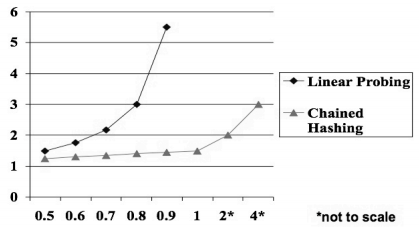
* 可以看出： $\lambda\approx{}0.7$为安全值，散列表的读写操作复杂度为O(1)

### 随堂练习

1. 对于大小为13的散列表，27、130的散列值分别是多少？
  - A) 1, 10
  - B) 13, 0
  - C) 1,0
  - D) 2,3

2. 对于大小为11的散列表，如果插入如下数据项`113, 117, 97, 100, 114, 108, 116, 105 , 99`
并采用线性探测解决散列冲突，最后的布局是什么？
  - A) 100, None,  None, 113, 114, 105, 116, 117, 97, 108, 99
  - B) 99, 100, None,  113, 114, None, 116, 117, 105, 97, 108
  - C) 100, 113, 117, 97, 14, 108, 116, 105, 99, None, None
  - D) 117, 114, 108, 116, 105, 99, None, None,  97, 100, 113

```python
if __name__ == "__main__":
  h = HashTable(11)
  for i in [113, 117, 97, 100, 114, 108, 116, 105 , 99]:
    h[i] = None
  print(h.slots)
```

### 散列的应用案例：Git

Git：一个分布式的版本管理和协作工具

  

2005年：Linux的创始人Linus 为了管理日益庞大、参与者众多的 Linux 内核代码，在短短两周内写出了 Git 的原型。

- 散列的应用远比我们已知的要广
- 用理论知识去观察一个真实的软件系统
  - Bitcoin vs. Git，很多共性
    - 都大量用了散列技术；都是“去中心化”的
  - 但 Bitcoin 离我们太“远”

  

- 版本管理需要处理时间和空间两个维度的问题，加上协作使问题更为复杂
  - http://github.com/git/git，十万行源代码
- 从数据结构的角度去了解一个软件系统
  > Bad programmers worry about the code;
  > Good programmers worry about data structures and their relationships.
  - 希望用几张 slides 就能让同学们了解一个大型软件的工作原理.

#### 一个Git项目的组织结构

  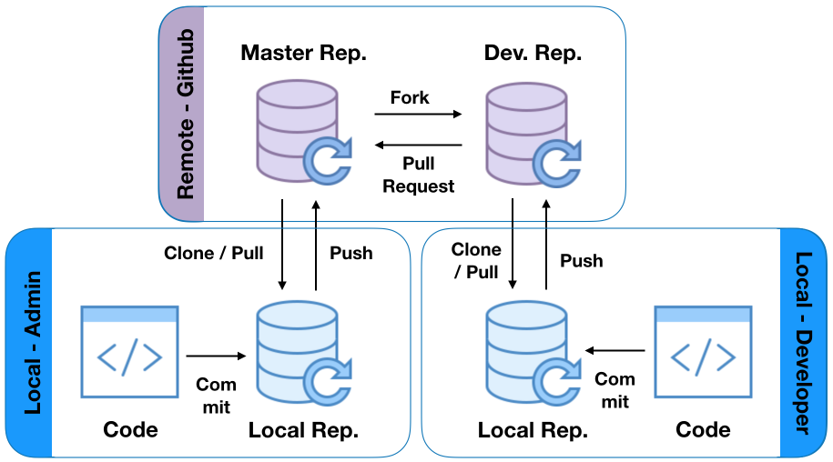

- 去中心化的结构
- 多个结点并不比单个结点有：
  - 更大的存储能力
  - 更强的计算能力
- 仓库之间就是“复制Replica”关系
  - 强大的“分支-合并”能力
  - 高效/高并发能力
  - 离线工作能力

#### 案例：dsaClass/dsa2020

- 把 dsa2020 仓库在本地复制一份
```bash
git clone http://github.com/dsaClass/dsa2020
```

- 查看工作目录 Working directory
```bash
ls -la dsa2020/
```

- 真正意义上的仓库Local Rep`.git`
```bash
ls -la dsa2020/.git
```

#### Object database

Git中的所有数据（包括文件、目录、提交和标签）都被存储为由哈希值标识的不可变压缩对象。

- 一个同学的解题文档
```bash
cat dsa2020/openjudge/96/2400010604.md
```
- 读取到python字符串中
```python
import os

file_path = 'dsa2020/openjudge/96/2400010604.md'
# 使用 with 语句，自动关闭文件
with open(file_path, 'rb') as file:
    md = file.read() # 将整个文件读取为一个字符串
file_size = os.path.getsize(file_path)
header = f"blob {file_size}\0".encode('utf-8')
```
```python
#print(md.decode('utf-8'))
print(header)
```

- 计算该文档的指纹(SHA1)
```python
import hashlib
sha1 = hashlib.sha1()

sha1.update(header)
sha1.update(md)
sha1.hexdigest()
```
- git也提供了类似功能：`hash-object`
```bash
git hash-object dsa2020/openjudge/96/2400010604.md
```

- 从本地仓库`.git`中读出这个文件
```bash
git -C dsa2020 cat-file -p '710df'
```

- 本地仓库如何存放数据
```bash
ls dsa2020/.git/objects
```
```bash
ls -l dsa2020/.git/objects/71
```

- 为了节省存储空间，仓库中存储的是经过zlib压缩之后的文件

```python
import zlib
fn='dsa2020/.git/objects/71/0dff9bce854a22510e1d6642f23acb87354a5f'
with open(fn, 'rb') as file:
    data = file.read()
print(zlib.decompress(data).decode('utf-8'))
```

```python

```

- 前面的存储格式称为“松散”的
  - 文件名为内容的散列值
  - 必须是完美散列函数
  - 同时还具备抗修改性、抗冲突性

* 在此基础上为了减少文件数量
  - 会把多个 objects 打包存储

```bash
ls -l dsa2020/.git/objects/pack
```
```bash
git verify-pack -v dsa2020/.git/objects/pack/pack-d1b4afd83990604c30fb75448910ff4d3ea27c6e
```

- 为了进一步节省磁盘空间
  - 增量保存近似文件
  - 对于大文件的多个相邻版本
    - 只记录它们之间的∆来节省空间
```bash
git -C dsa2020 log -p README.md | head -n 20
```

- 看README.md文件最后一次做了什么修改？
```bash
git -C dsa2020 diff HEAD^ README.md
```

<details>
<summary>如何实现</summary>

- 最长公共子序列算法

</details>

#### Git 中的 commit

- commit 日志：历史版本信息
```bash
git -C dsa2020 log -n 5
```

- 看最上面（最新）一个commit是什么内容

```bash
git -C dsa2020 cat-file -p 0deae18
```

- commit中的tree是什么东东？

```bash
git -C dsa2020 cat-file -p 13f7523
```

- commit中的parent是什么东东？
  - 原来是它的上一个版本commit
  - parent是一个从后往前的指针

```bash
git -C dsa2020 cat-file -p 515873c
```

- merge commit有两个 parent
- 普通commit 有一个 parent
- 初始commit 没有 parent

把每个 commit 看成一个顶点，parent 关系看成一条有向边，我们得到了一张有向无圈图DAG

  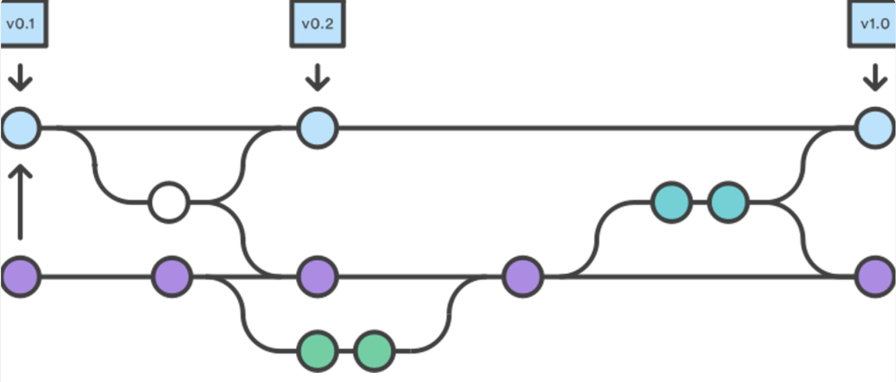

#### DAG: Commit Graph

  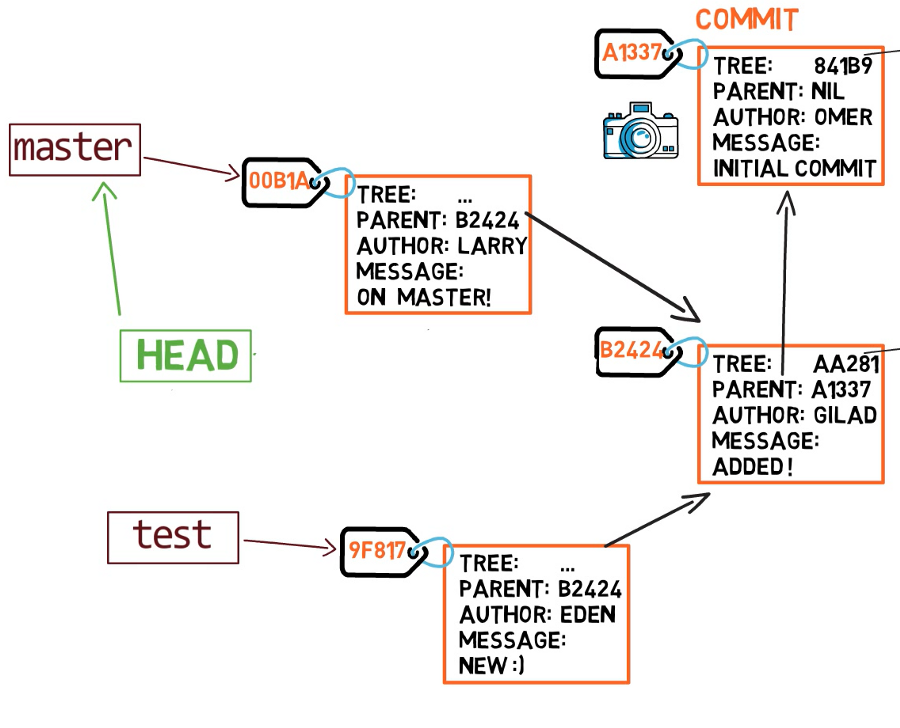

- 由哈希算法带来的不可篡改性
  - 固定 commit，它串起的所有结点都不可篡改
  - 有向无圈图


- 以ASCII图形的方式显示日志

```bash
git -C dsa2020 log --graph
```

- Bitcoin: Blockchain
  - 反时序单链表

  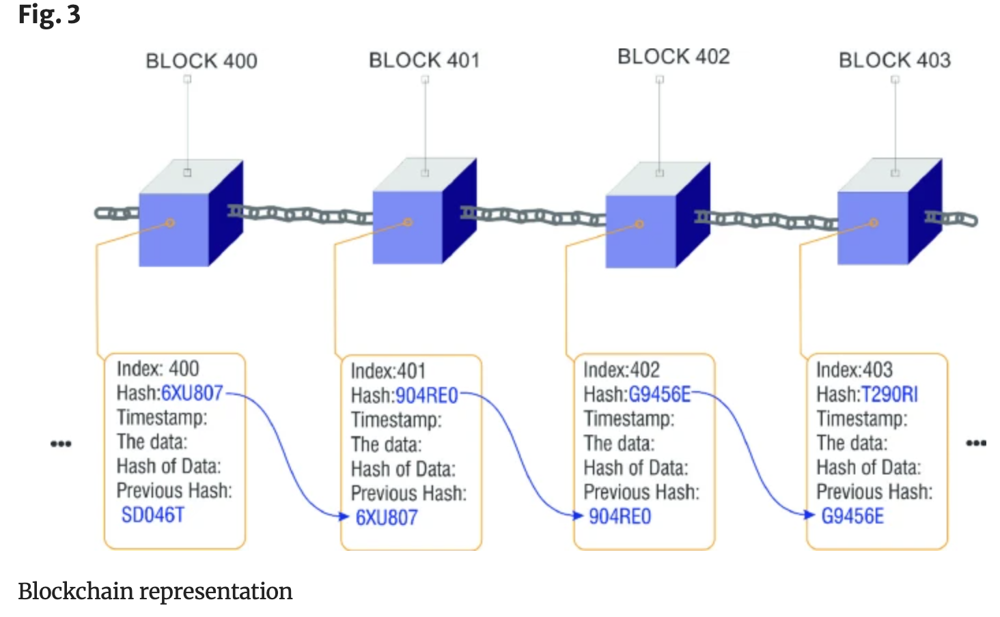


```python

```

#### Commit 中如何组织文件

- commit 中的tree其实对应文件系统中的目录
  - tree 表示（子）目录
  - blob 表示文件—叶子结点
  - **名字与内容分离**

```bash
git -C dsa2020 cat-file -p 13f7523
```

- 相同的tree和blob复用
  - 它们的内容和指纹一样，在object-database中也只能存一份

* foo项目当前状态
  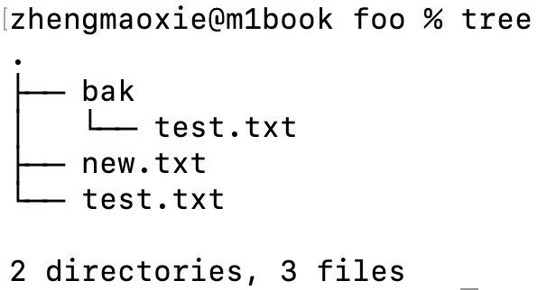

  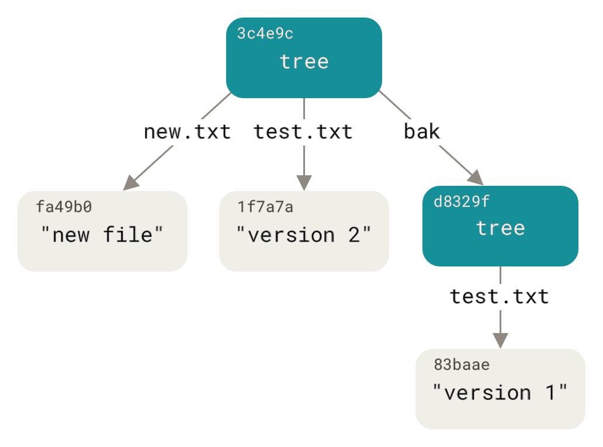

* foo项目日志，3个commit
  - 文件复用`test.txt`、`new.txt`
  - 目录复用`bak`

  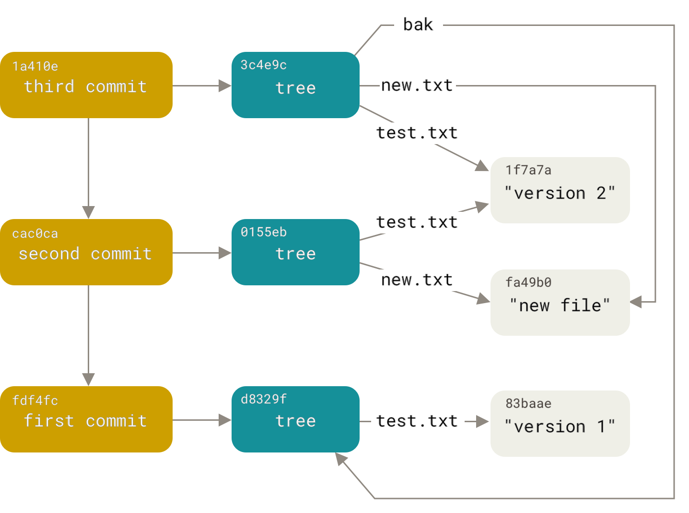

- 固定 tree 结点，它串起的内容都不可篡改
- 修改一个 blob，会改动从它开始到根路径上的所有tree 结点
- 从commit中的 tree 属性开始，可以串起（验证）该版本对应的所有文件

* blockchain中一个区块中的所有交易，把它们的哈希值组织成merkle tree结构，也采用类似的原理：下图中
  - $H_{AB}, H_C, H_{EFGH},$ and the root $H_{ABCDEFGH}$ 能够证明 $T_D$ 的真伪

  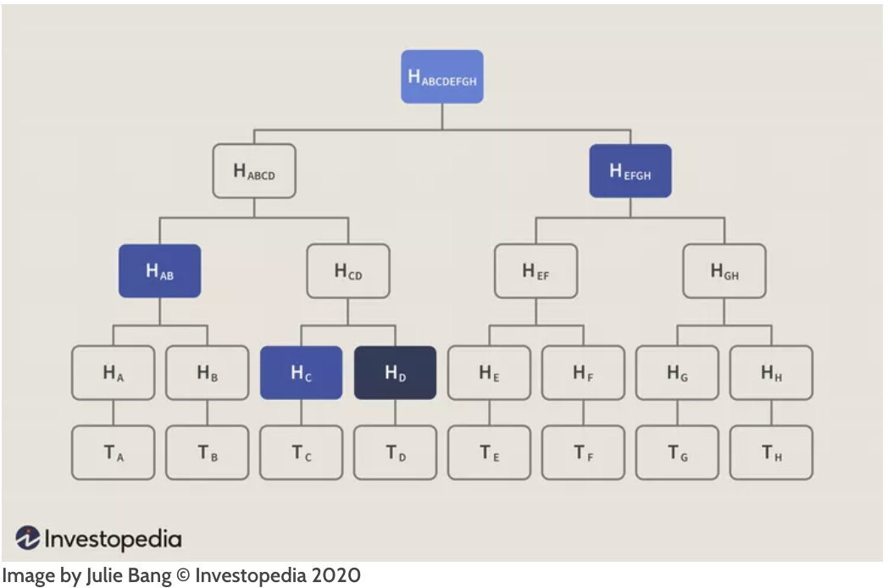

## 冒泡排序

- 冒泡排序的算法思路在于对无序表进行多趟比较交换，每趟包括了多次两两相邻比较，并将逆序的数据项互换位置，最终能将本趟的最大项就位，经过 n-1 趟比较交换，实现整表排序
  - 每趟的过程类似于“气泡”在水中不断上浮到水面的经过
- 第 1 趟比较交换，共有 n-1 对相邻数据进行比较
  一旦经过最大项，则最大项会一路交换到达最后一项，本趟尾部位置
- 第 2 趟比较交换时，最大项已经就位，需要排序的数据减少为 n-1，共有 n-2 对相邻数据进行比较
- 直到第 n-1 趟完成后，最小项一定在列表首位，就无需再处理了。

* 最小项先就位实现  

  

* 最大项先就位实现：第 1 趟

  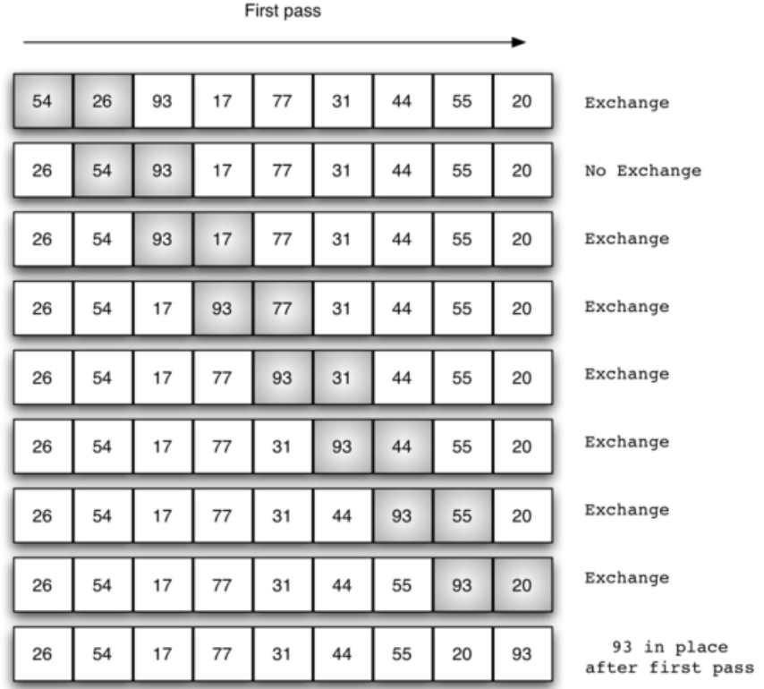

* 代码

```python
def bubbleSort(alist):
  for round_tail in range(len(alist)-1, 0, -1):
    for i in range(round_tail):
      if alist[i] > alist[i+1]:
        alist[i], alist[i+1] = alist[i+1], alist[i]

# Example usage
if __name__ == "__main__":
    nums = [64, 34, 25, 12, 22, 11, 90]
    bubbleSort(nums)
    print(f"Sorted array: {nums}")
```

### 算法分析

- 前面的实现中初始数据项的排列对冒泡排序没有影响，算法过程总需要 n-1 趟，
随着趟数的增加，比对次数逐步从 n-1 减少到 1，并包括可能发生的数据项交换。
- 比对次数是 1～n-1 的累加：n(n-1)/2
  - 比对的时间复杂度是 O($n^2$)
- 关于交换次数，时间复杂度也是 O($n^2$)
  - 最好的情况是列表在排序前已经有序，交换次数为 0
  - 最差的情况是每次比对都要进行交换，交换次数等于比对次数
    - 什么时候出现最坏情况？逆序。
- 排序保持稳定：两个数据项的排序码相等，排序后他们的顺序不变（保序）。
- 冒泡排序是保持稳定的

* 冒泡排序通常作为时间效率较差的排序算法，来作为其它算法的对比基准。
* 其效率主要差在每个数据项在找到其最终位置之前，必须要经过多次比对和交换，其中大部分的操作是无效的。
* 但有一点优势，就是无需任何额外的存储空间开销。
* 就好像画画一样，算法也是先有轮廓，再逐步改进、完善细节。

  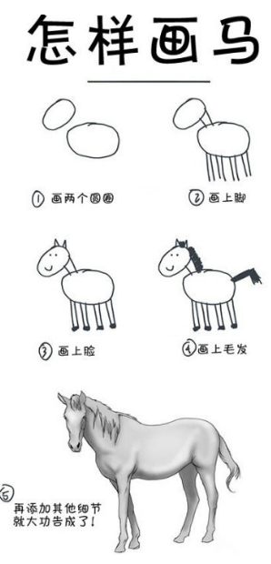

### 性能改进

- 冒泡排序算法的一个特点：监测一趟比对，看是否发生过交换，就可以提前确定排序是否完成 
- 如果某趟比对没有发生任何交换，说明列表已经排好序，可以提前结束算法
  - 算法复杂度仍然为O($n^2$)，改进属于一种 **小修小补**的情况

```python
def bubbleSort(alist):
  for tail in range(len(alist)-1, 0, -1):
    swapped = False
    for i in range(tail):
      if alist[i] > alist[i+1]:
        alist[i], alist[i+1] = alist[i+1], alist[i]
        swapped = True
    if not swapped:
      return

# Example usage
if __name__ == "__main__":
    nums = [64, 34, 25, 12, 22, 11, 90]
    bubbleSort(nums)
    print(f"Sorted array: {nums}")
```

## 选择排序

- 选择排序对冒泡排序进行了改进，保留了其基本的多趟比对思路，每趟都使当前最大项就位。
- 但选择排序对交换进行了削减，相比起冒泡排序进行多次交换，每趟仅进行 1 次交换
  - 记录最大项的所在位置，最后再跟本趟最后一项交换
- 选择排序的时间复杂度比冒泡排序稍优
  - 比对次数不变，还是 O($n^2$)
  - 交换次数则减少为 O(n)
- 选择排序保持稳定吗？

* 最小项就位实现

  

* 最大项就位实现

  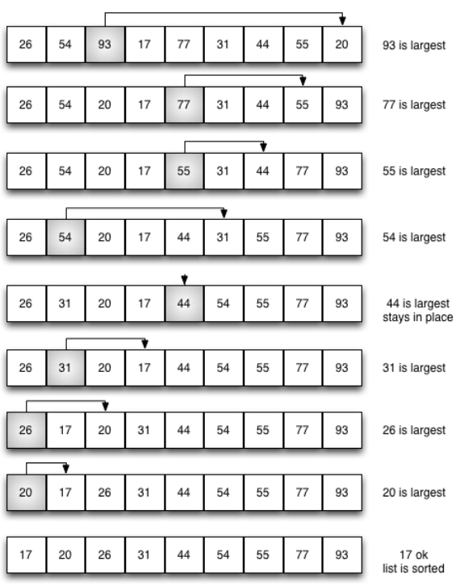

### 代码

```python
def selectionSort(alist):
  for fillslot in range(len(alist)-1, 0, -1):
    i_max = 0
    for curr in range(1, fillslot+1):
      if alist[curr] >= alist[i_max]:
        i_max = curr

    alist[fillslot], alist[i_max] = alist[i_max], alist[fillslot]

# Example usage
if __name__ == "__main__":
    nums = [64, 34, 25, 12, 22, 11, 90]
    selectionSort(nums)
    print(f"Sorted array: {nums}")
```

- 注意元素交换对排序稳定性的影响
- 能不能改进算法，保持选择排序的稳定性？
- 黄金口诀：稳定性看移动数据是否跨等值项 

<details>
<summary>跨等值项</summary>

- 最大项就位时，被替换项的移动可能跨过了它的等值项

</details>

## 插入排序

- 插入排序时间复杂度仍然是 O($n^2$)，但算法思路与前两个不同
- 插入排序维持一个已排好序的子列表，其位置始终在列表的前部，然后逐步扩大这个子列表直到全表
  - 第 1 趟，子列表仅包含第 1 个数据项，将第 2 个数据项作为“新项”插入到子列表的合适位置中，这样已排序的子列表就包含了 2 个数
据项；
  - 第 2 趟再继续将第 3 个数据项从后往前跟前 2 个数据项比对，并移动比自身大的数据项，空出位置来，以便加入到子列表中
  - 经过 n-1 趟比对和插入，子列表扩展到全表，排序完成

  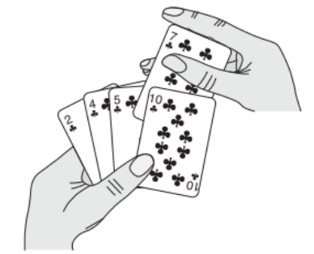

  

* 插入排序的比对主要用来寻找“新项”的插入位置
* 最差情况是每趟都与子列表中所有项进行比对，总比对次数与冒泡排序相同，数量级仍是 O(n2)
* 最好情况，列表已经排好序的时候，每趟仅需 1 次比对，总次数是O(n)；且无需移动数据
* 最坏情况，逆序。

### 算法思路

  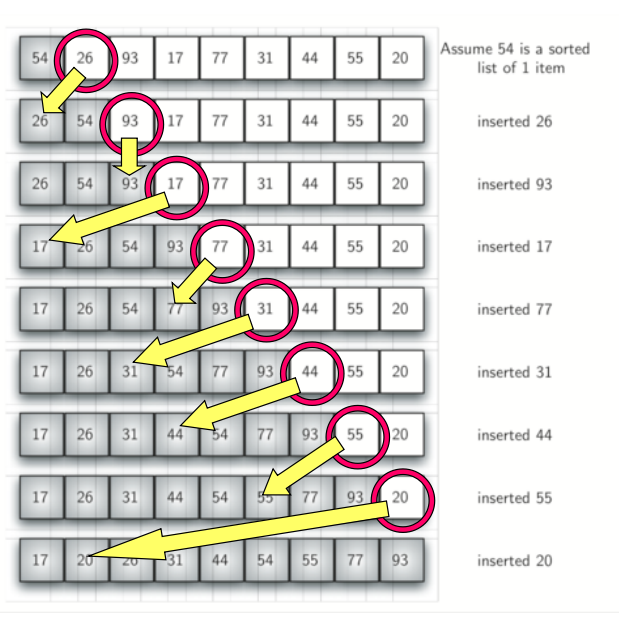

  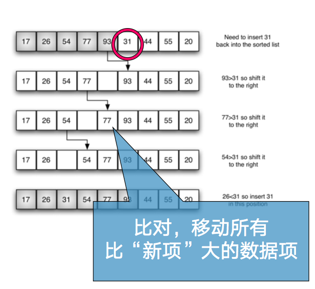

### 代码
```python
def insert_sort(alist):
  for i in range(1,len(alist)):
    item2insert, hole = alist[i], i
    while hole > 0 and alist[hole - 1] > item2insert:
      alist[hole] = alist[hole - 1]    #移动数据
      hole = hole - 1
    # 找到了不大于新项的元素，或者到了表头位置
    alist[hole] = item2insert     #插入新项

# Example usage
if __name__ == "__main__":
    nums = [64, 34, 25, 12, 22, 11, 90]
    insert_sort(nums)
    print(f"Sorted array: {nums}")
```

- 思考：对已排好部分用二分查找插入位置，会不会更高效？
- 思考：插入排序保持稳定吗？

## 谢尔排序

谢尔排序 Shell Sort

### 算法思路

- 我们注意到插入排序的比对次数：在最好的情况下是 O(n)，在列表已是有序的情况下
  - 实际上，列表越接近有序，插入排序的比对次数就越少
- 从这个情况入手，谢尔排序以插入排序作为基础，对无序表进行“间隔”划分子列表，每个子列表都执行插入排序
  - 随着子列表的数量越来越少，无序表的整体越来越接近有序，从而减少整体排序的比对次数
- 间隔为 3 的子列表，子列表分别插入排序后的整体状况更接近有序

  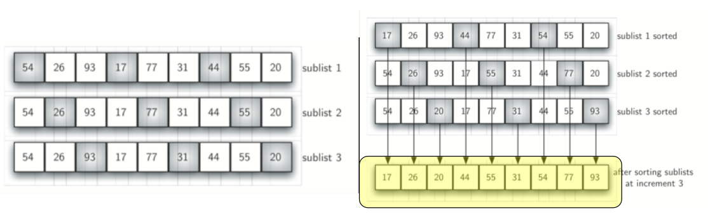

- 最后一趟是标准的插入排序，但由于前面几趟已经将列表处理到接近有序，这一趟仅需少数几次移动即可完成（左图）

  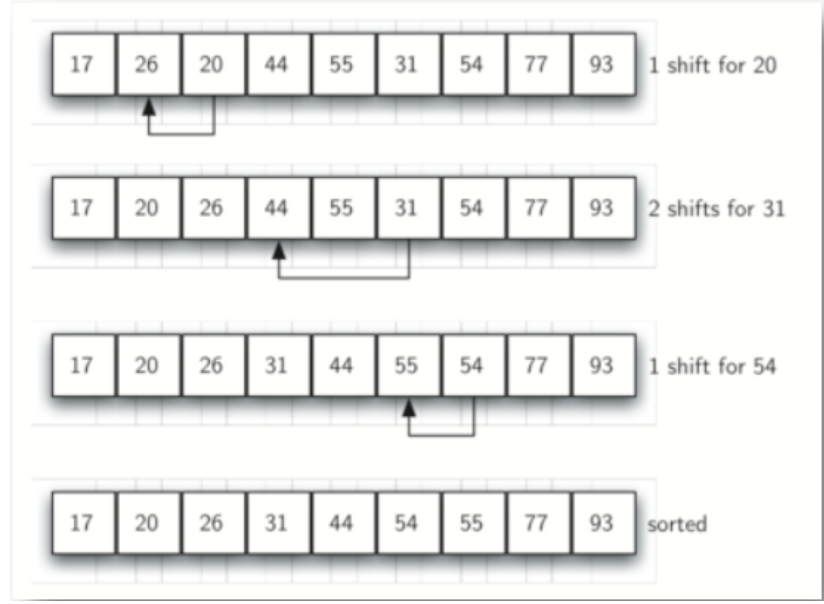

- 子列表的间隔（取子列表的步长，同时也是子列表的个数）一般从n//2 开始，每趟倍减：n//4, n//8,…… 直到 1

  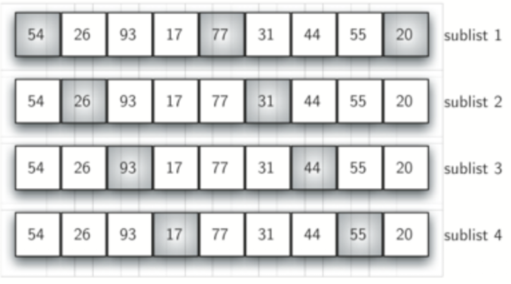

### 代码

```python
def shell_sort(alist):
  step = len(alist)//2
  while step > 0:
    print(f"Sorting with step {step}: {alist}")
    for start in range(step):
      gap_insert_sort(alist, start, step)
    step //=  2

def gap_insert_sort(alist, start, step):
  for i in range(start+step, len(alist), step) :
    item2insert, hole = alist[i], i
    while hole > start and alist[hole - step] > item2insert:
      alist[hole] = alist[hole - step]
      hole = hole - step
    alist[hole] = item2insert

import random
worst_case = [random.randrange(20) if i % 2 == 0 else random.randrange(20)+1000 for i in range(16)]

# Example usage
if __name__ == "__main__":
    nums = [503, 87, 512, 61, 908, 170
      , 897, 275, 653, 426, 154
      , 509, 612, 677, 765, 703]
    #nums = worst_case
    shell_sort(nums)
    print(f"Sorted array: {nums}")
```

  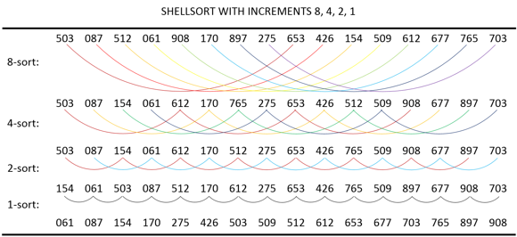

### 算法分析

- 粗看上去，谢尔排序以插入排序为基础，进行了多次插入排序，效率应该更差才是
- 但由于每趟都使得列表更加接近有序，这个过程会减少很多原先需要做的“无效”比对
- 对谢尔排序的详尽分析比较复杂，大致说是介于 O(n) 和 O($n^2$) 之间
- 如果将间隔保持在 $2^k − 1$ (1、3、5、7、15、31、……），谢尔排序的时间复杂度约为$O(n^{3/2})$
- 谢尔排序是稳定的吗？

- 步长序列对最坏时间复杂度的影响

步长序列类型|公式定义|使用示例|最坏时间复杂度
----- | ------ | ----------- | ------
希尔原始序列|$\{N//{2^t}\}$|"N//2,N//4,…,4,2,1"|O($n^2$)
Hibbard 序列|$\{2^k−1\}$|"…,31,15,7,3,1"|O($n^{1.5}$)
Sedgewick 序列|$\{9\cdot 4^i−9\cdot 2^i+1\}\cup \{4^j−3\cdot 2^j+1\}$|"…,109,41,19,5,1"|O($n^{1.3}$)

```python
# Sedgewick 建议的步长序列 (部分)
SEDGEWICK_GAPS = [1, 5, 19, 41, 109, 209, 505, 929, 2161, 3905, 8929, 16001, 36289]

def shell_sort_sedgewick(arr):
    n = len(arr)
    # 找到小于 n 的最大步长索引
    gaps = [g for g in SEDGEWICK_GAPS if g < n][::-1]

    for gap in gaps:
        # 标准的步长插入排序逻辑
        for i in range(gap, n):
            item2insert = arr[i]
            hole = i
            while hole >= gap and arr[hole - gap] > item2insert:
                arr[hole] = arr[hole - gap]
                hole -= gap
            arr[hole] = item2insert
```

## 归并排序

- 下面我们来看看分而治之的策略在排序中如何应用
- 归并排序是递归算法，思路是将数据表持续分裂为两半，对两半分别进行归并排序
  - 递归的基本结束条件是：数据表仅有 1 个数据项，自然是排好序的；
  - 缩小规模：将数据表分裂为相等的两半，规模减为原来的二分之一；
  - 调用自身：将两半分别调用自身排序，然后将分别排好序的两半进行归并，得到排好序的数据表。

  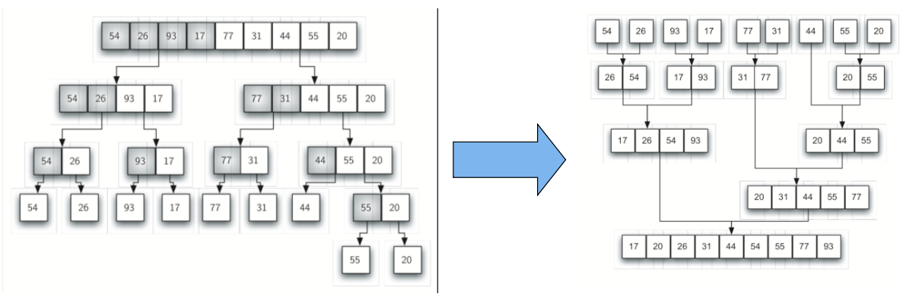

### 代码

```python
def merge_sort(alist):
  if len(alist) <= 1:         # 基本结束条件
    return alist
  # 对左右两半分别进行递归调用
  mid = len(alist)//2
  left = merge_sort(alist[:mid])
  right = merge_sort(alist[mid:])

  alist.clear()
  i = j = 0
  while i < len(left) and j < len(right):
    # 拉链式归并剩余最小项
    if left[i] <= right[j] :
      alist.append(left[i])
      i += 1
    else :
      alist.append(right[j])
      j += 1

  # 归并所有剩余项
  alist.extend(left[i:] if i<len(left) else right[j:])
  return alist


if __name__ == "__main__":
    nums = [503, 87, 512, 61, 908, 170
      , 897, 275, 653, 426, 154
      , 509, 612, 677, 765, 703]
    merge_sort(nums)

    print(nums)
```

```python

```

### 算法分析

- 将归并排序分为两个过程来分析：分裂和归并
    - 分裂的过程，借鉴二分查找中的分析结果，分裂的层数为 O(log n)
    - 归并的过程，相对于每一层的分裂，其所有数据项都会被比较和放置一次，所以是线性复杂度，其时间复杂度是 O(n)
- 综合考虑，每层分裂都进行一次 O(n) 的数据项归并，所以总的时间复杂度是 **O(nlog n)**
- 最后我们还注意到有三个切片操作，他们的复杂度是 O(n)，对上述的分析没有影响。
- 我们注意到归并排序算法使用了额外O(n)的存储空间用于归并，这个特性在对特大数据集进行排序的时候要考虑进去
    - 额外O(n)的存储空间、顺序访问的特性，使归并排序在外存上 **大显身手** 
- 我们可以再次套用“主定理”，对归并排序进行分析。
- 归并排序是稳定的吗？

### 随堂思考

1. 给定排序列表 [21, 1, 26, 45, 29, 28, 2, 9, 16, 49, 39, 27, 43, 34, 46, 40]，在归并排序的第 3 次递归调用时，排序的是哪个子表？
    1. [16, 49, 39, 27, 43, 34, 46, 40]
    1. [21,1]
    1. [21, 1, 26, 45]
    1. [21]
1. 排序数据同上，归并排序中，哪两个子表是最先归并的？
    1. [21, 1] and [26, 45]
    1. [1, 2, 9, 21, 26, 28, 29, 45] and [16, 27, 34, 39, 40, 43, 46, 49]
    1. [21] and [1]
    1. [9] and [16]

<details>
<summary>答案</summary>

- 归并排序算法过程中递归调用与归并事件发生的时序：
    - 红圈：递归调用
    - 绿圈：归并

  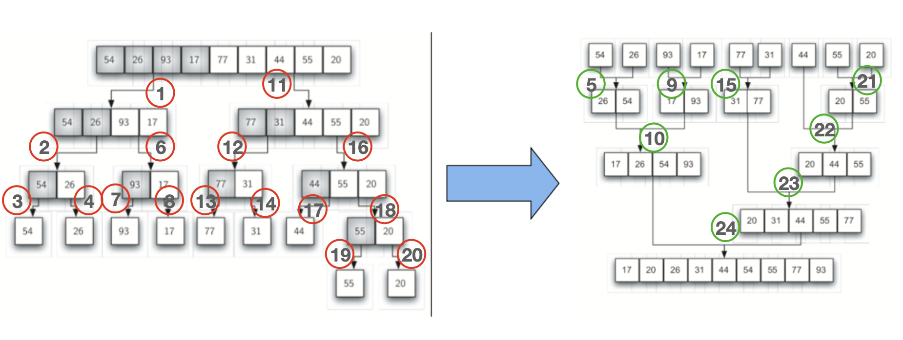

- 第3次递归调用时，排序的是子表`[21,1]`
- 子表`[21]`和`[1]`是最先归并的

</details>

## 快速排序

- 另一个采用分而治之策略的排序算法是快速排序，其优势是只需要很少的额外空间，这一点比归并排序强
    - 但是！快速排序不是总能“等分” 数据表，这样在性能上就会打折扣
- 快速排序的思路是依据一个“中值”数据项来把数据表分为两半：小于中值的一半和大于中值的一半，然后每部分分别进行快速排序
    - 如果希望这两半拥有相等数量的数据项，则应该找到数据表的“中位数”
    - 但找中位数需要计算开销！要想没有开销，只能随意找一个数来充当“中值”
    - 比如，第 1 个数。

  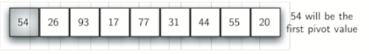

- 快速排序的递归算法“递归三要素”如下：
    - 基本结束条件：数据表仅有 1 个数据项，自然是排好序的；
    - 缩小规模：根据“中值”，将数据表分为两半，最好情况是相等规模的两半
    - 调用自身：将两半分别调用自身进行排序（排序基本操作在分裂过程中）

### 算法图示

- 分裂数据表的目标: 找到“中值”应处的位置

  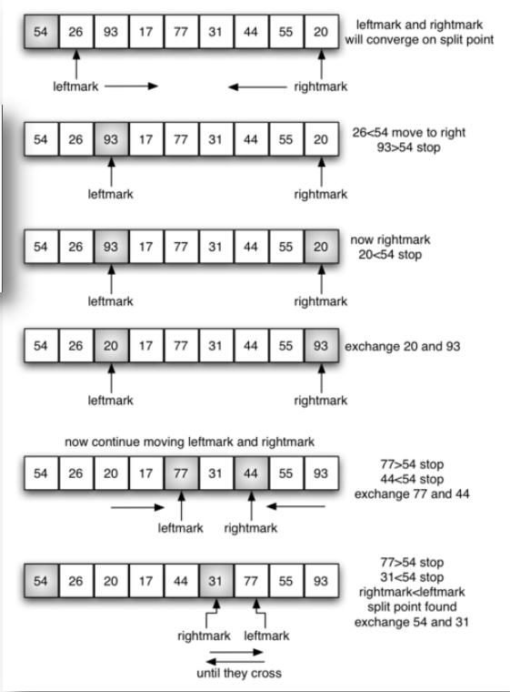

- 分裂数据表的手段
    - 设置左右标（left/rightmark）
    - 左标向右移动，右标向左移动
        - 左标向右移动，碰到比中值大的就停止
        - 右标向左移动，碰到比中值小的就停止
    - 然后把左右标所指的数据项交换
    - 继续前述的移动过程，直到左标移到右标的右侧，停止移动
        - 此时右标的右边（包含左标）都大于等于中值
        - 而左标的左边（包含右标）都小于等于中值
    - 这时右标所指位置就是“中值”应处的位置
    - 将中值和这个位置交换

  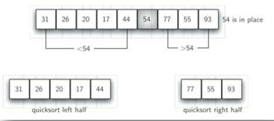

- 分裂完成，左半部 ≤ 中值，右半部 ≥ 中值
- 思考三种特殊情况：都比中值大；都比中值小；都等于中值。

### 代码

- 分裂

```python
def split(alist, first, last):
    """
    选第一个元素为中值，进行分裂
    """
    left, right = first+1, last-1     #左右标初值
    while left <= right:               #左右相错之前一直执行
        """ 访问元素之前先考虑下标是否越界 """
        while left<=right and alist[left] <= alist[first]:
            left += 1      #右移左标
        while left<=right and alist[right] >= alist[first]:
            right -= 1     #左移右标
        if left < right:   #交换左右标元素，并继续移动
            alist[left], alist[right] = alist[right], alist[left]
    else:                  #中值点就位
        alist[first], alist[right] = alist[right], alist[first]
    # print(alist[:right], alist[right], alist[right+1:])
    return right           #返回中值点位置
```

- 排序

```python
def quickSort(alist):
    _quickSort(alist, 0, len(alist))

def _quickSort(alist, first, last):  #递归形式函数
    if last - first > 1:  # more than 1 elems基本结束条件
        pivot = split(alist, first, last)  #分裂为左右两半
        _quickSort(alist, first, pivot)    #递归调用
        _quickSort(alist, pivot+1, last)

def worst_case():
    yield list(range(1000))
    yield [23]*1000

if __name__ == "__main__":
    #l = [54, 26, 93, 17, 77, 31, 44, 55, 21]
    l = [14, 17, 13, 15, 19, 10, 3, 16, 9, 12]
    quickSort(l)
    print(l)
```

```python

```

### 算法分析

- 快速排序基本的过程也分为两部分：分裂和递归
    - 分裂过程将每项都与中值进行比对，时间复杂度是 O(n)；
    - 只使用了左右两个指针变量，分裂算法是原地工作的
    - 如果每次总能把数据表分裂成相等的两部分，则分裂层数是 O($\log n$)；用递归实现的话，递归的深度也是 O($\log n$)
    - 综合起来，快速排序时间复杂度就是 O(nlog n)；
    - 空间代价是 O(log n)，非递归实现需要用栈保存每层的分裂结果，栈的深度也是 O(log n)
- 但是如果不那么幸运的话，中值所在的分裂点过于偏离中部，造成左右两部分数量不平衡
    - 极端情况，有一部分始终没有数据，这样时间复杂度就退化到O($n^2$)，还要加上递归调用的开销（比冒泡排序还糟糕）
    - 比如：输入数据表已经排好序，或者完全逆序的情况
- 可以适当改进下中值的选取方法，让中值更具有代表性
    - 比如“三点取样”，从数据表的头、尾、中间选出中值
    - 会产生额外计算开销，仍然不能排除极端情况
    - 改进有限，增加了代码的复杂度
- 对于所有数据元素大部分相等的情况，时间复杂度也是O($n^2$)，如何改进？

### 随堂练习

1. 给定排序列表 `[14, 17, 13, 15, 19, 10, 3, 16, 9, 12]`，快速排序在第 2 次分裂后，列表内容是?
1. 给定排序列表 `[1, 20, 11, 5, 2, 9, 16, 14, 13, 3, 19]`，快速排序如果采用“三点取样”法，得到的第 1 个“中值”是：
    > a) 1 b) 9 c) 16 d) 19
1. 下面哪些算法，即使在最坏情况下，复杂度还保证是 O(n$\log n$)
    > a) 谢尔排序 b) 快速排序 c) 归并排序 d) 插入排序

<details>
<summary>答案</summary>

1. 分裂算法有不同的实现，但是中值的位置是一样的
    - [9, 3, 10, 13, 12, 14, 19, 16, 15, 17]
2. 三点取样中值：9
3. 归并排序

* 快速排序分裂算法 
    * 霍尔法
    * 挖坑法

  

  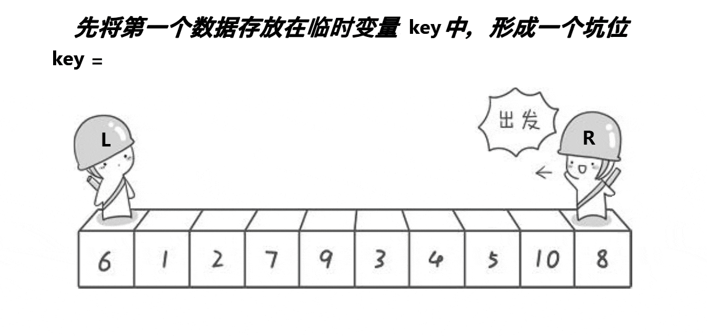

</details>

## 分配排序

分配排序 (Distribution Sort)：是一类排序算法的总称。与“比较排序”（如冒泡、快排）不同，它不通过直接比较元素的大小来排序，而是利用元素的属性值，将元素分发到对应的空间（桶/位置）中，最后按序收集。

### 桶式排序

桶排序 (Bucket Sort)是分配排序最典型的代表。它将待排序序列划分为`m`个连续的、有序的“桶”，每个桶代表一个数值区间

- 事先知道序列中排序key值只有少数的情况
    - 如果是连续的浮点数排序码，我们引入了一个区间映射逻辑，计算出离散的key值。
    - 假设我们要对 $[0, 1)$ 之间的浮点数进行排序，准备了 10 个桶：
    $$key = \lfloor \text{Value} \times 10 \rfloor$$
        - 值 0.12 $\rightarrow$ 映射到 1 号桶（区间 $[0.1, 0.2)$）
        - 值 0.18 $\rightarrow$ 映射到 1 号桶（区间 $[0.1, 0.2)$）
        - 值 0.85 $\rightarrow$ 映射到 8 号桶（区间 $[0.8, 0.9)$）
- 将具有相同key值的记录都分配到同一个桶中，
    - 如果是连续的排序码，还需要在每个桶进行桶内 **比较排序**
- 依次按照编号从桶中取出记录，组成一个有序序列
- 不需要比较两个元素的key

  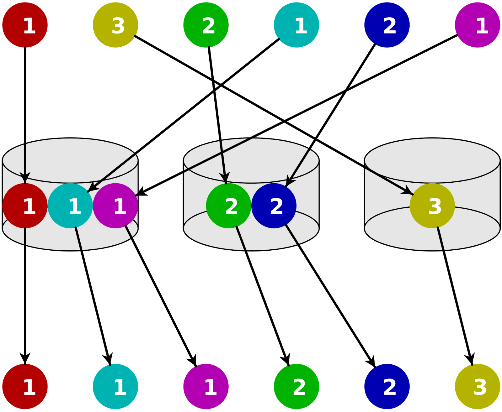

#### 计数法实现

- 整数$key \in [0, 9]$，对应10个桶。
- 首先按桶号对元素进行计数

  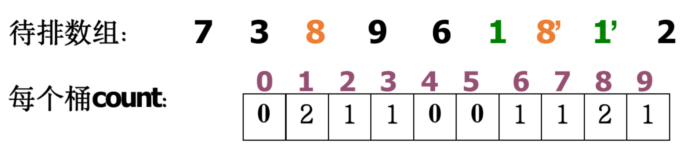

- 前若干桶的累积计数，也就是前缀和(Prefix Sum)数组

  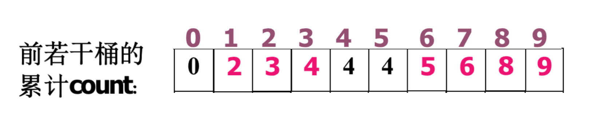

- **从后往前**扫描待排序数组，每个元素在前缀和数组中查到的数值其实就是它排序的 **名次**
- 按照名次把元素放到输出数组中，同时把对应的前缀和值减一
    - 原来排在它前面的等值元素，在输出数组中也比它高一个名次

* 完成排序的输出数组

  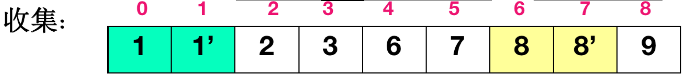

* 使用过的前缀和数组（与原来的相比较）

  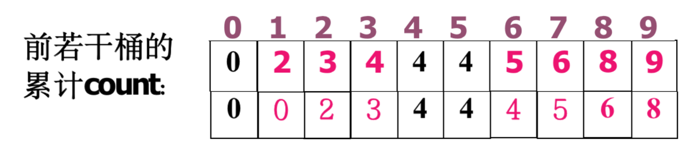

##### 计数法算法分析

- 数组长度为 n, key值区间 $[0, m)$
- 时间代价:
    - 统计计数：O(n+m)，先计数再累计；
    - 总的时间代价为 O(m+n)
    - 适用于 m 相对于 n 很小的情况
- 空间代价
    - m 个计数器，长度为 n 的临时数组，O(m+n)
- 排序保持稳定：在排序码相等的情况下，保持输入的序（保序）
- 应用举例：高考成绩排名

#### 容器法实现

- 不需要对key值进行计数
- 把待排序元素直接挂在它对应的槽slot上
- 一个槽可能对应多个元素
    - C语言实现中用链表实现
    - Python中可以使用list

  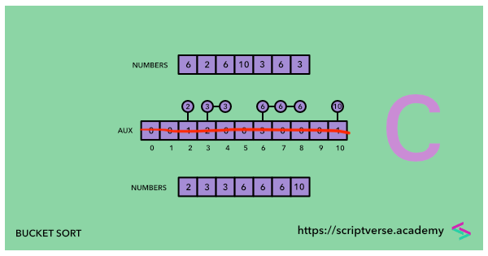

### 基数排序

- 还有一类排序问题，排序“码” 包括 d 个部分。通过对各个部分分别排序，最终实现对整个排序码的排序。
    - 世界杯小组赛排名：先看积分，再看净胜球，最后看进球数
    - 扑克牌排序：假设花色地位高于面值，则先看花色、再看面值
- 在算法理论中，这种处理方式被称为多关键字排序（Multi-Key Sorting）
- 或者前面桶排序中，key对应的m值太大
    - 邮编排序：100871, 422000 …, 先看高位，再看低位
    - 手机号码，有11位数字
- 用于实现桶的数据结构将非常大，远远超出了内存空间

* 将一个记录的值即排序码拆分为多个部分来进行比较
* 假设长度为 n 的待排序序列：
    $$R = \{ r_0,r_1,\ldots,r_{n-1} \}$$
* 记录的排序码 K 包含 d 个子排序码:
    $$K = ( k_{d-1},k_{d-2},\ldots,k_1,k_0 )$$
* R 对排序码有序，要求对于任意两个记录 $R_i,R_j(0 \le i \lt j \le n-1)$， 都满足字典序:
    $$(k_{i,d-1},k_{i,d-2},\ldots,k_{i,1},k_{i,0})\le(k_{j,d-1},k_{j,d-2},\ldots,k_{j,1},k_{j,0})$$
* 可以分为两种方式, 以扑克牌排序为例：
    * 花色（Suit）优先和数值（Rank）次之
    * 高位先排，递归分治；更符合人类手工理牌的习惯。
        1. 第一轮分配：先按花色把牌分成四堆。
        1. 递归处理：在每一堆花色内部，再分别按数值进行排序。
        1. 合并：最后把四堆牌按花色顺序叠在一起。
    * **低位先排，要求稳定排序！** 非常适合机器或计算机程序
        1. 第一轮分配与收集：先按数值（2, 3, ..., A）进行分配，然后收集。
        1. 第二轮分配与收集：在第一轮的基础上，再按花色（梅花、方块、红桃、黑桃）进行分配。
        * 关键点：第二轮分配必须是稳定的。这样当花色相同时，数值的相对先后顺序（第一轮的结果）会被保留下来。
* 对每一个子排序码进行排序时，通常使用桶排序（计数法实现）；
    * 原则上也可以使用其他排序算法，包括各种比较排序算法

#### 高位优先法

- MSD，Most Significant Digit first
- 先处理高位 $k_{d-1}$ 将序列分到若干桶中
- 然后再对每个桶处理次高位 $k_{d−2}$ ，分成更小的桶
- 依次重复，直到对 k0 排序后，分成最小的桶，每个桶内含有相同排序码 $(k_{d-1}, \ldots, k_{1}, k_{0})$
- 最后将所有的桶中的数据依次连接在一起，成为一个有序序列
- 这是一个分、分、……、分、收的过程

#### 低位优先法

- LSD，Least Significant Digit first
- 从最低位 $k_0$ 开始排序
- 对于排好的序列再用次低位 $k_1$ 排序；
- 依次重复，直至对最高位 $k_{d−1}$ 排好序后，整个序列成为有序的
- 分、收；分、收；……；分、收的过程
- 反复调用“桶式排序” 即可；
- 比较简单，计算机常用

#### 算法分析

- 主要讨论 LSD
- 原始输入数组 R 的长度为 n，基数为 m，排序码个数为 d
- 算法复杂度:
    - 时间复杂度：等于桶式排序的 d 倍 O(d*(n+m))
    - 空间复杂度：等于桶式排序 O(n+m)
    - 当 d,m $\ll$ n 时，可以认为都是 O(n)
    - 单纯从复杂度上来讲，我们获得了最优的排序算法
        - 与 hash 搜索类似，都是用空间换时间
        - 使用的场景受限：排序码的取值范围是离散有限的；
        - 通过设计，需要把 d 和 m 控制在一个较小的数值范围内。

#### 随堂练习

1. 假设线性表中每个元素有两个数据项 key1 和 key2，现对线性表按以下规则进行排序：先根据数据项 key1 的值进行非递减排序；在key1 值相同的情况下，再根据数据项 key2 的值进行非递减排序。满足这种要求的排序方法是 ( )。
    - A. 先按 key1 值进行冒泡排序，再按 key2 值进行直接选择排序
    - B. 先按 key2 值进行冒泡排序，再按 key1 值进行直接选择排序
    - C. 先按 key1 值进行直接选择排序，再按 key2 值进行冒泡排序
    - D. 先按 key2 值进行直接选择排序，再按 key1 值进行冒泡排序
2. 上一题得到的排序算法是稳定的吗？

<details>
<summary>答案</summary>

1. key1为高位，需要先排key2; key1排序算法需稳定
2. 只要中间出现了不稳定的排序算法，最后的排序就不稳定

</details>

## 内排序和外排序的关系

在算法设计和数据处理中，内排序（Internal Sorting）与外排序（External Sorting）的根本区别在于：待排序的数据量是否超出了计算机内存（RAM）的容量。

它们之间的关系可以理解为“局部”与“整体”，或者“工具”与“框架”的关系。

外排序并不是一种完全独立的全新算法，它实际上是以内排序作为基础组件的“分治框架”。
一个典型的外排序流程（如 外部归并排序）通常分为两个阶段，这两个阶段体现了它们的关系：

- 第一阶段：生成“初始归并段”（Run Generation）
    - 动作：将磁盘上的大数据量分批次读入内存。
    - 关系：在内存中，使用内排序算法（如快排或堆排序）对这一小块数据进行排序。
    - 输出：将排好序的小块（称为 Run）写回磁盘。

- 第二阶段：多路归并（Multi-way Merge）
    - 动作：将第一阶段生成的多个有序小块，通过“归并”的方式合并成一个巨大的有序文件。
    - 关系：归并过程中，内存中会维护一个类似“胜者树”或“败者树”的结构，这本质上也是一种内存中的数据组织形式。

内排序有很多种（快排、希尔、堆排等），但外排序几乎清一色地使用归并排序的思想。

## 本章小结

- 在无序表或者有序表上的顺序查找，其时间复杂度为 O(n)
- 在有序表上进行二分查找，其最差复杂度为 O(log n)
- 散列表可以实现常数级时间的查找
- 冒泡排序、选择排序和插入排序是 O($n^2$) 的算法
- 谢尔排序在插入排序的基础上进行了改进，采用对递增子表排序的方法，其时间复杂度可以在 O(n) 和 O($n^2$) 之间
- 归并排序的时间复杂度是 O(nlog n)，但归并的过程需要额外存储空间
- 快速排序最好的时间复杂度是 O(nlog n)，但如果分裂点偏离列表中心的话，最坏情况下会退化到 O($n^2$)；它需要用 O(logN) 的栈空间保存每次分裂的结果。
- 分配排序在有限的应用场景下，实现了 O(n) 的算法复杂度

    排序 | 最好情况 | 最差情况 | 平均情况 | 稳定性 |空间
    ---  |  ----- | ----- | ----- | ---- | ----
    冒泡 | $O(n)$ | $O(n^2)$ | $O(n^2)$ | 稳定 | O(1) 
    选择 | $O(n^2)$ | $O(n^2)$ | $O(n^2)$ | 不稳定 | O(1) 
    插入 | $O(n)$ | $O(n^2)$ | $O(n^2)$ | 稳定| O(1)     
    谢尔 | $O(n)$ | $O(n^2)$ | $O(n^{\frac{3}{2}})$ | 不稳定|O(1)  
    归并 | $O(n\log n)$ | $O(n\log n)$ | $O(n\log n)$ | 稳定| O(n) 
    快速 | $O(n\log n)$ | $O(n^2)$ | $O(n\log n)$ | 不稳定 |$O(\log n)$ 
    分配 | $O(d(m+n))$ | $O(d(m+n))$ | $O(d(m+n))$ | 稳定 | O(m+n) 
    堆 | $O(n\log n)$ | $O(n\log n)$ | $O(n\log n)$ | 不稳定|O(1)  
