---
jupyter:
  jupytext:
    cell_metadata_filter: -all
    split_at_heading: true
    text_representation:
      extension: .md
      format_name: markdown
      format_version: '1.3'
      jupytext_version: 1.18.1
  kernelspec:
    display_name: Python 3 (ipykernel)
    language: python
    name: python3
---

# Ch06. 排序与查找

[Home]( README.md )

## 本章目标

- 了解和实现顺序查找和二分法查找；
- 了解和实现选择排序、冒泡排序、归并排序、快速排序、插入排序和希尔排序；
- 了解用散列 Hashing 实现查找的技术；
- 了解抽象数据类型：映射 Map；
- 采用散列实现抽象数据类型 Map。

## 顺序查找

- 顺序查找（Sequential Search），也称为线性查找（Linear Search），是搜索算法中最基础、最直观的一种。

- 如果数据项保存在如列表这样的集合中，我们会称这些数据项具有
线性或者顺序关系，在 Python List 中，这些数据项的存储位置称
为下标（index），这些下标都是有序的整数，通过下标，我们就可
以按照顺序来访问和查找数据项，这种技术就称为“顺序查找”

- 要确定列表中是否存在需要查找的数据项，首先从列表的第 1 个数
据项开始，按照下标增长的顺序，逐个比对数据项，如果到最后一
个都未发现要查找的项，那么查找失败。

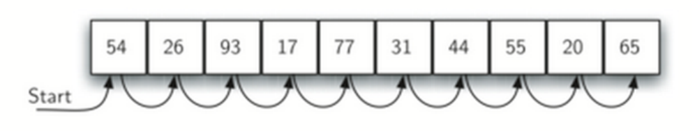

- 顺序查找只能在顺序表上进行吗❓

- 实现代码一

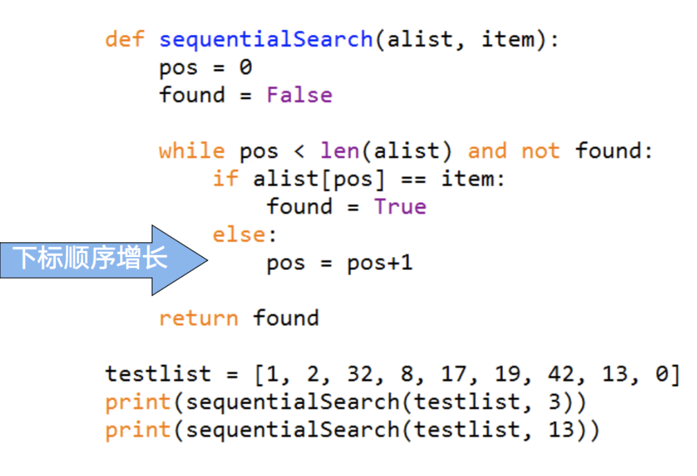

- 实现代码二

```python
def sequentialSearch(seq, target):
    """
    seq: 你的线性结构
    target: 查找目标
    """
    for elem in seq:
        if elem == target:
            return True
    else:
        return False

if __name__ == "__main__":
    testlist = [1,2,32,8,17,19,42,13,0]
    print(sequentialSearch(testlist, 3))
    print(sequentialSearch(testlist, 13))
```

### 算法分析

- 要对查找算法进行分析，首先要确定其中的基本计算步骤。回顾第二章算法分析的要点，这种基本计算步骤必须要足够简单，并且在算法中反复执行
- 在查找算法中，这种基本计算步骤就是进行数据项的比对
  - 当前数据项等于还是不等于要查找的数据项，比对的次数决定了算法复杂度
- 在顺序查找算法中，为了保证是讨论的一般情形，需要假定列表中的数据项并没有按值排列顺序，而是随机放置在列表中的各个位置
  - 换句话说，数据项在列表中各处出现的概率是相同的
- 数据项是否在列表中，比对次数是不一样的
  - 如果数据项不在列表中，需要比对所有数据项，则比对数是 n
  - 如果数据项在列表中，要比对的次数，其情况就较为复杂
    - 最好的情况，第 1 次比对就找到；最坏的情况，要 n 次比对

* 数据项在列表中，比对的一般情形如何？
  - 因为数据项在列表中各个位置出现的概率是相同的；
  - 所以平均状况下，比对的次数是 n/2；
* 所以，顺序查找的算法复杂度是 O(n)

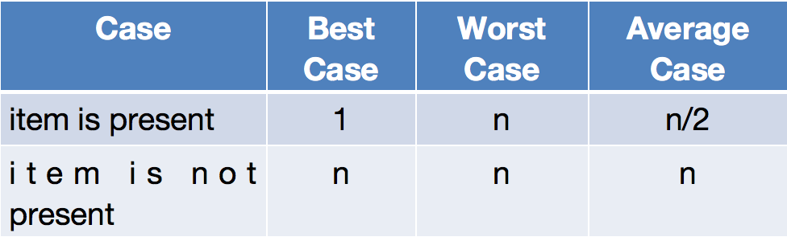

* 这里我们假定列表中的数据项是无序的，那么如果数据项排了序，顺序查找算法的效率又如何呢？

- 实际上，我们在第三章的有序表 Search 方法实现中介绍过顺序查找
  - 当数据项存在时，比对过程与无序表基本相同
  - 不同之处在于，如果数据项不存在，比对可以提前结束
    - 如下图中查找数据项 50，当看到 54 时，可知道后面不可能存在 50，可以提前退出查找

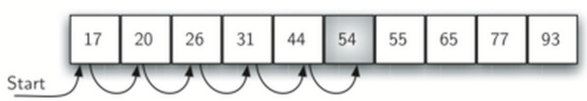

- 实现代码：顺序查找有序表

```python
def orderedSequentialSearch(ordered, target):
    for elem in ordered:
        if elem == target:
            return True
        elif elem > target:
            return False
    else:
        return False

if __name__ == "__main__":
  testlist = [0,1,2,8, 13, 17, 19, 32, 42 ]
  print(orderedSequentialSearch(testlist, 3))
  print(orderedSequentialSearch(testlist, 13))
```

```python

```

### 算法分析（有序表）

- 顺序查找有序表的各种情况分析

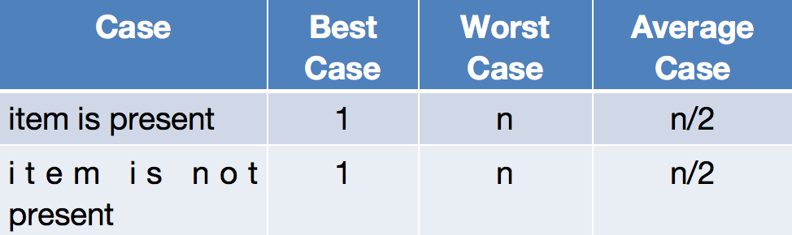

- 实际上，就算法复杂度而言，仍然是 O(n)
- 只是在数据项不存在的时候，有序表的查找能节省一些比对次数， 但并不改变其数量级。

## 二分查找

- 那么对于有序表，有没有更好的查找算法？
- 在顺序查找中，如果第 1 个数据项不匹配查找项的话，那最多还有n-1 个待比对的数据项
- 那么，有没有方法能利用有序表的特性，迅速缩小待比对数据项的范围呢？

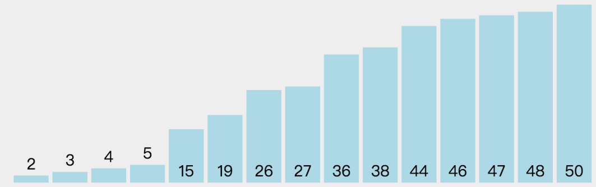

- 我们从列表中间开始比对！
  - 如果列表中间的项匹配查找项，则查找结束
  - 如果不匹配，那么就有两种情况：
    - 列表中间项比查找项大，那么查找项只可能出现在前半部分
    - 列表中间项比查找项小，那么查找项只可能出现在后半部分
  - 无论如何，我们都会将比对范围缩小到原来的一半：n/2
- 继续采用上面的方法查找
  - 每次都会将比对范围缩小一半

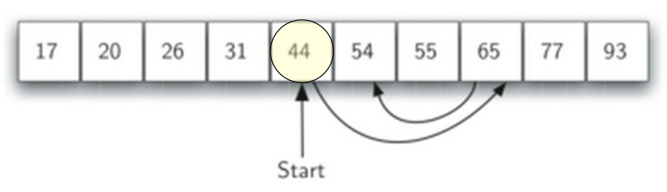

- 代码

```python
def binarySearch(alist, item):
    first, last = 0, len(alist)-1
    while first <= last:
        midpoint = (first + last) //2
        if alist[midpoint] == item:
            return True
        elif alist[midpoint] > item:
            last = midpoint -1
        else:
            first = midpoint + 1
    else:
        return False

if __name__ == "__main__":
    testlist = [0,1,2,8, 13, 17, 19, 32, 42 ]
    print(binarySearch(testlist, 3))
    print(binarySearch(testlist, 13))
```

- 同前面的顺序搜索相比较，二分搜索作用的对象有什么不同？
  - 在逻辑结构上，必须是有序（线性）表
  - **在存储结构上，必须是顺序表**

```python

```

### 分而治之（Divide & Conquer）

- 二分查找算法实际上体现了解决问题的另一个典型策略：分而治之
  - 将问题分为若干更小规模的部分
  - 通过解决每一个小规模部分问题，并将结果汇总得到原问题的解
- 显然，递归算法就是一种典型的分而治之策略，二分法也可以用递归算法来实现
- **slice 操作的复杂度是 O(N) 的，放在 O(logN) 的二分查找算法里面，整体复杂度也变成❓。实际使用中严重不可取！**

```python
def binarySearchRc(alist, item):
    if not alist:
        return False
    midpoint = len(alist) // 2
    if alist[midpoint] == item:
        return True
    elif alist[midpoint] > item:
        return binarySearchRc(alist[:midpoint], item)
    else:
        return binarySearchRc(alist[midpoint+1:], item)
```

### 算法分析

- 由于二分查找每次比对都将下一步的比对范围缩小一半
- 每次比对后剩余数据项如下表所示

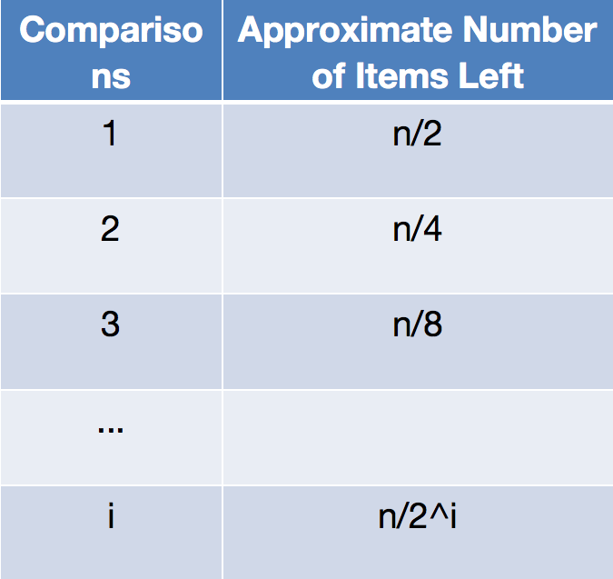

- 当比对次数足够多以后，比对范围内就会仅剩余 1 个数据项
- 无论这个数据项是否匹配查找项，比对最终都会结束，解下列方程：
    $$
    \frac{n}{2^i}=1 \Rightarrow  i=log_2{}(n)
    $$
- 所以二分法查找的算法复杂度是 O(log n)

### 主定理

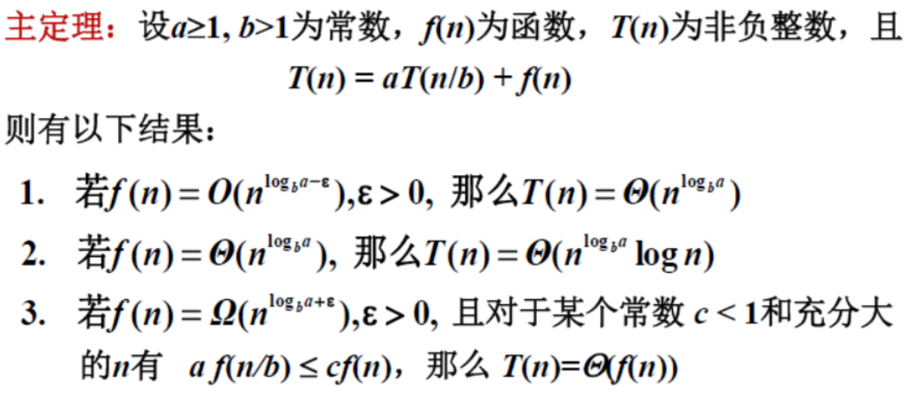

- 可分解为子问题的问题复杂度
  - 规模为n的问题可以分解为a个规模缩小b倍的子问题，分解成本为f(n)
- 对于二分查找问题：a=1, b=2, f(n)=O(1)
  - 套用主定理，我们可以马上知道二分查找的复杂度是 O(log n)
  - 如果在递归时使用了切片操作，则怎么运用主定理？

### 进一步的考虑

- 另外，虽然二分查找在时间复杂度上优于顺序查找
- 但也要考虑到对数据项进行排序的开销
  - 如果一次排序后可以进行多次查找，那么排序的开销就可以摊薄
  - 但如果数据集经常变动，查找次数相对较少，那么可能还是直接用无序表加上顺序查找来得经济
- 所以，在算法选择的问题上，光看时间复杂度的优劣是不够的，还需要考虑到实际应用的情况。
- “让发生的最多的事情最高效”

## 散列

- 前面我们利用数据集中关于数据项之间排列关系的知识，来将查找算法进行了提升。
  - 如果数据项之间是按照大小排好序的话，就可以利用二分查找来降低算法复杂度。
- 现在我们进一步来构造一个新的数据结构，能使得查找算法的复杂度降到 O(1)，这种概念称为“散列 Hashing”
- 能够使得查找的次数降低到常数级别，我们对数据项所处的位置就必须有更多的先验知识。
- 如果我们事先能知道要找的数据项应该出现在数据集中的什么位置，就可以直接到那个位置看看数据项是否存在即可。
- 由数据项的值来确定其存放位置，如何能做到这一点呢？

### 瑞幸想到的办法

- 根据订单号的最末一位，把咖啡放在对应的架子上！✌️
- 同学们找自己的咖啡，就方便多了。
- 进一步优化：每一格架子上的咖啡，按订单号又是一个 **有序表**


### 基本概念

- 散列表（hash table，又称哈希表）是一种数据集
  - 其中数据项的存储位置通过固定的映射函数获得，在查找定位时也可利用此函数获得 O(1) 的访问效率。
  - 散列表中的每一个可用于保存数据项的存储位置，称为槽（slot），每个槽用不同的编号来区别。
- 例如：一个包含 11 个槽的散列表，槽的编号分别为 0～10
  - 在插入数据项之前，每个槽的值都是 None，表示空槽
  - 实现从数据项到存储槽的转换的，称为散列函数（hash function）
  - 下面例子中，散列函数接受数据项作为参数，返回整数值 0～10，表示数据项存储的槽号

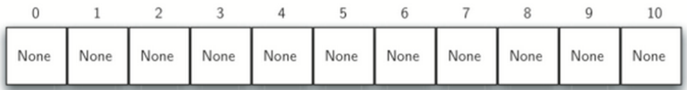

#### 示例

- 为了将数据项保存到散列表中，我们设计第一个散列函数
  - 数据项：54，26，93，17，77，31
- 有一种常用的散列方法是“求余数”，将数据项除以散列表的大小，得到的余数作为槽号。
  - 实际上“求余数”方法会以不同形式出现在所有散列函数里，因为散列函数返回的槽号必须在散列表大小范围之内，所以一般会对散列表size求余
  - 如果数据项不是整数怎么办？比如身份证号的最后一位有可能是’X’（非数项）
    - 字符和整数之间存在转换关系

* 本例中我们的散列函数是最简单的求余：
        $$ h(item)= item \bmod 11 $$

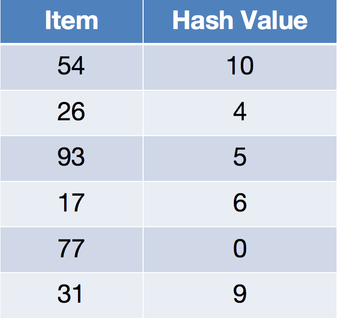

- 按照散列函数 h(item)，为每个数据项计算出存放的位置之后，就可以将数据项存入相应的槽中
- 例子中的 6 个数据项插入后，占据了散列表 11 个槽中的 6 个。
  - 槽被数据项占据的比例称为散列表的“负载因子”，这里负载因子为6/11
- 数据项都保存到散列表后，查找就变得无比简单
- 要查找某个数据项是否存在于表中，我们只需要使用同一个散列函数进行计算，用得到的槽号看对应的槽中是否是要我们要找的
  - 实现了 O(1) 时间复杂度的查找算法。
- 天底下没有免费的午餐，想想我们的代价是什么？

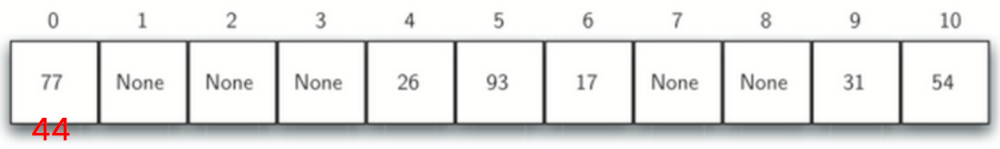

- 不过，你可能也看出这个方案的问题所在，这组数据相当凑巧，各自占据了不同的槽
- 假如再来一个数 44，h(44)=0，它跟 77 被分配到同一个 0# 槽中，这种情况称为“冲突 collision（碰撞）”，我们后面会讨论到这个问题
的解决方案。

### 完美散列函数：Perfect Hash Function

- 散列函数是一种离散函数
  - 定义域的大小 N；
  - 值域的大小 M，也等于散列表的容量；
  - 函数实际的输入个数 k，也等于散列表中存储的不同元素个数。
- 给定一组数据项，如果一个散列函数能把每个数据项映射到不同的槽中，那么这个散列函数就可以称为“完美散列函数”
  - 对于固定的一组数据 (k &lt; M)，总是能想办法设计出完美散列函数
  - 数据很少变动，且极为看重搜索效率的场合
- 但如果数据项经常性的变动，很难有一个系统性的方法来设计对应的完美散列函数。
  - 当然，冲突也不是致命性的问题，我们后面会有办法处理的。

* 获得完美散列函数的一种方法是扩大散列表的容量，大到等于数据项的值空间大小；用恒等函数来做散列函数，这样不同的数据项都能够占据不同的槽
* 但这种方法对于可能数据项范围过大的情况并不实用
  - 假如我们要保存手机号（11 位数字），完美散列函数得要求散列表具有百亿个槽！对于仅需要保存班级 100 名同学的手机号来说，浪费了太多空间
* 退而求其次的话，好的散列函数需要具备 3 个特性：冲突最少（近似完美）、计算难度低（额外开销小）、充分分散数据项（节约空间）

### 近似完美散列函数

- 除了用于在散列表中安排数据项的存储位置，散列技术还用在信息处理的很多领域。
- 由于完美散列函数能够对任何不同的数据生成不同的散列值，可以把散列值用作数据的“指纹”或者“摘要”
  - 由任意长度的数据生成长度固定的“指纹”，还要求具备唯一性，这在数学上是无法做到的，但设计巧妙的“准完美”散列函数却能在实用范围内做到这一点。
  - 离散函数 y= hash(x)，如果其 N 大于 M，根据鸽笼原理，肯定存在冲突：$x_1\neq{}x_2, hash(x_1)=hash(x_2)$
  - 但如果它的定义域和值域空间都非常“广阔”，实际取的 x 个数远远小于它们，那么冲突的可能性就“没有了”。
  - 尽管 N > M，只要 $k \ll M$，在计算机领域广泛当成“完美散列函数”来用。

### 完美散列函数应用于密码学领域

- 作为一致性校验的数据“指纹”函数还需要具备更多的特性
  - 压缩性：任意长度的数据，得到的“指纹”长度是固定的；
  - 易计算性：从原数据计算“指纹”很容易；而从指纹计算原数据实际上是不可能的；
  - 抗修改性：对原数据的微小变动，都会引起“指纹”的大改变；
  - 抗冲突性：
    - 弱抗冲突性：给定 Hashing 函数和一个数据项，很难找到另一个数据项，和原数据项具有相同的指纹
    - 强抗冲突性：给定 Hashing 函数，很难找到两个不同数据项，使它们具有相同的指纹
  - 讨论 Python 内置的哈希函数：hash()
    - 是不是近似完美的?
    - 满足上面的特性吗?

```python
hash(1)
```

```python
hash(18)
```

```python
hash('作为一致性校验的数据“指纹”函数还需要具备更多的特性')
```

```python
hash(-1), hash(-2)
```

```python
d = {-1: 'a', -2: 'b'}
print(d[-1], d[-2])
```

- Python 内置 `hash()` 函数返回值特性表

| 特性 | 描述 | 备注 |
| :--- | :--- | :--- |
| **返回类型** | `int` (有符号整数) | 始终返回 Python 的整型对象 |
| **数值范围** | 取决于机器字长（32位或64位） | 匹配底层 C 语言的 `Py_ssize_t` 类型 |
| **最大值** | `sys.maxsize` | 64位系统通常为 $2^{63}-1$ |
| **最小值** | `-sys.maxsize - 1` | 64位系统通常为 $-2^{63}$ |
| **特殊保留值** | **-1** 永远不会作为正常结果返回 | 若计算结果为 `-1`，系统会自动将其转为 `-2` |
| **稳定性（数字）** | 相同数值的数字哈希值固定且跨进程一致 | 例如 `hash(1)` 在任何时候运行都是 `1` |

#### 散列函数 MD5/SHA

- 最著名的近似完美散列函数是 MD5 和 SHA 系列函数
- MD5（Message Digest）将任何长度的数据变换为固定长为 128位（16 字节）的“摘要”
  - 128 位二进制已经是一个极为巨大的数字空间：据说是地球沙粒的数量
- SHA（Secure Hash Algorithm）是另一组散列函数
  - SHA-0/SHA-1 输出散列值 160 位（20 字节），
  - SHA-256/SHA-224 分别输出 256 位、224 位，
  - SHA-512/SHA-384 分别输出 512 位和 384 位
  - 160 位二进制相当于 $10^{48}$，地球上水分子数约为 $10^{47}$
  - 256 位二进制相当于 $10^{77}$，已知宇宙所有基本粒子大约为$10^{72\sim{}87}$ 
- 小明和小芳各从宇宙中挑一个原子，他们会不会挑到同一个原子？
- 虽然近年发现 MD5/SHA-0/SHA-1 三种散列函数，能够以极特殊的情况来构造个别碰撞（散列冲突）, 但在实用中从未有实际的威胁。
  - 王小云：提出了密码哈希函数的碰撞攻击理论，即模差分比特分析法，破解了包括 MD5、SHA-1 在内的 5 个国际通用哈希函数算法

### Python 的散列函数库 hashlib

- Python 自带 MD5 和 SHA 系列的散列函数库：hashlib
  - 包括了 md5/sha1/sha224/sha256/sha384/sha512 等 6 种散列函数

```python
import hashlib
print(hashlib.md5(b"hello world!").hexdigest())
print(hashlib.sha1(b"hello world!").hexdigest())
print(hashlib.sha256(b"hello world!").hexdigest())   # 比特币挖矿算法中常用
```

```python

```
