---
jupyter:
  jupytext:
    cell_metadata_filter: -all
    split_at_heading: true
    text_representation:
      extension: .md
      format_name: markdown
      format_version: '1.3'
      jupytext_version: 1.18.1
  kernelspec:
    display_name: Python 3 (ipykernel)
    language: python
    name: python3
---

<style>
/* 全局字体 */
body {
  font-size: 18px;
  line-height: 1.8;
  color: #333;
}

/* 标题 */
h1 {
  color: #2c7be5;
  border-bottom: 2px solid #eee;
  padding-bottom: 5px;
}

h2 {
  color: #e5533d;
}

h3 {
  color: #2fa84f;
}

/* 强调 */
.highlight {
  color: #d63384;
  font-weight: bold;
}

/* 提示框 */
.note {
  background: #f8f9fa;
  border-left: 5px solid #2c7be5;
  padding: 10px;
  margin: 10px 0;
}

/* 警告 */
.warning {
  background: #fff3cd;
  border-left: 5px solid #ffc107;
  padding: 10px;
}

/* 代码说明 */
.code-desc {
  color: #6c757d;
  font-size: 16px;
}

/* 1. 只选中第一级列表的文字，调整大小或颜色 */
ul > li, 
ol > li {
  font-size: 18px;          /* 把第一级放大到 20px */
  font-weight: bold;        /* 把第一级加粗（也可以不加） */
  color: #2c7be5;           /* 给第一级换个颜色，比如蓝色 */
}

/* 2. 关键：把第二级及更深层级的列表恢复成全局默认字体样式 */
ul ul li, 
ol ol li, 
ul ol li, 
ol ul li {
  font-size: 18px;          /* 恢复成你全局定义的 18px */
  font-weight: normal;      /* 恢复常规粗细 */
  color: #333;              /* 恢复全局的深灰色 */
}

</style>

# Ch07. 树及算法

[Home]( README.md )

## 本章目标

  

- 理解树数据结构及其应用
- 树用于实现 ADT Map
- 用列表来实现树
- 用类和引用来实现树
- 以递归方式实现树
- 用堆来实现优先队列

## 树的例子

在学习了栈、队列等线性数据结构，以及递归算法之后, 本章我们来讨论一种基本的“非线性”数据结构——树；

- 树在计算机科学的各个领域中被广泛应用
    - 操作系统、图形学、数据库管理系统、计算机网络
- 数据结构“树” 也分为：根、枝和叶三个部分
    - 跟自然界中的树一样，
    - 不同的是，习惯把树画成倒的：根放在上方，叶放在下方
- 本质是特定的“前驱/后继” 关系：
    - 除根结点之外，每个结点有且仅有一个直接前驱结点
    - 每个结点有零到多个直接后继结点；或者说除叶结点之外，每个结点有一到多个直接后继结点
    - 也可以叫“父/子” 或“祖先/后代” 关系

### 物种分类树

  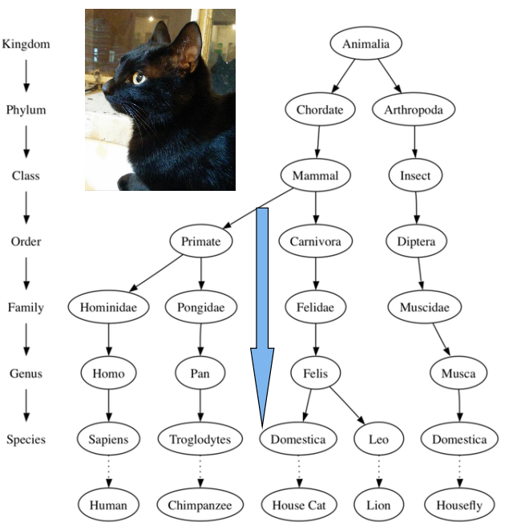

- 特征一：层次化
    - 越接近顶部的层越普遍
    - 越接近底部的层越独特
    - 林奈分类系统: 域、界、门、纲、目、科、属、种；看看我们自己：
        - 真核生物域 $\rightarrow$ 动物界 $\rightarrow$ 脊索动物门 $\rightarrow$ 哺乳纲 $\rightarrow$ 灵长目 $\rightarrow$ 人科 $\rightarrow$ 人属 $\rightarrow$ 智人。
- 分类树的用法：辨认物种
    - 从顶端开始，沿着箭头方向向下
    - 门：脊索动物还是节肢动物？
    - 纲：哺乳动物么？
    - 目：食肉动物？
    - 科：猫科？
    - 属：猫属？
    - 种：家猫！

* 特征二：隔离性/独立性
    - 一个结点的子结点与另一个结点的子结点相互之间是隔离、独立的
    - 猫属 Felis 和蝇属 Musca 下面都有 Domestica 的同名结点，但相互之间并无任何关联，可以修改其中一个 Domestica 而不影响另一个。
* 特征三：唯一性
    - 每一个叶结点都具有唯一性
    - 可以用从根开始到达每个种的完全路径来唯一标识每个物种
    - 动物界-> 脊索门-> 哺乳纲-> 食肉目-> 猫科-> 猫属-> 家猫种
    - Animalia->Chordate->Mammal->Carnivora->Felidae->Felis->Domestica

### 更多树的例子

- Linux 文件系统

  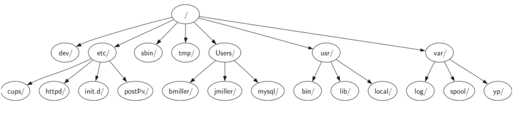

- Windows 文件系统

  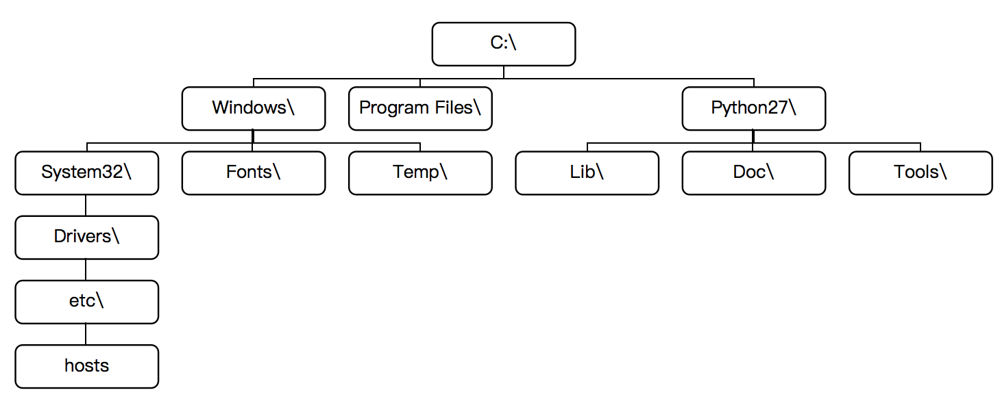

- HTML 文档（嵌套标记）

  

  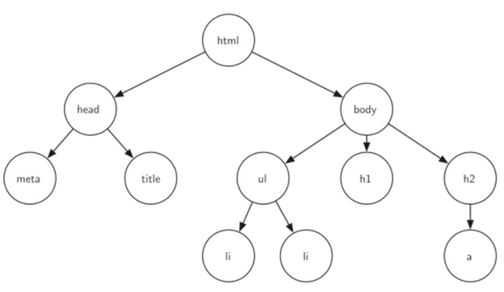

- 域名体系

  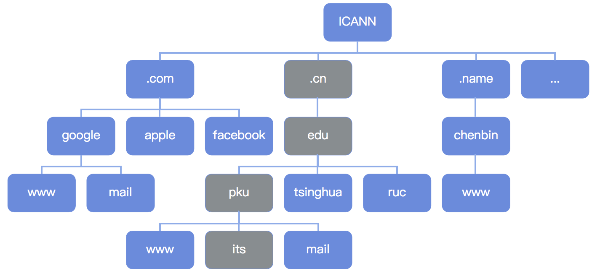

## 实现树

虽然现实世界中的关系往往是多叉的（如文件系统、组织架构），但计算机科学却偏爱二叉树，其原因可以概括为以下几个核心维度：

1. 逻辑上的基础地位：万物皆可转二叉
    - 任何一棵普通树或森林，都可以通过“左孩子右兄弟”表示法（Left-Child Right-Sibling Representation）唯一地转换为一棵二叉树。
2. 极高的搜索效率：平衡与效率的平衡
    - 二叉树最重要的应用之一是二叉搜索树（BST）。
    - 二叉查找树是理解高级多叉查找树（如 B 树、B+ 树）的基石。
    - 在内存中多用二叉树（AVL树，红黑树）；在磁盘中多用（多叉）树（B树、B+树）
3. 递归属性与算法之美
    - 遍历算法：前序、中序、后序遍历为解决复杂的递归问题提供了标准范式。
    - 分治思想：二叉树是分治法（Divide and Conquer）最直观的体现，很多复杂算法（如快速排序、归并排序）的执行轨迹本质上就是一棵二叉树。
4. 特殊应用场景的不可替代性
    - 许多高效的数据结构本质上都是二叉树的变体
    - 堆（Heap），哈夫曼树（Huffman Tree）

《树及算法》后面课堂上讲的主要是二叉树。

### 术语与定义

#### 基本概念

- 结点 Node
    - 组成树的基本部分
    - 每个结点具有名称，或“键值”，结点还可以保存额外数据项，数据项根据不同的应用而变
- 边 Edge
    - 边是组成树的另一个基本部分
    - 每条边恰好连接两个结点，表示结点之间具有关联，边具有出入方向；
    - 每个结点（除根结点外）恰有一条来自另一结点的入边；
    - 每个结点可以有零条/一条/多条连到其它结点的出边。
        - 如果加限制不能有“多条边”，这里树结构就特殊化为线性表
- 根Root
    - 树中唯一一个没有入边的结点
- 路径 Path
    - 由边依次连接在一起的结点的有序列表
    - 如：哺乳纲 → 食肉目 → 猫科 → 猫属，是一条路径


#### 结点之间的关系

- 子结点 Children
    - 入边均来自于同一个结点的若干结点，称为这个结点的子结点
- 父结点 Parent
    - 一个结点是其所有出边所连接结点的父结点
- 兄弟结点 Sibling
    - 具有同一个父结点的结点之间称为兄弟结点
- 子树 Subtree
    - 一个结点和其所有子孙结点，以及相关边的集合

  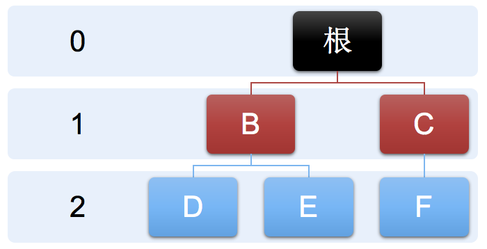

#### 结点的度、层级与树的高度

* 一个结点的子结点的数量，称为该结点的“度”
* 叶结点 Leaf Node
    - 没有子结点的结点称为叶结点
* 层级 Level
    - 从根结点开始到达一个结点的路径，所包含的边的数量，称为这个结点的层级。
    - 如 D 的层级为 2，根结点的层级为 0
    - 右图中的树有 3 层，分别是第0、第1、第2层。
* 高度 Height
    - 树中所有结点的最大层级称为树的高度
    - 右图中树的高度为 2

#### 树的定义

##### 定义一

- 树由n（n ≥ 0) 个结点，以及连接两个结点的边组成，并具有如下性质：
    - 边表示了一种“父子”关系：“父”是“子”的前驱
    - 唯一没有“父”的结点被设定为根结点；
    - 根以外的每个结点都“恰有”一条来自“父”的边
    - 每个结点从根开始的路径是唯一的
    - 每个结点可以有 0 或多个“子”；如果仅有左右两个子结点，则这样的结构称为“二叉树binary tree”
    - 当n=1，唯一的结点是根结点时，称树为一棵 **平凡树**
- “树”和“二叉树”是两种相似而不相同的逻辑结构
    - “树”只定义了一种“父子”关系；而“二叉树”定义了两种“父子”关系
    - 二者形式化表述的差别：树T = (D, R)；而二叉树B = (D, {L, R})

  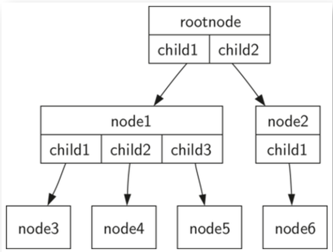

##### 定义二

采用递归的方式定义树，在下面的嵌套列表法中马上用到。
- 树“约定” 为：
    - 空集合（实现为`[]`，而不是
None）称为空树；
    - 或者由根结点及0或多个子树构成
    - 子树也是树，并且非空
        - 二叉树的子树可以是空二叉树
    - 每个子树的根到根结点具有边相连。
    - 空树或空二叉树没有树根
    - 平凡树实现为`[root, [], []]`

  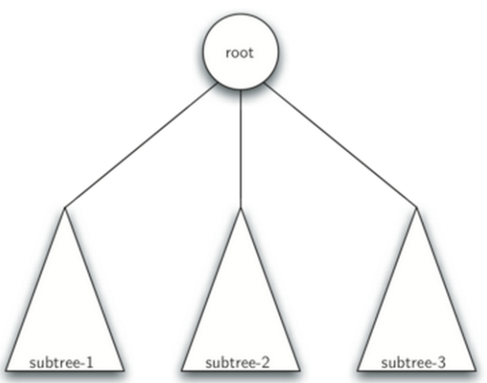

#### 二叉树

因为“二叉树” 与“树” 的关系，可以沿用大部分树的术语
- 二叉树结点的“度”
    - 该结点非空子结点的数量，0 度/1 度/2 度结点
    - 在不引起混淆的情况下，往往把“非空” 两个字省掉
    - 例题：某二叉树共 101 个结点，其中度数为 1 的结点数有 30 个，问度数为 0 的结点有几个?
        - 小窍门：二叉树的 0 度结点总比 2 度结点多 1。

##### 特殊二叉树

- 满二叉树
    - 定义：无 1 度结点，Full/Strict Binary Tree

    ```
           x
         /   \
        /     \
       x       x
      / \ 
     x   x 
        / \
        x x 
    ```
    - 国内传统定义：每一层都放满结点 2k（k 为层级数），Perfect Binary Tree

    ```
           x
         /   \
        /     \
       x       x
      / \     / \
     x   x   x   x
    / \ / \ / \ / \
    x x x x x x x x
    ```

- 完全二叉树：Complete Binary Tree
```
       x
     /   \
    /     \
   x       x
  / \     / \
 x   x   x   x
/ \ /
x x x
```

### 嵌套列表法

我们用 Python List 来实现二叉树树数据结构；递归的嵌套列表实现二叉树，由具有 3 个元素的列表实现：
- 第 1 个元素为根结点的值；
- 第 2 个元素是左子树（用列表表示）；
- 第 3 个元素是右子树。

以下图的示例，一个 6 结点的二叉树

- 用下标 0、1、2 分别访问 myTree 的树根、左子树、右子树
- 用“[]”空树为不存在的子树占位

  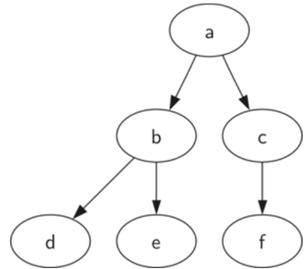

  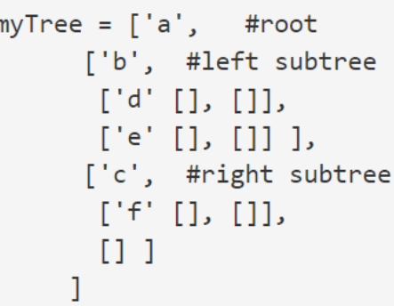

- 嵌套列表法的优点
    - 子树的结构与树相同，是一种递归结构
    - 可以很容易扩展到多叉树，仅需要增加列表元素即可


我们通过定义一系列函数来辅助操作嵌套列表
- BinaryTree 创建仅有根结点的二叉树

    ```python
    def BinaryTree(r, left=[], right=[]):
        return [r, left, right]
    ```
    - insertLeft/insertRight 将新结点插入树中作为 root 直接的左/右子结点，
        - 原来的左/右子结点变为新结点的左/右子结点。
        - 没有特别的原因，一种实现方式而已

    ```python
    def insertLeft(root, newBranch):
        root[1] = BinaryTree(newBranch, left=getLeftChild(root))
        return root

    def insertRight(root, newBranch):
        root[2] = BinaryTree(newBranch, right=getRightChild(root))
        return root
    ```
- get/setRootVal 则取得或返回根结点

    ```python
    def getRootVal(root):
        return root [0]
    def setRootVal (root, newVal):
        root[0] = newVal
    ```
- getLeft/RightChild 返回左/右子树

    ```python
    def getLeftChild(root):
        return root[1]
    def getRightChild(root):
        return root[2]
    ```
没有为 BinaryTree 设计 class 来实现

- 完整代码

```python
def BinaryTree(r, left=[], right=[]):
    return [r, left, right]

def insertLeft(root, newBranch):
    root[1] = BinaryTree(newBranch, left=getLeftChild(root))
    return root

def insertRight(root, newBranch):
    root[2] = BinaryTree(newBranch, right=getRightChild(root))
    return root

def getRootVal(root):
    return root [0]

def setRootVal (root, newVal):
    root[0] = newVal

def getLeftChild(root):
    return root[1]

def getRightChild(root):
    return root[2]
```

#### 算法示例

```python
if __name__=="__main__" :
    r = BinaryTree(3)
    insertLeft(r, 4)
    insertLeft(r, 5)
    insertRight(r, 6)
    insertRight(r, 7)
    l = getLeftChild(r)
    print(l)

    setRootVal(l, 9)
    print(r)
    insertLeft(l, 11)
    print(r)
    print(getRightChild(getRightChild(r)))
```

- 请通过图示讲解操作

  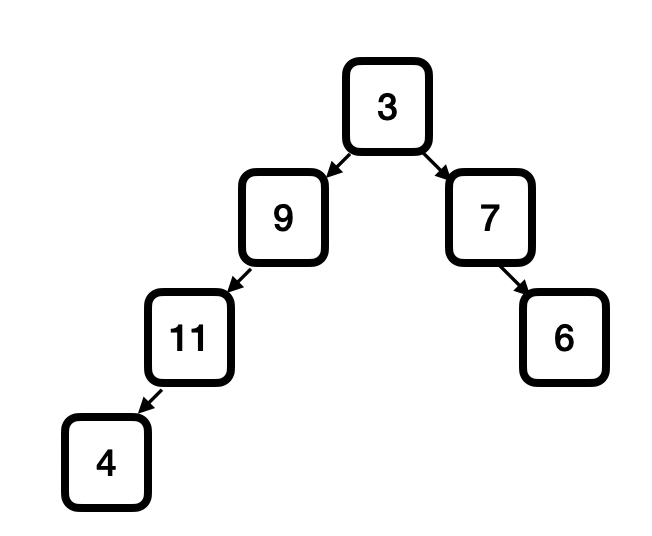

### 结点链接法

  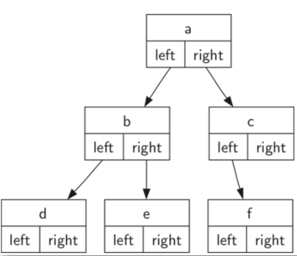

同样可以用类似链表的结点链接法来实现树。每个结点保存该结点的数据项，以及指向左右子树的链接

- 定义一个 BinaryTree 类
    - 成员 key 保存根结点数据项
    - 成员 left/rightChild 则保存指向左/右子树的引用（同样是BinaryTree 对象）
    - 树和结点使用同一个类来实现

- insertLeft/Right 方法
    - 实现逻辑与嵌套列表法相同。

```python
class BinaryTree:
    def __init__(self, rootObj, left=None, right=None): 
        self.key = rootObj
        self.leftChild = left
        self.rightChild = right

    def insertLeft(self, newNode):
        self.leftChild = BinaryTree(newNode, left=self.leftChild)

    def insertRight(self, newNode):
        self.rightChild = BinaryTree(newNode, right=self.rightChild)

    def getRightChild(self):
        return self.rightChild;

    def getLeftChild(self):
        return self.leftChild

    def setRootVal(self, obj):
        self.key = obj

    def getRootVal(self):
        return self.key

    def _print(self, is_left, offset, depth, buf, label):
        b = "{:^5}".format(label(self))
        width = 5
        while len(buf)<2*depth+1:                #让后面的buf[2*depth]访问有效
            buf.append([])
        left  = self.leftChild._print(True, offset,                depth + 1, buf, label) if self.leftChild else 0;
        right = self.rightChild._print(False, offset + left + width, depth + 1, buf, label) if self.rightChild else 0;

        enlarge = offset+left+width+right-len(buf[2*depth])
        buf[2*depth].extend([' ']*enlarge)
        for i, c in enumerate(b):               #输出子树根节点的内容
            buf[2*depth][offset+left+i] = c
            
        if depth > 0:                          #输出子树与其父节点的连线
            if is_left:
                enlarge = offset+left+2*width+right-len(buf[2*depth-1])
                buf[2*depth-1].extend([' ']*enlarge)
                for i in range(width+right):
                    buf[2 * depth - 1][offset + left + width//2 + i] = '-'
                buf[2 * depth - 1][offset + left + width//2] = '+';
                buf[2 * depth - 1][offset + left + width//2 + right + width] = '+';
            else:
                enlarge = offset+left+width+right-len(buf[2*depth-1])
                buf[2*depth-1].extend([' ']*enlarge)
                for i in range(left+width):
                    buf[2 * depth - 1][offset - width//2 + i] = '-';
                buf[2 * depth - 1][offset + left + width//2] = '+';
                buf[2 * depth - 1][offset - width//2 - 1] = '+';
        return left + width + right;

    def print(self, label=lambda x:x.key):
        """
        在命令行下打印树。
        树结构需要采用节点链接法来实现。
        用label来选择用来代表节点的内容。
        """
        buf = []
        self._print(True, 0, 0, buf, label)
        for l in buf:
            print(''.join(l))

LinkedNode = BinaryTree

```
#### 算法示例

```python
if __name__ == "__main__":
    r = BinaryTree('a')
    r.insertLeft('b')
    r.insertRight('c')
    r.getRightChild().setRootVal('hello')
    r.getLeftChild().insertRight('d')    
    r.print()
```

- 请画出r的图示

<details>
<summary> 答案 </summary>

  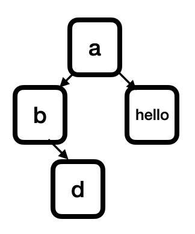

</details>

## 二叉树应用

### 解析树 Parse Tree

#### 语法树

将树用于表示语言中句子，可以分析句子的各种语法成分，对句子的各种成分进行处理
- 语法分析树
    - 主谓宾，定状补
- 程序设计语言的编译
    - 词法、语法检查
    - 从语法树生成目标代码
- 自然语言处理
    - 机器翻译、语义理解

  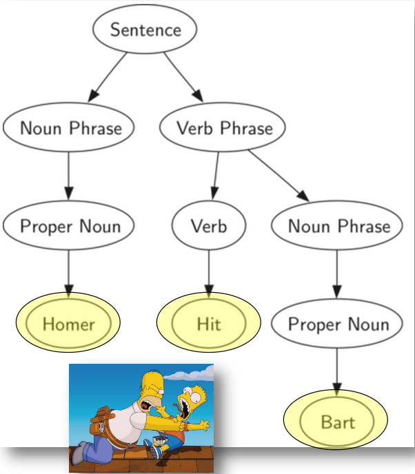

#### 建立表达式树

表达式的几种形式：前缀、中缀、后缀、全括号之外，我们还可以将表达式表示为树结构

- 叶结点保存操作数，内部结点保存操作符
    - **全括号表达式** `((7+3)*(5-2))`
    - 由于括号的存在，需要计算`*` 的话，就必须先计算 `7+3` 和 `5-2`
    - 表达式树清晰地表达了运算的层次结构
    - **越底层** 的表达式，优先级越高
    - 全括号表达式转表达式树相对简单，我们用它来做例子
    - 如果是一般的中缀表达式转表达式树，则需要使用调度场算法基础上的双栈法（一个操作数栈，一个运算符栈）
- 树中每个子树都表示一个子表达式
    - 将子树替换为子表达式值的结点，即可实现求值
- 得到了表达式树之后，生成它的前缀/后缀/中缀表示都异常简单

  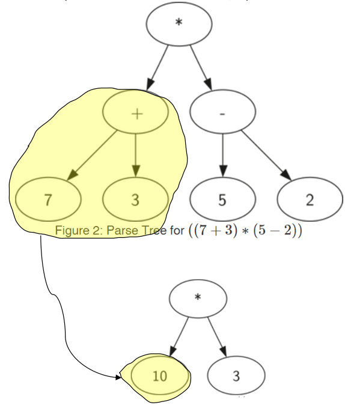

下面我们从全括号表达式开始，用树结构来做如下尝试
- 构建表达式解析树
- 表达式解析树求值
- 表达式树恢复原表达式（课下练习）


##### 算法思路

- 得到单词列表
    - 首先全括号表达式要分解为单词 Token 列表
    - 其单词分为括号“（）”、操作符“+-*/”和操作数“0～9”这几类
    - 左括号就是表达式的开始，而右括号是表达式的结束
- 建树规则
    - 一棵表达式树的根、左子树、右子树分别对应它最后或最上一个操作的操作符、左操作数/子树和右操作数/子树。
    - 从左到右扫描全括号表达式的每个单词，依据规则建立解析树
        - 如果当前单词是"("：为当前结点添加一个新结点作为其左子结点，当前结点下降为这个新结点，准备接收左操作树/子树。
        - 如果当前单词是操作符['+','-','/','*']：将当前结点的值设为此符号，为当前结点添加一个新结点作为其右子结点，当前结点下降为这个新结点，准备接收右操作数/子树。
        - 如果当前单词是操作数，则接收操作数：将当前结点的值设为此数，当前结点上升返回到父结点
        - 如果当前单词是")"：则当前结点上升返回到父结点

##### 图示 

输入全括号表达式：`(3+(4*5))`
- 分解为单词表
```python
fplist = ['(', '3', '+', '(', '4', '*', '5', ')', ')']
```

- 创建表达式解析树过程
    - 创建空树，当前结点为根结点
    - 读入'('，创建了左子结点，当前结点左下降
    - 读入'3'，当前结点设置为3，上升到父结点
    - 读入'+'，当前结点设置为+，创建右子结点，当前结点右下降

    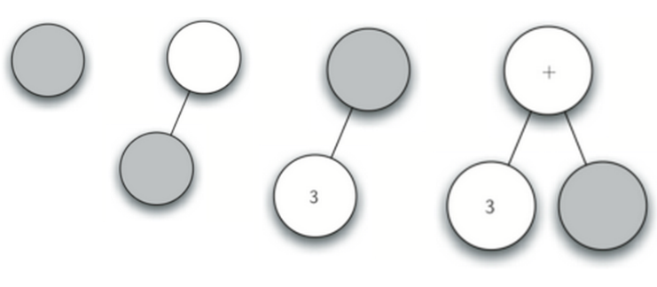

    - 读入'('，创建左子结点，当前结点左下降
    - 读入'4'，当前结点设置为4，上升到父结点
    - 读入'\*'，当前结点设置为\*，创建右子结点，当前结点右下降
    - 读入'5'，当前结点设置为5，上升到父结点
    - 读入')'，上升到父结点。

    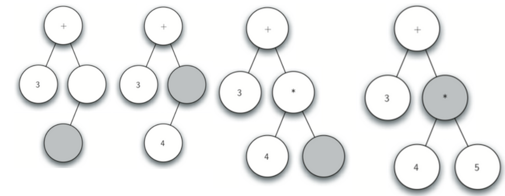

- ⚠️ 细节
    - 最外面的闭括号其实是没用的，处理不好反而带来程序bug

* 关键操作
    - 当前结点创建左右子树，可以调用BinaryTree.insertLeft/Right
    - 当前结点设置值，可以调用BinaryTree.setRootVal
    - 当前结点下降到左右子树，可以调用BinaryTree.getLeft/RightChild
    - **如何从当前结点上升到父结点?！于是我们可以用一个栈来记录、跟踪父结点**
        - 当前结点下降时，将下降前的结点push入栈
        - 当前结点需要上升到父结点时，上升到pop出栈的结点即可！

##### 代码 

- 输入表达式中单词需用空格分开

```python
def buildParseTree(fpexp):                 #full parentheses
    """
    把全括号形式的表达式转成二叉树结构
    """
    fplist = fpexp.split()                 #分解单词：输入表达式中单词需用空格分开
    pStack = []                            #python list是多面手，可以把它当栈用。
    currentTree = eTree = BinaryTree('')   #创建一棵平凡树，根的key值为空串
    for i in fplist[:-1]:                   #最外面的闭括号其实是没用的，丢掉。
        if i=="(":                         #子表达式开始
            currentTree.insertLeft('')
            pStack.append(currentTree)     #入栈左下降
            currentTree = currentTree.getLeftChild()
        elif i in ['+', '-', '*', '/']:    #操作符
            currentTree.setRootVal(i)
            currentTree.insertRight('')
            pStack.append(currentTree)     #入栈右下降
            currentTree = currentTree.getRightChild()
        elif i == ')':                     #子表达式结束
            currentTree = pStack.pop()
        elif ord('0')<= ord(i)<= ord('9'): #操作数
            currentTree.setRootVal(int(i))
            currentTree = pStack.pop()     #出栈上升
        else:
            raise ValueError
    return eTree

if __name__ == "__main__":
    tree = buildParseTree("( 5 + ( 9 * 2 ) )")
    tree.print()
```

- 栈深度的变化

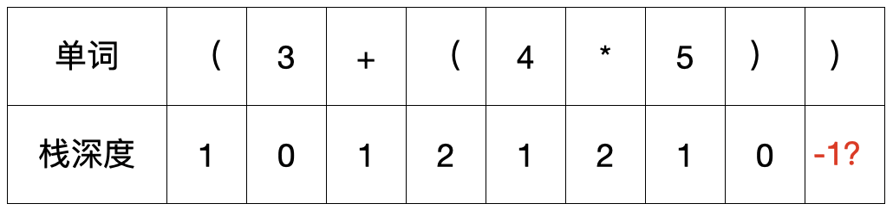


#### 表达式树求值

##### 思路 

创建了表达式解析树之后，我们可以用来进行表达式求值。
由于BinaryTree是一个递归数据结构，自然地，可以用递归算法来处理BinaryTree，包括求值函数evaluate。
- 递归过程：
    - 可以从树的底层子树开始，逐步向上层求值，最终得到整个表达式的值
- 递归三要素：
    - 基本结束条件：叶结点是最简单的子树，没有左右子结点，其根结点的数据项即为子表达式树的值
    - 缩小规模：将表达式树分为左子树、右子树，即为缩小规模
    - 调用自身：分别调用evaluate计算左子树和右子树的值，其基本操作是将左右子树的值依根结点的操作符进行计算，从而得到表达式的值


* 一个增加程序可读性的技巧：函数引用

```python
import operator
op = operator.add
op(1, 2)
```

##### 代码 

```python
import operator
opers = {'+':operator.add, '-':operator.sub, 
        '*':operator.mul, '/':operator.truediv}

def evaluate(parseTree):                   #递归法实现
    leftC = parseTree.getLeftChild()       #取子树，缩小规模
    rightC = parseTree.getRightChild()
    
    if leftC and rightC:
        fn = opers[parseTree.getRootVal()] 
        return fn(evaluate(leftC), evaluate(rightC))   #递归调用
    else:
        return parseTree.getRootVal()      #基本结束条件
    

if __name__ == "__main__":
    tree = buildParseTree("( 5 + ( 9 * 2 ) )")
    tree.print()
    print(evaluate(tree))

```

### 哈夫曼树

哈夫曼树（Huffman Tree），又称最优二叉树，是一种带权路径长度（WPL）最短的二叉树。在信息检索和数据压缩（如 ZIP 压缩、JPEG 编码）中有着举足轻重的地位。

在计算机科学中，字符编码（Character Encoding）是连接“人类文字”与“二进制数字”的桥梁，它定义了两者之间的映射关系。
我们以字符编码问题为例来进行说明。

#### 定长编码

所有字符编码成等长的二进制0/1序列
- 例子：
    - 下图中“林妹妹哭哭哭哭哭哭了”，每个字符采用两个bit进行编码。
    - 编码后的串长度为20bits

    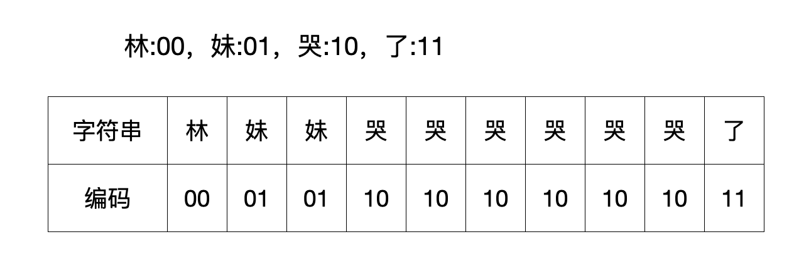

- unicode编码
    - 现实中的unicode采用的就是这种方式每个字符都编码成4bytes(32bits)
    - ASCII、中文字符，考虑了世界上绝大多数语言的字符
    - 优点：所有字符采用统一的编码长度，处理比较方便。
        - 可以通过内存地址计算，直接定位到中间任一字符
    - 缺点：空间太浪费了，每一个ASCII字符：1byte $\Rightarrow$ 4bytes

####  不定长编码

- 前缀码
    - 所有符号串之间互不为前缀
    - 编码的符号串会连在一起使用，这样才能避免歧义

- 例子：
    - 字符编码成不等长的0/1序列
    - “林妹妹哭哭哭哭哭哭了”编码长度为16bits

    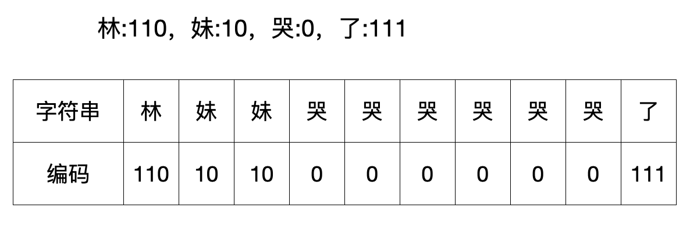

- 诀窍：让出现的最多的字符使用最短的编码
    - 林:1，妹:2，哭:6，了:1

#### 哈夫曼编码树

- 编码目标
    - 所有的$m$个编码字符放在二叉树的叶结点上
    - 左子边标为0；右子边标为1
    - 从根到叶结点路径上的标记连起来就是字符对应的编码
    - 叶结点中的数字$w_i$表示字符的频率；
    - 叶结点的层级为$l_i$，它同时也是编码字符i使用的比特数
    - 中间结点的数字表示子树中所有叶结点的频率和
    - 编码后文本的总长度为WPL，目标是使它最小

$$
WPL=\sum_{i=1}^{m}{w_i{}l_i}
$$

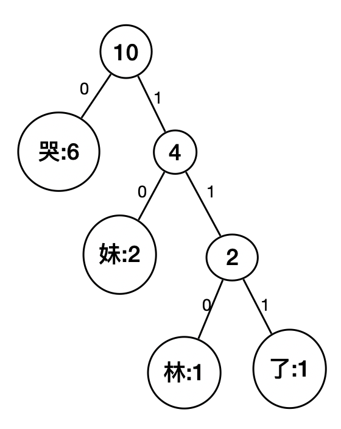

##### 编码思路

- 贪心法
    - 让常见的字符使用最短的编码；
    - 反过来看，也就是让罕见的字符使用最长的编码，处在树的最底端
- 步骤
    1. 为每个字符构造一棵平凡树放入集合中
    2. 从集合中取出w最小的两个树作为左右子树，组成新树；
    3. 新树根结点的w为它们w的和；
    4. 把新树放回集合
    5. 回到步骤2.直到集合中只有一个元素

- 细节
    - 需要从集合中取最小值，我们用优先队列实现
    - 使用嵌套列表法表示二叉树，每个树结点上存放元组`(权重,字符)`，中间结点的字符为空串

python堆队列的使用

```python
import heapq

# 1. 初始化
data = [5, 1, 9, 3, 2]
heapq.heapify(data) # 原地转换为最小堆: [1, 2, 9, 3, 5]

# 2. 插入元素
heapq.heappush(data, 0)

# 3. 弹出最小值
smallest = heapq.heappop(data) 
print(f"最小值为: {smallest}") # 输出: 0

# 4. 查看当前堆顶（不弹出）
peek = data[0]
print(peek)
```

##### 代码

- 哈夫曼建树

```python
import heapq
from typing import List, Tuple
def haffmanTree(alist: List[Tuple[str, int]]): 
    # 建立多棵平凡树的集合，每棵平凡树以字符元素为根
    forest = [[(item[1], item[0]), [], []] for item in alist]
    heapq.heapify(forest)
    while len(forest) >= 2 :                    
        #取出两个最小的元素， 
        left, right = heapq.heappop(forest), heapq.heappop(forest) 
        #组成一个新的元素插入优先队列
        heapq.heappush(forest, [(left[0][0]+right[0][0], ""), left, right])
    else:
        return heapq.heappop(forest)                        #返回唯一的元素
```

- 输出哈夫曼编码

```python
def _printCode(haff, path):
    if haff[1]==[] and haff[2]==[]: 
        #字符所在的叶节点
        print(haff[0][1], ':', ''.join(path))
    else: #修改path，对左右子树进行递归调用
        _printCode(haff[1], path+['0'])
        _printCode(haff[2], path+['1'])

def printCode(haff):
    curr = haff
    path = []    #用一个栈来保存路径
    _printCode(curr, path)
    
if __name__ == "__main__":
    l = [("林",1),("妹",2),("哭",6),("了",1)]
    haff = haffmanTree(l)
    print("haff={}".format(haff))
    printCode(haff)
```


- 随堂练习


    - www.cncorpus.org网站从2000万字的现代汉语语料中统计了5708个汉字字频。
        我们从中等间距抽取了12个汉字及字频，请为它们构建Haffman树并写出它们的编码。

        序号 | 汉字 | 字频 | 序号 | 汉字 | 字频 
        --- | ---- | --- | --- | --- | ----
        1 | 的 | 759834 | 3001 | 秤 | 150 
        501 | 维 | 6485 | 3501 | 啧 | 84 
        1001 | 损 | 2330 | 4001 | 铿 | 80
        1501 | 厅 | 1084 | 4501 | 桕 | 70 
        2001 | 氛 | 528 | 5001 | 珙 | 60
        2501 | 聘 | 291 | 5501 | 妣 | 12 

    - 简单一点：编码a(3),b(4),c(9),d(12),e(15),f(20)字符集，
        - 括号中的数字为字符出现的频率。
    - 计算编码的文本总长度WPL(也称哈夫曼树的加权路径长度）
        - 哈夫曼编码不唯一，但WPL是唯一的

## 二叉树的遍历

- 遍历Traversal
    - 对某一数据结构中的所有元素逐个访问的操作称为“遍历Traversal”
    - 线性数据结构中遍历操作比较简单直接，
- 树的非线性特点，使得遍历操作较为复杂
    - 我们按照对结点访问次序的不同来区分3种遍历
    - **前序遍历（preorder）**：先访问根结点，再递归地前序访问左子树、最后前序访问右子树； 也叫先根遍历
    - **中序遍历（inorder）**：先递归地中序访问左子树，再访问根结点，最后中序访问右子树； 也叫中根遍历
    - **后序遍历（postorder）**：先递归地后序访问左子树，再后序访问右子树，最后访问根结点； 也叫后根遍历
    - “前”、“中”、“后”，都是针对根结点来说的。


### 前序遍历的例子

一本书的章节阅读

- Book$\rightarrow$ Ch1$\rightarrow$ S1.1$\rightarrow$ S1.2$\rightarrow$ S1.2.1$\rightarrow$ S1.2.2$\rightarrow$
- Ch2$\rightarrow$ S2.1$\rightarrow$ S2.2$\rightarrow$ S2.2.1$\rightarrow$ S2.2.2

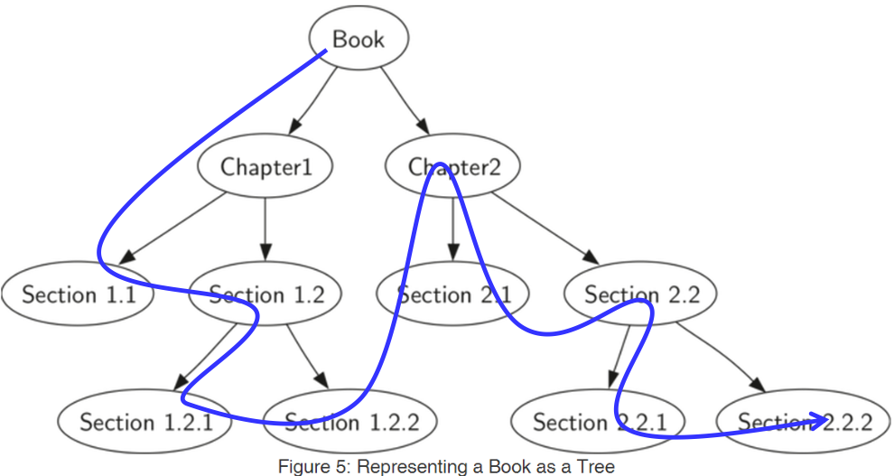


### 递归算法代码


树遍历的代码非常简洁！后序遍历和中序遍历的代码仅需要调整语句顺序：

* 对于嵌套列表法实现的二叉树

```python
def preorder(tree):
    if tree:
        print(tree.getRootVal())
        preorder(tree.getLeftChild())
        preorder(tree.getRightChild())

def postorder(tree):
    if tree:
        postorder(tree.getLeftChild())
        postorder(tree.getRightChild())
        print(tree.getRootVal())

def inorder(tree):
    if tree:
        inorder(tree.getLeftChild())
        print(tree.getRootVal())
        inorder(tree.getRightChild())
```

- 对于BinaryTree类实现的二叉树
    - 需要加入子树是否为空的判断
    ```python
    def preorder(self):
        print(self.key)
        if self.leftChild:
            self.leftChild.preorder()
        if self.rightChild:
            self.rightChild.preorder()
    ```


### 后序遍历：表达式求值 

回顾前述的表达式解析树求值，实际上也是一个后序遍历的过程，只是代码没有明显表现出遍历的次序。

- 采用后序遍历法重写表达式求值代码：

```python
import operator 

opers = {'+':operator.add, '-':operator.sub,
         '*':operator.mul, '/':operator.truediv}

def postordereval(tree):
    if tree:
        left = postordereval(tree.getLeftChild())
        right = postordereval(tree.getRightChild())
        if left and right:
            return opers[tree.getRootVal()](left, right)
        else:
            return tree.getRootVal()
    else:
        return None

if __name__ == "__main__":
    tree = buildParseTree("( 5 + ( 9 * 2 ) )")
    tree.print()
    print(postordereval(tree))

```

### 中序遍历：全括号表达式 

- 采用中序遍历递归算法来生成全括号中缀表达式

```python
def fpexp(tree):
    """
    全括号表达式
    """
    if tree:
        left = fpexp(tree.getLeftChild())
        right = fpexp(tree.getRightChild())
        if left and right:
            return '('+left+str(tree.getRootVal())+right+')'
        else:
            return str(tree.getRootVal())
    else:
        return ""

if __name__ == "__main__":
    tree = buildParseTree("( 5 + ( 9 * 2 ) )")
    tree.print()
    print(fpexp(tree))

```

## 二叉堆实现的优先队列

### 优先队列Priority Queue 

在第3章我们学习了一种FIFO数据结构队列queue，队列有一种变体称为“优先队列”。
- 优先队列
    - 银行窗口取号，VIP客户优先级高，可以插到队首
    - 操作系统中执行关键任务的进程或用户特别指定进程在调度队列中靠前
- 优先级
    - 排队的考虑因素首先是某种优先级，然后才是时间先后。
- 稳定性
    - 既然是“队列”，自然会问它是不是稳定的：就是说在相同的优先级下，能不能保证FIFO？


* 例子：Windows任务管理器

    

- 入队\出队规则
    - 优先队列的出队dequeue操作跟队列一样，都是从队首出队；
    - 但在优先队列内部，数据项的次序却是由“优先级”来确定：
        - 高优先级的数据项排在队首，而低优先级的数据项则排在后面
        - 优先队列的入队操作就比较复杂：需要将数据项根据其优先级插入到队列的合适位置
- 思考：用已经学过的线性表如何实现优先队列？
    - 出队和入队的复杂度大概是多少？

    <details>
    <summary>答案</summary>

    - 以优先级为键值实现的有序表

    </details>


### 二叉堆

- 二叉堆数据结构
    - 实现优先队列的经典方案是采用二叉堆数据结构
    - 二叉堆能够将优先队列的入队和出队复杂度都保持在O(log n)
- “堆”
    - 想象成一团具有流动性的物质：轻的浮上去；重的沉下来。
    - 二叉堆的有趣之处在于，其逻辑结构上象二叉树，却是用顺序表来实现的！
    - 最小key在队首的称为最小堆/小根堆(min heap)
        - 反之是最大堆/大根堆(max heap)

#### ADT BinHeap

- ADT BinHeap 的操作定义如下：

    - BinHeap()：创建一个空二叉堆对象；
    - insert(k)：将新key加入到堆中；
    - findMin()：返回堆中的最小项，最小项仍保留在堆中；
    - delMin()：返回堆中的最小项，同时从堆中删除；
    - isEmpty()：返回堆是否为空；
    - size()：返回堆中key的个数；
    - buildHeap(list)：从一个key列表创建新堆

* ADT BinHeap的操作示例 
    ```python
    bh = BinHeap()
    bh.insert(5) 
    bh.insert(7) 
    bh.insert(3) 
    bh.insert(11)
    print(bh.delMin())
    print(bh.delMin())
    print(bh.delMin())
    print(bh.delMin())
    ```

### 用“非嵌套”列表实现二叉堆 

- 二叉树结构
    - 可以使堆操作能保持在对数水平上；
- 平衡性
    - 如果要使操作始终保持在对数数量级上，就必须始终保持二叉树的“平衡”——树根左右子树拥有相同数量的结点
- 完全二叉树
    - 定义：高度为n的二叉树，第i（i&lt;n）层结点数为$2^i$；第n层的结点从左往右紧密排列。
    - 最多有一个结点有且仅有一个子结点，且必须是左子结点。
        - 如下图的结点`18`
    - 叶子结点出现在下面“两层”。
    - 我们采用“完全二叉树”的结构来近似实现“平衡”

    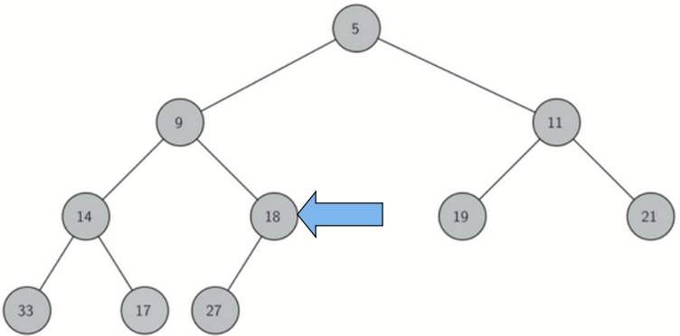


#### 完全二叉树的实现及性质 

我们从1开始，从上到下，从左到右给所有结点编号。
完全二叉树由于其特殊性，可以把它放到一个“非嵌套”的列表中，列表的0下标元素弃用。

- 具有下面的特性：

    - 如果结点在列表中的下标为p，那么其左子结点下标为2p，右子结点为2p+1
    - 如果结点在列表中下标为n，那么其父结点下标为n//2

    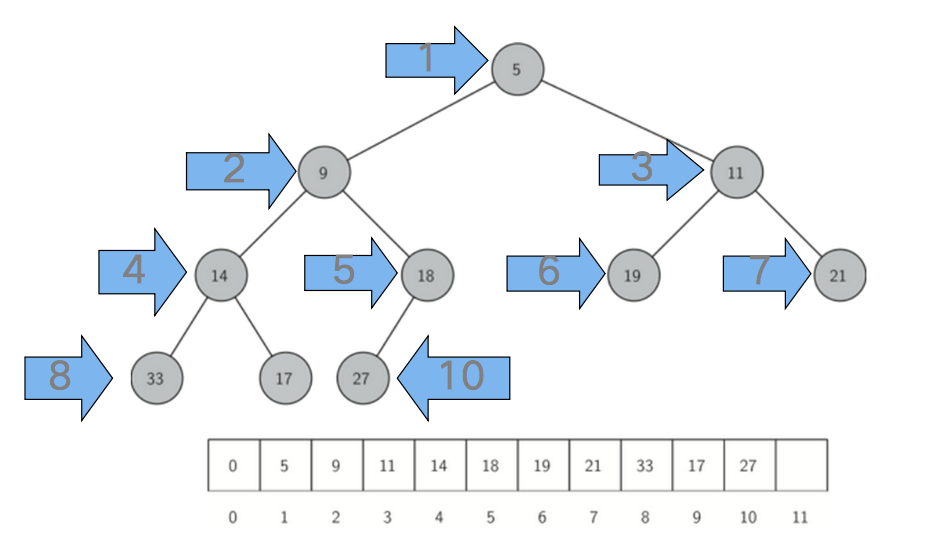

    - 完全二叉树的高度$d = O(\log{}n)$


### 堆次序Heap Order 

- “堆”的特性
    - 堆中任何一个结点x，其父结点p中的key均小于等于x中的key。
        - 这样，符合“堆”性质的二叉树，其中任何一条路径，均是一个已排序数列
        - 符合“堆”性质的二叉树，其树根结点中的key最小

    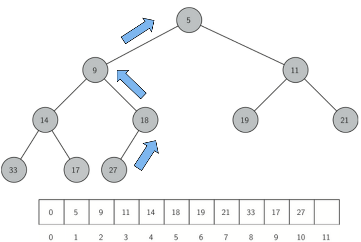


### 二叉堆操作的实现 

- 二叉堆初始化
    - 采用一个列表来保存堆数据，其中表首下标为0的项无用（浪费一点空间），但为了后面代码可以用到简单的整数乘除法，仍保留它。
    ```python
    class BinHeap:
        def __init__(self):
            self.heapList = [0]
            self.currentSize = 0
    ```
- insert(key)方法

    - 首先，为了保持“完全二叉树”的性质，新key应该添加到列表末尾
    - 问题？

    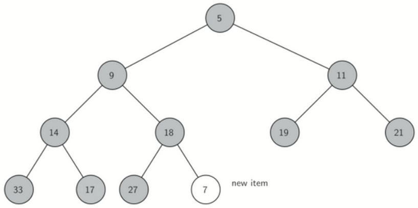


    - 但是，新key简单地加在列表末尾，显然无法保持“堆”次序
    - 虽然对其它路径的次序没有影响，但对于其到根的路径可能破坏次序
    - 于是需要将新key沿着路径来“上浮”到其正确位置
        - 与插入排序中插入新元素的动作非常相似
    - 注意：新key的“上浮”不会影响其它路径结点的“堆”次序，上浮路径上的结点值只会变小


    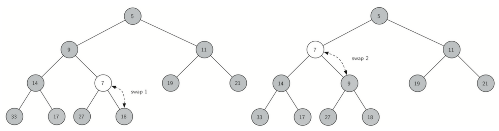

    - insert代码 
        - 参考：http://github.com:dsaClass/dsa2020.git, course/binHeap.py

    ```python
    class BinHeap:
        def __init__(self, key=lambda x:x):
            self.heapList = [0]
            self.currentSize = 0
            self.key = key
            
        def percUp(self, i):
            while i // 2 > 0:
                if self.key(self.heapList[i]) < self.key(self.heapList[i//2]):
                    self.heapList[i//2], self.heapList[i] \
                    =self.heapList[i], self.heapList[i//2]  #与父节点进行交换
                else:
                    break                                   #提前停止上浮
                i = i//2                                    #沿路径向上
                
        def insert(self, elem):
            self.heapList.append(elem)                      #添加到末尾
            self.currentSize += 1
            self.percUp(self.currentSize)                   #新元素按照key上浮
    ```

    - percUp中的perc是Percolate的缩写，词义为`渗透、过滤、逐渐流传`。
    - percUp沿长度为d的路径进行，因此insert()方法的复杂度为$O(\log n)$

- delMin()方法

    - 首先，移走整个堆中最小的key——位于堆首位的根结点heapList[1]
    - 为了保持“完全二叉树”的性质，用最后一个结点来代替根结点
    - 问题？

    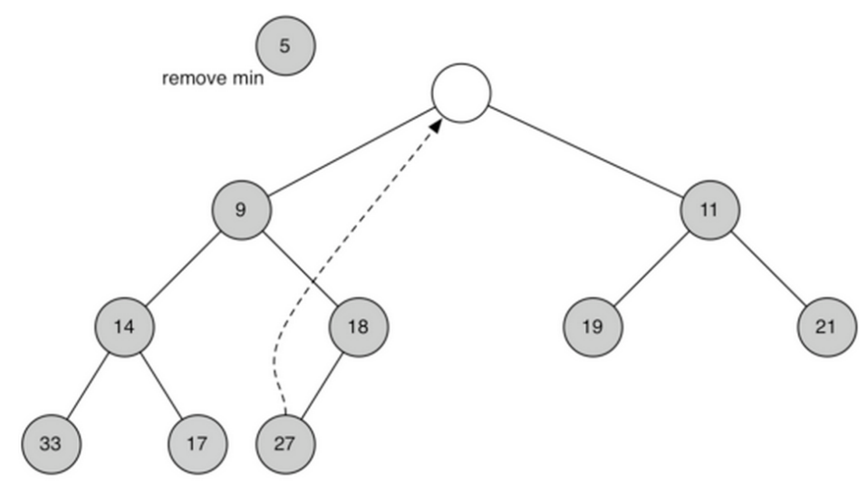


    - 同样，这么简单的替换，还是破坏了“堆”次序
    - 解决方法：将新的根结点沿着一条路径“下沉”，直到比两个子结点都小
    - “下沉”路径的选择：如果比子结点大，那么 **选择较小的子结点交换下沉**

    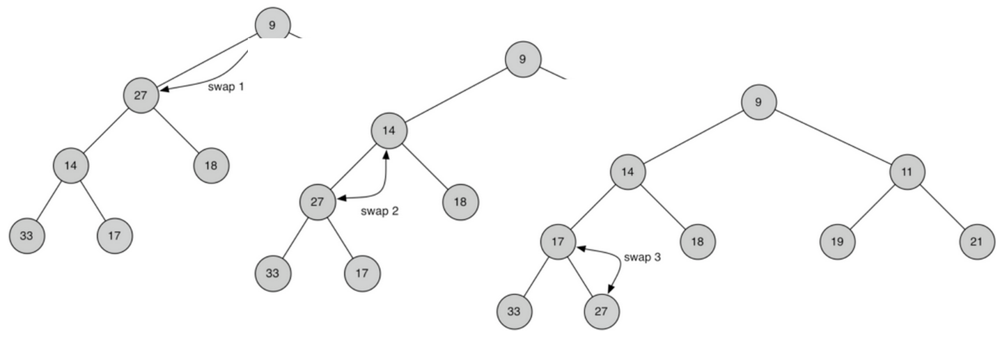

    - delMin代码

    ```python
        def percDown(self, i):
            while (i * 2) <= self.currentSize:
                mc = self.minChild(i)
                if self.key(self.heapList[i]) > self.key(self.heapList[mc]):
                    self.heapList[i], self.heapList[mc] = self.heapList[mc], self.heapList[i]   #交换下沉
                else:
                    break                                  #提前终止
                i = mc                                     #沿路径向下
                
        def minChild(self,i):
            if i*2 > self.currentSize:
                return None                                #没有子节点
            elif i*2 == self.currentSize:                  #只有左子节点
                return i*2
            if self.key(self.heapList[i*2]) <= self.key(self.heapList[i*2+1]): 
                return i*2
            else:
                return i*2+1
        
        def delMin(self):
            retval = self.heapList[1]                     #移走堆顶
            self.heapList[1] = self.heapList[self.currentSize]
            self.currentSize -= 1
            self.heapList.pop()
            self.percDown(1)                              #新顶下沉
            return retval
    ```

    - delMin()方法的复杂度同样为$O(\log n)$

- buildHeap()方法

    - buildHeap(lst)方法：从无序表生成“堆”

    - 我们最自然的想法是：用insert(key)方法，将无序表中的数据项逐个insert到堆中，但这么做的总代价是$O(n\log n)$
    - 然而用“下沉”法，能够将总代价控制在O(n)
        - 叶结点不需调用percDown()
        - 不同结点调用percDown()所执行的比较次数也不一样，与结点离叶结点的距离有关
        - 1/2的结点进行一组比较，1/4的结点进行2组比较, ...
    - 🧐percDown和percUp都能够调整堆次序，关键在于后面的调整不能影响前面调整的 **结果**
        - 假设perc(j)在perc(i)之后进行，进行了perc(j)之后再进行perc(i)不会发生任何动作
    - 只有从后往前percDown满足这样的条件


    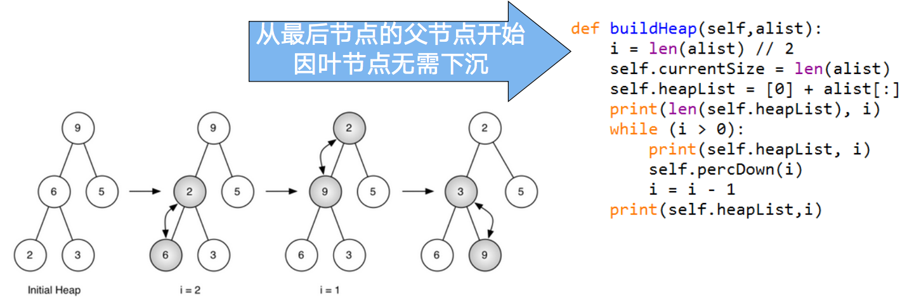
    
    ```python
        def buildHeap(self, l):
            self.heaplist = [0] + l
            for i in range(self.size() // 2, 0, -1):
                self.percDown(i)
    ```

##### 二叉堆建堆操作的算法复杂度证明

为了便于讨论，我们定义树中结点的高度height为该结点到叶结点的最大路径长度。那么，

- 叶结点的高度为零
- 根结点的高度等于树的高度

在percDown(self,i)下沉i结点的过程中，每下降一个高度进行3次比较，合计执行的比较次数为:
$$
T_{percDown}(i)\leq{}3*height(i)
$$
常数“3”不需要太准确，在后面的大O表示法中会被忽略，细究的话：数据项的比较只有2次，另有2次下标的比较

- 假设完全二叉树的结点个数为n，那么整个建堆过程的比较次数
$$
T(n)=\sum{}_{1\leq{}i\leq{}n}{T_{percDown}(i)}\leq{}\sum{3*height(i)}
$$
    - 高度不小于1的结点数为n//2，不小于2的结点数为n//4，不小于3的结点数为n//8，$\ldots$ 剩下约n//2的叶结点高度为0
    - 高度恰好为k的结点的个数为$n//2^k-n//2^{k+1}$
    $$
    \begin{split}
    T(n)  \leq & 3 \cdot \sum_{k\geq{}1}{k \cdot (n//2^k-n//2^{k+1})} \\
    \leq & 3n \cdot (1/2 + 1/4 + 1/8 + 1/16 + 1/32 + \dots ) \\
    = & 3\cdot n = O(n)
    \end{split}
    $$

- 2024陈同学提问：建堆时为什么不能先沉堆顶？

    <details>
    <summary>答案</summary>

        如果先沉前面的，比如说堆顶：如果最小元素恰巧不在堆首的下沉路径上。那么完成了堆顶的下沉后，最小元素无论如何都到不了堆顶的位置。

    </details>

- 有了“最小堆”，我想用“最大堆”怎么办？
    <details>
    <summary>答案</summary>

        把key的相反数存进去，最大数就变成了最小数，取出来之后再取反即可

    </details>

- 二叉堆在各种算法中很常用，Python提供的实现

    - `import heapq`
    - 提供的堆操作：heappush, heappop, heapify
    - 不提供的堆操作：percUp, percDown

- 二叉堆的结构特点对应的OJ题

    - OJ24686-树的重量
    - OJ24637-宝藏二叉树


### 堆排序算法

- 排序的目标是一个线性结构
    - “堆”只是一个树形结构。
    - 先建堆，再从堆中依次取出所有元素
    - “堆排序”算法复杂度：$O(n)+O(n\cdot{}\log{n}) = O(n\log{n})$
    - “堆排序”是稳定的吗？

        <details>
        <summary>答案</summary>
            不稳定，建堆时下沉操作交换结点时可能跨了等值项。
        </details>
    - “堆排序”能原地工作吗？
        <details>
        <summary>答案</summary>

            能够原地工作，出堆时堆尾部的空间会腾出来，刚好用来放出堆的元素

        </details>
    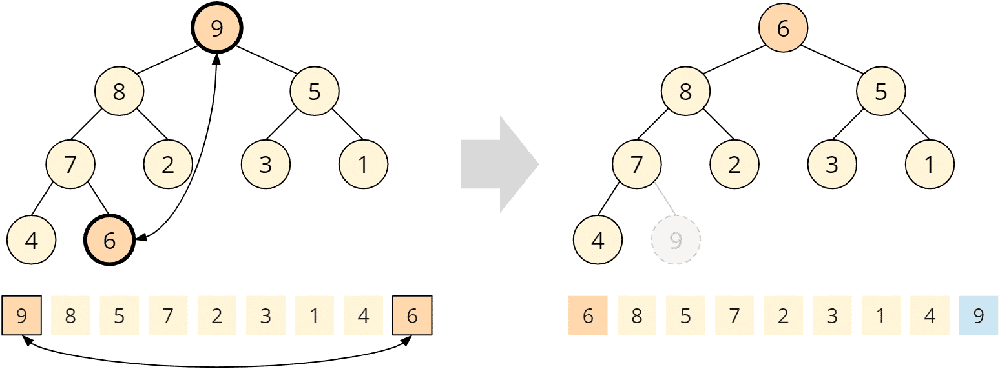

- 从n个数据中取前m个($m\ll{}n$)，谁更快？
    - 堆排序：O(n)+O($m\cdot \log{n}$)
    - 冒泡排序：O($m\cdot n$)

### 优先队列的不同实现比较


底层数据结构 | 入队 (Insert / Push) | 出队 (Delete / Pop) | 查询最值 (Find Min/Max) | 构建队列 (Build Heap/Queue) | 额外空间复杂度 | 适用场景/优缺点
--- | ---- |  ---  |  --- | ---- | --- | ----
1、无序列表/数组| $O(1)$ | $O(n)$| $O(n)$| $O(n)$ | $O(1)$ |极少使用。入队极快，但每次出队都要全表扫描找最值。
2、有序列表/数组| $O(n)$ | $O(1)$ | $O(1)$ | $O(n \log n)$ | $O(1)$ | 适用于数据量极小且出队极其频繁、对出队延迟敏感的场景。
3、二叉堆 (Binary Heap) | $O(\log n)$ | $O(\log n)$ | $O(1)$ | $O(n)$ | $O(1)$  | (顺序存储)工业界最主流、最完美的平衡方案（如 Python 的 heapq、C++ 的 priority_queue）。


## 二叉搜索树(Binary Search Tree)

二叉搜索树也属于二叉树的应用之一，因为太重要/内容太多，所以单独做为一节来讲。

数据的管理是计算机学科的核心问题之一，尤其关心数据的“随机”访问效率。
一般都会通过索引的方式，通过$key\rightarrow data$的方式来进行数据的 **快速访问**，这就是ADT Map的主要功能。
在ADT Map的具体实现方案中，可以采用不同的数据结构和搜索算法来保存和查找Key，前面已经实现了两个方案

- 有序表数据结构+二分搜索算法
- 散列表数据结构+散列及冲突解决算法

- 二叉搜索树
    - 下面我们来试试用二叉搜索树保存key，实现key的快速搜索以及完整的ADT Map


### ADT Map

* ADT Map的操作：

    - Map()：创建一个空映射
    - put(key, val)：将key-val关联对加入映射中，如果key已经存在，则将val替换原来的旧关联值；
    - get(key)：给定key，返回关联的数据值，如不存在，则返回None；
    - del：通过del map[key]的语句形式删除key-val关联；
    - len()：返回映射中key-val关联的数目；
    - in：通过key in map的语句形式，返回key是否存在于关联中，布尔值

* 树的实现形式：

    - 嵌套列表法
    - 结点链接法
    - 非嵌套-列表法（只适用于完全二叉树）
    - 提问：上面哪些是顺序存储？ 
        <details>
        <summary>答案</summary>
            只有非嵌套列表法
        </details>


### 二叉搜索树的性质 

- 二叉搜索树的每个结点上都存储了key
- 比父结点小的key都在左子树，比父结点大的key都在右子树。

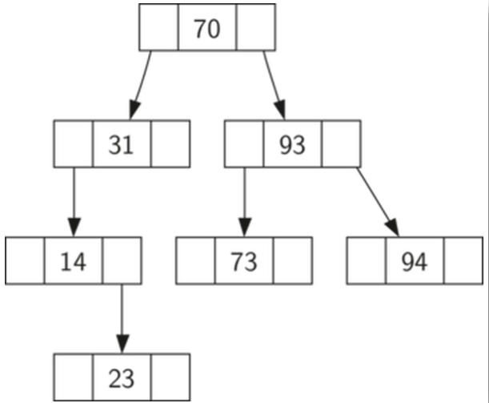

- 上图是一个简单的BST，按照70,31,93,94,14,23,73的顺序插入
    - 画图的时候只画key而省略value
    - 首先插入的70成为树根
    - 31比70小，放到左子结点
    - 93比70大，放到右子结点
    - 94比93大，放到右子结点
    - 14比31小，放到左子结点
    - 23比14大，放到其右
    - 73比93小，放到其左

- 在想象中把二叉搜索树“拍扁”，就能得到一个有序列表
    ```python
    flat = lambda x: flat(x.left)+[x.key]+flat(x.right) if x else []
    ```
    - 是不是也可以叫二叉排序树？中序遍历得到有序表
- ⚠️ 插入顺序不同，生成的BST也不同！


### 实现：结点链接法 

- BST和Node分别用类来实现，BST的root成员引用根Node
- 二分搜索树类：class BinarySearchTree

    - root引用TreeNode对象
    - size表示结点总个数
    - 特殊函数\_\_iter\_\_（以后再说）

    ```python
    class BinarySearchTree:              #函数太多了，增加了“树”类来管理与之有关的部分
        TreeNode = TreeNode
        def __init__(self):
            self.root = None
            self.size = 0
        def length(self):
            return self.size
        def __len__(self):               #供len(bst)调用
            return self.size
        def __iter__(self):
            return self.root.__iter__()
    ```
    - 和Python dict一样，BinarySearchTree是ADT Map的另一个实现

- 结点类：class TreeNode

    - key为键值
    - payload是value
    - 用left/rightChild属性指向左右子树
    - 用parent属性指向父节点
    - 还有一些简单有用的方法，意思显而易见

    ```python
    class TreeNode(LinkedNode):
        def __init__(self, key, val, left=None,
                    right=None, parent=None):
            self.key = key
            self.payload = val
            self.leftChild = left
            self.rightChild = right
            self.parent = parent     #增加了对parent的指回           
            
        def hasLeftChild(self):      #这个函数实际没必要，只是为了代码的讲解更加口语化。
            return self.leftChild
        
        def hasRightChild(self):
            return self.rightChild
        
        def isLeftChild(self):
            return self.parent and self.parent.leftChild is self
        
        def isRightChild(self):
            return self.parent and self.parent.rightChild is self
        
        def isRoot(self):
            return not self.parent
        
        def hasAnyChildren(self):
            return self.rightChild or self.leftChild
        
        def hasBothChildren(self):
            return self.rightChild and self.leftChild
        
        def isLeaf(self):
            return not self.hasAnyChildren()
        
        def flat(self):
            flat = lambda x: flat(x.leftChild)+[x.key]+flat(x.rightChild) if x else []
            return flat(self)
        
        def replaceNodeData(self, key, value, lc, rc):
            self.key = key
            self.payload = value
            self.leftChild = lc
            self.rightChild = rc
            if self.hasLeftChild():           #让左右子节点指回自己
                self.leftChild.parent = self
            if self.hasRightChild():
                self.rightChild.parent = self
    ```


#### BST.put方法

- put(key, val)方法：插入&lt;key, val&gt;对来构建BST

    - 只是简单调用一个递归函数\_put(key, val, root)来放置key
    - 并且把该函数的返回赋值给root
    ```python
        def put(self,key,val=0):
            #调用递归形式的_put
            self.root = self._put(key, val, self.root)
    ```

- \_put(key, val, currentNode)的算法流程

    - 如果当前结点为None，生成一个新的结点，并把size计数器加一。
    - 如果key比currentNode.key小，那么\_put到currentNode左子树
    - 如果key比currentNode.key大，那么\_put到currentNode右子树
    - 把左或右子结点的parent指向当前结点
    - 如果出现重复key，更新它的payload！⚠️ 不同于“排序”
    - 所以BST中的'S'是search，而不是sort

    ```python
        def _put(self, key, val, curr):
            """
            按照二叉搜索树的规则，采用递归的方式在子树中插入新结点。
            返回子树的根
            """
            if curr is None:
                self.size += 1
                return self.TreeNode(key, val)
            if key < curr.key:           #递归左子树
                curr.leftChild = self._put(key, val, curr.leftChild)
                curr.leftChild.parent = curr
            elif key > curr.key:         #递归右子树
                curr.rightChild = self._put(key, val, curr.rightChild)
                curr.rightChild.parent = curr
            else: #key == curr.key
                curr.payload = val       #更新结点，无新增
            return curr
    ```


- 随手把特殊函数`__setitem__`做了:
    - 可以myZipTree['PKU'] = 100871

    ```python
        def __setitem__(self, k, v):
            self.put(k,v)
    ```

- BST.put图示 
    - 插入key=19，currentNode的变化过程（灰色）：

    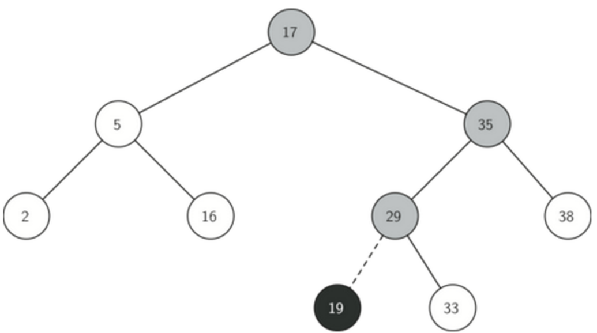

#### 随堂练习

- 按照顺序5, 30, 2, 40, 25, 4插入key，生成的BST是：

    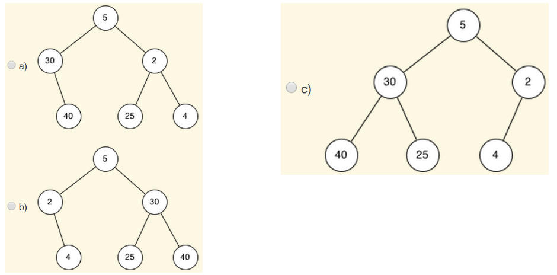


#### BST.get方法 

一旦BST构建起来，下一个方法就是从树中按照key来取val，即在树中找到key所在的结点

- 从root开始，递归向下
    - 直到找到，或者下到最底层的叶结点也未找到。

- get方法
    - 调用递归函数\_get
    - 根据\_get的结果，返回结点的值或空
    ```python
        def get(self, key):
            if res := self._get(key, self.root):
                return res.payload
            else:
                return None
    ```
- \_get方法
    - curr为空返回None
    - 尝试匹配，成功则返回当前结点，
    - 否则递归进入左/右子树
    ```python
        def _get(self, key, curr):
            """
            返回匹配key的结点
            """
            if not curr:
                return None
            elif curr.key == key:
                return curr
            elif curr.key > key:
                return self._get(key, curr.leftChild)
            else: #curr.key < key
                return self._get(key, curr.rightChild)
    ```

- 相关的\_\_getitem\_\_特殊方法
    - 实现val= myZipTree['PKU']
    ```python
        def __getitem__(self, key):
            return self.get(key)
    ```

- \_\_contains\_\_特殊方法
    - 实现'PKU' in myZipTree的集合判断运算符in
    ```python
        def __contains__(self, key):
            if self._get(key, self.root):
                return True
            else:
                return False
    ```

#### BST.delete方法 

- 有增就有减，delete方法比较复杂：

    - 首先用\_get找到要删除的结点，然后调用remove来删除结点，找不到则提示错误；
    - 输入参数不同：delete删除的目标是key，而remove删除的目标是node

- \_\_delitem\_\_特殊方法

    - 实现del zipTree['PKU']这样的语句操作

- 而细节工作由remove方法来处理

    ```python
        def delete(self, key):
            nodeToRemove = self._get(key, self.root)
            if nodeToRemove:
                self.remove(nodeToRemove)
                self.size -= 1
            else:
                raise KeyError("'{}' notFound.".format(key))

        def __delitem__(self, key):
            self.delete(key)
    ```

#### BST.remove方法

- 从BST中remove一个结点，还仍然保持BST的性质，分以下3种情形

    - 结点没有子结点
    - 结点有1个子结点
    - 结点有2个子结点

##### 叶结点的情况 

- 没有子结点的情况好办，直接删除

    ```python
            if curr.isLeaf():   #作为叶节点的最简单情况
                #移除叶节点只需要在它的父节点中把它移除
                p = curr.parent
                if curr.isLeftChild():
                    p.leftChild = None
                elif curr.isRightChild():
                    p.rightChild = None
                else:                     #删除唯一结点
                    self.root = None
                return p
    ```
    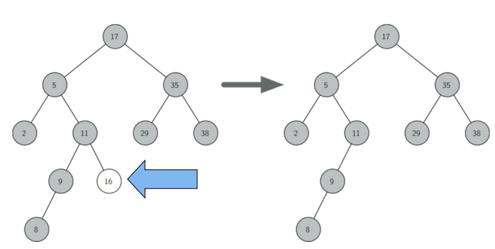


##### 被删结点有一个子结点

- 第2种情形稍复杂：被删结点有1个子结点
    - 解决：将这个唯一的子结点上移，替换掉被删结点的位置

    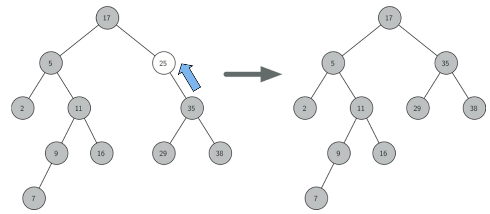

- 当前结点是根结点时，需要特殊处理
    ```python
            else:                           #只有一个子节点的情况
                # 取得唯一子节点，不关心左右
                child = curr.leftChild \
                        if curr.hasLeftChild() \
                        else curr.rightChild  #可以砍掉一半的源代码
                p = child.parent = curr.parent
                if curr.isLeftChild():   #在子、父结点之间跳过当前节点
                    p.leftChild = child
                elif curr.isRightChild():
                    p.rightChild = child
                else :             #当前节点是根节点，直接替换成子节点
                    self.root = child
                return p
    ```
##### 有两个子结点的情况 

- 第3种情形最为复杂：被删结点有2个子结点

    - 这时无法简单地将某个子结点上移替换被删结点
    - 但可以找到另一个合适的结点来替换被删结点，这个合适结点就是被删结点的下一个key值结点，即被删结点右子树中最小的那个，称为“后继”
    - 可以肯定这个后继结点最多只有1个子结点（本身是叶结点，或仅有右子树）
    - 将后继结点的内容移动到被删结点，再摘除后继结点。

    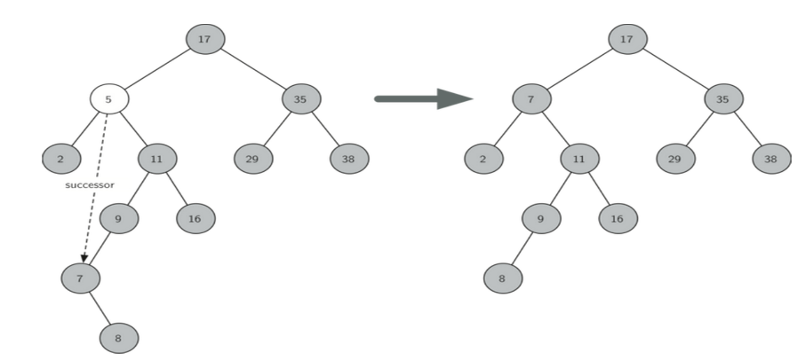


- remove方法：有两个子结点的处理代码 
    ```python
            elif curr.hasBothChildren():    #有左右两个子节点的复杂情况
                succ = curr.findSuccessor() #前驱、后继肯定都有
                curr.key = succ.key
                curr.payload = succ.payload
                return self.remove(succ)    #succ没有左子节点，为什么？
                                            #不会出现第二层递归
    ```

- 例子: 依次删除4、2

    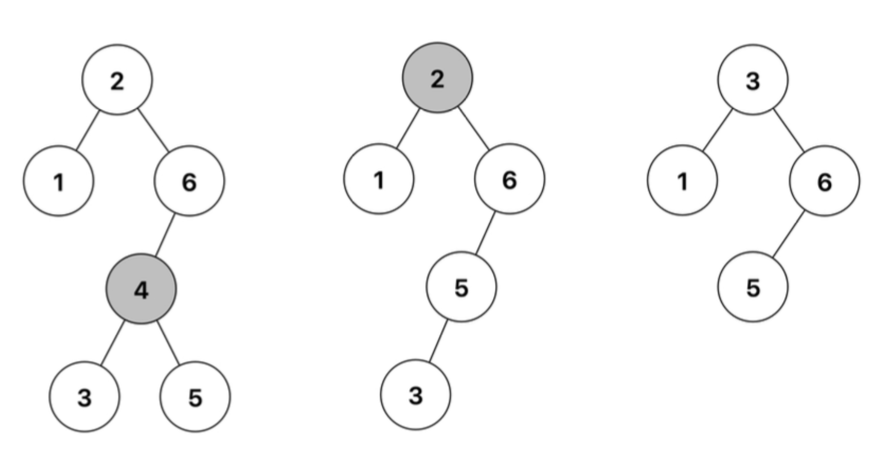

<details> 
<summary>remove()完整代码</summary>

```python
    def remove(self, curr):
        """
        返回实际remove结点的直接父结点。
        """
        if curr.isLeaf():   #作为叶节点的最简单情况
            #移除叶节点只需要在它的父节点中把它移除
            p = curr.parent
            if curr.isLeftChild():
                p.leftChild = None
            elif curr.isRightChild():
                p.rightChild = None
            else:                     #删除唯一结点
                self.root = None
            return p
        elif curr.hasBothChildren():    #有左右两个子节点的复杂情况
            succ = curr.findSuccessor() #前驱、后继肯定都有
            curr.key = succ.key
            curr.payload = succ.payload
            return self.remove(succ)    #succ没有左子节点，为什么？
                                        #不会出现第二层递归
        else:                           #只有一个子节点的情况
            # 取得唯一子节点，不关心左右
            child = curr.leftChild \
                    if curr.hasLeftChild() \
                    else curr.rightChild  #可以砍掉一半的源代码
            p = child.parent = curr.parent
            if curr.isLeftChild():   #在子、父结点之间跳过当前节点
                p.leftChild = child
            elif curr.isRightChild():
                p.rightChild = child
            else :             #当前节点是根节点，直接替换成子节点
                self.root = child
            return p
```

</details> 

#### TreeNode.findSuccessor方法

- 调用findMin()，找到最小结点
    ```python
        def findSuccessor(self):
            if self.hasRightChild():   #在remove()中的唯一可能
                return self.rightChild.findMin()
            elif self.isRoot():
                return None
            elif self.isLeftChild():   #是左子树且无右子女
                return self.parent
            else : #是右子树且无右子女，处在parent子树中的末位
                self.parent.rightChild = None #暂时移除自己
                succ = self.parent.findSuccessor()
                self.parent.rightChild = self #恢复自己
                return succ

        def findMin(self):
            current = self
            while current.hasLeftChild():     #往左下角
                current = current.leftChild
            return current

    ```

#### 迭代器 

对于Python字典，我们可以用for i in dict: 这样的方法枚举字典中的所有key，ADT Map也应该实现这样的迭代器功能

- BinarySearchTree类中的\_\_iter\_\_方法直接调用了TreeNode中的同名特殊方法

    ```python
        def __iter__(self):
            return self.root.__iter__()
    ```

- TreeNode类中的\_\_iter\_\_迭代器

    - 实际上是一个递归函数
    - yield是对每次迭代的返回值。
    - yield函数与return函数的区别？yield函数有记忆。
    ```python
        def __iter__(self):
            if self:
                if self.hasLeftChild():
                    for elem in self.leftChild:
                        yield elem
                yield self.key
                if self.hasRightChild():
                    for elem in self.rightChild:
                        yield elem
    ```


### 算法分析（以put方法为例）

- 其性能决定因素在于二叉搜索树的高度（最大层次），
- 而其高度又受数据项key插入顺序的影响。
    - 如果key的列表是随机分布的话，那么大于和小于根结点key的键值大致相等，那么BST的高度就是$log_2{}n$（n是结点的个数），这样的树就是平衡树，put方法的时间复杂度为O($log_2{}n$)。
    - 但key列表分布极端情况就完全不同

        - 按照从小到大顺序插入的话，如下图
        - 这时候put方法的时间复杂度为O(n)

    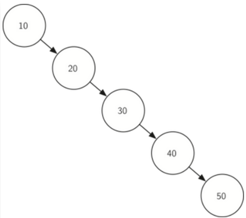

- 其它方法也是类似情况
- 如何改进？
    - 不管key以何种顺序插入，BST的高度保持$O(\log{n})$


## 平衡二叉搜索树

下面介绍一种能够在key插入时一直保持平衡的二叉搜索树：AVL树

- AVL是发明者的名字缩写：G.M. Adelson-Velskii and E.M. Landis

利用AVL树实现ADT Map，基本上与前面的BST实现相同，不同之处在于二叉树的的变化过程中需要维持平衡。
AVL树的实现中，需要对每个结点跟踪“平衡因子balance factor”参数，平衡因子是根据结点的左右子树的高度来定义的。确切地说，是左右子树高度差：

$$
balanceFactor = height(leftSubTree) − height(rightSubTree)
$$

- 如果平衡因子大于0，称为“左重left-heavy”，小于零称为“右重right-heavy”
- 平衡因子等于0，则称作平衡。

- $AVL \subset{} BST $

### 平衡树的定义

- 一棵二叉搜索树中每个结点的平衡因子都在-1，0，1之间
    - 也可以说每个结点的左右子树高度差 **不超过1**
    - 则把这个二叉搜索树称为平衡树

    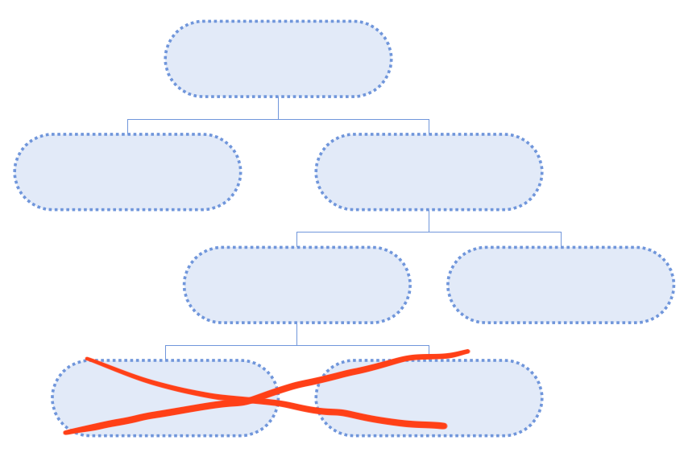


#### AVL树的“再平衡”

- 一旦在平衡树操作过程中，有结点的平衡因子超出此范围，则需要一个重新平衡的过程

    - 同时要保持BST的性质！左子树所有结点都小于根，右子树都大于根
    - 如果某个结点的平衡因子等于-2，称树“左重+”；如果等于2，则称树“右重+”

- 思考：下面的不平衡树，如何重新平衡？

    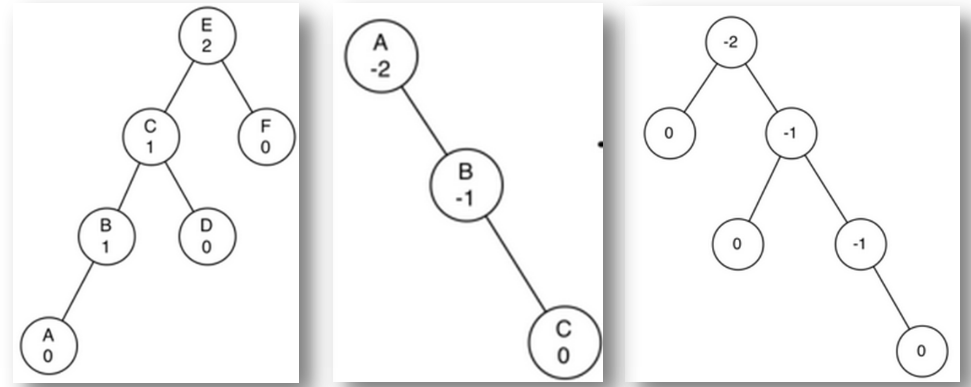

### AVL树的性能 

实现AVL树之前，先看看AVL树是否确实有一个很好的性能

- 一次查找所需的最多比较次数等于树高加一

我们来分析AVL树最差情形下的性能：即平衡因子为1或者-1

- 构造最差情况：固定结点数，最大树高 $\Rightarrow$ 或者固定树高，最少结点数。

 下图列出平衡因子为1的“左重”AVL树，树的高度从0开始，来看看树高h和问题规模（总结点数N）之间的关系如何？

    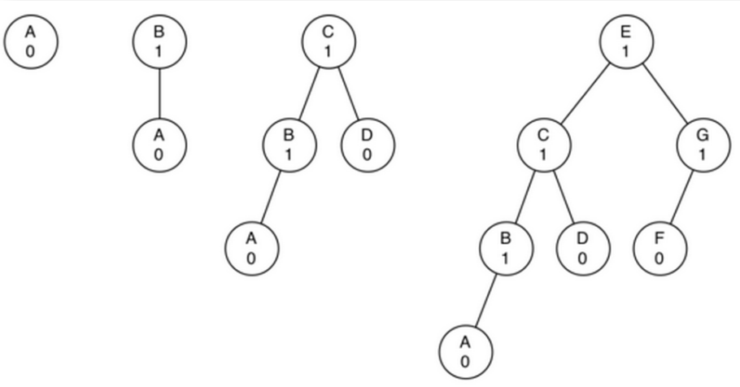

- 观察上图h=0、1、2、3时，总结点数N的变化：

    - $N_0= 1$
    - $N_1= 2= 1+ 1$
    - $N_2= 4= 1+ 1+ 2$
    - $N_3= 7= 1+ 2+ 4$
    - $N_h = 1 + N_{h-1} + N_{h-2}$

- 观察这个通式，很接近斐波那契数列！

    - 定义斐波那契数列Fi
    $$
    \begin{split}
    F_0&=0 \\
    F_1&=1 \\
    F_i&=F_{i-1}+F_{i-2} ,i\geq{}2 \\
    \end{split}
    $$

        i | 0 | 1 | 2 | 3 | 4 | 5 | 6 | 7 | 8 | 9  
        -- | -- | -- | -- | -- | -- | -- | -- | -- | -- | --  
        $F_i$ | 0 | 1 | 1 | 2 | 3 | 5 | 8 | 13 | 21 | 34  
        $N_i$ | 1 | 2 | 4 | 7 | 12 | 20 | 33 | 54 | 88 | 143  

    - 发现他们之间的关系：$N_h$就是平移后的斐波那契数列再减去1（证明：归纳法）
    $$
    N_h=F_{h+3}-1,h\geq{}0
    $$

    - 斐波那契数列的性质：${F_i}/{F_{i-1}}$趋向于黄金分割$\Phi$
        $$
            \Phi=\frac{1+\sqrt{5}}{2}\\
        $$

    - 可以写出Fi的近似通式
        $$
        F_i \rightarrow \frac{\Phi^i}{\sqrt{5}}
        $$

    - 将$F_i$通式代入到$N_h$中，得到$N_h$的通式
        $$
        N_h=\frac{\Phi^{h+3}}{\sqrt{5}}-1 
        $$
    - 我们进一步解出h
        $$
        \begin{split}
        log(N_h+1)=&(h+2)log\Phi-\frac{1}{2}log5\\
        h=&\frac{log(N_h+1)+\frac{1}{2}log5}{log\Phi}-2\\
        h\approx{}&1.44logN_h
        \end{split}
        $$
- 最差情况
    - AVL树在总结点数为N的搜索中，最多需要$1.44\log{N}$次比对
- 最好情况
    - 如果是Perfect Binary Tree，会出现最好情况：最多需要的比对次数为$\log{N+1}$
- 可以说AVL树的搜索时间复杂度为O(log n)


### AVL树的实现 

既然AVL平衡树确实能够改进BST树的性能，避免退化情形，我们来看看向AVL树插入一个新key，如何才能保持AVL树的平衡性质

- 首先，新key必定以叶结点形式插入到AVL树中

    - 叶结点的平衡因子是0，其本身无需重新平衡
    - 但会影响其父结点的平衡因子：
        - 如果作为左子结点插入，则父结点平衡因子会增加1；
        - 如果作为右子结点插入，则父结点平衡因子会减少1。

    - 这种影响可能随着其父结点到根结点的路径一直传递上去，直到：
        - 传递到根结点为止；
        - 或者某个父结点平衡因子被调整到0，不再影响上层结点的平衡因子为止。
            - 发生“再平衡”子树的高度会回到平衡被破坏之前的值

#### AVLTreeNode

- 将AVL树作为BST树子类实现，AVLTreeNode也实现为TreeNode的子类
    - 增加height属性
    - balanceFactor不是一个属性，而是通过左右子树的height计算得到

- 参考代码：github:course/avl.py

    ```python
    class AVLTreeNode(TreeNode):
        def __init__(self, key, val, parent=None):
            super().__init__(key, val, parent=parent)
            self.height = 1

        def renew_height(self):
            l = self.leftChild.height if self.leftChild else 0
            r = self.rightChild.height if self.rightChild else 0
            self.height = 1 + max(l, r)

        def balance(self):
            l = self.leftChild.height if self.leftChild else 0
            r = self.rightChild.height if self.rightChild else 0
            return l - r
    ```

#### put方法 

重新定义\_put方法即可
- \_put用递归实现：新增结点后 **自下而上逐级**检查平衡因子，实际只需要平衡一次
    ```python
        def _put(self, key, val, curr):
            if curr is None:
                self.size += 1
                return self.TreeNode(key, val)
            if key < curr.key:           #递归左子树
                curr.leftChild = self._put(key, val, curr.leftChild)
                curr.leftChild.parent = curr
            elif key > curr.key:         #递归右子树
                curr.rightChild = self._put(key, val, curr.rightChild)
                curr.rightChild.parent = curr
            else: #key == curr.key
                curr.payload = val       #更新结点，无新增
            return self.checkBalance(curr)
    ```

#### checkBalance方法 

- 在递归过程自下而上，逐一检查
    - balanceFactor分为-2(R+)，-1(R)，0，1(L)，2(L+)五种情况
    - 通过左右旋转的办法平衡

```python
    def checkBalance(self, curr):
        """
        检查curr结点的平衡因子，并负责再平衡。
        返回平衡之后新子树的根结点，由caller维护父结点对他的指向
        """
        bal = curr.balance()
        if bal > 1: #L+
            if curr.leftChild and curr.leftChild.balance() == -1 : #L+R
                curr.leftChild = self.rotateLeft(curr.leftChild)
            curr = self.rotateRight(curr)
        elif bal < -1: #R+
            if curr.rightChild and curr.rightChild.balance() == 1: #R+L
                curr.rightChild = self.rotateRight(curr.rightChild)
            curr = self.rotateLeft(curr)
        else:      #没有发生旋转，子树的高度也需要重算
            curr.renew_height()
        return curr
```

下面详细讨论平衡是怎么实现的。

### 平衡的实现

- 主要手段：将不平衡的子树进行旋转rotation

    - 视“左重+”或者“右重+”进行不同方向的旋转，同时更新对父结点引用
    - 更新旋转后被影响结点的平衡因子

- 如图，是一个“右重+”子树A的左旋转（并保持BST性质）

    - 将右子结点B提升为子树的根
    - 将旧根结点A作为新根结点B的左子结点

    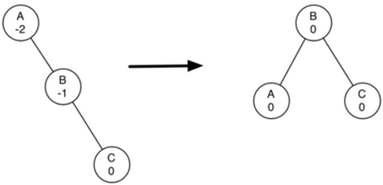

    - 如果B结点原来有左子结点怎么办？

#### 子树移植

- 如图的“左重+”子树右旋转，如何处理新根结点C原来的右子结点D?
    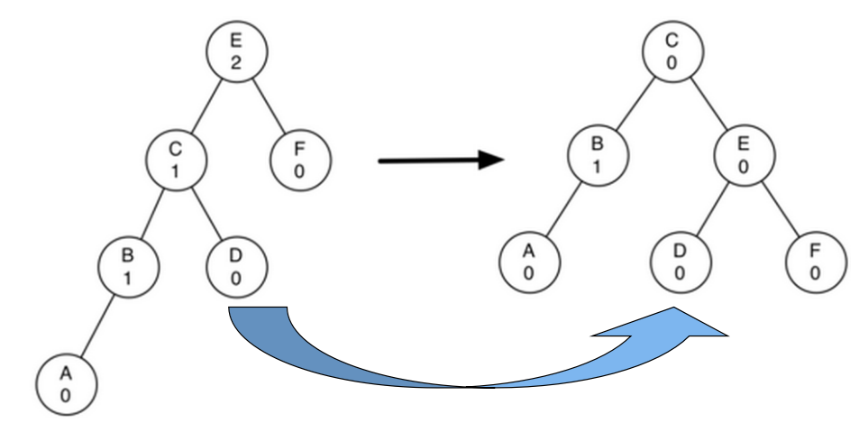
    - 旋转后，新根结点C将旧根结点E作为右子结点，C原来的右子结点D不能扔掉，需要给它重新找位置！
    - E原来的左子结点是C，C移走之后，位置空了出来；刚好可以用来放D
    - **这样的操作完美保持了BST的性质**
    - 除了C和E之外，其他结点为根的子树没有变化

- rotateRight代码 

```python
    def rotateRight(self, rotRoot):
        o, n = rotRoot, rotRoot.leftChild      #旧的和新的根结点
        tr   = n.rightChild                    #移植新根结点的右子结点

        n.parent = o.parent                    #新根上连
        n.rightChild, o.parent = o, n          #重建新旧根之间的联系
        o.leftChild = tr                       #-->到旧根的左子结点
        if tr : tr.parent = o
        
        #新/旧根的高度需要重算
        o.renew_height()
        n.renew_height()
        #返回新根结点
        return n;
```


#### 更复杂的情形


- 下图的“右重+”(-2)子树，单纯的左旋转无法实现平衡

    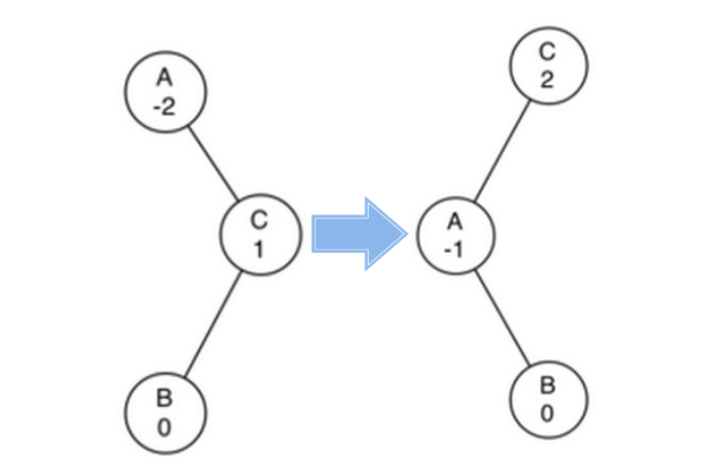

    - 左旋转后变成“左重+”(+2)了
    - “左重+”(+2)再右旋转，还回到“右重+”(-2)

- 所以，在左旋转之前检查右子结点的因子

    - 如果右子结点“左重”(+1)的话，先对它进行右旋转
    - 再实施原来的左旋转

    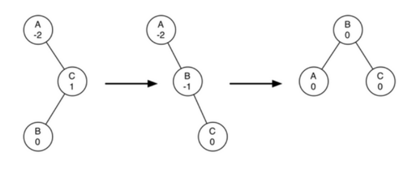

- 同样，在右旋转之前检查左子结点的因子

    - 如果左子结点“右重”(-1)的话，先对它进行左旋转
    - 再实施原来的右旋转


#### 实际操练

- 如图所示的“右重”子树如何平衡？
- 请图示旋转过程

    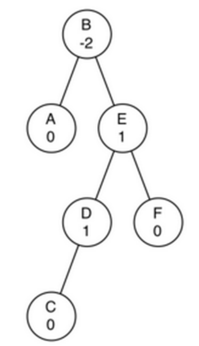

- 一个重要现象：所有的“再”平衡操作都把子树的高度“降一”
    - 对于由put引起的不平衡，“降一”刚好恢复了put之前的树高，不会影响上一级子树的平衡
    - 由delete引起的不平衡，“降一”可能减少了上一级子树的高度，产生连锁的不平衡


#### delete方法

- 从被remove的结点的 **父节点**开始，沿路经向上逐个检查平衡。
- 如果发生旋转，子树的根结点会被换掉，需要重建其父结点对它的连接

```python
    def delete(self, key):
        nodeToRemove = self._get(key, self.root)
        if not nodeToRemove:
            raise KeyError("'{}' notFound.".format(key))
        curr = self.remove(nodeToRemove) #得到remove结点的父结点
        self.size -= 1
        while curr : 
            if curr.isLeftChild():
                curr.parent.leftChild = self.checkBalance(curr)
            elif curr.isRightChild():
                curr.parent.rightChild = self.checkBalance(curr)
            else:                  #isRoot
                self.root = self.checkBalance(curr)
            curr = curr.parent

```

### 完整代码

```python

class LinkedNode:
    """
    结点链接法实现的二叉树，树和树节点使用同一个类
    """
    def __init__(self, rootObj, \
            left=None, right=None):
        self.key = rootObj
        self.leftChild = left
        self.rightChild = right

    def insertLeft(self, newNode):
        self.leftChild = LinkedNode(newNode, \
                left=self.leftChild)

    def insertRight(self, newNode):
        self.rightChild = LinkedNode(newNode, \
                right = self.rightChild)

    def getRightChild(self):
        return self.rightChild;

    def getLeftChild(self):
        return self.leftChild

    def setRootVal(self, obj):
        self.key = obj

    def getRootVal(self):
        return self.key

    def _print(self, is_left, offset, depth, buf, label):
        b = "{:^5}".format(label(self))
        width = 5
        while len(buf)<2*depth+1:                #让后面的buf[2*depth]访问有效
            buf.append([])
        left  = self.leftChild._print(True, offset,                depth + 1, buf, label) if self.leftChild else 0;
        right = self.rightChild._print(False, offset + left + width, depth + 1, buf, label) if self.rightChild else 0;

        enlarge = offset+left+width+right-len(buf[2*depth])
        buf[2*depth].extend([' ']*enlarge)
        for i, c in enumerate(b):               #输出子树根节点的内容
            buf[2*depth][offset+left+i] = c


        if depth > 0:                          #输出子树与其父节点的连线
            if is_left:
                enlarge = offset+left+2*width+right-len(buf[2*depth-1])
                buf[2*depth-1].extend([' ']*enlarge)
                for i in range(width+right):
                    buf[2 * depth - 1][offset + left + width//2 + i] = '-'
                buf[2 * depth - 1][offset + left + width//2] = '+';
                buf[2 * depth - 1][offset + left + width//2 + right + width] = '+';
            else:
                enlarge = offset+left+width+right-len(buf[2*depth-1])
                buf[2*depth-1].extend([' ']*enlarge)
                for i in range(left+width):
                    buf[2 * depth - 1][offset - width//2 + i] = '-';
                buf[2 * depth - 1][offset + left + width//2] = '+';
                buf[2 * depth - 1][offset - width//2 - 1] = '+';
        return left + width + right;

    def print(self, label=lambda x:x.key):
        """
        在命令行下打印树。
        树结构需要采用节点链接法来实现。
        用label来选择用来代表节点的内容。
        """
        buf = []
        self._print(True, 0, 0, buf, label)
        for l in buf:
            print(''.join(l))


class TreeNode(LinkedNode):
    def __init__(self, key, val, left=None,
                right=None, parent=None):
        self.key = key
        self.payload = val
        self.leftChild = left
        self.rightChild = right
        self.parent = parent     #增加了对parent的指回，在findSuccessor中需要

    def hasLeftChild(self):              #这个函数实际没必要，只是为了代码的讲解更加口语化。
        return self.leftChild

    def hasRightChild(self):
        return self.rightChild

    def isLeftChild(self):
        return self.parent and self.parent.leftChild is self

    def isRightChild(self):
        return self.parent and self.parent.rightChild is self

    def isRoot(self):
        return self.parent is None

    def hasAnyChildren(self):
        return self.rightChild or self.leftChild

    def hasBothChildren(self):
        return self.rightChild and self.leftChild

    def isLeaf(self):
        return not self.hasAnyChildren()

    def flat(self):
        flat = lambda x: flat(x.leftChild)+[x.key]+flat(x.rightChild) if x else []
        return flat(self)

    def replaceNodeData(self, key, value, lc, rc):
        self.key = key
        self.payload = value
        self.leftChild = lc
        self.rightChild = rc
        if self.hasLeftChild():           #让左右子节点指回父节点
            self.leftChild.parent = self
        if self.hasRightChild():
            self.rightChild.parent = self

    def findSuccessor(self):
        if self.hasRightChild():   #在remove()中的唯一可能
            return self.rightChild.findMin()
        elif self.isRoot():
            return None
        elif self.isLeftChild():   #是左子树且无右子女
            return self.parent
        else : #是右子树且无右子女，处在parent子树中的末位
            self.parent.rightChild = None #暂时移除自己
            succ = self.parent.findSuccessor()
            self.parent.rightChild = self #恢复自己
            return succ

    def findMin(self):
        current = self
        while current.hasLeftChild():     #往左下角
            current = current.leftChild
        return current

    def __iter__(self):
        if self:
            if self.hasLeftChild():
                for elem in self.leftChild:
                    yield elem
            yield self.key
            if self.hasRightChild():
                for elem in self.rightChild:
                    yield elem


class BinarySearchTree:              #函数太多了，增加了“树”类来管理与之有关的部分
    TreeNode = TreeNode
    def __init__(self):
        self.root = None
        self.size = 0
    def length(self):
        return self.size
    def __len__(self):               #供len(bst)调用
        return self.size
    def __iter__(self):
        return self.root.__iter__()

    def display(self):
        if self.root:
            self.root.print()
        else:
            print("[]")

    def put(self,key,val=0):
        #调用递归形式的_put
        self.root = self._put(key, val, self.root)

    def _put(self, key, val, curr):
        """
        按照二叉搜索树的规则，采用递归的方式在子树中插入新结点。
        返回子树的根
        """
        if curr is None:
            self.size += 1
            return self.TreeNode(key, val)
        if key < curr.key:           #递归左子树
            curr.leftChild = self._put(key, val, curr.leftChild)
            curr.leftChild.parent = curr
        elif key > curr.key:         #递归右子树
            curr.rightChild = self._put(key, val, curr.rightChild)
            curr.rightChild.parent = curr
        else: #key == curr.key
            curr.payload = val       #更新结点，无新增
        return curr

    def __setitem__(self, k, v):
        self.put(k,v)

    def get(self, key):
        if res := self._get(key, self.root):
            return res.payload
        else:
            return None

    def _get(self, key, curr):
        """
        返回匹配key的结点
        """
        if not curr:
            return None
        elif curr.key == key:
            return curr
        elif curr.key > key:
            return self._get(key, curr.leftChild)
        else: #curr.key < key
            return self._get(key, curr.rightChild)

    def __getitem__(self, key):
        return self.get(key)

    def __contains__(self, key):
        if self._get(key, self.root):
            return True
        else:
            return False

    def delete(self, key):
        nodeToRemove = self._get(key, self.root)
        if nodeToRemove:
            self.remove(nodeToRemove)
            self.size -= 1
        else:
            raise KeyError("'{}' notFound.".format(key))

    def __delitem__(self, key):
        self.delete(key)

    def remove(self, curr):
        """
        返回实际remove结点的直接父结点。
        """
        if curr.isLeaf():   #作为叶节点的最简单情况
            #移除叶节点只需要在它的父节点中把它移除
            p = curr.parent
            if curr.isLeftChild():
                p.leftChild = None
            elif curr.isRightChild():
                p.rightChild = None
            else:                     #删除唯一结点
                self.root = None
            return p
        elif curr.hasBothChildren():    #有左右两个子节点的复杂情况
            succ = curr.findSuccessor() #前驱、后继肯定都有
            curr.key = succ.key
            curr.payload = succ.payload
            return self.remove(succ)    #succ没有左子节点，为什么？
                                        #不会出现第二层递归
        else:                           #只有一个子节点的情况
            # 取得唯一子节点，不关心左右
            child = curr.leftChild \
                    if curr.hasLeftChild() \
                    else curr.rightChild  #可以砍掉一半的源代码
            p = child.parent = curr.parent
            if curr.isLeftChild():   #在子、父结点之间跳过当前节点
                p.leftChild = child
            elif curr.isRightChild():
                p.rightChild = child
            else :             #当前节点是根节点，直接替换成子节点
                self.root = child
            return p


class AVLTreeNode(TreeNode):
    def __init__(self, key, val, parent=None):
        super().__init__(key, val, parent=parent)
        self.height = 1

    def renew_height(self):
        l = self.leftChild.height if self.leftChild else 0
        r = self.rightChild.height if self.rightChild else 0
        self.height = 1 + max(l, r)

    def balance(self):
        l = self.leftChild.height if self.leftChild else 0
        r = self.rightChild.height if self.rightChild else 0
        return l - r


class AVL(BinarySearchTree):
    TreeNode = AVLTreeNode

    def checkBalance(self, curr):
        """
        检查curr结点的平衡因子，并负责再平衡。
        返回平衡之后新子树的根结点，由caller维护父结点对他的指向
        """
        bal = curr.balance()
        if bal > 1: #L+
            if curr.leftChild and curr.leftChild.balance() == -1 : #L+R
                curr.leftChild = self.rotateLeft(curr.leftChild)
            curr = self.rotateRight(curr)
        elif bal < -1: #R+
            if curr.rightChild and curr.rightChild.balance() == 1: #R+L
                curr.rightChild = self.rotateRight(curr.rightChild)
            curr = self.rotateLeft(curr)
        else:      #没有发生旋转，子树的高度也需要重算
            curr.renew_height()
        return curr

    def _put(self, key, val, curr):
        if curr is None:
            self.size += 1
            return self.TreeNode(key, val)
        if key < curr.key:           #递归左子树
            curr.leftChild = self._put(key, val, curr.leftChild)
            curr.leftChild.parent = curr
        elif key > curr.key:         #递归右子树
            curr.rightChild = self._put(key, val, curr.rightChild)
            curr.rightChild.parent = curr
        else: #key == curr.key
            curr.payload = val       #更新结点，无新增
        return self.checkBalance(curr)

    def delete(self, key):
        nodeToRemove = self._get(key, self.root)
        if not nodeToRemove:
            raise KeyError("'{}' notFound.".format(key))
        curr = self.remove(nodeToRemove) #得到remove结点的父结点
        self.size -= 1
        while curr : 
            if curr.isLeftChild():
                curr.parent.leftChild = self.checkBalance(curr)
            elif curr.isRightChild():
                curr.parent.rightChild = self.checkBalance(curr)
            else:                  #isRoot
                self.root = self.checkBalance(curr)
            curr = curr.parent

    def rotateLeft(self, rotRoot):
        o, n = rotRoot, rotRoot.rightChild     #旧的和新的根结点
        tr   = n.leftChild                     #移植新根结点的左子结点

        n.parent = o.parent                    #新根上连
        n.leftChild, o.parent = o, n           #重建新旧根之间的联系
        o.rightChild = tr                      #-->到旧根的右子结点
        if tr : tr.parent = o
        
        #新/旧根的高度需要重算
        o.renew_height()
        n.renew_height()
        #返回新根结点
        return n;

    def rotateRight(self, rotRoot):
        o, n = rotRoot, rotRoot.leftChild      #旧的和新的根结点
        tr   = n.rightChild                    #移植新根结点的右子结点

        n.parent = o.parent                    #新根上连
        n.rightChild, o.parent = o, n          #重建新旧根之间的联系
        o.leftChild = tr                       #-->到旧根的左子结点
        if tr : tr.parent = o
        
        #新/旧根的高度需要重算
        o.renew_height()
        n.renew_height()
        #返回新根结点
        return n;

    def display(self):
        if self.root:
            self.root.print(label=lambda x:"{}:{}".format(x.key, x.balance()))
        else:
            print("[]")

```
### 操作演示

```python
if __name__ == "__main__":
    
    tree = AVL()
    
    tree.put(1)
    tree.display()
    tree.put(2)
    tree.display()
    tree.put(30)
    tree.put(40)
    tree.put(50)
    tree.put(60)
    tree.put(70)
    tree.put(80)
    tree.put(0)
    tree.put(25)
    tree.put(35)
    tree.put(21)
    tree.display()
    del tree[40]
    tree.display()

    command = input().split()
    while command[0] != 'exit':
        if command[0] == 'put':
            tree.put(int(command[1]))
        elif command[0] == 'delete':
            tree.delete(int(command[1]))
        elif command[0] == 'display':
            tree.display()
        command = input().split()
```


### 结语 

- 经过复杂的方法，AVL树始终维持平衡性质，树的高度为$O(\log{n})$
- 这样get方法也始终保持$O(\log{n})$的高性能
- put和delete方法的代价有多大？

    - 首先同put方法一样，需要O($log n$)的代价找到新结点插入的位置，或者需要删除的结点
    - 其次需要O($log n$)次checkBalance，每次的代价是O(1)
    - 综合起来，put和delete方法的代价也是O($log n$)

对于ADT Map的各种实现方法，我们采用了多种数据结构和算法来实现ADT Map，其时间复杂度数量级如下表所示：

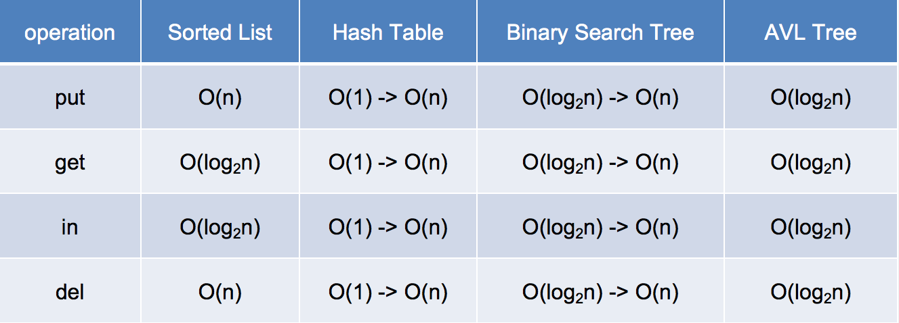

- Map驻留在内存中的情况，如果在文件中，就需要采用不同的标准

    - 数据库索引，B/B+树，时间复杂度关注的是访问磁盘的次数
    - 一次读取一个磁盘块，一个结点存很多key，最大可能限制树的深度

## 树与森林

### 二叉树与树的关系与区别

- 二叉树是一类简单而又重要的树形结构
- 二叉树不是树

    - 二叉树的左右子树对应固定的位置，互相之间不可替代
    - 左子树被删除，它在父结点的位置“空”出来。
    - 树的第一子树被删除，第二子树自然顶替成为第一

- “k-叉树”与“树”
    - 在把空集合定义为空树的情况下
    - k-叉树子女数量固定为k，允许有空子树
    - 树的子女数量不固定，不允许有空子树

- 具体到二叉树，当我们说它的左子树为“空”（树）时，并不是说它没有左子树，

    - 准确的说，它没有 **非空**左子树。

- 二叉树叶结点的定义：没有“非空“子结点。

* **它们的应用领域完全不同！**


### 对树的进一步观察

在原有的[树的定义]( #%E6%A0%91%E7%9A%84%E5%AE%9A%E4%B9%89 )之外，我们观察到：

- 任一结点，比如B的子结点E、F、G、H、I组成“线性表“。

    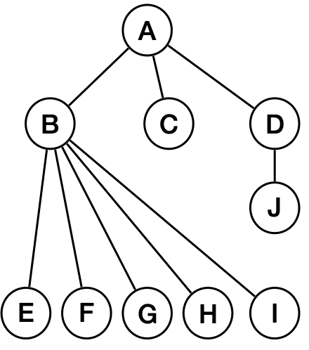

    - ⚠️ 而不是集合
    - E为B的最左子结点，或称 **长子**(First Child)
    - 线性表中的前驱/后继也可看成“长/幼“兄弟关系
    - 这既是理论定义上的逻辑顺序，也体现在代码实现上

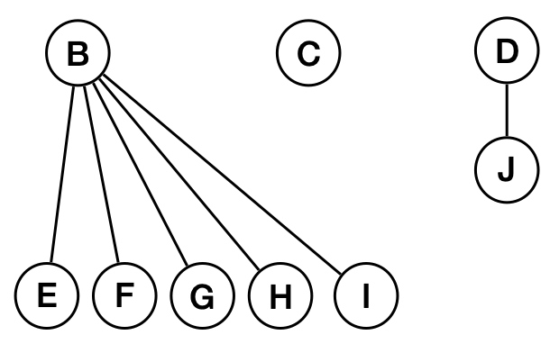

- 森林(forest)：零棵或多棵不相交的树组成的序列(sequence)
    - 可以是一个 **空**，里面一棵树都没有
    - 如果有树，必须是 **非空**树

- 树与森林的关系
    - 树可以看成一种特殊的森林：只有一颗树的森林。
    - 一棵树，删除树根，其子树就组成了森林。
    - 后面关于森林的操作，同样适用于树。

### 森林与二叉树的等价转换

- 森林与二叉树之间可以互相转换，而且这种转换是一一对应的

    - 森林的相关操作都可以转换成对二叉树的操作

森林转化成二叉树的形式定义

- $F=(T_1,T_2,\ldots,T_n)$ 是树$T_1,T_2,\ldots,T_n$ 组成的森林，递归转换成二叉树B(F)：

    - 若 F 为$\varnothing$，即 n = 0，则 B(F) 为空二叉树
    - 若 F 非$\varnothing$，即 n > 0，则: 
        - B(F) 的根结点是森林中第一棵树 $T_1$ 的根结点$W_1$ 
        - B(F) 的左子树是$T_1$删去$W_1$后再转换来的二叉树：$B(T_1-W_1)$ 
        - B(F)的右子树是F去除$T_1$后再转换来的二叉树：$B(F-T_1)$ 

    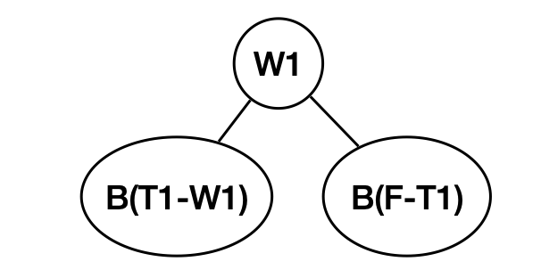


二叉树转化成森林的形式定义

- 设B是一棵二叉树，root是B的根，$B_L$ 是 root 的左子树，$B_R$ 是 root 的右子树，则对应于二叉树B的森林F(B) 的形式定义是：
    - 若 B 为空，则 F(B) 是空的森林
    - 若 B 不为空，则 F(B)是一棵树$T_1$加上森林 $F(B_R)$, 
        - 其中树 $T_1$ 的根为 root，root 的子树为 $F(B_L)$

    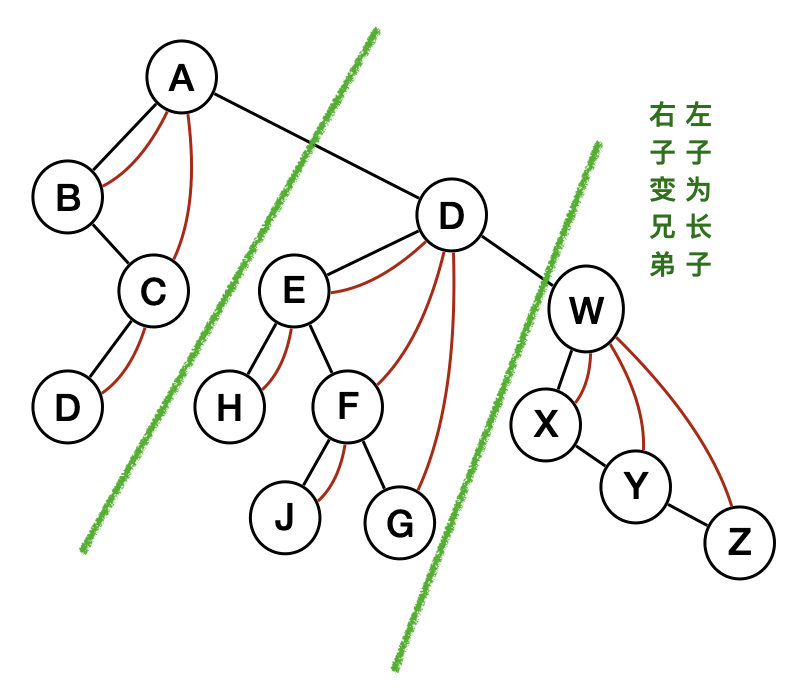

  
## 本章总结

- 本章介绍了“树”数据结构，我们讨论了如下算法
- 用于表达式解析和求值的二叉树
- 通过构建哈夫曼树对字符进行编码
- 用二叉堆实现了优先队列
- 用于实现ADT Map的二叉搜索树BST树
- 改进了性能，用于实现ADT Map的平衡二叉搜索树AVL树
- 二叉树与森林及树之间的互相转换

