---
jupyter:
  jupytext:
    cell_metadata_filter: -all
    split_at_heading: true
    text_representation:
      extension: .md
      format_name: markdown
      format_version: '1.3'
      jupytext_version: 1.18.1
  kernelspec:
    display_name: Python 3 (ipykernel)
    language: python
    name: python3
---

<style>
/* 全局字体 */
body {
  font-size: 18px;
  line-height: 1.8;
  color: #333;
}

/* 标题 */
h1 {
  color: #2c7be5;
  border-bottom: 2px solid #eee;
  padding-bottom: 5px;
}

h2 {
  color: #e5533d;
}

h3 {
  color: #2fa84f;
}

/* 强调 */
.highlight {
  color: #d63384;
  font-weight: bold;
}

/* 提示框 */
.note {
  background: #f8f9fa;
  border-left: 5px solid #2c7be5;
  padding: 10px;
  margin: 10px 0;
}

/* 警告 */
.warning {
  background: #fff3cd;
  border-left: 5px solid #ffc107;
  padding: 10px;
}

/* 代码说明 */
.code-desc {
  color: #6c757d;
  font-size: 16px;
}

/* 1. 只选中第一级列表的文字，调整大小或颜色 */
ul > li, 
ol > li {
  font-size: 18px;          /* 把第一级放大到 20px */
  font-weight: bold;        /* 把第一级加粗（也可以不加） */
  color: #2c7be5;           /* 给第一级换个颜色，比如蓝色 */
}

/* 2. 关键：把第二级及更深层级的列表恢复成全局默认字体样式 */
ul ul li, 
ol ol li, 
ul ol li, 
ol ul li {
  font-size: 18px;          /* 恢复成你全局定义的 18px */
  font-weight: normal;      /* 恢复常规粗细 */
  color: #333;              /* 恢复全局的深灰色 */
}

</style>

# Ch07. 图及算法

[Home]( README.md )

## 本章目标 

- 理解图的概念及使用
- 实现图抽象数据类型
- 图应用于解决不同领域的问题

## 图的概念及使用  

### 名词“图”的不同含义

就像“羊”在英文中并不是一个单独的词，中文的“图画”在英文中有很多对应的单词，其意义大不相同

- 中文“图”可能的多种含义
    - painting：用画刷画的油画
    - drawing：用硬笔画的素描/线条画
    - picture：真实形象所反映的画，如照片等，如take picture
    - image：由印象而来的画，遥感影像叫做image，因是经过传感器印象而来
    - **graph：重在由一些基本元素构造而来的图，如点、线段等**
    - figure：轮廓图的意思，某个侧面的轮廓，所以有figure out的说法
    - diagram：抽象的概念关系图，如电路图、海洋环流图、类层次图
    - chart：由数字统计得来的柱状图、饼图、折线图
    - map：地图；plot：地图上的一小块

- 计算机“图形”学 vs. 数据结构中的“图”
    - 前者是为了让眼睛“看”的
    - 后者是为了让算法“理解”和“算”的


### 图Graph的概念 

- 图Graph是比树更为一般的结构

    - 也是由结点和边构成
    - 实际上树是一种具有特殊性质的图

- 图可以用来表示现实世界中很多事物
    - 道路交通系统、航班线路、互联网连接、
    - 或者是大学中课程的先修次序（不能有环）

    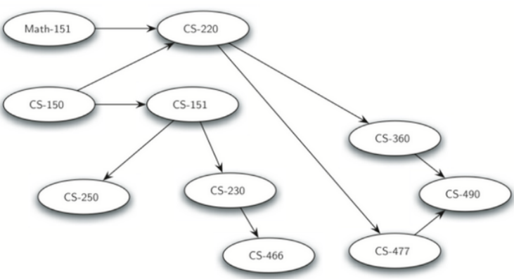

- 计算科学对图的研究相对透彻
    - 许多表面上错综复杂的现实难题，一旦成功抽象为图模型，往往能套用成熟的图算法迎刃而解。
    - **地图与导航**：将地图抽象为图（顶点为地标或路口，边为道路），可以轻松求解最优路线，其计算效率和准确度往往能超越对路线极度熟悉的行业专家。
    - **互联网与路由寻路**：互联网是由海量计算机和路由器相互连接而成的庞大网络。利用图算法（如最短路径算法），可以动态计算出数据包在网络中传输的最短、最快或最有效的通信路径。
    - **课程依赖与排期**：大学课程之间的“先修依赖关系”非常适合用有向图来表达，通过图的拓扑排序等算法可以完美解决排课与工序推进问题。
    - **现实建模**：无论是社交网络、知识图谱还是物流供应链，现实世界中大量具有“关联特征”的复杂事物，其底层本质都适合用图来建模与表达。

### 现实生活中的图  

- 公共交通中的图结构

    - 北京地铁共有18条运营线路，不重复计算换乘车站则为268座车站，总长约527千米。
    - 北京公交系统有1020条运营线路，公交站点近2000个。

    

    

    - 路在嘴下 vs. 导航
        - 导航的本质，就是把现实世界“抽象”成一张图，然后利用图算法在最快时间内计算出一条最优路径。

- 互联网中的图结构

    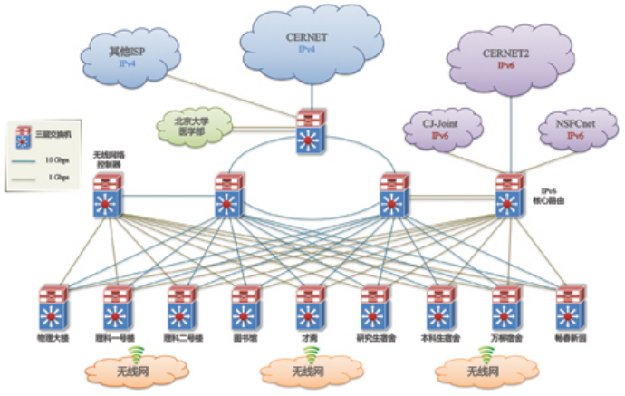

    - 通过层层的交换机、路由器连接在一起，路由器之间又相互连接

        - 北京大学校园网目前已经具有近10万信息点
        - 互联网中ipv4的近40亿地址已接近枯竭
        - 一张几十亿个信息点的巨型网络

    - 提供内容的Web站点已突破10亿个

        - 由超链接相互连接的网页更是不计其数
        - Google每天处理的数据量约10PB

    - 在天文数字规模的网络面前，人脑已经无法处理


- 社交网络：六度分隔理论 

    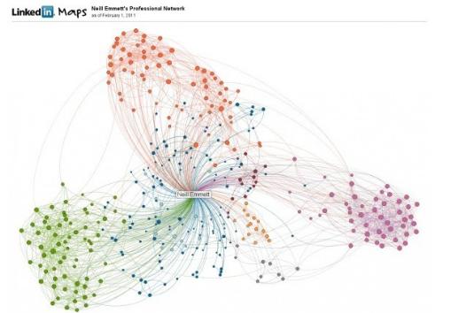

    - 社交网络的兴起将每个人联系到一起
        - 个体通过好友关系形成了一张巨大的图
    - 在社会中有 20% 擅长交往的人，建立了 80%的连接
        - 世界上任何两个人之间通过最多6个人即可建立联系
        - 区别于随机网络，保证了六度分隔的成立
        - 引出了无尺度网络的研究
        - 现实中的复杂网络多属于无尺度网络

    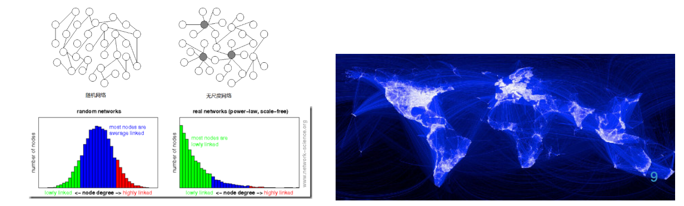

  
### 图的定义与基础术语

#### 核心术语表 (Terminology)

* **顶点 (Vertex)**
    * 也称**结点 (Node)**，是图的最基本构成单元。
    * 通常具有唯一标识符 `Key`（如名称、编号），并可携带特定的业务数据 `Payload`。

* **边 (Edge)**
    * 也称**弧 (Arc)**，用于表示两个顶点之间的关联关系。
    * **方向性**：
        * 边可以是**单向 (One-way)** 或 **双向 (Two-way)** 的。
        * **判定标准**：观察边两端顶点的地位是否对称/对等。若不对等（有先后、因果或流向关系），则为单向。
        * 若图中所有边均为单向，该图称为**有向图 (Directed Graph / Digraph)**。
        * 在有向边中，两个顶点分别扮演**起点（连出 / Tail）**与**终点（连入 / Head）**的角色。

* **度 (Degree)**
    * **定义**：与某个顶点相连接的边的数量。
    * **有向图分类**：在有向图中，度被进一步细分为：
        * **入度 (In-degree)**：指向该顶点的边的数量。
        * **出度 (Out-degree)**：从该顶点出发的边的数量。
    * **特例**：若图中所有顶点的度数均等于常数 $k$，则称该图为 **$k$-正则图 ($k$-Regular Graph)**。

* **权重 (Weight)**
    * 用于量化从一个顶点到另一个顶点的“代价”或“度量”。
    * **典型场景**：在交通网络中，边上的权重可代表两站之间的“物理距离”、“行驶时间”或“乘车票价”。
    * 边上带有权重的图被称为**赋权图 (Weighted Graph)** 或网络 (Network)。

#### 数学定义与形式化表示

* 有向图 $G$ 可以定义为二元组 $G = (V, E)$
    * **$V$（Vertex Set）**：顶点的有限非空集合。
    * **$E$（Edge Set）**：边的集合。其中每条有向边表示为一个有序对 $e = (v, u)$，满足 $v, u \in V$ 且 $u \neq v$（即暂不考虑自环）。
    * **赋权形式**：若是赋权图，则可在边 $e$ 中添加第三个权重分量，表示为三元组 $e = (v, u, w)$。
    * **子图 (Subgraph)**：设 $G' = (V', E')$，若其顶点集和边集分别满足 $V' \subseteq V$ 且 $E' \subseteq E$，则称 $G'$ 为 $G$ 的子图。

- 有向赋权图的例子：6个顶点及9条边

    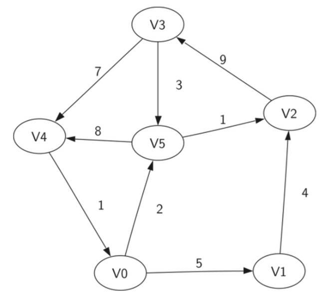 <br>

    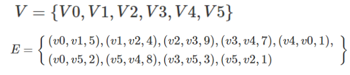

    - 如果边没有方向，则用无序对$\{u, v\}$表示，G也变成无向图

### 更多概念

* **路径 (Path)**
    * **定义**：图中的路径是由边依次首尾相连构成的顶点序列。
    * **形式化表示**：路径可表示为序列 $P = (v_1, v_2, \dots, v_n)$，对于任意 $1 \leq i \leq n-1$，均满足有序对 $(v_i, v_{i+1}) \in E$（有向图）或无序对 $\{v_i, v_{i+1}\} \in E$（无向图）。该路径通常记作 $v_1 \rightarrow v_n$，其中 $v_1$ 称为**起点 (Source)**，$v_n$ 称为**终点 (Destination)**。
    * **路径长度 (Path Length)**：
        * **无权路径**：其长度定义为路径上**边的数量**，即 $n - 1$。
        * **带权路径**：其长度定义为路径上**所有边权重的累加和**：
            $$\text{Length}(P) = \sum_{i=1}^{n-1} w(v_i, v_{i+1})$$
    * **实例解析**：参考前文实例，从 $V_3$ 到 $V_1$ 的路径 $(V_3, V_4, V_0, V_1)$：
        * 所经有向边依次为：$(V_3, V_4, 7)$、$(V_4, V_0, 1)$、$(V_0, V_1, 5)$。
        * 该带权路径的长度为：$7 + 1 + 5 = 13$。

* **圈 / 环 (Cycle)**
    * **定义**：圈是指**起点与终点相同**的路径。例如前页图中的路径 $(V_5, V_2, V_3, V_5)$ 即构成一个圈。
    * **无圈图 (Acyclic Graph)**：如果一个图中不存在任何圈，则该图被称为“无圈图”。
    * **有向无圈图 (DAG)**：特指不包含任何环路的有向图，即 **Directed Acyclic Graph (DAG)**。
    * **实际应用**：DAG 具有独特的拓扑性质（如可进行拓扑排序），许多复杂的工程问题（如任务依赖调度、编译器优化、区块链结构）都能抽象为 DAG，并通过高效的图算法得到完美解决。

- 思考：树是一种什么性质的图？是DAG么？


* **连通性 (Connectedness)**
    * **连通图 (Connected Graph)**：在习惯上，若不加特殊说明，“连通图”通常特指**连通无向图**。
    * **无向图的连通性**：
        * 若无向图中任意两个不同的顶点 $u, v$ 之间都存在路径相连，则称该图为**连通图**。
    * **有向图的连通性 (Connectivity in Digraphs)**：由于有向图的边具有方向性，其连通性根据强弱划分为以下三种：
        * **强连通 (Strongly Connected)**：图中任意两个不同的顶点 $u, v$，均同时存在双向路径，即既有路径 $u \rightarrow v$，又有路径 $v \rightarrow u$。
        * **单向连通 (Unilaterally Connected)**：图中任意两个不同的顶点 $u, v$，至少存在一个方向的路径，即满足路径 $u \rightarrow v$ 或 $v \rightarrow u$ 至少其一成立。
        * **弱连通 (Weakly Connected)**：若忽略有向图中所有边的方向（即将所有有向边 $(u, v)$ 替换为无向边 $\{u, v\}$），所得的底层无向图是连通的，则称原图为弱连通图。

## ADT Graph(有向图)

- 抽象数据类型 ADT Graph 定义如下：

    - `Graph()`：创建一个空的图对象。
    - `addVertex(vert)`：将一个顶点 `Vertex` 对象加入图中。
    - `addEdge(fromVert, toVert)`：在两个顶点之间添加一条有向边。
    - `addEdge(fromVert, toVert, weight)`：在两个顶点之间添加一条带权的有向边。
    - `getVertex(vertKey)`：查找并返回名称为 `vertKey` 的顶点对象。
    - `getVertices()`：返回图中所有顶点的列表。
    - `in`：支持 `vert in graph` 的语法结构，判断指定顶点是否存在于图中，返回 `True` / `False`。

- ADT Graph 的实现方法有两种主要形式：

    - **邻接矩阵 (Adjacency Matrix)** 和 **邻接表 (Adjacency List)**。
    - 两种实现方法在空间复杂度和时间开销上各有优劣，需要根据具体应用场景的稀疏程度和操作频次加以选择。

### 邻接矩阵Adjacency Matrix 

- 邻接矩阵是图最直观的二维矩阵实现法
    - 矩阵的每行和每列均对应图中的一个顶点。若两个顶点之间存在边相连，则在相应行列相交的矩阵分量中予以记录。

    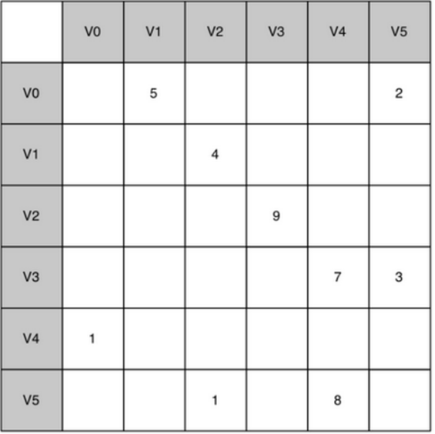

- 边的存储表示方法
    - **无权边**：若顶点间有边相连则将矩阵分量标注为 1，无边相连则标注为 0。
    - **带权边**：将边权值直接保存为矩阵分量值。对于没有边相连的情况，通常用特殊值（如无穷大 $\infty$、`float('inf')` 或 `None` / `0`）来表示。

- 优点：结构直观且实现简单
    - 可以以 $O(1)$ 的时间复杂度极快地查询、判断任意两个顶点之间是否相连以及获取边的权重。

- 缺点：图稀疏时空间效率低下
    - 边数很少的矩阵被称为**“稀疏 (Sparse)”矩阵**。
    - 现实中的大多数问题所对应的图都是稀疏的，实际边数 $|E|$ 远远少于 $|V|^2$ 这个最大理论量级，从而导致矩阵中出现大量无意义的空值，浪费存储空间。

### 邻接表Adjacency List

- 邻接表是稀疏图更高效的存储方案
    - 算法核心是维护一个包含所有顶点的主列表（Master List，在具体工程中通常使用高效的 **字典（dict）** 结构来实现）。
        - 字典的key是顶点的标识(id)，value指向一个个顶点对象
    - 在每个顶点中，分别关联一个用于记录与自身有边直接相连的所有邻居顶点的二级列表。

    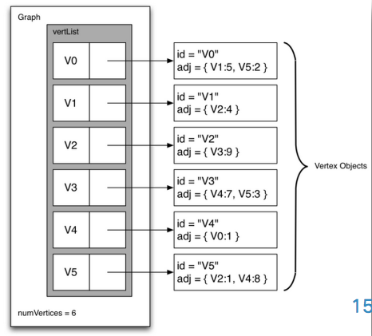

- Python 环境下 Vertex 类的字典实现
    - 在具体编码中，可采用 Python 字典来保存上面的二级列表。
    - 字典中的 `Key` 指向邻居顶点对象，而 `Value` 则直接保存该条连接边的权重值。

- 优点：存储空间紧凑，邻居查询高效
    - 邻接表避免了无效空值的存储，其空间复杂度为 $O(|V| + |E|)$，且能极其方便地遍历获取某个顶点的所有邻居顶点及相关边权信息。

- 注意：有向图中的方向选择性记录
    - 在有向图的邻接表中，通常只记录“连出边（出边）”或“连入边（入边）”的其中一种。
    - 系统默认或缺省状态下记录的是出边；若特意记录入边，则该结构被称为“入边邻接表”或**“逆邻接表 (Inverse Adjacency List)”**。

### ADT Graph的实现 

- 包括两个类VertBase和Graph

    - Graph保存了包含所有顶点的主表master list
    - VertBase则包含了顶点信息，以及顶点连接边的信息
    - VertBase: connectedTo, connectedFrom?

- 顶点Vertex代码

```python
class VertBase:
    """
    有向带权图的顶点
    当自定义类的对象用作字典的键值时，缺省使用系统hash()函数，它基于id()函数实现，
    也就是说，一个对象的哈希值在它的生命周期期间是固定的。
    """
    def __init__(self, key):
        self.id = key
        self.connectedTo = {}
        self.inDegree = self.outDegree = 0

    def addNeighbor(self, nbr, weight=1):
        """
        添加从当前节点到nbr节点的有向边
        添加重复边会更新其权值，不影响节点的出/入度。
        """
        if nbr not in self.connectedTo:
            self.outDegree += 1
            nbr.inDegree += 1
        self.connectedTo[nbr] = weight

    def delNeighbor(self, nbr):
        """
        删除有向边
        """
        if nbr in self.connectedTo:
            self.outDegree -= 1
            nbr.inDegree -= 1
            del(self.connectedTo[nbr])

    def __str__(self):
        return f"{self.id}({self.inDegree}:{self.outDegree})-->{[x.id for x in self.connectedTo]}"

    __repr__ = __str__

    def getConnections(self):
        """
        取得所有指向的节点
        """
        return self.connectedTo.keys()

    def getId(self):
        return self.id

    def getWeight(self, nbr):
        """
        取得指向某节点边的权重
        """
        return self.connectedTo[nbr]
```

- 图Graph代码

    ```python
    class Graph:
        """
        有向带权图，不支持重复边
        """
        def __init__(self, Vert=VertBase, other=None):
            """
            Vert: 顶点类型，需要继承基础顶点Vertex
            other: 复制other中所有的顶点和边
            """
            assert issubclass(Vert, VertBase)
            self.Vertex = Vert
            self.vertList = {}    #其实是一个字典
            if other:
                for v in other:
                    self.addVertex(v.getId())
                    for u in v.getConnections():
                        self.addEdge(v.getId(), u.getId(),
                                v.getWeight(u))

        def addVertex(self, key):
            if key not in self:
                self.vertList[key] = self.Vertex(key)
            return self.vertList[key]

        def getVertex(self, key):
            try:
                return self.vertList[key]
            except KeyError:
                return None

        def __contains__(self, key):
            return key in self.vertList
    ```

    - 如何添加边：先加顶点再加边
        - 在顶点的出边表中记录了有向边的目标顶点和权重
        - 用顶点对象作 dict 键值，是否 hashable?
    ```python
        def addEdge(self, f, t, weight=0):
            if f not in self:
                self.addVertex(f)
            if t not in self:
                self.addVertex(t)
            self.vertList[f].addNeighbor(self.vertList[t], weight)

        def getVertices(self):
            """
            返回所有顶点的key
            """
            return self.vertList.keys()

        def __iter__(self):
            """
            返回所有顶点本身
            """
            return iter(self.vertList.values())
    ```

    - Graph完整代码

```python
import os

class Graph:
    """
    有向带权图，不支持重复边
    """
    def __init__(self, Vert=VertBase, other=None):
        """
        Vert: 顶点类型，需要继承基础顶点Vertex
        other: 复制other中所有的顶点和边
        """
        assert issubclass(Vert, VertBase)
        self.Vertex = Vert
        self.vertList = {}    #其实是一个字典
        if other:
            for v in other:
                self.addVertex(v.getId())
                for u in v.getConnections():
                    self.addEdge(v.getId(), u.getId(),
                            v.getWeight(u))

    def addVertex(self, key):
        if key not in self:
            self.vertList[key] = self.Vertex(key)
        return self.vertList[key]

    def getVertex(self, key):
        try:
            return self.vertList[key]
        except KeyError:
            return None

    def __contains__(self, key):
        return key in self.vertList

    def delVertex(self, key):
        """
        删除一个顶点，先删掉它所有的入边、出边，再删本身
        """
        if key in self:
            v = self.getVertex(key)
            for f in self:
                f.delNeighbor(v)
            for t in [t for t in v.getConnections()]:
                v.delNeighbor(t)
            del(self.vertList[key])

    def addEdge(self, f, t, weight=0):
        if f not in self:
            self.addVertex(f)
        if t not in self:
            self.addVertex(t)
        self.vertList[f].addNeighbor(self.vertList[t], weight)

    def getVertices(self):
        """
        返回所有顶点的key
        """
        return self.vertList.keys()

    def __iter__(self):
        """
        返回所有顶点本身
        """
        return iter(self.vertList.values())

    def __len__(self):
        return len(self.vertList)

    def __str__(self):
        """
        每个顶点各占一行。
        """
        s = ""
        for v in self:
            nbrs = " ".join([str(u.getId()) for u in v.getConnections()])
            s += f"{v}: {nbrs}{os.linesep}"
        return s

    def T(self):
        """
        获取有向图的转置图
        """
        ng = Graph()
        for v in self:
            ng.addVertex(v.getId())
            for u in v.getConnections():
                ng.addEdge(u.getId(), v.getId())
        return ng
```

- 代码演示

```python
g = Graph()
for i in range(6):
    g.addVertex(i)

print(g.vertList)
```

```python
g.addEdge (0,1,5)
g.addEdge (0,5,2) 
g.addEdge (1,2,4)
g.addEdge (2,3,9)
g.addEdge (3,4,7)
g.addEdge (3,5,3)
g.addEdge (4,0,1)
g.addEdge (5,4,8) 
g.addEdge (5,2,1)

for v in g:
    for w in v.getConnections ():
        print(f"({v.getId()}, {w.getId()})")
```

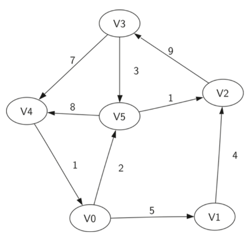

## 词梯Word Ladder问题 

- 词梯游戏（Word Ladder）的概念与规则
    - 该游戏由《爱丽丝漫游奇境》的作者 Lewis Carroll 于 1878 年发明，核心玩法是将一个单词演变到另一个目标单词。
    - 规则要求变换过程中的每一步只能**改变一个字母**。例如从 FOOL 变换到 SAGE 的过程：
        $$\text{FOOL} \Rightarrow \text{POOL} \Rightarrow \text{POLL} \Rightarrow \text{POLE} \Rightarrow \text{PALE} \Rightarrow \text{SALE} \Rightarrow \text{SAGE}$$
    - **与“最小编辑距离”的核心区别**：该游戏要求演变过程中的所有中间状态，都必须是词典中真实存在的有效单词。

- 求解最短单词变换序列的目标与步骤
    - 我们的主要工程目标是找到从初始单词到目标单词之间，步数最少、最短的单词变换序列。
    - **第一步：图的建模**——将词典中所有可能的单词作为顶点，若两个单词之间仅相差一个字母，则在它们之间连一条边，从而将演变关系表达为一张图。
    - **第二步：图的搜索**——在此图的基础上，采用**广度优先搜索 (BFS)** 算法，来高效寻找到从起始单词顶点到结束单词顶点之间的最短有效路径。

### 构建单词关系图 
        
- 图的建模：如何将大量单词集转化为图结构
    - **顶点设计**：将每一个独立的单词作为图顶点的唯一标识键（Key）。
    - **边设计**：遍历单词集，如果任意两个单词之间仅仅相差一个字母，就在它们之间建立一条无向边。
    - **求解本质**：在这张单词关系图中，从起点单词到终点单词之间的任意一条可达路径，都对应词梯（Word Ladder）问题的一个可行解。

    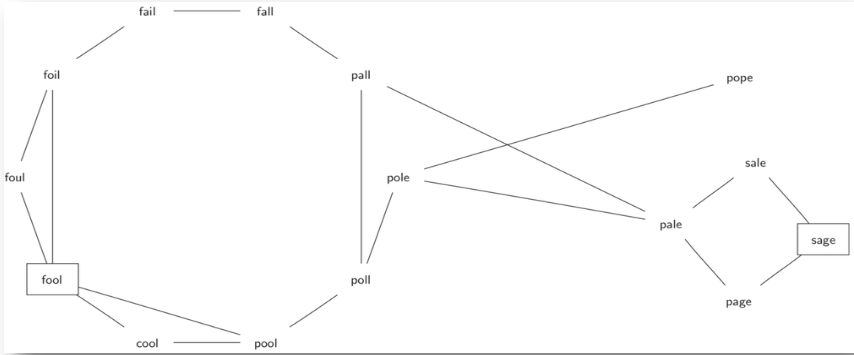

- 词梯问题解的图模型特征
    - 该模型是一个典型的**无向无权图**。由于“A 和 B 仅相差一个字母”这一关系是对称且对等的，因此边没有方向，也没有权重。
    - 在这张无向图中，从起点 FOOL 到终点 SAGE 的每条路径都代表一个有效的变换序列，而我们要寻找的就是其中长度最短的那条路径。

- 图构建的基准算法与性能挑战
    - **顶点初始化**：首先将 `vocabulary.txt` 文件中全部 3993 个 4 字母单词作为顶点加入图中。
    - **朴素建边算法（暴力法）**：最直接的方法是将每个单词顶点与词表中的其他所有单词逐一进行比对。若发现两个单词间仅相差一个字母，则建立一条边。
    - **复杂度瓶颈**：该暴力比对的时间复杂度高达 $O(n^2)$。对于这 3993 个单词，需要进行超过 1594 万次（$\approx 4000^2$）的字符串比较，在大规模词表下性能表现极差。

- 改进算法：基于通配符桶的“空间换时间”优化
    - **分桶机制**：创建大量带有通配符的“桶”（Bucket）。桶的标签通过依次将 4 字母单词的某一位替换为下划线 `_` 来生成。
    - **按桶聚类**：遍历所有单词并根据其通配符标签分类归档。例如，单词 POOL、FOOL 和 COOL 拥有相同的模式 `_OOL`，它们都会被放入 `_OOL` 这个桶中。
    - **高效建边**：当所有单词分配就位后，只需在同一个桶内部的单词之间两两建立边即可。

- 优化效果与空间开销评估
    - **时间开销剧降**：该方法将原本庞大的全组合比对，转化为了基于哈希映射（桶）的线性分类，成功将建边的时间复杂度降至 $O(n \cdot L)$（其中 $L$ 为单词长度，此处 $L=4$）。
    - **空间开销（最多有多少个桶）**：根据空间换时间的策略，每个 4 字母单词可以产生 4 个不同的通配符标签。因此，对于 3993 个单词，系统理论上最多会创建 $3993 \times 4 = 15972$ 个桶（实际由于大量单词共享相同的通配符模式，最终生成的独立桶数量会远小于这个上限值）。

    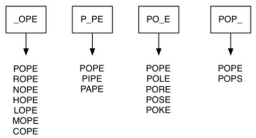

    - 采用 Python 字典来建立桶
    - 桶内部的单词之间两两建立边
        - ⚠️ 在有向图中添加 **双向边**来构建了一个无向图
        - 每个桶内最多有26个单词，产生的双向边数量不超过$26^2$ = O(1)

#### 代码

```python
def buildGraph(wordFile):
    d = {}
    g = Graph(Vertex)
    with open(wordFile, 'r') as f:
        for line in f:
            word = line[:-1]
            # create buckets of words that differ by one letter
            for i in range(len(word)):
                bucket = word[:i]+'_'+word[i+1:]
                if bucket in d:
                    d[bucket].append(word)
                else:
                    d[bucket] = [word]

    # add vertices and edges for words in the same bucket
    for bucket in d.keys():
        for word1 in d[bucket]:
            for word2 in d[bucket]:
                if word1 != word2:
                    g.addEdge(word1, word2)
    return g
```

- 基于邻接矩阵的存储开销与稀疏度分析
    - **理论存储空间**：若采用二维邻接矩阵来表示拥有 3933 个顶点的单词关系图，由于每个顶点都要与其他所有顶点建立行列交点，总共需要分配高达 1547 万个矩阵单元（$3933 \times 3933 = 15,468,489$）。
    - **实际边数占比**：经统计，该单词关系图实际上仅包含 42600 条边。这意味着在整个矩阵中，真正存有边信息的单元格仅占总容量的 **0.27%**，其余 99.73% 的空间全为空值。

- 图拓扑结构特征：高度稀疏性与网络属性猜想
    - **极高稀疏性**：上述数据极其直观地证明了单词关系图是一个极度稀疏（Sparse）的图，使用邻接矩阵会造成巨大的空间浪费。
    - **拓扑结构猜想（随机网络验证）**：面对如此稀疏的复杂图结构，我们可以提出一个有趣的学术猜想——这个单词关系图是一个“随机网络（Random Network）”吗？
        - 可以通过验证其度分布（Degree Distribution）等聚类特性，来揭示真实人类语言词汇网与纯数学随机图之间的本质区别。

### 实现广度优先搜索

- 基于 BFS 算法求解最短序列
    - 在单词关系图构建完成后，下一步需要利用**广度优先搜索 (BFS)** 算法来寻找两个单词顶点之间的最短变换路径。
    - BFS 是图论中最简单、最经典的搜索算法之一，也是许多其他高级图算法（如最短路径、生成树算法）的基础。

- BFS 的逐层搜索机制
    - 给定图 $G$ 和起始顶点 $s$，BFS 会从起点开始，沿着边向外辐射状地搜索所有从 $s$ 可达的顶点。
    - 算法严格遵循层级顺序：在访问距离为 $k+1$ 的顶点之前，BFS 必然已经访问完所有距离起点为 $k$ 的顶点。

- BFS 的树形构建视角
    - BFS 的搜索过程可以形象地理解为一棵生成树的动态构建过程：以起始顶点 $s$ 为根节点，自顶向下逐步分层扩展。
    - 广度优先搜索能够从机制上保证，在向树中增加下一层级的子节点之前，当前层级的所有兄弟节点均已被访问并添加完毕。

#### 算法过程

- 我们从FOOL开始搜索

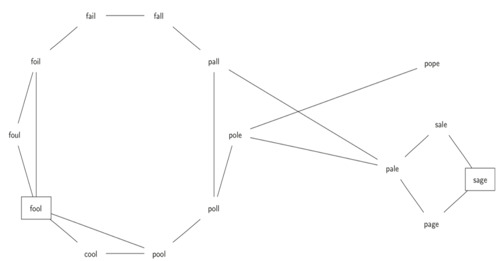

- 为了跟踪顶点的加入过程，并避免重复顶点，要为顶点增加3个属性

    - 距离distance：从起始顶点到此顶点的路径长度；
    - 前驱顶点pred：可追溯到起始顶点的反向路径；
    - 颜色color：标识了此顶点是尚未发现（白色）、已经发现（灰色）、还是已经完成探索（黑色）

    ```python
    #对VertBase进行扩充，
    #增加了distance, color, pred
    #和discovery, finish属性,
    #从而对BFS/DFS搜索算法进行支持。
    import sys
    class Vertex(VertBase):
        def __init__(self, key):
            super().__init__(key)
            self.color = 'white'
            self.distance = sys.maxsize
            self.pred = None
            """
            self.pred = []
            前驱可能有多个值，用一个列表来存放。
            这样可以通过BFS算法找出所有的最短路径。
            """
            self.discovery = None
            self.finish = None
    ```

- 引入队列管理搜索顺序
    - 算法必须依赖一个**队列 (Queue)** 结构来管理已发现但尚未探索邻居的顶点。
    - 队列严格遵循先进先出（FIFO）原则：新发现的顶点被加入队尾，而算法总是从队首取出下一个顶点进行深入探索，从而确保了“广度优先”的推进次序。

- 前驱指针构建生成树
    - 在搜索过程中，每当通过当前顶点发现一个新顶点时，需要将新顶点的“前驱（Parent/Predecessor）”指针指向当前顶点。
    - 这种前驱顶点的记录方式，将原本复杂的网状图搜索路径巧妙地转换、约束成了一棵清晰的“树”型结构。

- 算法初始化配置
    - 从起始顶点 $s$ 开始，将其标记为刚发现的“灰色”顶点，其距离属性初始化为 0，前驱节点设为 `None`。
    - 随后将该起始顶点 $s$ 推入队列，正式开启基于队列的循环迭代搜索过程。

- 循环迭代与邻居遍历
    - **出队操作**：从队首取出一个顶点作为当前核心顶点进行处理。
    - **邻居探索**：遍历当前顶点的所有邻接顶点。若遇到尚未被发现的“白色”顶点，则将其颜色改为“灰色（已发现）”，其距离值在当前顶点基础上加 1，前驱顶点指针指向当前顶点，并将其推入队列尾部。

- 状态更新与循环复位
    - 当当前顶点的所有邻接顶点均被遍历、处理完毕后，将该当前顶点的颜色状态修改为“黑色（已完全探索）”。
    - 算法随后循环回到出队步骤，继续处理队列中的下一个队首顶点，直至队列为空。

#### 运行图例

- 完成探索`fool`

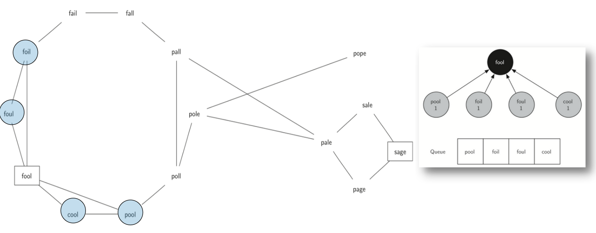

- 完成探索`pool`


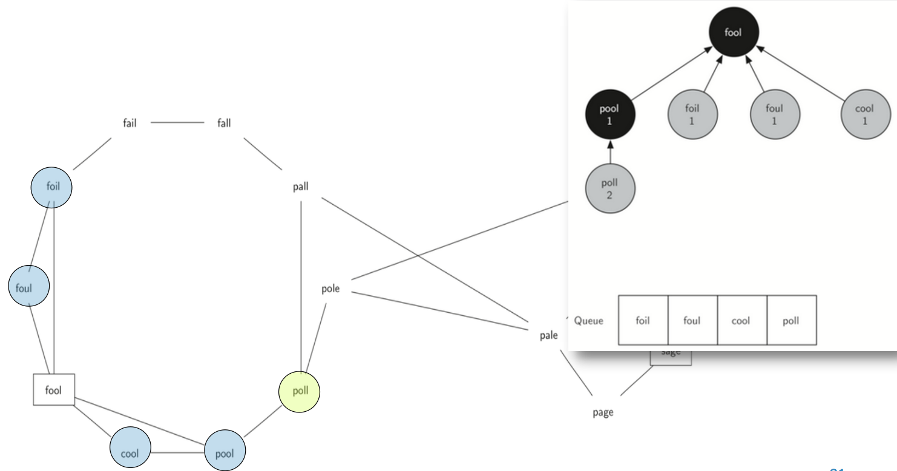

- 完成探索`foil, foul, cool`


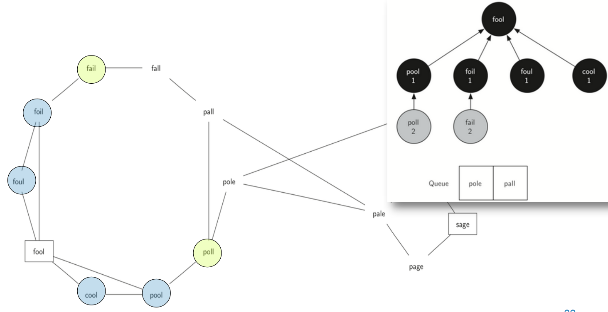

- 发现`sage`

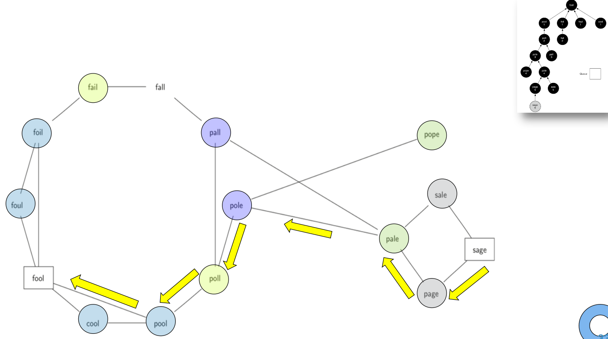

#### 代码

- BFS


```python
def bfs(g, start):
    start.setDistance(0)
    start.setPred(None)
    Queue = Queue_on_list
    vertQueue = Queue()
    vertQueue.enqueue(start)
    while (vertQueue.size() > 0):
        currentVert = vertQueue.dequeue()         #取出队首顶点进行搜索
        for nbr in currentVert.getConnections():
            if (nbr.getColor() == 'white'):       #发现新的相邻顶点
                nbr.setColor('gray')
                nbr.setDistance(currentVert.getDistance() + 1)
                nbr.setPred(currentVert)
                vertQueue.enqueue(nbr)
        currentVert.setColor('black')             #当前顶点完成搜索
```

- 顶点和队列 

```python
import sys
class Vertex(VertBase):
    def __init__(self, key):
        super().__init__(key)
        self.color = 'white'
        self.distance = sys.maxsize
        self.pred = None
        """
        self.pred = []
        前驱可能有多个值，用一个列表来存放。
        这样可以通过BFS算法找出所有的最短路径。
        """
        self.discovery = None
        self.finish = None

    def setDiscovery(self, t):
        self.discovery = t

    def setFinish(self, t):
        self.finish = t

    def getDistance(self):
        return self.distance

    def setDistance(self, dist):
        self.distance = dist

    def setPred(self, pred):
        self.pred = pred

    def getPred(self):
        return self.pred

    def getColor(self):
        return self.color

    def setColor(self, color):
        self.color = color


class Queue_on_list:
    def __init__(self):
        self.items = []
    def isEmpty(self):
        return self.items == []
    def enqueue(self, item):
        self.items.insert(0, item) #0为队尾
    def dequeue(self):
        return self.items.pop()
    def size(self):
        return len(self.items)
```

- 基于 BFS 状态的路径反向追溯
    - 当 BFS 算法以 FOOL 为起始顶点运行完毕后，单词关系图中的每个可达顶点都已完成了状态着色，并正确设置了距离值与前驱指针。
    - 此时，只需设计一个简单的“回途追溯函数（Backtracking Function）”，从目标单词顶点开始，沿着前驱指针（Parent）逆向查找，即可顺藤摸瓜地确定从 FOOL 到任何目标单词顶点的最短词梯路径。

```python
def traverse(y):
    x = y
    while (x.getPred()):
        print(x.getId())
        x = x.getPred()
    print(x.getId())
```

#### 运行示例

```python
if __name__ == "__main__":
    g = buildGraph("vocabulary.txt")
    bfs(g, g.getVertex('FOOL'))
    target = input("traverse:")
    traverse(g.getVertex(target))
    #print(len(g.getVertices()))
    #print(g.vertices)
```

- 思考：
    - FOOL到其他单词顶点的最短词梯可能有多条，BFS能得到所有的最短词梯解么？
    - 为什么？

### 算法分析 

- BFS 算法的主体双重循环嵌套复杂度
    - **外层 While 循环开销**：外层的 `while` 循环负责对图中的每个可达顶点进行出队与访问。由于在标准流程中每个顶点最多只会入队并出队一次，因此该部分的时间复杂度为 $O(|V|)$。
    - **内层 For 循环开销**：嵌套在其中的 `for` 循环用于遍历当前顶点的所有邻接边。在有向图或无向图中，每条边只有在其起始顶点出队时才会被检查。既然每个顶点最多出队一次，所有的边在整个搜索过程中也最多被检查一次，因此该部分总的时间复杂度为 $O(|E|)$。
    - **搜索总体复杂度**：将顶点处理与边处理的开销相加，经典 BFS 算法的总体时间复杂度表现为线性级别的 $O(|V| + |E|)$。

- 词梯问题完整生命周期的算法复杂度
    - **路径回溯部分**：在 BFS 生成树构建完成后，利用回溯函数从目标顶点逆向追溯到起始顶点的过程，其路径长度在极端情况下不会超过顶点的总数，因此该步骤的时间复杂度最多为 $O(|V|)$。
    - **建图部分的复杂度思考**：解决整个词梯问题的首要步骤是创建单词关系图。根据前面讨论的不同建图策略，其复杂度有本质区别：
        - 若采用**暴力比对法**（每个单词与其余所有单词比对），时间复杂度为 $O(n^2 \cdot L)$，其中 $n$ 为单词总数（即 $|V|$），$L$ 为单词长度。
        - 若采用**通配符分桶法**（空间换时间），遍历所有单词并按桶聚类的时间复杂度可大幅优化至 $O(n \cdot L)$，而在桶内建立边关系的时间复杂度取决于桶的平均大小和稠密程度，整体表现远优于暴力法。


## 骑士周游问题

- 骑士周游（Knight's Tour）问题概述
    - 在国际象棋棋盘上，棋子“马”按“马走日”规则移动，目标是从某一格子出发，不重复地恰好走遍棋盘上每个格子一次。
    - 这种能够完美覆盖棋盘所有格子的合法移动序列，被称为一次**“周游”**。
    - 在 $8 \times 8$ 的标准棋盘上，合法的周游数量高达 $1.305 \times 10^{35}$ 个，而走棋过程中无路可走的失败路径更是多到难以计数。

    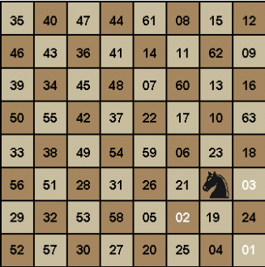

- 基于图搜索的解题步骤
    - 采用图搜索算法是解决该问题最容易理解和编程的方案之一，整体流程分为两步：
    - **第一步：构建走棋图**——将棋盘上的每一个格子抽象为图中的顶点。如果马能从格子 A 合法跳到格子 B，则在两个顶点之间建立一条边。
    - **第二步：搜寻特定路径**——利用图搜索算法，在图中寻找一条总长度（边数）恰好为 $\text{行} \times \text{列} - 1$ 的路径（如 $8 \times 8$ 棋盘上为 63 步）。
    - **路径的核心约束**：该路径必须包含图中的每一个顶点**恰好一次**。在图论中，这种不重复遍历所有顶点的路径被称为**哈密顿路径（Hamiltonian Path）**。

### 构建骑士周游图


- 将棋盘格抽象为图的顶点
    - 将棋盘上的每一个格子作为图中的一个顶点（Vertex）。
    - 对于 $8 \times 8$ 的棋盘，可以直接使用行列坐标（如 `(row, col)` 或 `0` 到 `63` 的数字）作为顶点的唯一标识键（Key）。

- 将合法走棋步骤抽象为连接边
    - 严格按照“马走日”的规则，计算当前格子在棋盘边界内所有可能跳跃到的目标格子。
    - 如果马能从格子 A 一步跳到格子 B，就在顶点 A 和顶点 B 之间建立一条无向边。
    - 下图为$5 \times 5$ 的棋盘，连接`12`格子的八条边

    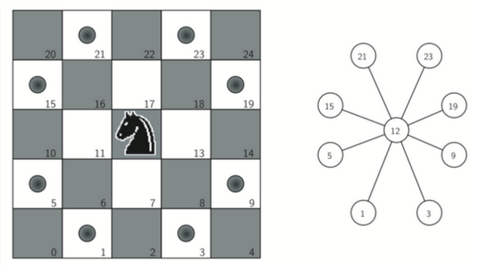

- 建立完整的走棋关系图
    - 通过遍历棋盘上的每一个格子，计算并连接它们所有合法的下一步落子点，从而构建出整张走棋关系图。
    - 处于棋盘中央的格子最多可以向外辐射出 8 条边，而靠近边缘或角落的格子由于受边界限制，其合法边数会大幅减少（最少仅剩 2 条边）。

#### 代码

```python
def knightGraph(bdSize):
    ktGraph = Graph(Vert=Vertex)
    for row in range(bdSize):                         #遍历每一行
        for col in range(bdSize):                     #遍历行上的每一个格子
            #按照“马走日”，返回下一步可能的位置
            for e in legalMoves(row, col, bdSize):
                ktGraph.addEdge((row, col), e)  #在骑士周游图中为两个格子加一条边
    return ktGraph

def legalMoves(x, y, bdSize):
    offsets = [(-1, -2), (-1,2),(-2,-1),(-2,1),
                   (1, -2), (1,2), (2,-1), (2,1)]    #马走日的8种走法
    for ix, iy in offsets:
        #检查一下不能走出棋盘
        if 0 <= x+ix < bdSize and 0 <= y+iy < bdSize:
            yield(x+ix, y+iy)
```

- $8\times 8$棋盘生成的图
    - 具有336条边，相比起全连接的4096条边，64*64的邻接矩阵，仅8.2%，还是稀疏图

    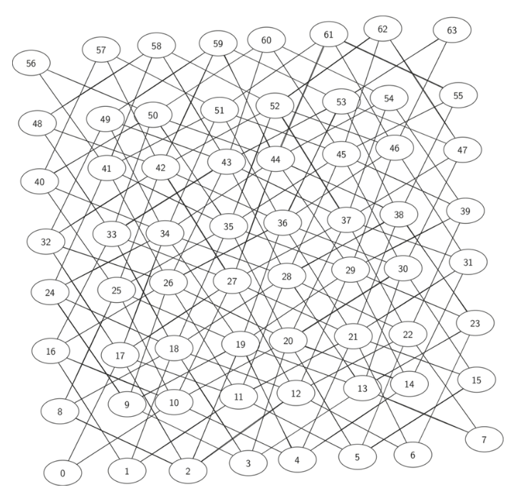

### DFS算法

- 深度优先搜索（DFS）的算法特性
    - 与 BFS 逐层横向构建搜索树不同，DFS 会沿着树的单一分支尽可能深地向下探索。
    - 如果搜索到无法继续（死胡同）且仍未找到解，算法会触发**回溯（Backtracking）**机制，退回上一个节点并尝试探索其他分支。

- DFS 的两种主要实现形式
    - **专用于骑士周游的 DFS**：特点是带有特定步数计数器，要求每个顶点在一条路径中**仅能访问一次**，一旦达到目标步数即刻终止。
    - **通用型 DFS**：设计更为底层和通用，允许在不同阶段重复访问顶点（用于计算时间戳等），是拓扑排序和强连通分量等高级图算法的基础。

- 骑士周游的 DFS 核心求解思路
    - **状态标记**：从指定的起点顶点出发，每成功走一步，就将对应节点标记为“已访问”颜色。
    - **死胡同判定与回溯**：若当前节点的所有邻接节点都已被访问过，且当前路径长度未达到预定值（如 $8 \times 8$ 棋盘下的 63 步），则说明此路不通。
    - **撤销与换向**：此时算法会清除当前顶点的颜色标记（恢复为未访问状态），并“回退一步”到前驱节点，换用另一个相邻分支继续向下深入探索。

#### 代码

- 棋盘建图已经完成，u为图中顶点
- 搜索的路径记录在path中

```python
def knightTour(n, path, u, limit):
    """
    n:层次；path:路径；u:当前顶点；limit:搜索总深度
    """
    u.setColor('grey')
    path.append(u)                                   #当前顶点涂色并加入路径
    if n < limit:
        nbrList = list(u.getConnections())           #对所有的合法移动依次深入
        for nbr in nbrList:
            #选择“白色”未经深入的点, 层次加一，递归深入
            if nbr.getColor() == 'white' and knightTour(n+1, path, nbr, limit):
                return True
        else:                                        #所有的“下一步”都试了走不通
            path.pop()                               #回退途径
            u.setColor('white')                      #改回颜色
            return False                             #回到上一层，尝试下一个顶点
    else:       # n==limit，基本结束条件
        return True

```

#### 算法图示

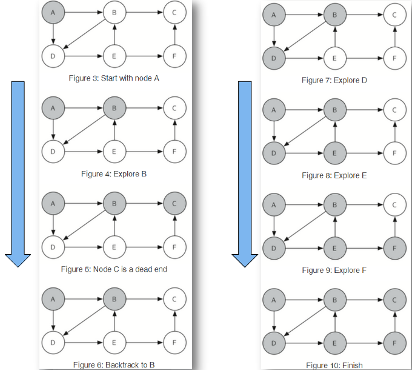

#### 算法演示

```python
if __name__ == "__main__":
    bd_size = int(input("Please input board size:"))
    g = knightGraph(bd_size)
    path=[]
    start = g.getVertex((1, 1))
    if knightTour(0, path, start, bd_size**2 - 1):
        for i, v in enumerate(path):
            print(i, v.id)
    else:
        print("knight tour failed!")
```

### 算法分析

- 算法的递归与搜索次序
    - `knightTour` 算法采用递归实现，每前进一步递归深度即加 1。
    - 算法的执行效率高度依赖于邻居列表 `nbrList` 中顶点的**搜索次序**。

- 棋盘扩大导致的性能危机
    - **$5 \times 5$ 棋盘**：搜索空间较小，大约 **1.5 秒** 即可找到一条周游路径。
    - **$8 \times 8$ 棋盘**：搜索空间呈爆炸式增长，需要 **半小时以上** 才能得到一个解。

- 指数级复杂度与搜索树
    - 算法的时间复杂度高达 $O(k^n)$，其中 $n$ 是棋盘格数，$k$ 是每一步的平均走法数。
    - 这是一种**指数时间复杂度**算法，其搜索轨迹构成了一棵层数为 $n$、分支巨大的巨型搜索树。

    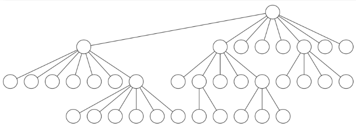

### 算法改进

- 算法大幅改进的前提条件
    - **核心前提**：问题并不需要找出所有的周游路径，**只要找出任意一种合法解**就可以立即终止并返回，这为分支优化提供了巨大空间。
    - **速度质变**：通过灵巧构造 `nbrList` 的访问次序，能将 $8 \times 8$ 棋盘的搜索时间直接从半小时以上降低到**秒级**。

- Warnsdorff 算法的分支优化
    - **代码微调**：将原始顺序 `nbrList = list(u.getConnections())` 修改为排序后的 `nbrList = orderByAvail(u)`。
    - **排序规则**：将当前格子的合法移动目标进行排序，**下一步合法移动目标最少（出度最小）的格子优先搜索**。

- 性能提升的内在机理（思考与尝试）
    - **为什么能提高性能（稳扎稳打）**：优先占领边缘和角落等“最难触及”的格子。如果不先走这些格子，它们很容易在后期变成无法到达的孤立死胡同，引发灾难性的回溯。
    - **反向次序会如何**：如果优先走目标多的中心格子，骑士会孤军深入开阔地，导致四周的边缘格子迅速被孤立。算法将陷入无休止的“进退维谷”和深度回溯中。

- 启发式规则（Heuristic）与 DFS 剪枝
    - **概念应用**：这种利用先验知识改进算法性能的做法称为**启发式规则**，广泛应用于人工智能领域（如黑白棋的“金角银边”口诀、传统棋类程序的预存棋谱），能极大地缩小搜索范围。
    - **DFS 优化策略**： **剪枝（Pruning）** 是其核心，通过提前评估，一旦确认当前分支是无法走通的死路，便立刻提前返回，不再向下做无谓的深层搜索。

#### 改进后代码

```python
def orderByAvail(n):
    resList = []
    for v in n.getConnections ():
        if v.getColor() == 'white':
            c = 0
            for w in v.getConnections():
                if w.getColor() == 'white':
                    c = c + 1
            resList.append ((c,v))
    resList.sort(key=lambda x: x[0])
    return [y[1] for y in resList]

def knightTour(n, path, u, limit):
    """
    n:层次；path:路径；u:当前顶点；limit:搜索总深度
    """
    u.setColor('grey')
    path.append(u)                                   #当前顶点涂色并加入路径
    if n < limit:
        nbrList = orderByAvail(u)                    #合法移动目标最少的选择优先
        for nbr in nbrList:
            #选择“白色”未经深入的点, 层次加一，递归深入
            if nbr.getColor() == 'white' and knightTour(n+1, path, nbr, limit):
                return True
        else:                                        #所有的“下一步”都试了走不通
            path.pop()                               #回退途径
            u.setColor('white')                      #改回颜色
            return False                             #回到上一层，尝试下一个顶点
    else:       # n==limit，基本结束条件
        return True
```

- 改进后的效果

```python
if __name__ == "__main__":
    bd_size = int(input("Please input board size:"))
    g = knightGraph(bd_size)
    path=[]
    start = g.getVertex((1, 1))
    if knightTour(0, path, start, bd_size**2 - 1):
        for i, v in enumerate(path):
            print(i, v.id)
    else:
        print("knight tour failed!")
```

## 通用的深度优先搜索

- 骑士周游与通用 DFS 的本质区别
    - **骑士周游的 DFS**：是一种极端的特例，目标是建立一棵**没有分支、单支最深**的生成树，本质是寻找一条包含所有顶点的哈密顿路径。
    - **通用 DFS**：目标更为宽泛，旨在尽量深地搜索并连接图中尽可能多的顶点，必要时**允许并会创建大量分支**（形成多棵树的结构）。

- 深度优先森林与前驱属性
    - **深度优先森林**：当图不是强连通或者存在多个连通分量时，通用 DFS 无法从一个起点遍历全图，此时会多次选择新起点，从而创建多棵树，统称为“森林”。
    - **前驱构建**：通用 DFS 同样依赖顶点的“前驱（Predecessor）”属性来隐式或显式地勾勒出树与森林的拓扑拓扑骨架。

- 关键时间戳属性：发现时间与结束时间
    - **发现时间（Discovery Time）**：算法在第几步首次访问到该顶点（即顶点状态由白色变为**灰色**时记录的步数/计数器值）。
    - **结束时间（Finish Time）**：算法在第几步彻底完成了对该顶点及其所有邻接分支的探索（即顶点状态由灰色变为**黑色**时记录的步数/计数器值）。
    - **应用价值**：这两个时间戳属性对于后续的图拓扑排序、寻找强连通分量（SCC）等高级图算法至关重要。

- 全图遍历与无需回撤特性
    - **全面遍历**：通用 DFS 的核心本质是在搜索过程中不漏地到达图的每一个顶点，完美实现图的“遍历（Traversal）”。
    - **无需回撤**：与骑士周游问题中因为“死路”而必须清除标记并频繁“回撤（Backtracking）”不同，通用 DFS 一旦染黑顶点便不再回溯改变量，它是一个一往无前、定格历史状态的底层框架。

### 图的实现

- DFS 图与顶点的类成员扩展
    - **顶点扩展**：`Vertex` 类增加了 `discovery`（发现时间）和 `finish`（结束时间）两个整型成员变量，用于记录状态变换时的步数。

    ```python
    #对VertBase进行扩充，
    #增加了distance, color, pred
    #和discovery, finish属性,
    #从而对BFS/DFS搜索算法进行支持。
    import sys
    class Vertex(VertBase):
        def __init__(self, key):
            super().__init__(key)
            self.color = 'white'
            self.distance = sys.maxsize
            self.pred = None
            """
            self.pred = []
            前驱可能有多个值，用一个列表来存放。
            这样可以通过BFS算法找出所有的最短路径。
            """
            self.discovery = None
            self.finish = None
    ```

    - **图级扩展**：`Graph` 的子类增加了成员变量 `time`，作为全局计数器，用于在算法执行过程中精确记录当前的步骤数目。

    ```python
    class DFSGraph(Graph):
        def __init__(self, other = None):
            super().__init__(Vertex, other)
            self.time = 0                # 不是物理时间，而是算法执行步数
    ```
### DFS代码

- DFS 方法的驱动与入口
    - `dfs` 作为 `DFSGraph` 类的主体方法，负责全图的初始化和循环调度。
    - 它遍历图中的每一个顶点，若顶点为未发现的白色，则调用专门的递归工作马（workhorse）方法：`dfsvisit`。

- 核心递归方法 `dfsvisit`
    - `dfsvisit` 是实际执行深度纵向探索的递归函数。
    - 每次进入该方法，它会更新全局 `time` 并记录当前顶点的发现时间，随后遍历邻接顶点进行深层递归，并在所有邻居探索完毕后记录结束时间。

    ```python
    class DFSGraph(Graph):
        def __init__(self, other = None):
            super().__init__(Vertex, other)
            self.time = 0                # 不是物理时间，而是算法执行步数

        def dfs(self):
            for aVertex in self:
                aVertex.setColor('white')   # 颜色初始化
                aVertex.setPred(None)
            for aVertex in self:           # 从每一个顶点开始遍历
                if aVertex.getColor() == 'white':
                    self.dfsvisit(aVertex) # 建立一个以aVertex为根的树
                                           # 如果有多棵树，则形成森林
        def dfsvisit(self, startVertex):
            startVertex.setColor('gray')
            self.time += 1                 # 记录算法的步数
            startVertex.setDiscovery(self.time)
            for nextVertex in startVertex.getConnections():
                if nextVertex.getColor() == 'white':
                    nextVertex.setPred(startVertex)
                    self.dfsvisit(nextVertex)   #深度优先递归访问
                """
                DFS过程中发现了圈
                elif nextVertex.getColor() == 'gray':
                    raise ValueError("Ring detected")
                """

            startVertex.setColor('black')
            self.time += 1
            startVertex.setFinish(self.time)
    ```

- 隐式栈与 BFS 的底层区别
    - **BFS 机制**：广度优先搜索显式地采用**队列（Queue）**作为辅助结构，实现先进先出的逐层横向扩展。
    - **DFS 机制**：深度优先搜索则通过**递归调用**函数自身，隐式地利用了系统底层的**栈（Stack）**结构，从而实现后进先出的纵向单支深入。

### 算法图示

- ⚠️ 与骑士周游中的无分枝DFS相比较，对于顶点C的处理不同

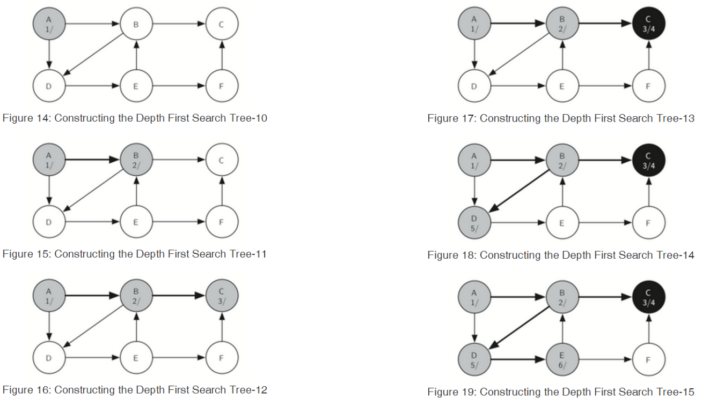 <br>

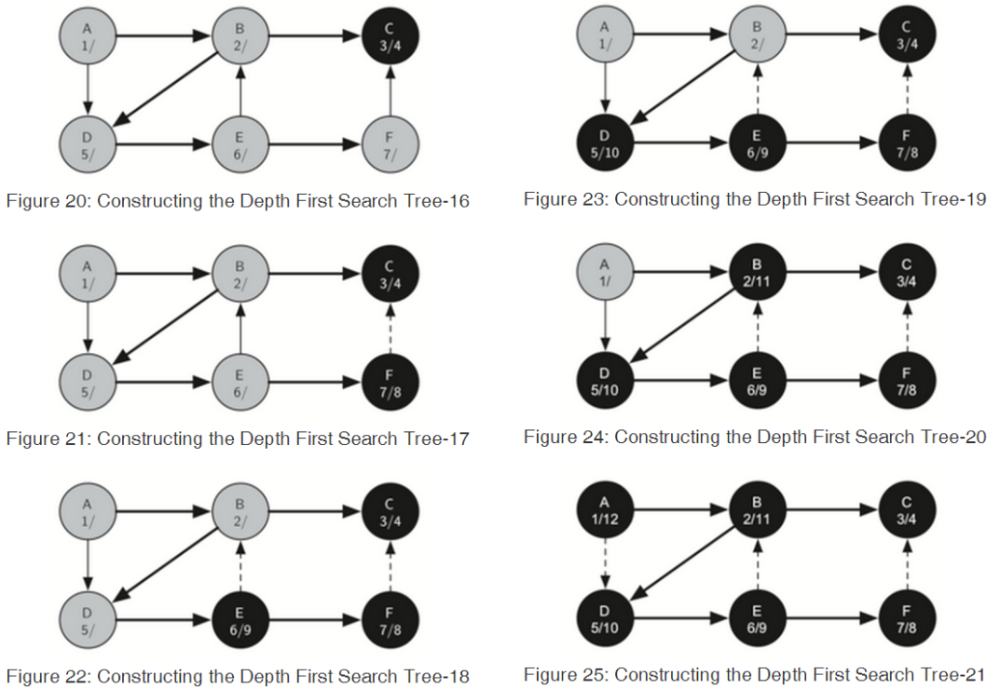

### 算法分析 

- 通用 DFS 的状态定格特性
    - **无回撤标记**：当当前顶点的所有邻接邻居都被访问完毕后，算法将其状态直接标记为黑色（访问“完成”）。
    - **对比骑士周游**：它不会像骑士周游 DFS 那样为了尝试其他路径而将节点重新抹白并执行回撤（Backtracking），而是定格状态，一往无前。

- 时间戳的括号化性质（Parenthesis Property）
    - **结构化包含**：通用 DFS 树中顶点的 `discovery` 和 `finish` 时间戳呈现出完美的嵌套括号特征。
    - **时间轴规律**：一个祖先顶点的发现时间必然**早于（小于）**其所有子孙顶点的发现时间；而其结束时间也必然**晚于（大于）**所有子孙顶点的结束时间，形成跨度上的完全包含。

- 连通性分支与 DFS 森林生成
    - **单次遍历边界**：`dfsvisit` 函数启动后，会势如破竹地访问完当前起点**所有可达**的结点，并将它们无一例外地归入到同一棵深度优先生成树中。
    - **森林的构建**：外层 `dfs()` 函数通过循环多次调用 `dfsvisit`，可以逐个攻破图里相互孤立的连通分量，从而生成多棵互不相交的树，统称为 **DFS 森林**。

- 算法运行时间与嵌套循环误区
    - **复杂度叠加**：通用 DFS 的总体时间复杂度与 BFS 一样，依然是平稳的 $O(|V| + |E|)$。
    - **避坑指南（为何不是乘积）**：虽然 `dfs` 内部嵌套调用了 `dfsvisit`，但并非每个顶点都会重复触发完整的边遍历。每个顶点这辈子**只会进入 `dfsvisit` 一次**（由白变灰），每条边也只会在其起始顶点被访问时**被检查一次**。两者的开销在宏观上是“各司其职”的加法关系，而非相乘。

### 深度优先搜索树（林）的性质

通用的深度优先搜索算法被其他算法广泛采用，我们需要先讨论它的一些性质：

- 路径与顶点序定义
    - **路径记法**：图 $G$ 中从顶点 $u$ 到顶点 $v$ 的路径 $P = (u, x, \ldots, y, v)$ 简记为 $u \rightarrow v$。
    - **顶点大小定义**：对于图中任意两个顶点 $u$ 和 $v$，其大小关系通过结束时间（`finish`）严格定义为：$$\forall u,v \in G, \quad u < v \equiv u.fin < v.fin$$ 即结束时间越早，节点越小。

- 子树大小与路径存在性
    - **子树大小定义**：由于同一棵子树内所有结点的 `fin` 时间在时间轴上是连续的，因此可以定义两棵互不相交子树 $t1$ 和 $t2$ 的大小关系为：$$t1 < t2 \equiv \forall u \in t1, \forall v \in t2, \quad u < v$$
    - **路径不存在定理**：如果满足 $t1 < t2$ 且 $u \in t1, v \in t2$，则图中**绝对不存在**从 $u$ 到 $v$ 的路径（$u \rightarrow v$）。因为若存在路径，根据通用 DFS 的特性，在探索 $u$ 时必然会顺藤摸瓜延展到 $v$，这与 $t1$ 先于 $t2$ 结束探索的假设相矛盾。

- 同树内大小关系的结构特征
    - 如果在同一棵 DFS 生成树中满足 $u < v$（即 $u$ 比 $v$ 更早结束探索），则它们在树中的拓扑拓扑关系**只有以下两种可能**：
    - **可能一（祖先关系）**：$v$ 是 $u$ 的直系祖先。因为祖先具有更晚结束的“括号包含”性质，即 $v.fin > u.fin$。
    - **可能二（兄弟/堂表关系）**：$u$ 和 $v$ 拥有共同的祖先 $t$，它们分别属于 $t$ 的两棵不相交子树 $t1$ 和 $t2$，且满足子树序 $t1 < t2$。也就是说，$u$ 所在的整个分支都比 $v$ 所在的整个分支更早被完全探索并染黑。

- 例题
    -  给定一个无向图 G，从顶点 V0 出发进行无向图 G 的深度优先遍历，
    访问的边集合为： {(V0,V1), (V0,V4), (V1,V2), (V1,V3), (V4,V5), (V5,V6)}，
    则下面哪条边不能出现在 G 中？

        1. (V0, V2)
        1. (V4, V6)
        1. (V4, V3)
        1. (V0, V6)

        <details>
        <summary>
            答案
        </summary>

        $V3 \in T(V1), V4 \in T(V4)$, 如果存在边(V4, V3)，破坏了前面的 **路径不存在定理**

        </details>

    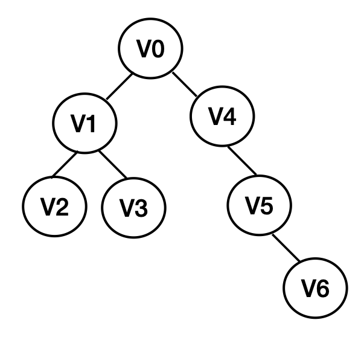

    - hints: 无向图可以看成 **双向图**，套用有向图的算法

## 拓扑排序

**拓扑排序Topological Sort** 是一种重要的图上的算法，它解决一类问题：如何在不违反任何先后依赖关系的前提下，给一堆交织的任务排出一个合法的先后执行顺序。

以下面的 **制作薄煎饼** 为例：

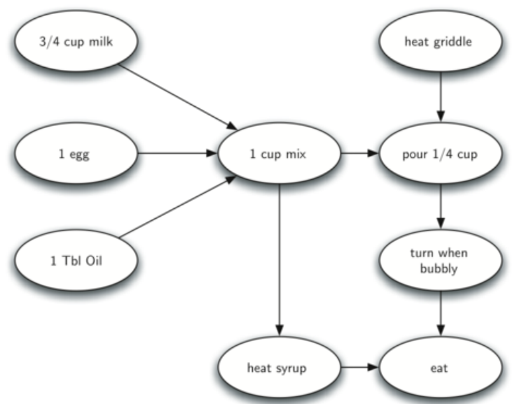

- 薄煎饼制作的依赖图（DAG）
    - 这张图直观地展示了制作薄煎饼（Pancake）时，各个独立步骤之间的**有向依赖关系**。
    - **顶点（椭圆）** 代表具体的操作步骤（如准备原料、加热、烹饪、食用）。
    - **有向边（箭头）** 代表严格的先后执行顺序，箭头由前置条件指向后续步骤。

- 原料准备与混合阶段（左侧分支）
    - 顶部的三个独立顶点 `3/4 cup milk`（3/4 杯牛奶）、`1 egg`（1 个鸡蛋）和 `1 Tbl Oil`（1 汤匙油）共同指向中央的 `1 cup mix`（1 杯预拌粉）。
    - 这意味着在进行混合搅拌（`1 cup mix`）之前，这三种基础原料必须全部准备就绪。

- 烹饪与加热阶段（右侧与中部连接）
    - **并行分支一**：右上角的 `heat griddle`（加热烤盘）独立进行，并在完成后指向 `pour 1/4 cup`（倒入 1/4 杯面糊）。
    - **并行分支二**：混合好的面糊（`1 cup mix`）也指向 `pour 1/4 cup`。说明只有当**烤盘热了**且**面糊调好**时，才能执行倒面糊的操作。
    - **后续线性流程**：倒好面糊后，顺着箭头依次执行 `turn when bubbly`（起泡时翻面），最后指向终点 `eat`（享用）。

- 调味酱的独立依赖（底部连接）
    - 中央的 `1 cup mix` 还有一条向下的分支指向 `heat syrup`（加热糖浆），而加热好的糖浆最终也指向 `eat`。
    - 这表明糖浆应该在面糊混合好之后开始加热，并且它和煎好的饼共同作为 `eat` 的必要前置条件。


### 拓扑排序的定义与实现

- 拓扑排序的定义与应用场景
    - **定义与输入输出**：拓扑排序输入一个**有向无环图（DAG）**，输出顶点的线性序列。若图中存在有向边 $(v,w)$，则在线性序列中 $v$ 必须绝对出现在 $w$ 之前。
    - **广泛的应用领域**：该算法不仅适用于早餐制作等生活流排期，还广泛应用于**项目管理**（关键路径排期）、**数据库查询优化**（连接操作执行顺序）以及**矩阵乘法的次序优化**上。

- 基于通用 DFS 的算法实现
    - **核心步骤**：
        1. 对 DAG 图调用通用 DFS 算法，计算出每个顶点的“结束时间（`finish`）”。
        2. 按照每个顶点的结束时间**从大到小（降序）**进行排序。
        3. 顺次输出这个次序下的顶点列表，即为合法的拓扑序列。

- 拓扑排序正确性的反证法证明
    - **反证假设**：假设算法输出的序列不合法。即存在两个顶点满足 $u < v$（根据定义即 $u.fin < v.fin$，意味着 $u$ 在序列中排在 $v$ 的**后面**），但原图中却存在一条从 $u$ 到 $v$ 的有向边 $(u,v)$。
    - **推导矛盾**：
        - 当 DFS 访问到 $u$ 时，由于存在边 $(u,v)$，算法必然会考察顶点 $v$。
        - 此时 $v$ 的状态只可能有三种情况：
            1. **白色（未访问）**：DFS 会立即递归调用 `dfsvisit(v)`，$v$ 成为 $u$ 的后代，因此必然满足 $v.fin < u.fin$。
            2. **灰色（正在访问）**：这意味着 $v$ 是 $u$ 的祖先，从而存在一条从 $v$ 到 $u$ 的路径。结合已有的边 $(u,v)$，图中将出现**环路**，这与输入是 DAG（无环图）的前提相矛盾。
            3. **黑色（已完成）**：由于 $v$ 已经完成而 $u$ 还在探测中，必然满足 $v.fin < u.fin$。
    - **结论**：在所有合法情况下，都必然导向 $v.fin < u.fin$（即 $u > v$），与反证假设 $u.fin < v.fin$ 完全矛盾。因此，按结束时间降序排列的序列绝对合法。

### 完整代码

```python
#对VertBase进行扩充，
#增加了distance, color, pred
#和discovery, finish属性,
#从而对BFS/DFS搜索算法进行支持。
import sys
class Vertex(VertBase):
    def __init__(self, key):
        super().__init__(key)
        self.color = 'white'
        self.distance = sys.maxsize
        self.pred = None
        """
        self.pred = []
        前驱可能有多个值，用一个列表来存放。
        这样可以通过BFS算法找出所有的最短路径。
        """
        self.discovery = None
        self.finish = None

    def setDiscovery(self, t):
        self.discovery = t

    def setFinish(self, t):
        self.finish = t

    def getDistance(self):
        return self.distance

    def setDistance(self, dist):
        self.distance = dist

    def setPred(self, pred):
        self.pred = pred

    def getPred(self):
        return self.pred

    def getColor(self):
        return self.color

    def setColor(self, color):
        self.color = color

class DFSGraph(Graph):
    def __init__(self, other = None):
        super().__init__(Vertex, other)
        self.time = 0                # 不是物理时间，而是算法执行步数

    def dfs(self):
        for aVertex in self:
            aVertex.setColor('white')   # 颜色初始化
            aVertex.setPred(None)
        for aVertex in self:           # 从每一个顶点开始遍历
            if aVertex.getColor() == 'white':
                self.dfsvisit(aVertex) # 建立一个以aVertex为根的树
                                       # 如果有多棵树，则形成森林
    def dfsvisit(self, startVertex):
        startVertex.setColor('gray')
        self.time += 1                 # 记录算法的步数
        startVertex.setDiscovery(self.time)
        for nextVertex in startVertex.getConnections():
            if nextVertex.getColor() == 'white':
                nextVertex.setPred(startVertex)
                self.dfsvisit(nextVertex)   #深度优先递归访问
            """
            DFS过程中发现了圈
            elif nextVertex.getColor() == 'gray':
                raise ValueError("Ring detected")
            """

        startVertex.setColor('black')
        self.time += 1
        startVertex.setFinish(self.time)
```

### 算法演示

```python
def main():
    g = DFSGraph()
    #把做煎饼的步骤导入到图中
    g.addEdge("3/4 cup milk", "1 cup mix")
    g.addEdge("1 egg", "1 cup mix")
    g.addEdge("1 Tbl Oil", "1 cup mix")
    g.addEdge("1 cup mix", "heat syrup")
    g.addEdge("1 cup mix", "pour 1/4 cup")
    g.addEdge("heat griddle", "pour 1/4 cup")
    g.addEdge("pour 1/4 cup", "turn when bubbly")
    g.addEdge("turn when bubbly", "eat")
    g.addEdge("heat syrup", "eat")
    #g.addEdge("eat", "3/4 cup milk")

    g.dfs()
    vertices = [vert for vert in g]
    vertices.sort(key=lambda x:x.finish, \
            reverse=True)
    for vert in vertices:
        print(f"{vert.getId()} {vert.discovery}/{vert.finish}")

if __name__ == "__main__":
    main()
```

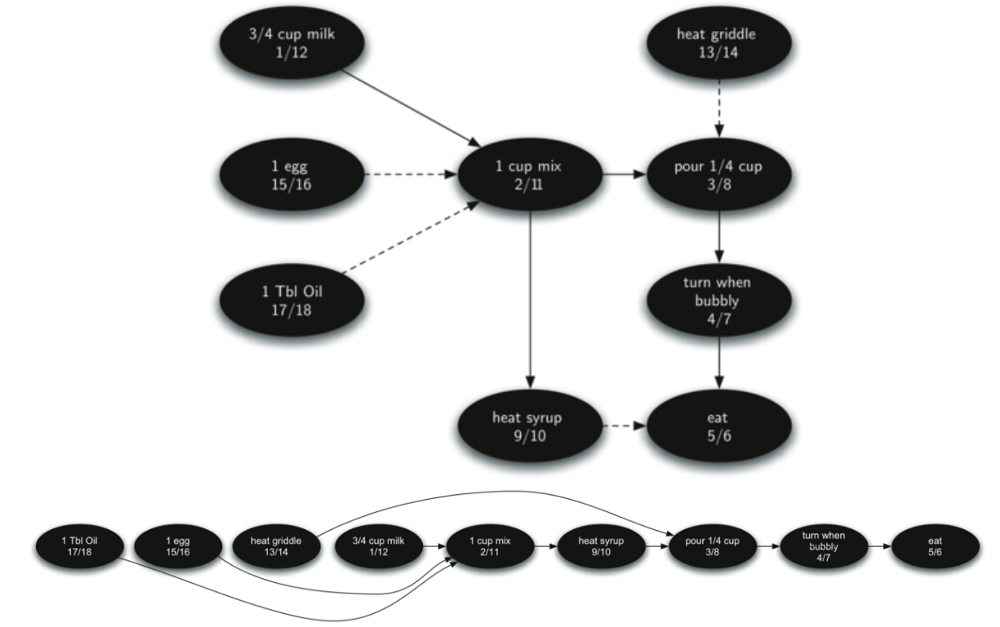

### 拓扑排序算法II

- 基于入度的拓扑排序，卡恩(Kahn)算法
    - **零入度核心**：图中入度为 0 的顶点意味着它不依赖任何其他前置任务，可以直接被安全地从图中取出并加入到拓扑排序序列中。
    - **递推迭代**：每次取出一个顶点时，将其指向的所有下游邻接顶点的入度减 1（即更新余下顶点的入度），随后重复寻找新产生的“零入度”顶点，直至全图顶点被处理完毕。

- 圈（环路）的自动检测机制
    - **死锁判定**：如果图中还有顶点没有被取出排序，但此时在剩余的顶点里再也找不到任何一个“零入度”的顶点，即说明图中存在“圈（环路）”。
    - **应用价值**：这使得基于入度的排队算法天然具备了检测有向图是否合法（是否有死循环依赖）的能力。

- 代码
```python
def topSort(g):
    result = []
    while len(g) > 0:
        zeroIn = [vert for vert in g if vert.inDegree == 0]
        if len(zeroIn) == 0:
            raise ValueError("Ring detected")
        for vert in zeroIn:
            result.append(vert.getId())
            g.delVertex(vert.getId())
    return result
```

- 测试代码
```python
if __name__ == "__main__":
    g = Graph()
    #把做煎饼的步骤导入到图中
    g.addEdge("3/4 cup milk", "1 cup mix")
    g.addEdge("1 egg", "1 cup mix")
    g.addEdge("1 Tbl Oil", "1 cup mix")
    g.addEdge("1 cup mix", "heat syrup")
    g.addEdge("1 cup mix", "pour 1/4 cup")
    g.addEdge("heat griddle", "pour 1/4 cup")
    g.addEdge("pour 1/4 cup", "turn when bubbly")
    g.addEdge("turn when bubbly", "eat")
    g.addEdge("heat syrup", "eat")
    #g.addEdge("eat", "3/4 cup milk")

    print(topSort(g))
```

```python

```

## 强连通分支问题

### 关联结点的聚集

- 互联网的两大超大规模图模型
    - **物理网络图**：由无数台主机/服务器作为顶点，通过物理网线、光纤或无线信号作为边连接而成的庞大硬联通网络。
    - **虚拟网页图**：由无数个网页（以唯一的 URI 作为顶点 ID）作为顶点，通过网页内嵌入的超链接（Hyperlink）作为有向边，交织形成的一个超级有向图。

    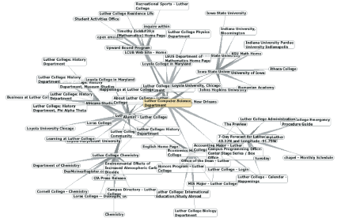


- 网页有向图的局部拓扑特征（以 Luther College 计算机系为例）
    - 将特定机构的网页及其引用的超链接转换为有向图后，往往会呈现出极具现实社会学和组织架构特性的**聚类与辐射现象**：
        1. **校内纵向生态**：图中密集包含了大量 Luther College 其他学系的网站链接，反映了同一机构内部的高度关联性与信息化协同。
        2. **同类地域横向连接**：图中包含了一些同处爱荷华州（Iowa）的其他大学或学院的网站，体现了地理位置相近或同类高校之间的学术与行政往来。
        3. **跨学科交叉辐射**：图中还延伸出了一些人文学院（Liberal Arts Colleges）的网站链接，展现了计算机学科在文理学院背景下跨领域融合、通识教育资源共享的图谱特征。

    

### 强连通分支定义

- Web 聚集结构与强连通分支（SCC）
    - **聚集猜想**：在互联网的超链接有向图中，底层结构往往存在着大量同类网站的密集聚集（如同类学系、友情链接圈）。
    - **SCC 的引入**：为了在复杂的有向图中挖掘出这些高度聚集的结点群，我们需要引入 **强连通分支（Strongly Connected Components, SCC）** 算法。

- 强连通分支的数学定义
    - **双向可达性**：对于图 $G$ 的一个顶点子集 $C$，如果其中任意两个顶点 $v$ 和 $w$ 都是**强连通**的（即既存在路径 $v \rightarrow w$，也存在路径 $w \rightarrow v$），则称它们具有双向来回的连通性。
    - **极大子集特性（Maximal）**：子集 $C$ 必须是具备该性质的**极大**集合。正如“增一分则太肥”，一旦向 $C$ 中强行加入任何外部顶点 $u$，都必然会破坏该子集内部的双向强连通性。
    - **DAG 的平凡性**：在有向无环图（DAG）中，由于绝对不存在任何环路，其所有的强连通分支都是**平凡的（Trivial）**——即每个 SCC 仅仅包含单个顶点本身。

- 强连通关系的等价性质
    - 顶点之间的强连通关系 $R$ 满足数学上的**等价关系**，具有以下关键定律：
        - **自反性**：$R(u, u)$ 恒成立（顶点到自身天然可达）。
        - **对称性（交换律）**：$R(u, v) \Rightarrow R(v, u)$，即可来亦可回。
        - **传递性**：$R(u, v) \land R(v, w) \Rightarrow R(u, w)$，即通过中间站 $v$ 可以建立 $u$ 到 $w$ 的双向桥梁。
    - 因为是等价关系，所以强连通分支本质上就是将图中的所有顶点划分成了若干个**互不相交的等价类**。

### 应用举例：顶点聚类

- 有向图的 SCC 缩点与 DAG 化简
    - **顶点聚类**：通过强连通分支（SCC）算法，我们可以将复杂的有向图顶点进行归类和打包。
    - **化简为 DAG**：如果将图中的每一个强连通分支分别“浓缩”成一个单一的复合顶点（组件节点），并保留分支之间的跨区域单向边，原本错综复杂的图就会被转化为一个结构清晰的**有向无环图（DAG）**。
        - 如果缩点后还有环，环上的有两个复合顶点P,Q，他们内部的任意两个顶点之间都是强连通的。这与SCC的 **极大子集特性（Maximal）** 矛盾。

    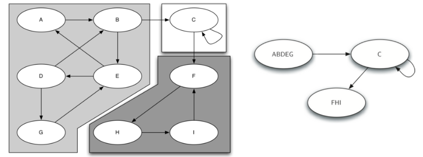

    - SCC与DAG是 **一体两面**的

- 社交网络中的精准营销应用
    - **社群圈子挖掘**：在现代社交网络中，强连通分支常用于识别具有高度凝聚力的“核心圈子”。
    - **商业变现（精准营销）**：例如，如果某一群体内的用户在关注、转发或互动上形成了强连通关系，且他们都对某款特定游戏表现出浓厚兴趣，系统便可以精准定位该圈子并集中投放广告，实现转化率极高的商业精准营销。

- 跨领域的高级应用：SAT 问题
    - **布尔方程可满足性（2-SAT）**：强连通分支在计算机理论科学中有着极为重要的应用。例如在解决 2-SAT 问题时，可以将逻辑隐含关系（如 $A \Rightarrow B$）构造成有向图。
    - **冲突检测与求解**：通过对该图运行 SCC 算法，如果发现变量 $X$ 和它的非状态 $\neg X$ 处于同一个强连通分支内（即互相蕴含导致悖论），就能瞬间判定该布尔方程组无解。


### 强连通分支计算

#### 有向图的转置

- 有向图转置（Transposition）的定义
    - **边的方向逆转**：一个有向图 $G = (V, E)$ 的转置图记为 $G^T$。它的顶点集合与原图完全相同，但所有有向边的方向全部反转。即如果原图中存在一条边 $(v, w)$，那么在转置图中对应的边就是 $(w, v)$。

- 强连通分支的等价性观察
    - **双向可达性守恒**：在原图 $G$ 中，如果顶点 $u$ 和 $v$ 属于同一个强连通分支，意味着它们之间存在双向路径（$u \rightarrow v$ 且 $v \rightarrow u$）。
    - **结构结构对称**：当把图转置为 $G^T$ 后，原本的路径 $u \rightarrow v$ 变成了 $v \rightarrow u$，而 $v \rightarrow u$ 变成了 $u \rightarrow v$。因此，$u$ 和 $v$ 在转置图中依然保持双向可达。
    - **数量与划分等价**：从宏观上看，**原图 $G$ 和转置图 $G^T$ 的强连通分支（SCC）在数量和顶点的划分上是完全等价的**。转置操作改变了宏观的流向，但并没有打破圈子内部的凝聚性。

    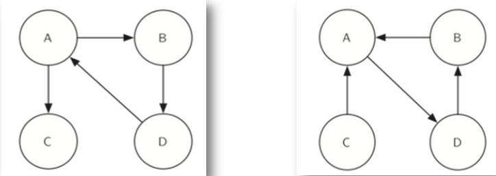

#### Kosaraju算法

- 科萨拉朱(Kosaraju `/ˌkoʊsəˈrɑːdʒuː/`)算法（双体 DFS 强连通分量算法）
    - **核心逻辑**：该算法在 $O(|V| + |E|)$ 的线性时间内，通过两次不同方向的 DFS 遍历，完美地将有向图中的所有极大强连通分量（SCC）剥离出来。
    - **标准步骤**：
        1. **第一阶段**：对原图 $G$ 调用通用 `dfs`，计算并记录每个顶点的结束时间 `finish`。
        2. **转置阶段**：将原图所有边反向，构造转置图 $G^T$。
        3. **第二阶段**：在 $G^T$ 上运行 `dfs`。**关键点**：外层调度循环必须按照第一阶段得出的 `finish` 时间**由大到小（倒序）**来选择起始顶点。
        4. **结果输出**：在第二阶段生成的深度优先森林中，每一棵独立的 DFS 生成树就精确对应原图中的一个极大强连通分支。

    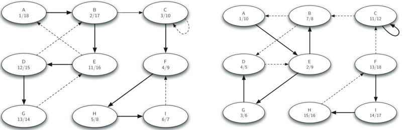<br>

    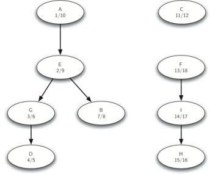

- 核心正确性证明（反证法）
    - **我们要证明的结论**：按结束时间倒序对 $G^T$ 进行 DFS 时，从某个顶点 $s$ 出发所能遍历到的所有未访问顶点，**当且仅当**是与 $s$ 属于同一个 SCC 的顶点。
    - **反证假设**：假设该算法出错了。这意味着在 $G^T$ 中，从 $s$ 出发进行 `dfsvisit` 时，“越界”访问到了一个**不属于** $s$ 所在 SCC 的顶点 $v$。
    - **推导矛盾**：
        - 既然在 $G^T$ 中存在路径 $s \xrightarrow{G^T} v$，那么在原图 $G$ 中必然存在反向路径 $v \xrightarrow{G} s$。
        - 此时由于 $v$ 和 $s$ 不在同一个 SCC 中，原图 $G$ 中**绝对不能**存在 $s \xrightarrow{G} v$ 的路径（否则它们就双向可达、属于同一个 SCC 了）。
        - 我们来看看在第一阶段的原图 $G$ 的 DFS 中，这两者的结束时间关系：
            - 因为原图存在 $v \xrightarrow{G} s$ 但不存在 $s \xrightarrow{G} v$，所以在第一阶段中，不论谁先被发现，$v$ 的探索结束时间必然晚于 $s$，即：$$v.fin > s.fin$$
        - 既然 $v.fin > s.fin$，那么在第二阶段对 $G^T$ 进行外层循环遍历时，结束时间更大的 $v$ **必须比 $s$ 更早被选为树根并划入它自己的 SCC 中**，从而被染成黑色。
        - 因此，当轮到 $s$ 作为树根开始在 $G^T$ 中探索时，$v$ 早已被访问并标记完成， $s$ **绝对不可能**在当前树中遇到白色的 $v$。
    - **结论守恒**：假设破灭。因此，第二阶段生成的每一棵树都“多一个嫌胖，少一个嫌瘦”，完美收录且仅收录所有的极大强连通分量。

- 实现代码

```python
class SCCGraph(DFSGraph):
    def SCC(self):
        gt = DFSGraph(self.T())
        gt.dfs()
        self.__dfs(gt)
        scc = {}
        for v in self:
            u = v
            while u.getPred():
                u = u.getPred()
            scc.setdefault(u, []).append(v)
        return scc.values()

    def __dfs(self, gt):
        for aVertex in self:
            aVertex.setColor('white')   # 颜色初始化
            aVertex.setPred(None)
        gtsfin=lambda x:gt.getVertex(x.getId()).finish
        #for aVertex in self:           # 从每一个顶点开始遍历
        for aVertex in sorted([i for i in self], key=gtsfin, 
                reverse=True):
            if aVertex.getColor() == 'white':
                self.dfsvisit(aVertex) # 第一次运行后还有未包括的顶点
                                       # 则建立森林

```

- 测试

```python
edges = [('A', 'B'), ('B', 'E'), ('B', 'C'), ('D', 'B'), ('D', 'G'), ('G', 'E'), ('E', 'D'), ('E', 'A')
    , ('C', 'C'), ('C', 'F'), ('F', 'H'), ('H', 'I'), ('I', 'F') ]

if __name__ == "__main__":
    g = SCCGraph()
    #建图
    for u, v in edges:
        g.addEdge(u, v)

    for group in g.SCC():
        print([v.getId() for v in group]) 

```

#### Tarjan算法

塔江(Tarjan `/ˈtɑːrdʒæn/`)算法是另一个图论中用于寻找有向图强连通分量（SCC）的经典算法。

<div align="center">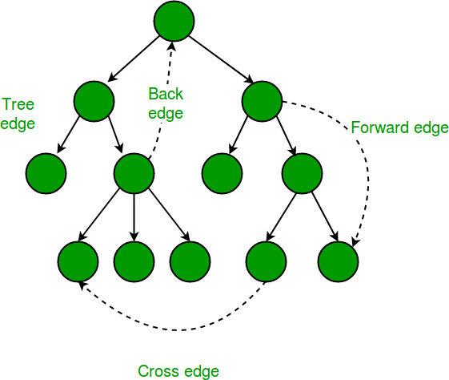</div>

- 参考：
    - http://www.cnblogs.com/luweiseu/archive/2012/07/14/2591370.html
- Tarjan 算法的核心思想与优势
    - **单次 DFS 搞定**：与需要两次 DFS 的 Kosaraju 算法不同，Tarjan 算法只需要对图进行**一次深度优先搜索（DFS）**，就能在 $O(|V| + |E|)$ 的线性时间内完美找出所有的强连通分量（SCC）。
    - **空间与常数优化**：因为它不需要对图进行转置操作，也不需要两次遍历，所以在实际运行时的常数极小，空间开销也更低。

- 算法的关键数据结构（两个时间戳与一个栈）
    - **`dfn[u]`（Discovery Time）**：顶点 $u$ 在 DFS 过程中被首次发现（访问）时的**绝对时间戳**（计数器编号）。
    - **`low[u]`（Lowest Reachable Ancestor）**：从顶点 $u$ 出发，经过 DFS 树枝边或者一条反向边，所能到达的在栈中的所有祖先节点的**最小 `dfn` 值**。
    - **辅助栈（Stack）**：每当 DFS 首次访问一个顶点时，就将其压入栈中。这个栈用于暂存当前正在探索的、可能属于同一个 SCC 的顶点群。

- 算法的执行与 SCC 判定逻辑
    - **邻接点探索**：当从 $u$ 出发考察边 $(u, v)$ 时：
        1. 如果 $v$ 尚未被访问（白色节点），则递归执行 DFS，随后用 `low[v]` 尝试更新 `low[u]`：`low[u] = min(low[u], low[v])`。
        2. 如果 $v$ 已经被访问过，且此时**仍然在栈中**，说明找到了一条强连通的环路，用 `dfn[v]` 更新 `low[u]`：`low[u] = min(low[u], dfn[v])`。
    - **树根触发判定**：当顶点 $u$ 的 DFS 流程即将结束时，算法检查是否满足 **`dfn[u] == low[u]`**：
        - 如果相等，说明 $u$ 是当前强连通分量在 DFS 树中的**根节点**。
        - 此时，该 SCC 的成员已经全部被完美地锁在了栈中。算法开始进行**弹栈**操作，将栈中 $u$ 及其上方的所有顶点依次弹出。这些被弹出的顶点集合，就精确构成了图中的一个极大强连通分量。

### 有向图的增强

- **问题的定义**
    - 给定一个有向图 $G$，目标是计算并设计出一种方案，使得**最少添加几条有向边**，就能让原图转变为一个任意两点皆可双向到达的强连通图。

- 问题与学术发展历史
    - **1976 年**：由 Eswaran 和经典图论大师 Tarjan 首次给出了该问题的线性时间最早解。
    - **1995 年**：Frank 将其进一步推广到 **$k$-强连通补全问题**（即具备更高的容灾抗毁性：即便图中有任意 $k$ 个顶点被战争或故障摧毁，余下的子图依然能够保持强连通）。
    - **2005 年**：后续学者在顶级期刊发文指出，Eswaran 和 Tarjan 在 1976 年论文中关于某些极端边界情况的证明细节存在微小瑕疵，并给予了修正。

- 现实中的重大意义
    - **核心价值**：强连通性在现实世界中对应着“鲁棒性”与“全双工通信能力”。
    - **应用场景**：
        - **交通规划**：设计单行道网络时，如何用最少的成本（如将某些单行道改为双向，或修路）确保市区内任意两个地点都能开车互达，避免出现“死胡同”。
        - **通信与控制**：在分布式传感器网络、工业控制链路以及互联网路由中，确保指令可以下发、状态可以回传。
        - **社交网络（直接/间接传话）**：若将“认识并可以直接传话”抽象为有向边，要让全班/全校没有任何一个孤立的“信息孤岛”，使得任意两个同学都能直接或间接地互通消息，其本质就是求解该网络的最少强连通边补全。

<div align="center">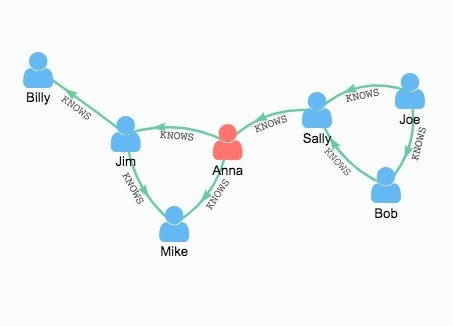</div>

- 一个真实的班级社会网络图

<div align="center">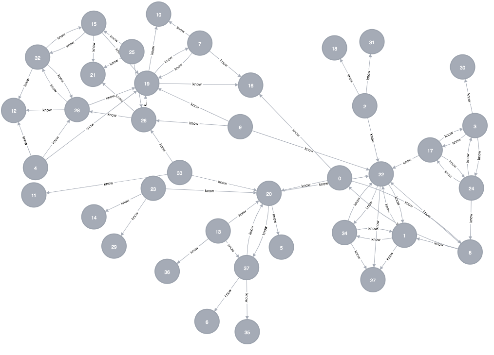</div>

- 综合运用图算法的逐步拆解思路
    - 面对这个看似复杂的图论难题，我们可以通过前几节课学到的核心工具，将其转化为一个极其直观的数学模型：
        1. **第一步：图的化简（SCC 缩点）**：首先利用 Tarjan 或 Kosaraju 算法，计算出原图的所有强连通分支（SCC）。将每个圈子“打包”浓缩成一个复合顶点。此时，原图被成功简化为了一个**有向无环图（DAG）**。
            - ⚡️每个SCC内部都是强连通的， **增强**只需要在它们之间进行
        2. **第二步：聚焦边界指标（入度与出度）**：在化简后的 DAG 中，强连通的瓶颈暴露在两端：
            - **源点（Source）**：入度为 0 的节点（只有出去的边，没有进来的边，外界无法到达它）。
            - **汇点（Sink）**：出度为 0 的节点（只有进来的边，没有出去的边，它无法到达外界）。
        3. **第三步：贪心匹配与连线**：设缩点后的 DAG 中，源点数量为 $P$，汇点数量为 $Q$。
            - 如果原图本身就已经强连通，答案显然为 0。
            - 否则，为了让信息能够“循环流动”，我们至少需要从每一个汇点连线连回源点。因此，**最少需要添加的边数即为 $\max(P, Q)$**（即源点总数与汇点总数中的最大值）。通过将汇点与源点进行贪心配对，便能完美打破 DAG 的单向流动性，使其融合成一个巨大的强连通图。

- 思考
    - 在前面 **第三步**中，在汇点和源点之间加边是随意的吗？
    - 下图中1、3是源点，2、4是汇点，加两条边(2,1)和(4,3)后，从4到1还是没有路径连通

    <div align="center">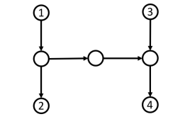</div>

## 最短路径问题

在图算法中，**最短路径**和**最小生成树**是解决网络优化问题的两大核心基石。

它们的核心区别在于关注的“目标”不同：

* **最短路径（如 Dijkstra 算法）关注的是“怎么走最快”**：
    - 它是以某个点为中心，寻找它到其他点的**路径距离和最小**。常用于高德导航、网络路由等“寻路”场景。
* **最小生成树（如 Prim / Kruskal 算法）关注的是“怎么连最省”**：
    - 它必须连接图中的所有顶点，追求的是**全网所有边的权重总和最小**。常用于电路布线、管道铺设等“基建”场景。

在算法体系中，它们是**贪心策略**和**动态规划**最经典的教科书级案例。需要注意的是，**最短路径树不等于最小生成树**——局部路径最短的组合，并不意味着全局建造成本最低。两者一动一静，共同构成了复杂图论算法的底层基础。

我们首先研究 **最短路径问题**。

- **现实背景**
    - **网络传输**：网页浏览、邮件发送、消息传输的底层，都是**数据包**在联网设备间穿梭。
    - **图论本质**：撇开繁琐的网络物理细节，Internet 的核心运作其实是**图算法（数据包路由）**。


- **图模型抽象**
    - **顶点 (Vertex)**：各个**路由器**。
    - **有向边 (Edge)**：物理通信链路（光纤、网线等）。
    - **边权 (Weight)**：链路的延迟、带宽或拥堵代价。

- **路由轨迹**
    - 路径流向：$$\text{浏览器} \rightarrow \text{路由器 A (起点)} \rightarrow \text{Internet 丛林} \rightarrow \text{路由器 B (终点)} \rightarrow \text{服务器}$$
    - **核心难题**：在动态变化的巨型网络图中，如何快速找到一条**总权重（代价）最小**的绿色通道？
    - **引出主题**：这就是图论中最经典的——**最短路径问题**。

<div align="center"></div>

- **Internet 的本质**
    - **云状结构背后**：图中的“Internet”云状结构，本质上是一个由无数**路由器**相互连接交织而成的巨型有向图。
    - **运作方式**：这些路由器各自独立而又协同工作，分布式地运行着路由算法，共同负责将数据包从互联网的一端精准传送到另一端。

- **路径追踪与动态特性**
    - **路径追踪**：通过 `traceroute` 命令可以真实观察到数据包在网络中的跳转。例如从 Luther College 到 University of Minnesota 之间就跨越了 **13 个路由器**（节点）。
    - **动态抉择**：由于网络流量和拥堵状况瞬息万变，路由算法会实时动态调整。因此，在 **不同时间** 发送数据，走过的路由器路径可能会完全不同。

<div align="center">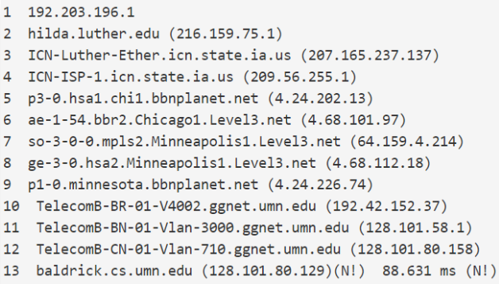</div>

- **问题转化：从路由到图算法**
    - **问题对等**：寻找信息传播速度最快的路径，完美转变为求解带权图上的**最短路径问题**。
    - **与 BFS 的联系**：此问题与通过 BFS 求解的无权图（如词梯问题）极其相似。
        - **BFS**的特点是通过一个队列，实现 **“按层扩展、一步一圈”**，率先触碰到终点的路径必然是最短路径。
        - 在边上增加了权重之后，就需要另想办法。

<div align="center">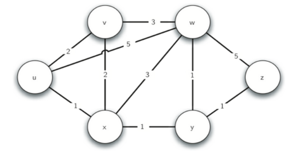</div>


### Dijkstra算法

<div align="center"></div>

迪杰斯特拉(Dijkstra `/deikstra/`)算法是专门解决 **带权单源最短路径**问题的经典迭代算法，由计算机科学家 Dijkstra 发明。它能计算出从一个起点到图中其余所有顶点的最短路径，在思路上与常规的广度优先搜索（BFS）高度相似。

- **核心逻辑与代码实现框架**
    - **Vertex 属性定义**：每个顶点 `Vertex` 内部维护一个 `dist` 变量，表示从源点到该顶点的当前带权路径总和。
    - **通过优先队列动态控制节点的访问次序**：
        - **队列初始化**：起始顶点的 `dist` 初始化为 `0`，其余所有顶点初始化为系统最大整数 `sys.maxsize`，并集体压入优先队列。
        - **遍历逻辑**：每次从队列中取出`dist`最小顶点$u$进行访问，通过边$(u, v)$对它的领居顶点$v$进行**松弛**操作
    - **最短路径的逼近**：
        - 当考察边 $(u, v)$ 时，若通过顶点 $u$ 到达 $v$ 的路径总长小于 $v$ 当前的已知距离，即满足：
      $$u.\text{dist} + \text{len}(u, v) < v.\text{dist}$$
        则立即更新 $v.\text{dist}$，该操作即为**松弛（Relaxation）**。
    - **完成遍历**后，每个顶点$u$中记录的路径长度`dist`总是最短的

#### 代码

- dijkstra代码
    - 在binHeap中并没有修改元素优先级的功能，用add_task方法把原来的元素删掉，再添加一个新的。

```python
def dijkstra(aGraph, start):
    pq = queue.PriorityQueue()

    start.setDistance(0)                   #起始点的dist为0
    #对所有顶点建堆，形成优先队列
    for v in g:
        pq.add_task(v, v.getDistance())
    while not pq.isEmpty():
        try :
            curr = pq.pop_task()    #优先队列出队
        except KeyError:
            break
        for nbr in curr.getConnections():
            newDist = curr.getDistance() \
                    + curr.getWeight(nbr)
            if newDist < nbr.getDistance():
                #更新邻居结点
                nbr.setDistance(newDist)
                nbr.setPred(curr)
                """
                pq.decreaseKey(nbr, newDist)
                """
                pq.add_task(nbr, newDist)
```

- 对比BFS代码

    ```python
    def bfs(g, start):
        start.setDistance(0)
        start.setPred(None)
        Queue = Queue_on_list
        vertQueue = Queue()
        vertQueue.enqueue(start)
        while (vertQueue.size() > 0):
            currentVert = vertQueue.dequeue()         #取出队首顶点进行搜索
            for nbr in currentVert.getConnections():
                if (nbr.getColor() == 'white'):       #发现新的相邻顶点
                    nbr.setColor('gray')
                    nbr.setDistance(currentVert.getDistance() + 1)
                    nbr.setPred(currentVert)
                    vertQueue.enqueue(nbr)
            currentVert.setColor('black')             #当前顶点完成搜索
    ```

#### 算法示例


- **第一轮迭代：起始顶点 $u$ 出队**
    - **出队节点**：当前 `dist` 最小的顶点 $u$（距离为 0）率先出队。
    - **邻接松弛**：遍历 $u$ 的邻接点 $x, v, w$，更新它们从无穷大（$\infty$）到当前带权路径长。
    - **状态更新**：
      $$\begin{array}{|c|c|c|c|c|c|c|}
      \hline
      \text{顶点} & \mathbf{\color{red}u} & v & w & x & y & z \\
      \hline
      \text{dist} & 0 & 2 & 5 & 1 & \infty & \infty \\
      \hline
      \end{array}$$

<div align="center">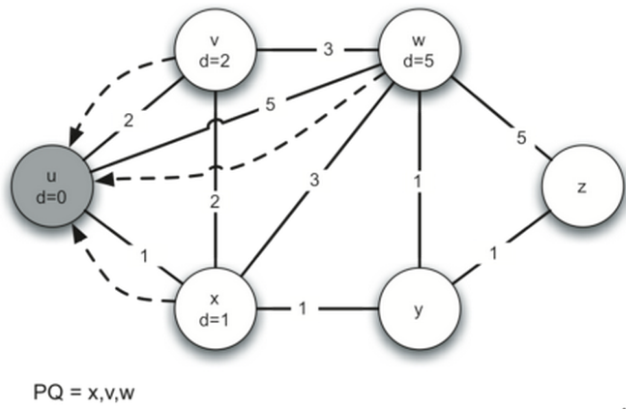</div>

- **第二轮迭代：顶点 $x$ 出队**
    - **出队节点**：在剩余未出队的节点中，选取当前 `dist` 最小的顶点 $x$（距离为 1）出队。
    - **邻接松弛**：考察 $x$ 的邻接点。此时发现通过 $x$ 到达 $w$ 的路径（$1 + \text{len}(x,w)$）比原先的 5 更短，成功将 $w.\text{dist}$ 压低至 4；同时激活并更新了顶点 $y$。
    - **状态更新**：
      $$\begin{array}{|c|c|c|c|c|c|c|}
      \hline
      \text{顶点} & \mathbf{\color{red}u} & \mathbf{\color{red}x} & v & w & y & z \\
      \hline
      \text{dist} & 0 & 1 & 2 & 4 & 2 & \infty \\
      \hline
      \end{array}$$

<div align="center">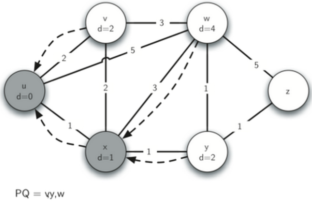</div>

- **第三轮迭代：顶点 $v$ 出队**
    - **出队节点**：在未出队节点中，当前 `dist` 最小的有 $v$ 和 $y$（均为 2），本轮选择顶点 $v$ 出队。
    - **邻接松弛**：考察 $v$ 的邻接点（如已出队的 $u, x$ 以及未出队的 $w$）。由于通过 $v$ 到达 $w$ 的路径代价未能小于当前已知的 4，因此所有节点的 `dist` 保持不变。
    - **状态更新**：
      $$\begin{array}{|c|c|c|c|c|c|c|}
      \hline
      \text{顶点} & \mathbf{\color{red}u} & \mathbf{\color{red}x} & \mathbf{\color{red}v} & w & y & z \\
      \hline
      \text{dist} & 0 & 1 & 2 & 4 & 2 & \infty \\
      \hline
      \end{array}$$

<div align="center">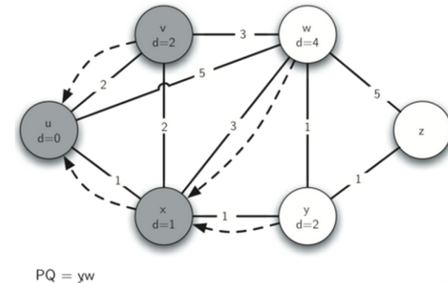</div>

- **第四轮迭代：顶点 $y$ 出队**
    - **出队节点**：当前未出队节点中 `dist` 最小的顶点 $y$（距离为 2）出队。
    - **邻接松弛**：考察 $y$ 的邻接点 $w$ 和 $z$。发现通过 $y$ 到达 $w$ 的路径（$2 + \text{len}(y,w)$）比当前的 4 更短，成功将 $w.\text{dist}$ 压低至 3；同时，到目的地 $z$ 的最短估计值也从 $\infty$ 成功更新为 3。
    - **状态更新**：
      $$\begin{array}{|c|c|c|c|c|c|c|}
      \hline
      \text{顶点} & \mathbf{\color{red}u} & \mathbf{\color{red}x} & \mathbf{\color{red}v} & \mathbf{\color{red}y} & w & z \\
      \hline
      \text{dist} & 0 & 1 & 2 & 2 & 3 & 3 \\
      \hline
      \end{array}$$

<div align="center">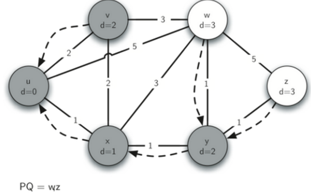</div>

- **第五轮迭代：顶点 $w$ 出队**
    - **出队节点**：当前未出队节点中 `dist` 最小的有 $w$ 和 $z$（均为 3），本轮选择顶点 $w$ 出队。
    - **邻接松弛**：考察 $w$ 的邻接点（如已出队的 $v, y$ 以及未出队的 $z$）。经判定，通过 $w$ 到达 $z$ 的路径代价无法小于当前已知的 3，因此全局 `dist` 保持不变。
    - **状态更新**：
      $$\begin{array}{|c|c|c|c|c|c|c|}
      \hline
      \text{顶点} & \mathbf{\color{red}u} & \mathbf{\color{red}x} & \mathbf{\color{red}v} & \mathbf{\color{red}y} & \mathbf{\color{red}w} & z \\
      \hline
      \text{dist} & 0 & 1 & 2 & 2 & 3 & 3 \\
      \hline
      \end{array}$$

<div align="center">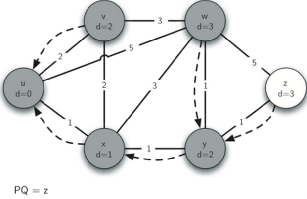</div>

- **第六轮迭代：顶点 $z$ 出队（算法结束）**
    - **出队节点**：最后一个未出队节点 $z$（距离为 3）出队。
    - **邻接松弛**：考察 $z$ 的所有邻接点（皆为已处理的红色顶点），均无需且无法更新。
    - **状态更新**：此时所有顶点均已出队，标志着从起点 $u$ 出发到全图所有顶点的最短带权路径全部确定。
      $$\begin{array}{|c|c|c|c|c|c|c|}
      \hline
      \text{顶点} & \mathbf{\color{red}u} & \mathbf{\color{red}x} & \mathbf{\color{red}v} & \mathbf{\color{red}y} & \mathbf{\color{red}w} & \mathbf{\color{red}z} \\
      \hline
      \text{dist} & 0 & 1 & 2 & 2 & 3 & 3 \\
      \hline
      \end{array}$$

<div align="center">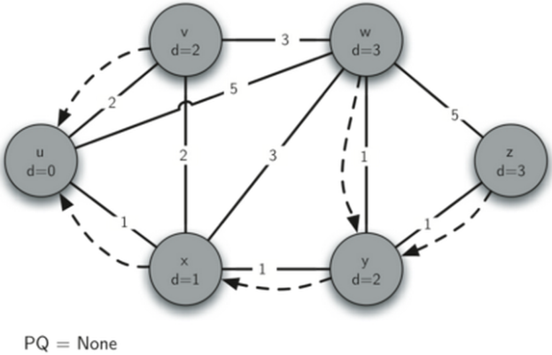</div>

#### 算法分析

- **Dijkstra 算法时间复杂度分析**
    - **基本参数**：设图的顶点总数为 $v = |V|$，边总数为 $e = |E|$。
    - **初始化建堆**：将所有顶点加入优先队列并构建初始最小堆，耗时为 $O(v)$。
    - **顶点出队操作**：每个顶点有且仅有 1 次出队机会。每次执行 `delMin` 操作花费 $O(\log v)$，所有顶点累计耗时 $O(v \log v)$。
    - **边权松弛与堆重排**：在遍历过程中，每条边最多被考察一次。如果松弛成功，会触发一次 `decreaseKey` 操作以调整堆结构，单次花费 $O(\log v)$，所有边累计最大耗时 $O(e \log v)$。
    - **综合复杂度**：将上述各项开销相加，由于在连通图中通常有 $e \ge v - 1$，因此最终的整体时间复杂度收敛为：
      $$O(v) + O(v \log v) + O(e \log v) = O((e + v) \log v)$$

#### 实现细节

##### decreaseKey的实现

- **原生优先队列的痛点**
    - **接口缺失**：Dijkstra 算法核心是 `decreaseKey`（动态减小键值），但 Python 的 `heapq` 并没有内置此功能。
    - **核心难点**：堆内节点位置会随上浮（Shift Up）动态改变，外部无法通过固定索引直接定位目标节点。
    - **效率陷阱**：Miller 教材中采用**顺序查找**（$O(v)$）来定位节点，直接导致最小堆的对数级性能优势丧失，算法整体复杂度退化。

<div align="center">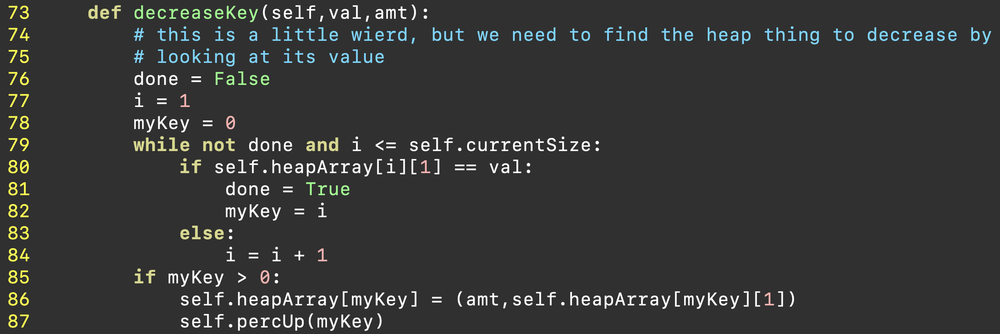</div>

- **如何优雅调整二叉堆中的值？**
    - **位置追踪**：用**字典（Dict）**记录各节点在堆中的数据项，实现 $O(1)$ 快速定位。
    - **延迟删除**：不原地修改。直接将旧节点标记为 `REMOVED`，再将新权重节点 `heappush` 重新插入堆中，出队时遇到废弃节点直接跳过。
    - **引入序列号**：用元组包装：`(priority, sequence_number, task)`。

- **两大核心优势**
    - **避开类型比较**：利用递增序列号作为次级键，彻底避免自定义对象 `task` 无法直接比大小的报错尴尬。
    - **实现稳定排序**：此机制带来了一个强大的副产品——提供了一种能让任何排序算法瞬间变为**稳定排序**的通用方法。
    - **复杂度保持**：修改后的单次入堆与弹出操作，依然完美保持在 **$O(\log v)$** 级别。

##### PriorityQueue完整代码

```python
import binHeap
import itertools

class PriorityQueue:
    REMOVED = '<removed-task>'    # placeholder for a removed task
    def __init__(self):
        self.entry_finder = {}    # mapping of tasks to entries
        self.counter = itertools.count()   # unique sequence count
        self.heap = binHeap.BinaryHeap()

    def add_task(self, task, priority=0):
        'Add a new task or update the priority of an existing task'
        if task in self.entry_finder:
            self.remove_task(task)
        entry = [priority, next(self.counter), task]
        self.entry_finder[task] = entry
        self.heap.insert(entry)

    def isEmpty(self):
        while not self.heap.isEmpty():
            priority, count, task = self.heap.findMin()
            if task is not self.REMOVED:
                return False
            else:
                self.heap.delMin()

    def remove_task(self, task):
        'Mark an existing task as REMOVED.  Raise KeyError if not found.'
        entry = self.entry_finder.pop(task)
        entry[-1] = self.REMOVED

    def pop_task(self):
        'Remove and return the lowest priority task. Raise KeyError if empty.'
        while not self.heap.isEmpty():
            priority, count, task = self.heap.delMin()
            if task is not self.REMOVED:
                del self.entry_finder[task]
                return task
        raise KeyError('pop from an empty priority queue')
```

#### 实际应用：城市导航

2026数算B作业六（图及算法）06:Subway openjudge/1504

- 抽象：城市看成一张图；

    - 家、学校和地铁站是图中的顶点；
    - 两个顶点之间的路线是图中的边

- 按需求快速的实现一个图graph，它的精髓在哪儿？

    - 就用一个字典来表示：存储顶点和顶点的key值；这里用顶点的坐标做key值；
    - graph类中的其他功能用不着，只需要主列表就可以了
    - 顶点需要用一个类来实现，记录顶点的坐标、通勤时间和出边表
    - 边的权重是两点之间的通行时间

- 先建图buildGraph；然后Dijkstra找最短路径(最短通勤时间)

### 负权边的处理

- **Dijkstra 算法的死穴：负权边**
    - **核心限制**：算法要求图中所有边的权重**必须大于 0**。一旦出现负值边，其贪心策略就会彻底失效。
    - **贪心基础**：算法的正确性建立在“没有负权边”的假设上。这能确保**已出队的红色顶点其最短路径已经绝对确定**，后续的松弛重算绝不会再产生任何更小的更改效果。


<div align="center">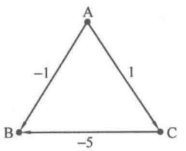</div>

- **经典失效案例（以 $A$ 为起点）**
    - **算法误判**：若存在负权边，算法会因贪心先让当前较小的路径出队，并错误地锁定 A $\rightarrow$ B 为最短。
    - **真实情况**：由于负权贡献，实际到 $B$ 的最短路径应该是 **A $\rightarrow$ C $\rightarrow$ B**，但算法此时已无法回头修正。


#### Bellman-Ford 算法

- 贝尔曼-福特(Bellman-Ford `/ˈbɛlmən fɔːrd/`)算法：破解负权边
    - **核心功能**：完美支持包含**负权边**的图，能准确求解单源最短路径。
    - **暴力松弛**：固定外层循环 **$|V| - 1$ 次**，每轮对**所有边**统一进行一次松弛操作。
    - **复杂度**：时间复杂度为 **$O(|V| \cdot |E|)$**，效率低于 Dijkstra。

<div align="center">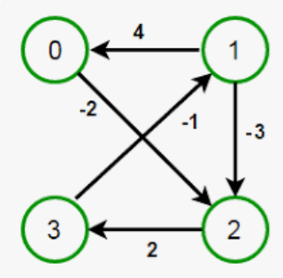</div>

- **死穴：负权回路（Negative Cycle）**
    - **无解情况**：若图中存在从起点可达的**负权圈（绕一圈权重大于 0 变小于 0）**，则问题彻底无解。
    - **原因**：无限次绕圈会让路径代价无限制缩小至**负无穷（$-\infty$）**。

- Bellman-Ford伪代码

    ```python
    def relax(edge):
      u, v, weight = edge
      if u.dist + weight < v.dist:
        v.dist = u.dist + weight
        v.predecessor = u
        return true
      else:
        return false

    def Bellman(G, start):
      V, E = G
      for u in V : u.dist = sys.maxsize
      start.dist = 0
      """
      对所有的边松弛 |V|-1 轮
      """
      for i in range(|V|-1):
        for edge in E:
          relax(edge)
      """
      检查负权回路
      """
      for edge in E:
        if relax(edge):
          raise NegativeCycle
    ```

### 两两距离计算

- **最短路径算法对比**
    - **单源最短路径（一对多）**
        - **Dijkstra**：适用于**非负权图**，堆优化复杂度 $O((e+v)\log v)$。
        - **Bellman-Ford**：可处理**负权边**，暴力循环 $|V|-1$ 次，复杂度 $O(|V| \cdot |E|)$。
    - **多源最短路径（多对多）**
        - **Floyd**：计算图中**所有顶点两两之间**的最短路径。
        - **机制与复杂度**：基于动态规划（三重循环中转），复杂度固定为 $O(|V|^3)$。

#### Floyd算法

- 弗洛伊德(Floyd `/flɔɪd/`)算法

- 算法伪代码

    ```python
    def Floyd(G):
      V, E = G
      dist = [[sys.maxsize]*|V| for _ in range(|V|)]
      for (u, v) in E:
        dist[u][v] = cost(u, v)      # 可以是负权边
      for u in V:
        dist[u][u] = 0
      for w in V:
        for u in V:
          for v in V:
            if dist[u][v] > dist[u][w] + dist[w][v]:
              dist[u][v] = dist[u][w] + dist[w][v]
      """
      负权回路的检测：顶点到自身负距离
      """
      for u in V:
        if dist[u][u] < 0:
          raise NegativeCycle
      return dist
    ```

### 核心算法总结与应用场景

- **Dijkstra 算法（最高效）**
    - **应用领域**：广泛应用于高德/谷歌导航、物流配送、机器人路径规划与避障等。
    - **网络路由现实**：互联网路由器**没有**采用它，因为其无法获取全局且动态的 Internet 拓扑结构，而是采用了**距离向量路由算法**（如 RIP 协议）。
    - **时间复杂度**：$O((|E|+|V|)\cdot \log |V|)$。
- **Bellman-Ford 算法（功能更强，效率较低）**
    - **特点**：以降低运行效率为代价，换取了处理**负权边**的能力。
    - **时间复杂度**：$O(|E|\cdot |V|)$。
- **Floyd 算法（多源全能）**
    - **特点**：一次性计算出图中**所有顶点两两之间**的最短路径。
    - **时间复杂度**：$O(|V|^3)$。

## 最小生成树

我们接着来研究 **最小生成树**。

### 信息广播问题

我们以 **信息广播问题** 为例来说明 **最小生成树算法** 的意义及特点。

- **目标：解决信息广播问题（Information Broadcasting）**
    - **应用痛点**：
        - **网络游戏**：需要实时让服务器上的**所有玩家**同步获知其他玩家的坐标与动态。
        - **网络收音机**：需要向**所有收听用户**高并发、低延迟地并发推送直播音频数据流。
    - **技术本质**：如何在一个复杂的网络拓扑结构中，高效地将源节点（Server）的数据分发到图中所有的其他顶点。

<div align="center">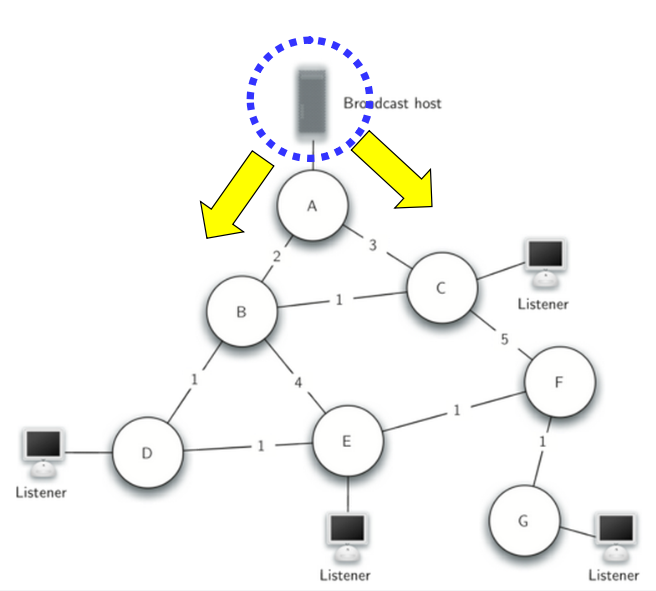</div>

为了达到这个目标，有什么可能的办法？

#### 单播解法

- **最直观解法：单播（Unicast / 点对点）**
    - **逻辑机制**：广播源（顶点 A）自行维护一个所有收听者的列表，针对每个接收者，都将消息复制并单独发送一次。
    - **路由选择**：每条独立的消息均采用 **Dijkstra 最短路径算法**各自寻路到达目的地。
    - **快递隐喻**：把数据包想象成“快递”，边的权重即为两个站点之间的“转运费用”。

<div align="center">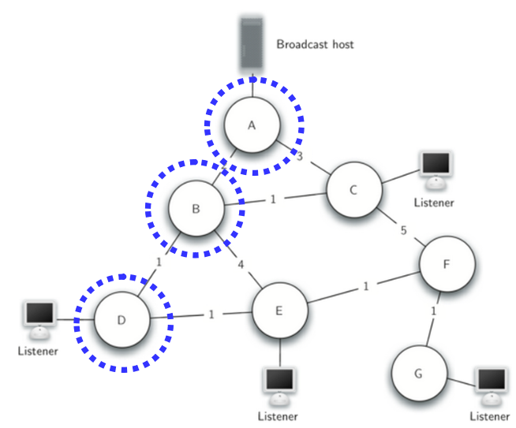</div>

- **费用开销计算（以 A 为源，向 C, D, E, G 发送）**
    - **A $\rightarrow$ C 费用**：$3$
    - **A $\rightarrow$ D 费用**：$2 + 1 = 3$
    - **A $\rightarrow$ E 费用**：$2 + 1 + 1 = 4$
    - **A $\rightarrow$ G 费用**：$2 + 1 + 1 + 1 + 1 = 6$ 
    - **单播总开销**：$3 + 3 + 4 + 6 = 16$
    - **致命缺陷**：同一条链路（如 A $\rightarrow$ B）被重复发送了 3 次，骨干网带宽被大量冗余快递（数据包）严重浪费。

#### 洪水解法

- **暴力解法：洪水填充（Flooding）**
    - **基本逻辑**：消息源直接将数据扔给相邻路由器，所有路由器收到后，无脑向**所有相邻路由器和收听者**进行二次转发。
    - **洪水灾难**：若没有任何限制，消息会在网络拓扑的环路中死循环，导致整个网络因海量重复数据而彻底瘫痪。

- **灾难防线：引入生命值（TTL）机制**
    - **TTL 设定**：每条消息附带一个生命值（Time To Live），初始值通常设为“源点到最远收听者的跳数”。
    - **递减与销毁**：路由器每转发一次，TTL 自动**减 1**。当 TTL 递减至 0 时，消息直接被丢弃。
    - **致命缺陷**：TTL 虽然止住了死循环，但其盲目广播产生的无效冗余流量，甚至远超点对点的单播方案。

- **现实工程应用（控制信息与初始化）**
    - **核心原则**：因开销极大，洪水解法**绝不用来传输日常业务数据**（如网游坐标、视频流），仅用于高可靠性的控制信息传输。
    - **网络路由拓扑同步（如 OSPF）**：当网络链路突发故障时，旧路由表失效，路由器通过洪水解法将状态变化迅速扩散全网，确保所有节点同步新地图并重新算路。
    - **区块链与 P2P 网络（如比特币）**：在无中央服务器的去中心化网络中，节点频繁进出，新交易或新区块只能通过限制 TTL 的洪水机制向四周邻居“推波助澜”，最终传遍全球。

#### 生成树解法

- **核心定义**
    - **生成树**：连通图 $G$ 的一个子图，包含 $G$ 的**所有 $n$ 个顶点**和 **$n-1$ 条边**，且**无环连通**。
    - **最小生成树（MST）**：在一张**连通无向图**中，所有边的**权重之和最小**的生成树。
    - ⚠️ 这里的图必须是无向图，对有向图算法失效；在有向图中还需额外指定“根结点”，变成另一个“最小树形图问题”

- **终极解法：生成树（Spanning Tree）**
    - **基本逻辑**：在网络拓扑中，通过特定算法（如 Prim 或 Kruskal）计算出一棵包含所有路由器的**最小生成树（MST）**。
    - **路由选择**：消息源只需沿着这棵树的“树枝”（边）发送**单份消息**。当消息到达树上的分叉路由器时，该路由器再复制并分发给它的子分支和相连的收听者。
    - **去冗余化**：数据包在任何一条链路上都**只通过一次**，且绝不走回头路。

- **优势与意义（完美兼顾开销与安全）**
    - **流量最小化**：彻底解决了单播方案中骨干网链路被重复快递塞爆的问题，也避免了洪水方案中无脑转发带来的流量灾难。
    - **杜绝死循环**：由于生成树在图论结构上天然**无环**，因此消息绝不会在网络中无限循环，从根本上免疫了网络洪水灾难，不再纯粹依赖 TTL 的强制销毁。

<div align="center">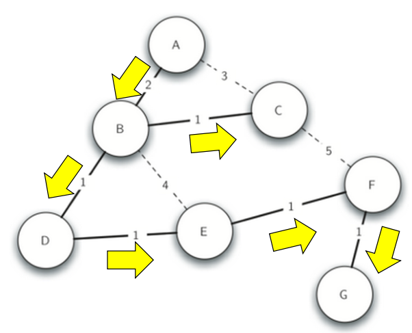</div>

- **广播机制与费用计算（以 A 为源点）**
    - **传播路径**：广播信息只需从 A 开始，沿着树的路径层次向下传播。
    - **核心特征**：消息在任何一条链路上都**只通过一次**。在网络中，“消息的传输有成本，而消息的复制没有成本”，当路径遇到分叉路由器时才会进行复制分发。
    - **总费用计算**：依图结构，所有树边的权重之和为：$2 + 1 + 1 + 1 + 1 + 1 = 7$。

### Prim算法

- 普里姆(Prim `/prɪm/`)算法

- **核心思想：贪心策略（Greedy Approach）**
    - Prim 与 Kruskal 算法均通过每一步寻找**“最小权重安全边”**，从而由局部最优达到全局最优。

- **通用构造思路（Loop）**
    - 只要 $T$ 还不是生成树，就反复执行：**找到一条安全边 $\rightarrow$ 添加到树 $T$**。

- **两大算法的“安全边”定义差异**
    - **Prim 算法**：安全边定义为**一端在树中、另一端不在树中**的边。每次向外扩张一个点，天然保持树的无圈特性。
    - **Kruskal 算法**：安全边定义为**两端不在同一个连通分量中**的边。每次直接选择全局最短边，通过并查集防止成环。

#### 算法示例

- **算法变体与工程实现**
    - Prim 算法的逻辑核心是不断挑选并维护“树距离”，但其性能取决于用何种数据结构来**保存和检索**这条最小权重安全边。

- **核心概念回顾**
    - **树距离**：定义为树外某顶点连接树中顶点的最短边，即与它相连的最短安全边。
    - 全局的最小权重安全边即从树距离中挑选

<div align="center">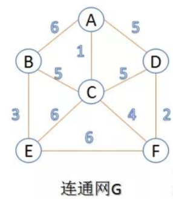</div>

1. **选择任意顶点作为起始（例如顶点A)**
    - 此时这棵“树”只有一个孤立的点。
    - A的树距离为0
    - A的邻居顶点的树距离为它们连接A的边权重
    - 其他顶点的树距离为无穷大（$\infty$）。

2. 每次挑选树距离最小的顶点
    - 把该顶点加入树
    - 并且更新它邻居的树距离

3. 直至所有顶点都在树中

<div align="center">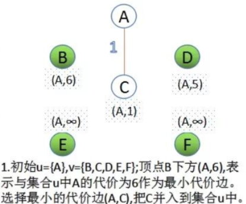</div>

<div align="center">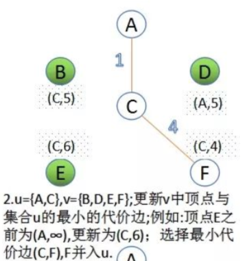</div>

<div align="center">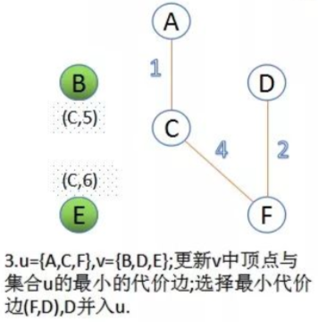</div>

<div align="center">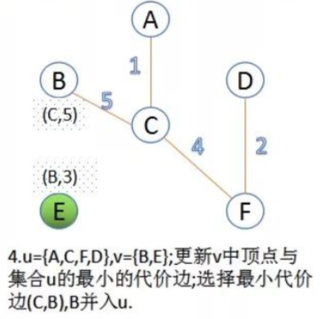</div>

<div align="center">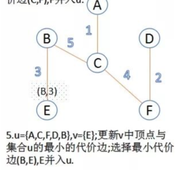</div>

#### 算法实现

- 朴素prim伪代码
    ```
    输入：一个连通网 G = (V, E)
    输出：最小生成树的边集 T

    1. 初始化：
       a. 创建一维数组 dist[|V|]，用以保存各个树外顶点到当前树的“树距离”。
       b. 创建一维数组 parent[|V|]，用以保存各个顶点的双亲节点（从而记录树的边）。
       c. 创建布尔数组 in_tree[|V|]，用以标记顶点是否已经加入树中。
       
       d. 将所有顶点的 dist 初始化为正无穷（∞），in_tree 初始化为 False。
       
    2. 选定起始点（假设为顶点 0）：
       a. 令 dist[0] = 0
       b. 令 parent[0] = -1

    3. 循环迭代 |V| 次（每次并入一个顶点）：
       a. 遍历 dist 数组，在所有满足 in_tree[u] == False 的顶点中，
          找出 dist[u] 最小的顶点 u。
          
       b. 将顶点 u 标记为已入树：
          in_tree[u] = True
          
       c. 【松弛操作 / 更新邻居】：
          遍历顶点 u 的所有邻接点 v：
             如果 in_tree[v] == False 且 边(u, v)的权重 < dist[v]：
                则更新 dist[v] = 边(u, v)的权重
                同时记录前驱 parent[v] = u

    4. 提取 parent 数组中的非负关系，即为最小生成树的完整边集。
    ```

- 堆优化版伪代码
    ```python
    import sys

    def Prim(G):
      V, E = G
      tree = []
      pq = buildHeap([(u, None, sys.maxsize) for u in V])
      pq.update(V[0], None, 0)        #以第一个顶点作为起始点
      while pq is not empty:
        u, pred, dist = pq.popMin()
        if pred : tree.append((pred, u))
        for v in u.neighbor: 
          if v in pq:                 #尝试更新v的树距离
            pq.update(v, u, weight(u, v))
      return tree
    ```

#### 算法分析

- **两种经典实现方式**
    - **邻接矩阵 + 暴力搜索（朴素实现）**：
        - 直接使用一个一维数组 `dist[]` 记录所有树外顶点的树距离。
        - 每次通过 $O(V)$ 的暴力遍历找出最小值，并用 $O(1)$ 的时间更新邻居。
        - **时间复杂度**：$O(V^2)$。由于与边数 $E$ 无关，这种方式在**稠密图**（边非常多）中效率很高。
    - **时间复杂度推导（堆优化版）**
        - **优先队列开销**：使用二叉堆实现的优先队列 `pq`，其弹出最小值（`popMin`）和更新元素权重（`update` / `decrease-key`）的操作耗时均为 $O(\log |V|)$。
        - **总体复杂度**：整个算法过程中，每个顶点入树需要执行一次 `popMin`（共 $|V|$ 次），每条边在松弛更新时可能触发一次 `update`（共 $|E|$ 次）。因此，总时间复杂度为：
          $$O((|V| + |E|) \cdot \log |V|) = O(|E| \cdot \log |V|)$$
          *(注：在连通图中，边数 $|E| \ge |V| - 1$，故常简写为 $O(|E| \log |V|)$，极度适合稀疏图。)*

### Kruskal算法

- 克鲁斯卡尔(Kruskal `/ˈkrʌskəl/`)算法是并查集的经典应用。

#### 算法实现

- 伪代码

    ```python
    def Kruskal(G):
      V, E = G
      V = DisjointSet(V)
      tree = []
      for edge in sorted(E):
        u, v = edge
        if V.find(u) != V.find(v):
          tree.append(edge)
          V.union(u,v)
      return tree
    ```

- **算法精髓：基于边的贪心扩展**
    - **并查集联动**：Kruskal 算法将图中的顶点视为森林。通过并查集的经典应用，在不形成环路的前提下，逐步将孤立的树林合并为一棵完整的最小生成树。
    - **安全边挑选**：策略极度纯粹——每次直接从剩余边中挑选**全局权重最小**的那条边，只要它的两个端点不在同一个连通分量中（即 `find(u) != find(v)`），即可安全加入。

#### 算法分析

- **基本关系**： $|E| \le |V|^2$
- **第一阶段：边集排序**
    - 对所有边按权重进行升序排序，耗时 $O(|E| \cdot \log |E|)$。
    - 依据对数性质，$\log |E| \le \log |V|^2 = 2\log |V|$，因此排序复杂度渐进等于 **$O(|E| \cdot \log |V|)$**。
- **第二阶段：逐边扫描与集合合并**
    - 遍历排序后的边集，对每条边执行两次 `find` 和至多一次 `union`，总操作次数与边数 $|E|$ 成正比。
    - 结合路径压缩与按秩合并优化，并查集的单次开销为反阿克曼函数 $O(\alpha(|V|))$，在工程上等同于常数 $O(1)$。
    - 故挑选安全边的总耗时仅为 **$O(|E|)$**。
- **总体复杂度结论**
    - 算法的总运行时间由排序主导，即 **$$O(|E| \cdot \log |V|)$$**。这一特性使其在**稀疏图**（边数 $|E|$ 接近顶点数 $|V|$）上的表现极为优秀。

### Prim和Kruskal算法总结

| 维度 / 算法 | 朴素 Prim 算法 | 堆优化 Prim 算法 | Kruskal 算法 |
| :--- | :--- | :--- | :--- |
| **核心数据结构** | 邻接矩阵 + 一维数组 | 邻接表 + 二叉堆 (优先队列) | 边集数组 + 并查集 |
| **驱动核心** | **点驱动**（每次新并入一个点） | **点驱动**（每次新并入一个点） | **边驱动**（按权重全局排序边） |
| **时间复杂度** | $O(\|V\|^2)$ | $O(\|E\| \log \|V\|)$ | $O(\|E\| \log \|V\|)$ |
| **空间复杂度** | $O(\|V\|)$ 或 $O(\|V\|^2)$ | $O(\|V\| + \|E\|)$ | $O(\|E\|)$ |
| **主导开销步骤** | 遍历数组寻找最小树距离点 | 堆顶弹出与频繁的 `Decrease-Key` | 算法开局对所有边的**初始排序** |
| **稀疏图表现**<br>($\|E\| \approx \|V|$) | **较差**<br>无论边多少，都必须空转 $\|V\|^2$ 次 | **优秀**<br>点少堆小，调整开销低 | **极佳（主场）**<br>排序边数少，并查集接近 $O(1)$ |
| **稠密图表现**<br>($\|E\| \approx \|V\|^2$) | **极佳（主场）**<br>不带 $\log$ 算子，完全无视边数暴增 | **较差**<br>沦为 $O(\|V\|^2 \log \|V\|)$，堆调整频繁 | **较差**<br>沦为 $O(\|V\|^2 \log \|V\|)$，排序开销爆炸 |
| **硬件缓存友好度** | **中等** | **差**（堆调整导致内存离散跳转） | **极好**（排序后对数组进行连续线性扫描） |
| **工程实现难度** | 最简单 | 较复杂（部分语言标准库不支持高效修改堆元素） | 较简单（套用并查集模板即可） |


## 一些经典NPC的图问题

在计算机科学、算法设计和实际工程中，了解这些 NPC（NP-完全）问题绝不仅仅是为了应付考试，而是有着极其重要的工程指导意义和思维训练价值。

- **哈密顿路径/回路问题（Hamiltonian Path/Cycle Problem）**
    - **定义**：寻找一条经过图中**每一个顶点**且仅经过一次的路径。如果最终能回到起点，则称为哈密顿回路。

- **旅行商问题（TSP, Traveling Salesperson Problem）**
    - **定义**：给定一系列城市和每对城市之间的距离，求解访问每一座城市一次并回到起始城市的最短回路。它是组合优化中的一个 **NP困难（NP-hard）** 问题，在运筹学和理论计算机科学中非常重要。
    - *(注：原课件括号中的“最短路径问题”通常指 Dijkstra 等 P 问题，此处 TSP 本质上是在寻找「最短权重哈密顿回路」，属于典型的 NPC/NP-hard 领域。)*

- **子图同构问题（Subgraph Isomorphism Problem）**
    - **定义**：给定两个图 $G$ 和 $H$，判断 $G$ 是否包含一个与 $H$ 同构的子图。这是一个经典的 NPC 问题（而完整的“图同构问题”目前已知属于特殊的 NP 状态，不被认为是 NPC）。

- **分团问题（Clique Problem）**
    - **定义**：在无向图中，分团是指一个顶点的子集合，其中任意两个顶点之间都有边相连（即完全子图）。分团问题通常指判定图中是否存在大小为 $k$ 的团，或列举/寻找最大团。

- **图的顶点覆盖问题（Vertex Cover Problem）**
    - **定义**：寻找一个最小的顶点集合，使得图中的**每条边**都至少有一个端点属于该集合。

- **图着色问题（Graph Coloring Problem）**
    - **定义**：给定一个无向图和 $k$ 种颜色，问能否为每个顶点着色，使得任意两条相邻顶点的颜色都不相同。

## 本章总结

- 本章我们学习了图抽象数据类型，以及若干实现方法
- 本章讨论了一些图的算法和应用

    - 广度优先搜索算法BFS，解决无权图的最短路径问题；
    - 图的深度优先搜索算法；
    - 用于简化图的强连通分支算法；
    - 用于关联任务排序的拓扑排序算法；
    - Dijkstra等算法, 解决带权图的最短路径问题；
    - 用于广播消息的最小生成树算法。
