# Ch02. Python入门

[Home]( README.md )

## 计算思维
- 程序是菜谱
- 计算思维
  > 通过不同的参数，同一段程序解决一类问题
### 计算：Computation

- 计算是利用计算机解决问题的过程
  - 组合性：通过简单操作指令的组合完成复杂任务
  - 通用性：同一台计算机，通过加载执行不同的程序，能解决不同的问题

### 如何用程序解决问题？

#### 数字求和：非程序思维
- 有2个数
  - print(2+3)
- 有3个数
  - print(2+3+15)
- 有8个数
  - print(2+3+15+17+1 +33+132+76)
- 有1000个数……?

#### 数字求和：程序思维
- 有n个数求和
  - 设置一个sum用来暂存部分和
  - sum ← 0
  - 从数据集中取到每一个数a：
     - sum ← sum + a
  - 输出sum

***通过使用各种条件控制语句与控制变量，用同一段代码解决一类问题。***

### 什么是计算思维？
- 我们在用计算机解决问题时形成了特有的思维方式和解决方法，即计算思维
  - 计算思维建立在计算机的能力和限制之上
  - 既要充分利用计算机的计算和存储能力，又不能超出计算机的能力范围
- 计算思维同时也吸收了其他领域的思维方式
  - 通过数学思维来建立现实世界的抽象模型，使用形式语言表达思想
  - 通过设计思维来打造软硬件应用系统，满足各方面需求
  - 通过工程思维需求更好的工艺流程提高软硬件产品质量

### 计算思维常见的思想和方法
- 问题表示：抽象与层次化
- 算法设计：各种策略
  - 枚举（穷举）策略
  - 分治策略
  - 贪心策略
  - 动态规划
  - 模拟仿真
  - 近似解
    - 通过牺牲精确性换来有效性和可行性
- 编程技术
  - 面向过程、面向对象、面向声明
  - 模块化
  - 查找、回溯
  - 缓存
  - 并发
- 可计算性和算法复杂度
  - 可解和可行
  - 算法与“智能”


## Python的运行环境和开发环境

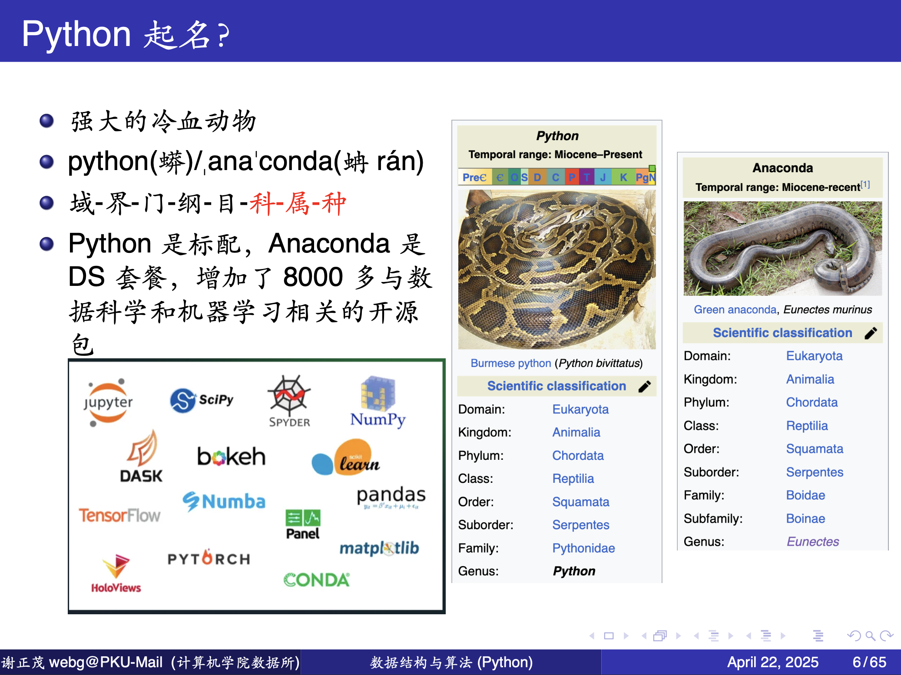

### Python的历史


- 1989年12月，Guido van Rossum为了打发圣诞节假期，开发了ABC语言的后继
- Python名称来自于他喜欢的一个情景剧Monty Python's Flying Circus
- Python语言继承了多种优秀语言的特性
  - 是一种高级动态、完全面向对象的语言
  - 函数、模块、数字、字符串都是对象
  - 并且完全支持继承、重载、派生、多继承，
    - 有益于增强源代码的复用性。

不到四十年间，Python经历了下面3个主要版本。
- 版本1.x：支持异常处理、函数定义，开发了核心数据结构
- 版本2.x：支持列表解析、垃圾收集器和Unicode编码
```python
# -*- coding: utf-8 -*-
# for python2
s = u'你好'           # Unicode 对象
print s.encode('utf-8')  # 输出时编码成 UTF-8
```
- 版本3.x：不向后兼容2.x，扫除了编程结构和模块上的冗余和重复


###  Python主要组成部分

Python开发环境的主要组成部分是：

| 模块                 | 内容                               | 作用         |
| ------------------ | -------------------------------- | ---------- |
| Python 解释器         | `python.exe` / `libpython3.x.so` | 执行代码       |
| 标准库                | `/Lib/`                          | 自带功能模块     |
| ***pip***               | 包管理工具                            | 安装第三方库     |
| setuptools / wheel | 打包与安装支持                          | pip 的底层依赖  |
| IDLE               | 简易开发环境                           | 初学者用 IDE   |
| Include / Libs     | C 扩展支持                           | 给开发者用      |
| py 启动器             | 多版本管理                            | Windows/Mac |
| ***PATH 设置***           | 环境变量                             | 命令行访问      |

### 安装Python

有多种安装途径，包括但不限于以下：
- 官方安装途径（最标准、最轻量）
  - python.org

  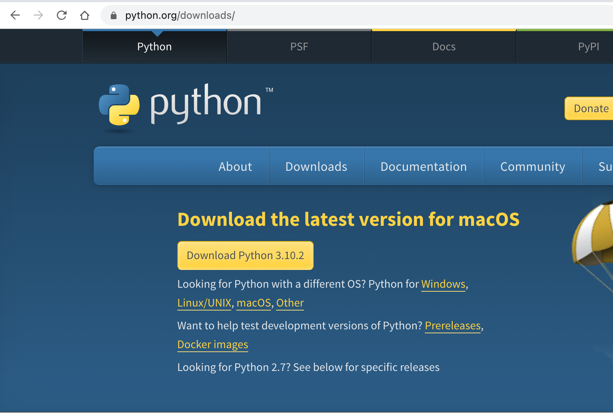

- Anaconda / Miniconda（数据科学必备）
- 操作系统内置的包管理器（开发者首选）
  - macOS： 使用 Homebrew。
    > `brew install python`
  - Linux (Ubuntu/Debian)： 通常自带 Python，升级使用apt。
    > `sudo apt update && sudo apt install python3`
  - Windows： 可以通过微软商店（Microsoft Store）搜索 "Python" 直接一键安装

安装完成后，请打开命令行（CMD 或 Terminal），输入 `python --version`。
如果看到版本号输出，说明你已经成功开启了 Python 大门！

可以在代码里面了解我们的Python（解释器）。
- 当前Python版本
```python
from platform import python_version
python_version()
```
- python解释器的全路径名
```python
import sys
sys.executable
```
通过不同的途径，同时安装多个 Python 版本（比如 3.9 跑旧项目，3.12 尝鲜）是开发者的常态，但这确实容易导致“库装错地方”或“命令无效”的混乱。
```console
(python3.12) zhengmaoxie@m1book cintro2025 % py --list
 3.13 │ /opt/homebrew/bin/python3.13
 3.12 │ /Users/zhengmaoxie/.virtualenvs/python3.12/bin/python3.12
 3.11 │ /opt/homebrew/bin/python3.11
 3.10 │ /opt/homebrew/bin/python3.10
 3.9  │ /opt/homebrew/bin/python3.9
```
> Python Launcher 是一个小工具（命令为 py），它能根据代码首行的指示或参数，
> 自动帮你从电脑里安装的多个 Python 版本中选出正确的那一个来运行。

处理这个问题的核心思路不是删除，而是**“隔离”**。

###  解决NotFoundError

```python
from line_profiler import LineProfiler
def foo(n):
    a = 5
    b = 6
    c = 10
    for i in range(n):
        for j in range(n):
            x = i * i
            y = j * j
            z = i * j
    for k in range(n):
        w = a * k + 45
        v = b * b
    d = 33

if __name__ == "__main__":
    lprofiler = LineProfiler(foo)
    lprofiler.run('foo(10)')
    lprofiler.print_stats()
```

  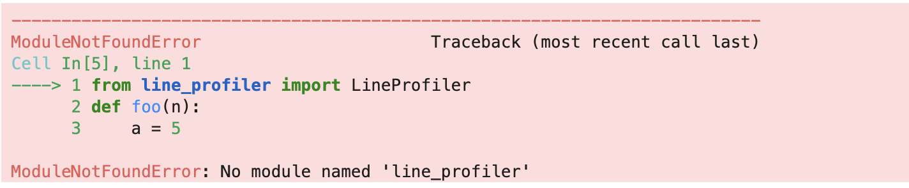

安装缺少的python软件包：

```console
(python3.12) zhengmaoxie@m1book dsa2026 % python -m pip install line_profiler
Collecting line_profiler
  Downloading line_profiler-5.0.2-cp312-cp312-macosx_11_0_arm64.whl.metadata (31 kB)
Requirement already satisfied: typing_extensions in /Users/zhengmaoxie/.virtualenvs/python3.12/lib/python3.12/site-packages (from line_profiler) (4.12.2)
Downloading line_profiler-5.0.2-cp312-cp312-macosx_11_0_arm64.whl (495 kB)
Installing collected packages: line_profiler
Successfully installed line_profiler-5.0.2

(python3.12) zhengmaoxie@m1book dsa2026 % pip show line_profiler
Name: line_profiler
Version: 5.0.2
Summary: Line-by-line profiler
Home-page: https://github.com/pyutils/line_profiler
Author: Robert Kern
Author-email: robert.kern@enthought.com
License: BSD
Location: /Users/zhengmaoxie/.virtualenvs/python3.12/lib/python3.12/site-packages
Requires: typing_extensions
Required-by:

```
- pip是什么？
  - pip 是 Python 的官方“软件包管家”，专门负责从云端仓库下载、安装、升级和管理那些别人写好的功能库（第三方包）。
  - `python -m pip install` (通过 Python 调用)
    > 这是官方更推荐的写法。它的意思是：启动指定的 python 解释器，并让它运行自带的 pip 模块。

如果仍然报ModuleNotFoundError，检查一下python的sys.path。
  > 当你输入 import os 或 import my_script 时，Python 并不是在你的电脑里全盘扫描，
  > 而是按照 sys.path 这个列表里记录的文件夹顺序，一个接一个地去找。如果找遍了还没找到，
  > 就会报那个著名的错误：ModuleNotFoundError。

```python
import sys
sys.path
```
通常它包含以下几类路径：
- 当前目录：你运行脚本时所在的文件夹（列表的第一个元素 ''）。
- 环境变量 PYTHONPATH：你自己手动设置的搜索路径。
- 标准库路径：Python 自带功能（如 json, re）所在的位置。
- 第三方库路径 (site-packages)：你用 pip install 安装的库都在这里。

### 各个操作系统里的 Python

#### Windows

- 各个版本的 Windows 都需要额外安装 Python
  - 安装成功完成后，从程序菜单找 Python
- Command Line 是命令行界面
  - 只能交互式执行单个语句
  - 如何退出：Use quit() or Ctrl-D (i.e. EOF) to exit
- IDLE 是 Python 的“极简” 图形界面
  - 拥有两种窗口：
  - 交互式单句执行窗口：Shell
  - 程序代码文件编辑窗口，编辑和保存程序文件，并在 Shell 中执行程序（Run->Run Module）

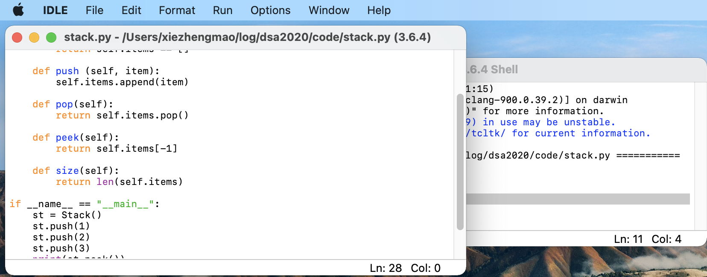

#### macOS

- macOS 内置有 Python，但可 以安装更高版本的 Python
- 命令行界面从“Launchpad-> 其 它-> 终端“，输入 python3
- IDLE 从”Launchpad” 直接运行 命令行界面和 IDLE 跟 Windows 下一样


#### Linux

- 各种 Linux 都内置了 Python3 
- 命令行界面也是从终端输入 python3 来启动
- 也具备 IDLE 的图形界面
  - 有简单自动安装命令
  - sudo apt install idle3
- IDLE 的基本操作也是一样

### 在 IDLE 中编辑和运行 Python 程序

- 启动 IDLE
- File->New File
- 在文件编辑窗口中输入代码
- 保存代码文件
  - 目录名和文件名不要用中文
- Run->Run Module 运行程序
- 在 Python Shell 中查看结果

### 集成开发环境：PyCharm

- 首先 New Project
- 创建 homework 目录
- 选择好 Python3 的解释器
- 然后 File->New⋯来创建 Python File
- 有巨多高级特性帮助快速编写 程序
- Run->Run⋯来运行程序
- 可以 Tools-> Python Console 调出命令行界面来执行单条语句

> 但无论是PyCharm还是VsCode，本身并不包含 Python。它们只是高效的“文本编辑器 + 工具箱”。
> 如果没有指定解释器（Interpreter），编辑器就不知道该用哪个文件夹里的 python.exe 来运行你的代码，
> 甚至连基础的代码补全和语法报错（红波浪线）都无法正常工作。

### JupiterLab

一个非常好的 Python 学习工具

- jupyterLab is the latest web-based interactive development environment for notebooks, code, and data.
- https://jupyter.org/
- 安装 `$ pip install jupyterlab` or `$ brew install jupyterlab`

### Unix/Linux/Mac 命令行下的开发环境

- Linux 与 Unix 同源，很多程序是通用的。
- Mac 的内核是 darwin, Unix

- 完备的生态，分工合作，大师出品
  - 文本编辑：vim, emacs

  - 文本处理：grep, sed, awk
  - 编程：make, gcc, python，…
  - 论文写作：$\LaTeX$
  - 文档、代码管理：Git

- 小身板，高稳定，力量大；
- 效率高，大量的快捷键，高 APM（Actions Per Minute）
- 要记很多东西，初期学习曲线陡。
- 后面的一些例子采用了这样的开发环境，但不影响代码。

### 第一个 Python 语句；超级计算器

- 打开 IDLE
- 在 Python Shell 中输入 语句
  - print (”Hello World!”)
- 立即看到运行结果！
- 可以计算 $2^{100}$
- 也可以直接输入算式，
- 当计算器用
- 超级大的数都没问题

```python
print("Hello World!")
print(2**100)
```

### Python2 or Python3?

- `print ”HelloWorld!”` vs. `print(”HelloWorld!”)`
- 全国计算机等级考试 Python 语言程序设计要求 Python3.5 版本及 以上
- Python2.7 在今年初开始已经停止维护
- 有些公司还在坚持用 Python2；一些基础软件依赖于 python2
  - 大量的代码是 Python2 的，升级成本高。
  - 担心兼容性问题。(Mysql5.7 & Mysql8)
- 让自己的代码同时兼容 python2 和 python3? 也麻烦！
- 对于我们，选择 Python3，有时电脑上装了几个版本的 Python，需要确认一下。

  > Python2还存在，但已经“死亡”，现实开发几乎全部使用Python3。

## Python程序

### "helloWorld"程序

- 编辑文件 hw.py
- 在文件中写入一行代码，保存退出。
```python
#hw.py
print ("Hello World!")
```
- 执行程序: `python hw.py`
- 对比 C 程序，省事很多。
```c
#include <stdio.h>

int main()
{
  printf("Helle World!\n")
  return 0;
}
```

```console
$ gcc -g -o hw hw.c
$ ./hw
Hello World!
```

### 代码缩进

视觉效果和功能的统一

- 程序块 block 是代码中经常出现的组 织方式

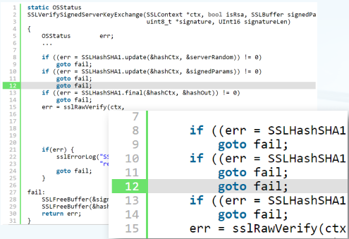

- 用’{}’ 容易出现的问题：C/java
  - 第 12 行的go fail;被误以为属于
  - if_block；实际上被无条件执行。
  - 整个函数始终以 fail 返回；
- 让眼睛更快、更轻松：
  - 缩进 vs. ’{}’
  - 颜色
- 缩进产生的 block 更加直观

### 注释与文档

在 Python 中，写好注释（Comment）和文档（Docstring）是区分“业余玩家”和“专业开发者”的重要标志。
Python 提供了两个层级的说明方式：

#### 1. 行内注释 (Inline Comments)

使用 # 符号。这是最基础的注释，用于解释某行代码“为什么”这么写，而不是“写了什么”。
- 语法： # 后跟一个空格。
- 规范： 如果写在代码行尾，建议与代码保持至少两个空格的距离。
  ```python
  x = x + 1  # 补偿边界溢出的偏移量
  ```

#### 2. 文档字符串 (Docstrings)
这是 Python 的精华所在。使用 三引号 (""" 或 ''')。它不仅是注释，还能被 Python 解释器识别，通过 help() 函数或 IDE 查看到。

- A. 函数/方法文档

紧跟在函数定义行之后，说明参数、返回值和功能。
```python
def calculate_bmi(weight, height):
    """
    计算身体质量指数 (BMI)。

    参数:
        weight (float): 体重 (kg)
        height (float): 身高 (m)

    返回:
        float: 计算出的 BMI 数值
    """
    return weight / (height ** 2)

help(calculate_bmi)
```

- B. 模块/类文档

放在文件（模块）的最开头，或者 class 定义的第一行。

* 黄金法则
  - 不要过度注释： 像 `i = i + 1 # 让 i 加 1 ` 这种注释是垃圾，代码本身已经说明了一切。
  - 代码即文档： 好的变量名（如 `user_retry_count`）比糟糕的变量名加注释（如 `n = 0 # 用户重试次数`）要强一百倍。
  - 同步更新： 改了代码却没改注释，是程序员最大的“罪过”。

### 程序可读性

- Python 的强制缩进规范完成了关键部分
- 我们还需要良好的编程规范
  - 变量、函数、类命名
  - 注释和文档
  - 一些编程设计上的良好风格
```
Programs are meant to be read by humans
and only incidentally for computers to
execute.
                    —Donald Ervin Knuth
```

### Python 语言的几个要件

* 数据对象和组织
  - 对现实世界实体和概念的抽象
  - 分为简单类型和容器类型
  - 简单类型用来表示值
    - 整数 int、浮点数 float、复数
    - complex、逻辑值 bool、字符串str
  - 容器类型用来组织这些值
    - 列表 list、元组 tuple、集合set、字典 dict
  - 数据类型之间几乎都可以转换

* 赋值和控制流
  - 对现实世界处理和过程的抽象
  - 分为运算语句和控制流语句
  - 运算语句用来实现处理与暂存
    - 表达式计算、函数调用、赋值
  - 控制流语句用来组织语句描述过程
    - 顺序、条件分支、循环
  - 定义语句也用来组织语句，描 述一个包含一系列处理过程的 计算单元
    - 函数定义、类定义

## 数据类型

| 类型类别      | 类型名                                | 示例                                                  |
| --------- | ---------------------------------- | --------------------------------------------------- |
| **数值类型**  | `int`, `float`, `complex`, `bool`  | `42`, `3.14`, `1+2j`, `True`                        |
| **序列类型**  | `str`, `list`, `tuple`, `range`    | `'abc'`, `[1,2,3]`, `(4,5,6)`, `range(3)`           |
| **集合类型**  | `set`, `frozenset`                 | `{1,2,3}`, `frozenset([1,2,3])`                     |
| **映射类型**  | `dict`                             | `{'a':1, 'b':2}`                                    |
| **空类型**   | `NoneType`                         | `None`                                              |
| **二进制类型** | `bytes`, `bytearray`, `memoryview` | `b'abc'`, `bytearray(b'abc')`, `memoryview(b'abc')` |

### 变量

#### 1. 变量的本质：标签，而非盒子

在 C 语言中，变量像是一个盒子，你把数据放进盒子里。
在 Python 中，变量更像是一个标签（Tag）或引线。
- 对象（Object）：数据（如数字 10 或字符串 "Hello"）在内存中独立存在。
- 变量（Variable）：只是指向那个对象的名称。

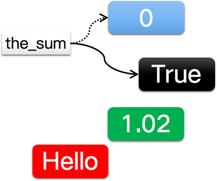

* the_sum=0 实际上把数据对象“0”的引用/指针赋值给 the_sum
* 变量可以指向任何一个数据对象，比如 True，1.02，或者“Hello”
* 变量的类型随着指向的数据对象类型改变而改变！
* Python 的类型是“动态”的
* __强类型__ vs. 弱类型，
* 静态类型 vs. __动态类型__

```python
a = 5
print(f"a={a}", f"id(a)={id(a)}")
a = 10
print(f"a={a}", f"id(a)={id(a)}")
```
> id(obj) 返回对象 obj 在当前运行期间的 唯一标识符。
> 在 CPython（最常见的 Python 实现）里： id(obj) 就是对象的内存地址。

当你写下 a = 10 时，Python 的动作是：
* 1. 在内存中创建一个对象 10。
* 2. 创建一个名为 a 的变量。
* 3. 将 a 指向对象 10。

当需要实现一个单链表结点类时，注意下面C/C++和Python中的next的不同。
- C++
  ```c++
  struct Node {
      int data;
      Node* next; // 这是一个存储“内存地址”的槽位
  };

  Node* a = new Node{1, nullptr};
  Node* b = new Node{2, nullptr};
  a->next = b; // 将 b 的地址“填入” a 的 next 槽位
  ```
- Python
  ```python
  class Node:
      def __init__(self, data):
          self.data = data
          self.next = None # self.next 是一个标签

  a = Node(1)
  b = Node(2)
  a.next = b # 将 a.next 这个标签贴在 b 所指向的对象上
  ```

#### 2. 变量名（标识符）的命名规则

Python 对变量名有严格的“性格要求”：

- 硬性规定：
  - 只能包含字母、数字和下划线（_）。** 汉字也可以 **
  - 不能以数字开头（如 1name 是非法的）。
  - 不能使用 Python 的关键字（如 if, for, def 等）。
- 命名风格（约定俗成）：
  - 蛇形命名法（snake_case）：Python 官方推荐，如 user_age, max_height。
  - 见名知意：不要用 a, b, c，除非是在极短的循环里。
  - 下划线含义：单下划线开头（_internal）通常表示“私有变量”，不希望被外部直接访问。

#### 3. 变量的访问机制：LEGB 规则

当你访问一个变量名时，Python 会按照 LEGB 的顺序搜索这个名字。如果搜遍了还没找到，就会报 NameError。

- 1. L (Local) - 局部作用域：
  > 函数内部定义的变量。
- 2. E (Enclosing) - 嵌套作用域：
  > 闭包环境（比如函数套函数，外层函数的变量）。
- 3. G (Global) - 全局作用域：
  > 当前 .py 文件顶层定义的变量。
- 4. B (Built-in) - 内置作用域：
  > Python 自带的名字，如 len, range, print。

* global 关键字的作用是：在函数内部声明，允许你修改全局变量的值。

```python
count = 0

def increment():
    global count  # 明确告诉 Python：我要动的是外面那个 count
    count = 10
    print("函数内:", count)

increment()
print("函数外:", count)
# 输出：函数内: 10, 函数外: 10 (全局变量被成功修改)
```

* 只有在“赋值”时才必须
  > 如果全局变量是一个可变对象（比如列表 list 或字典 dict），你调用它的方法（如 `.append()`）修改内容，
  > 是不需要 global 的。只有当你用 `=` 重新指向新对象时才需要。

##### 变量访问效率

当 Python 把你的源代码编译成**字节码（Bytecode）**时，它会对这两类变量采取完全不同的处理方式：

- 局部变量：索引寻址 (Fast Path)

在函数内部，Python 能够确定所有的局部变量。它会将这些变量存储在一个紧凑的、固定大小的**数组**中。

  * **指令：** 使用 `LOAD_FAST`。
  * **原理：** 访问时就像通过索引找数组元素（比如“取数组第 3 个位置的值”），速度极快。

- 全局变量：字典查询 (Slow Path)

全局变量存储在模块的 `__dict__`（一个哈希表/字典）中。

  * **指令：** 使用 `LOAD_GLOBAL`。
  * **原理：** 访问时需要进行哈希计算并搜索字典。即使 Python 对此做了优化，但哈希表查询的开销依然远高于数组索引。

虽然在现代计算机上，这种差异以“纳秒”计，但在处理大规模循环（百万次量级）时，差距会变得肉眼可见。

**实验对比：**

```python
import timeit

def use_local():
    x = 1
    for _ in range(1000):
        a = x  # 访问局部变量

x_global = 1
def use_global():
    for _ in range(1000):
        a = x_global  # 访问全局变量

print(f"局部变量耗时: {timeit.timeit(use_local, number=100000)}")
print(f"全局变量耗时: {timeit.timeit(use_global, number=100000)}")

```

通常情况下，**访问局部变量的速度比全局变量快约 20% 到 40%**。


-  一个常见的优化技巧

如果你在一个高频循环中必须反复调用一个全局函数（比如 `math.sin`）或访问全局变量，可以先将其**缓存到局部变量**中。

**不推荐写法：**

```python
import math
def compute():
    for x in range(1000000):
        y = math.sin(x)  # 每次循环都要查找全局变量 math，再查其属性 sin

```

**推荐写法（更快）：**

```python
import math
def compute():
    sin = math.sin  # 将全局函数缓存到局部变量
    for x in range(1000000):
        y = sin(x)  # 使用 LOAD_FAST 访问

```
#### 4. 如何进行对象的拷贝

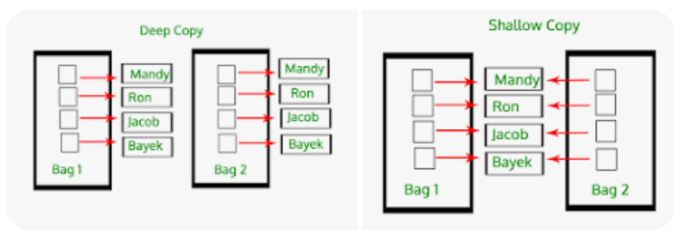

- `import copy`
- 浅拷贝： `Bag2 = copy.copy(Bag1)`
- 深拷贝： `Bag2 = copy.deepcopy(Bag1)`

deepcopy 会采取“递归式”的拷贝，它甚至能拷贝链表，并处理好链表上可能存在的**环**。

### 可变类型和不可变类型

* 不可变类型
  - 数字
  - 字符串
  - 元组

* 每次运算都生成一个新对象 
* 元组不能够元素赋值

* 为什么元组? 元组的出 现让 Python 程序更优 雅
```python
def 碾米(谷子):
  return divmod(谷子, 10)

米, 糠 = 碾米(31)
print(米, 糠)
```

* 可变类型
  - 列表
  - 集合
  - 字典
* 可以改变，可以赋值
* 不同的变量可能指向同一个对象

### 整数 int、浮点数 float

- Python 语言本身没有限制整数的大小
```python
7**(7**7)
```
```python
700**(700**700)
```
- 不得已的情况下，用sys.maxsize 表示$\infty$
- 整数运算包括以下种类：
  - 位运算：与`&`/或`|`/非`~`/异或`^`/左移`<<`/右移`>>`
  - 四则运算：加/减/乘/除、整除、求余
  - 幂运算
```python
a, b = 10, 3
f"{a:05b}, {b:05b}"
```

```python
f"a&b = {a&b:05b}"
```

```python
f"a|b = {a|b:05b}"
```

```python
f"~a = {~a:06b}"
```

```python
f"a^b = {a^b:05b}"
```

```python
7 / 2
```
```python
7 // 2
```
```python
7 % 2
```
```python
7 ** 3
```
```python
divmod(9, 5)
```
```python
2 ** 100
```
- 整数运算的运行时间与整数位数有关，一般来说
  - 位运算  &lt;  加减  &lt;  乘法  &lt;  除法  &lt;  幂
  - Python对与**2的幂**有关的运算，基本全部做了优化

* 求777**(777**777)的末四位？
  - pow(base, exp, mod)对幂求余的情况做了优化
```python
777**(777**777) % 10000
```

```python
pow(777, 777**777, 10000)
```
- 浮点数的操作也差不多，但受到 17 位有效数字的限制，存在精度丢失问题。
  - 需要用其他的办法来判断两个浮点数是否相等
```python
0.1 + 0.2 == 0.3, 0.1 + 0.2 < 0.3, 0.1 + 0.2 > 0.3
```
```python
import math
math.isclose(0.1+0.2, 0.3, rel_tol=1e-9)  #在十亿分之一的精度上判断
```

- 一些常用的数学函数如 sqrt/sin/cos 等都在math模块中
```python
import math
math.sqrt(2)
```

### 复数
- Python 内置对复数的计算
- 支持所有常见的复数计算
```python
1+3j
```
```python
(1+2j)*(2+3j)
```
```python
(1+2j)/(2+3j)
```
```python
(1+2j)**2
```
```python
(1+2j).imag
```
```python
(1+2j).real
```

- 对复数处理的数学函数在模块cmath 中
```python
import cmath
cmath.sqrt(1+2j)
```
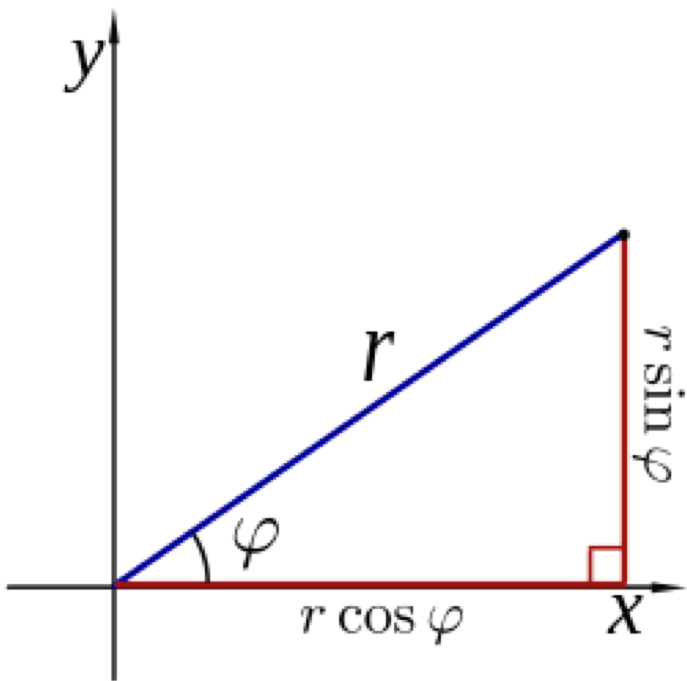

  - polar：极坐标
  - rect：直角坐标

```python
import cmath
cmath.polar(3+4j)
```
```python
import cmath
cmath.rect(1, cmath.pi)
```

- 复数的表示: m + nj（n = 1 时不能省略）
```python
1+1j
```
```python
1+j
```

### 逻辑类型：bool
- 用来作为判断条件，是逻辑推理的基础
  - 仅有两个值：True、False
- bool类型是int类型的子类，可以与int进行比较
```python
issubclass(bool, int)
```
```python
True == 1
```
```python
False == 0
```
```python
int(True)
```
```python
int(False)
```
- 数值的比较得到逻辑值
```python
3 > 4
```
- 逻辑值也有自己的运算
  - and，or，not
- 逻辑值用来配合if/while等语句做条件判断
- 其它数据类型在必要的时候可以转换为逻辑值：
  - 隐式调用`bool(x)`，称之为**等效**
  - 这些值等效于逻辑值`False`
    - 数值0、空字符串`''`、空容器、None
    - 类对象: 定义了`__bool__()`返回 False，或者定义了`__len__()`返回 0
  - 其他的等效于`True`
- `如果x为True`这句话有三种语义
  1. `if x:`  x等效于True，即`bool(x) == True`
  2. `if x==True: ` 值比较: 内置类型按内容进行比较；自定义类尝试调用特殊函数`__eq__`，或判断是否同一对象
```python
1 == True
```
```python
2 == True
```
```python
2 == False
```
  3. `if x is True: ` 判断是否同一对象
- and, or的短路
  - `f(x) and g(x)`
  - 运算从左至右进行，先计算f(x)，再计算g(x)
  - 如果f(x)等效为False，则直接返回f(x)的结果，不再计算g(x)
  - 同理`f(x) or g(x)`中如果f(x)等效为True，也返回f(x)的结果，不再计算g(x)
  - 优化策略：把“容易算”的条件f(x)放前面，避免计算“难算”的g(x)


### str字符串
- 文字字符构成的序列（“串”）
  - 可以表示姓名、手机号、快递地址、菜名、诗歌、小说
- 没有专门的字符类型，字符用长度为一的字符串表示
- 用双引号或者单引号都可以表示字符串
  - 多行字符串用三个连续引号表示
- 字符串操作：
  - +连接、*复制、len长度
  - [start:end:step]用来提取一部分（切片slice）

```python
'abc'
```
```python
"abc"
```
```python
print('''abc def
ghi jk''')
```
```python
"Hello\nWorld!"
```
```python
print ("Hello\nWorld!")
```
- 字符串拼接，执行效率为O(N）

```python
'abc' + 'def'
```
- 如果要拼接大量的字符串，则应该把它们都放到一个list里面，再进行`join`
  - 一个一个拼接的话，复杂度会达到$O(n^2)$
  - 而先list再join，复杂度只有O(n)

```python
import timeit

data = ['abc'] * 1000000

def cat_one_by_one():
    s = ""
    for i in data:
        s += i
    return s

def join_list():
    return ''.join(data)

print(f"cat_one_by_one耗时: {timeit.timeit(cat_one_by_one, number=100)}")
print(f"join_list耗时: {timeit.timeit(join_list, number=100)}")
```

```python
'abc' * 4
```
```python
len('abc')
```
```python
'abcd'[0:2]
```
```python
'abcd'[0::2]
```

- 判断字符串内容
  - isalnum/isalpha/isascii
  - isdecimal 十进制整数
  - isdigit 数字
  - isnumeric 数
  - isidentifier 标识符
  - islower/isupper 大小写
  - isprintable 可显示字符
  - isspace 各种空白字符
- 作为字符串（类）的方法
- 使用unicode，对中文有不错的支持
```python
'一八九八'.isnumeric()
```
```python
'Ωßπ'.isalpha()
```
```python
' '.isspace()
```
```python
' \t\n'.isspace()
```

- 查找字符串
  - startswith 开始字符是否
  - endswith 结束字符是否
  - find/index 查找子串（首次）
    - 两者在未找到子串时行为不一样
  - count 查找子串出现次数

```python
"abc".startswith("ab")
```
```python
s = "Hello"
s.endswith("lo")
```
```python
s.find("l")
```
```python
s.index("o")
```
```python
s.count ("l")
```
```python
s.count("lo")
```

- 格式化
  - zfill 填充前导0 - （扩充后字符串长度）
```python
s
```

```python
s.zfill(8)
```
```python
"127".zfill(10)
```

#### 更多常用操作

- split：分割；
  - 缺省使用space做分割符，也可以指定其他的
```python
s = 'You are \nmy \t sunshine.'
print(s)
```
```python
s.split()
```
- join：合并
```python
'-'.join(["One", "for", "Two"])
```
- upper/lower/swapcase：大小写相关
```python
'abc'.upper()
```
```python
'aBC'.lower()
```
```python
'Abc'.swapcase()
```
- ljust/center/rjust：排版左中右对齐
```python
'Hello World!'.center(20)
```
- replace：替换子串
```python
'Tom smiled, Tom cried, Tom shouted'.replace( 'Tom', 'Jane')
```
- [::-1]：字符串翻转
  - CPython用C实现的，专门优化过的特殊路径。非常快！
```python
'Tom smiled, Tom cried, Tom shouted'[::-1]
```

- 把整数转成字符串，CPython用C实现的，也非常快！

```python
i = 7 ** 700
```

```python
str(i)
```

#### f-string格式化功能
- f-string格式化字符串
  - f"Your {n} apples"
- 关于{}中的格式
  - :d :b :o :x 十/二/八/十六进制
  - :< :> :^ 左/右/居中对齐
  - :e :E 科学计数法
  - :f :F 小数
  - :#.# 宽度和小数点位数
  - :, :_ 千分位
```python
n=12
f"Your {n} apples"
```
```python
f"Your {n:b} apples"
```
```python
f"Your {n:^12b} apples"
```
```python
f"Your {n:^12.2f} apples"
```
```python
everest = 8848.86
f"""The official height of Mount Everest is {everest:^10,} meters"""
```
- [功能非常强大，语法也很复杂]( https://docs.python.org/3.14/reference/lexical_analysis.html#formatted-string-literals )

#### str的format方法
- 模版字符串.format(v1, v2, ...) – 先定义模板，再用format赋值
  - 带{}的模版
- 模版字符串的几种形式
  - "{} {} times"
  - "{0} {1} times"
  - "{sname} {nadd} times"
- 可以加入上页格式
  - {}中的格式
```python
sft = "For only {price:.2f} dollars!"
sft.format(price=123.1)
```
```python
"{} {} times".format("pat", 12)
```
```python
"{1} {0} times".format(12, "pat")
```
```python
"{sname} {nadd} times".format(nadd=12, sname="pat")
```

### 容器数据类型

#### 列表和元组
- Python中有几种类型是一系列元素组成的序列，以整数作为索引（也叫数字下标）
  - 计算机中的所有数字下标都是从`0`开始的
- 字符串str是一种同类元素的序列
- 列表list和元组tuple则可以容纳不同类型的元素，构成序列
- 元组是不可更新（不可变）序列
  - 字符串也是不能再更新的序列
- 列表则可以删除、添加、替换、重排序列中的元素
  - 可变类型

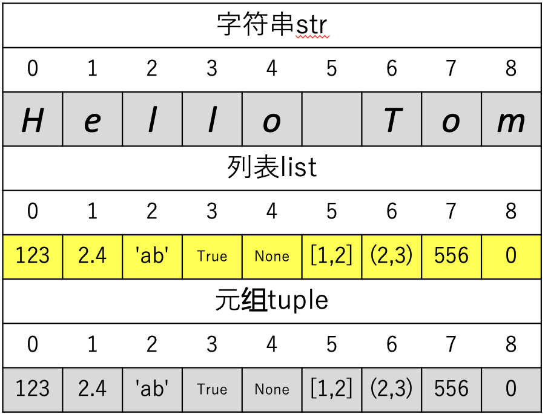

- 丰富的操作
    - 创建列表：[]或者list()
    - 创建元组：()或者tuple()
    - 用索引[n]获取元素（列表可变）
    - +：连接两个列表/元组
    - \*：复制n次，生成新列表/元组
    - len()：列表/元组中元素的个数
    - in：某个元素是否存在
    - [start:end:step]：切片

```python
[]
```
```python
list()
```
```python
alist = [11, True, 0.234]
alist[0]
```
```python
alist + ["Hello"]
```
```python
alist * 2
```
```python
len(alist)
```
```python
alist
```

猜猜什么结果？
```python
1 in alist
```
```python
alist
```
```python
alist[1:3]
```
```python
alist[0:3:2]
```
```python
alist[::-1]
```

```python
()
```
```python
tuple()
```
```python
atuple = (1, True, 0.234)
atuple[0]
```
注意单元素的元祖是怎么表示的？
```python
atuple + ("Hello",)
```
```python
atuple * 2
```
```python
len(atuple)
```
```python
1 in atuple
```
```python
atuple
```
```python
atuple[1:3]
```
```python
atuple[0:3:2]
```
```python
atuple[::-1]
```

##### 列表的其它方法

- 添加/插入/删除/更新等

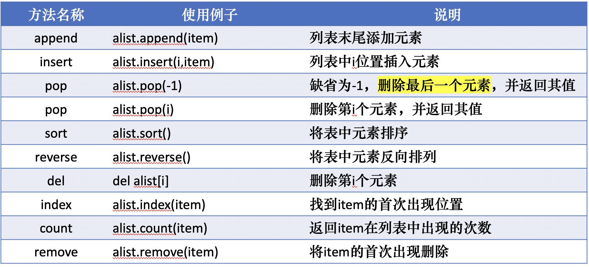

##### 可变类型和不可变类型

- 列表可以添加、插入、删除、更新、重新排列其中的元素
```python
alist=["OK", True, 0.345]
alist[0]=False
alist
```
- 元组不能添加、插入、删除、更新、重新排列其中的元素
```python
atuple = tuple(alist)
atuple[0]=True
```
- 字符串也不能添加、插入、删除、更新、重新排列其中的字符
```python
astr = 'Hello'
astr[0] = 'h'
```

##### 可变类型的变量引用情况
- 由于变量的引用特性，可变类型的变量操作需要注意
- 多个变量通过赋值引用***同一个***可变类型对象时
- 通过其中任何一个变量改变了可变类型对象
- 其它变量也会看到了改变
```python
alist = [1,2,3,4]
blist = alist
blist[0] = 'abc'
alist[0]
```
```python
cc = list(alist)
cc, id(cc), id(alist)
```

- 通过slice操作可以对列表进行复制，得到一个***新***的对象。
```python
clist = alist[:]
clist[0] = True
alist[0]
```
- 可视化python网站：[https://pythontutor.com/]( https://pythontutor.com/ )

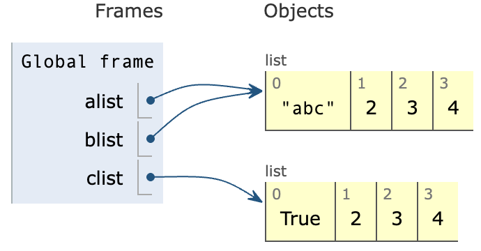

#### 集合set
- 集合是不重复元素的无序组合
- 用set()从其它序列转换生成集合
- 集合的常见操作
  - in：判断元素是否属于集合
```python
aset = set('abccc')
aset
```
```python
'a' in aset
```
存在同样的问题
```python
bset = {11, True, 0.234}
1 in bset
```
  - |, union()：并集
```python
aset | set('bcd')
```
  - &, intersection() ：交集
```python
bset = set(['b','c','d'])
aset & bset
```
  - -, difference() ：差集
```python
aset - bset
```
  - ^, symmetric_difference() ：异或
```python
aset ^ bset
```
  - <=,<,>=,>：子集/真子集/超集/真超集
```python
aset <= set('abcd')
```
```python
aset > set('abcd')
```
##### 集合set创建方式
- 直接创建，注意`{}`创建的是空字典
```python
aset = {'a', 'b', 'c'}
bset = {}
cset = set()
type(aset), type(bset), type(cset)
```
- 由字符串创建
```python
aset = set('abc')
aset
```
- 由list和tuple创建
```python
set(['a','b','c'])
```
```python
set(('a','b','c'))
```
##### set的更多方法
- add(x)：集合中添加元素
```python
aset.add('1.23')
aset
```
- remove(x)：删除指定元素
```python
aset.remove('b')
aset
```
```python
aset.remove('xzm')
```

- pop()：删除集合中随机元素并返回其值
```python
aset.pop()
```
```python
aset
```
- clear()：清空集合成为空集
```python
aset.clear()
aset
```

```python
hash([1,2,4])
```

- 如果经常需要判断元素是否在一组数据中，这些数据的次序不重要的话，推荐使用集合，可以获得比***列表***更好的性能

#### 字典dict
- 字典是通过键值key来索引元素value，而不是象列表是通过连续的整数来索引
  - 字典中的key和对应的value用冒号`:`连接，每个key-value对之间用逗号`,`分开；整个字典包在花括号`{}`中
- 字典是通过键值 key 来索引元 素 value，而不是象列表是通过 连续的整数来索引
- 字典是可变类型，可以添加、 删除、替换元素
- 字典中的元素 value 没有顺序， 可以是任意类型
- 字典中的键值 key 和集合的元 素都必须是 hashable
- 数值、字符串、元组、布尔值 是不可变类型 immutable
- immutable ⊂ hashable
- in 操作判断的是 key
```python
student = {'name':'Tom', 'age':20, 'gender':'Male', 'course':['math', 'computer']}
student
```
- 字典是可变类型，可以添加、删除、替换元素
  - dict[key] = value添加
```python
student['sno'] = '2400011141'
student
```
  - dict[key].pop删除
```python
del(student['sno'])
```
```python
student
```
  - dict[key] = newvalue修改
```python
student['name'] = 'Tom Hanks'
student
```
  - key in dict 是否存在key
```python
'gender' in student
```
  - len(dict)长度
```python
len(student)
```
  - keys(), values(), items() 遍历
```python
student.keys()
```
```python
student.values()
```
```python
student.items()
```
```python
for key in student:
  print(f"{key}: {student[key]}")
```

#### 建立大型数据结构（嵌套/复合）
- 嵌套列表
列表的元素是一些列表: alist[i][j]
- 字典的元素可以是任意类型，甚至也可以是字典
  - `bands= {′Marxes′ : [′Moe′ , ′ Curly′]}`
- 字典的键值可以是任意hashable类型，例如用元组来作为坐标，索引元素
  - `poi= {(100, 100) :′ busstop′}`

#### 三种类型的总结
- 列表list
  - 方括号[]，可增删修改
  - 元括号()为元组，不可修改
- 集合set
  - 花括号{}为集合
  - set()函数创建
  - 可做集合操作，in, &, |, -, ^, add, remove, pop, clear
- 字典
  - 花括号+冒号：{a:b, c:d, e:f}
  - 增删改: dict[key]=xxx, dict[key].pop, key in, len()

## 输入/输出

### 获取输入：input函数
- 用户给程序的数据在他脑子里，如何告诉计算机？
- input函数通过键盘获取用户输入的字符串
  - 以回车符作为输入结束，一行
- 可以加一个提示语句
  - 看清题，没有要求在OJ中***千万不能加***
```python
x = input("x :")
```
```python
y = input("y :")
```
```python
x + y
```
```python
type(x)
```
- input()得到的是字符串，需要转换成需要的其他类型
```python
x = int(input("x :"))
```
```python
y = int(input("y :"))
x + y
```
```python
type(x)
```
- 一个input()可能包含多个输入数据
  - 先用split()把它们分为多个“子串”放到一个列表里
  - 然后用推导式或者map把字串一起转化成所需的类型
```python
list(map(int, input().split()))
```
```python
[int(i) for i in input().split()]
```
- 获取不定行数的输入
  - input()每次读取一行输入，如果碰到用户终止输入则抛出EOFError
```python
sum = 0
while True:
  try:
    sum += int(input())
  except (EOFError, KeyboardInterrupt):  
    break #输入终止

print(f"sum={sum}")
```

### 打印输出：print函数
- 计算机把处理结果反馈给用户
- 用print在屏幕上显示数据对象或者变量的值
   - print(v1, v2, v3, ...)
- 格式化字符串f-strings
```python
name='Tim'
n = 7
print(f"Hello, {name}!")
```
```python
print(f"{name}, you have tried {n} times.")
```
- 可选的参数
   - sep=" ", end="\n"
```python
print(name, n, sep='#')
```

## 控制流工具

- 程序思维：让同一段程序完成不同的任务
- “控制流工具”就是让程序决定下一步去哪的机制。
- 从简单的 if/for，到复杂一点的异常处理、异步，都属于控制流。

### 条件分支结构：if语句
- 让计算机能够自动根据当前的状况来决定执行哪些语句
- 条件分支结构的2个要素
  - 判断条件
  - 一组语句
- if语句首先计算判断条件
  - 如果得到True，就执行这组语句
  - 否则，不执行

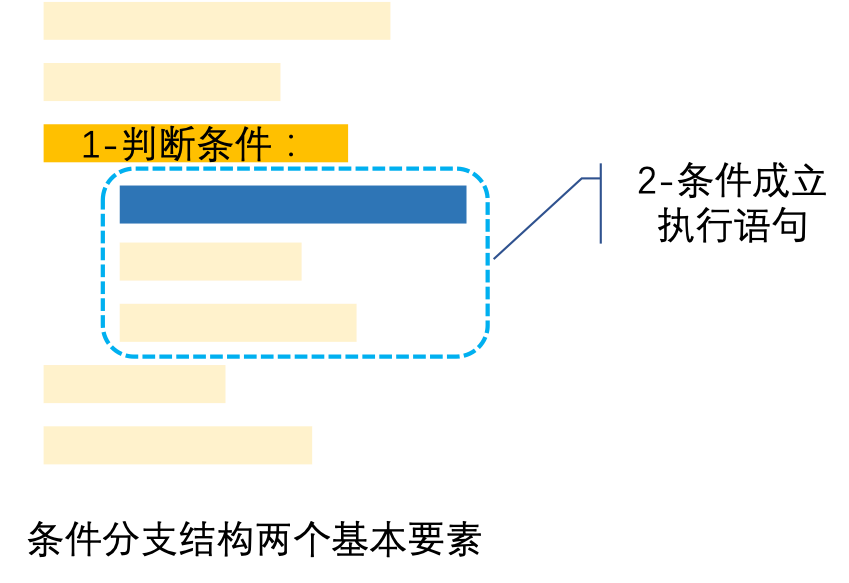

- 条件语句
```
if <逻辑条件>:
    <语句块>
elif <逻辑条件>: #可以多个elif
    <语句块>
else: #最多1个
    <语句块>
```
- 各种类型中某些值会自动被转换为False，其它值则是True：
  - None, 0, 0.0, '',
  - [], (), {}, set()

```python
a = int(input("Input a number:"))
if a > 10:
  print ("Great!")
elif a > 6:
  print ("Middle!")
else:
  print ("Low!")
```

```python
#判断偶数
n = int(input("n="))
print("Your number is", n)
if n % 2 == 0:
  print("It's a even number!")
else:
  print("It's a odd number!")
```

#### if语句的附加要素：elif和else
- elif子句可以在判断条件不成立的时候，再继续判断另一个条件
  - 相当于else：if
- 判断年龄

```python
# 判断年龄
age = int(input("age="))
print("年龄：", age)
if 0 <= age <= 6:
  print("童年")
elif 7 <= age <= 17:
  print("少年")
elif 18 <= age <= 40:
  print("青年")
elif 41 <= age <= 65:
  print("中年")
else:
  print("老年")
```

- 练习题：判断三条边能否构成一个三角形 
```python
def is_triangle(a, b, c):
  return a + b > c and b + c > a and a + c > b

is_triangle(3, 4, 5)
```
### 重复：循环结构（loop）
- 我们需要让计算机反复做设定的任务
- 又能在该停止的时候自动停止重复
- 循环结构具有两个要素
  - 一个循环前提
  - 一组重复执行的语句（循环体）
- 只要循环前提成立，循环体就会被反复执行

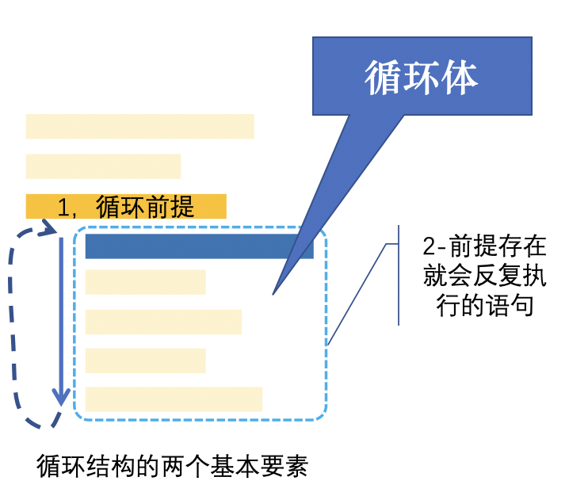

#### 迭代循环：for语句
- 迭代循环语句：for语句
- 循环前提：
  - 一个（或一组）循环变量
  - 一个数据对象集
- for语句每次从对象集中取出一个数据对象，赋值给循环变量
  - 如果能取到，就执行一次循环体
    - 循环体中可以使用循环变量
  - 如果取完了，就退出循环

- 迭代循环for：
```
for <变量> in <可迭代对象>:
    <语句块>
    break #跳出循环
    continue #略过余下循环语句
else: #迭代完毕，则执行
    <语句块>
```
- 可迭代对象有很多类型
  - 象字符串、列表、元组、字典、集合等
  - 也可以有后面提到的生成器、迭代器等

```python
adic = {'name': 'Tom', 'age':18, 'gender': 'Male'}
for k in adic:
  print (k, adic[k])
```
```python
for k, v in adic.items():
  print (k, v)
```

```python
# 求和：1 + 2 + ... + n
n = int(input("Input a number:"))
s = 0
for i in range(1, n+1):
  s = s + i
print(f"sum:1..{n}:", s)
```

```python
# 一元二次函数求值：ax^2+bx+c
a, b, c = 10, -5, 0.5
for x in [-25, 0, 10, 35, 100]:
  y = a * x**2 + b * x + c
  print(f"f({x})={y}")
```

```python
# 打招呼
for name in ["Tom", "Jerry", "张三"]:
  print("Hello!", name)
```

##### for in range
- range函数可以产生连续整数构成的数据集（等差数列）
```python
range(4)
```
- range函数返回range类型的对象，可以直接当做序列用，也可以转换为list或者tuple等容器类型
```python
for i in range(5):
  print(i)
```
- range(end)
  - [0, end)
```python
list(range(5))
```
- range(start, end)
  - [start, end)
```python
list(range(1, 6))
```
- range(start, end, step)
  - [start, end) 步长step
```python
list(range(1, 10, 2))
```
  - 如果step小于0则反向取
```python
list(range(5, 0, -1))
```
```python
list(range(0.1, 1, 0.1))
```

###### 对range进行变换
- range得到整数的等差数列，如何变换为我们需要的各种数列？
- 需要单调小数数列
  - 如：-6.28~6.28，
```python
print([i/100 for i in range(-628,629)])
```
- 需要多个不同的数列：递增/递减/先增后减
  - 如数字三角形

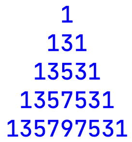

```python
for i in range(5):
  print(" " * (4 - i), end="")
  for j in range(2 * i + 1):
    print((i - abs(i - j)) * 2 + 1, end="")
  print()
```

##### for in list
- 列表是一种容器数据类型，可以包容多个数据对象
- 可以用作for语句的数据集

```python
for n in [1, 3, 5, 7, -10]:
  print(f"({n})^2={n*n}")
```

##### for的更多用法
推导式 comprehensions（又称解析式）

- 可以用来生成列表、字典和集合的语句
  - `[ < 表达式 > for < 变量 > in < 可迭代对象 > if < 逻辑条件 >]`
  - `{ < 键值表达式 >:< 元素表达式 > for < 变量 > in < 可迭代对象 > if <逻辑条件 >}`
  - `{ < 元素表达式 > for < 变量 > in < 可迭代对象 > if < 逻辑条件 >}`
- 代码简洁易懂

```python
[x*x for x in range(10)]
```
```python
{f'K{x}':x**3 for x in range(10)}
```
```python
{x*x for x in range (10)}
```
```python
{x+y for x in range(10) for y in  range (x)}
```
```python
[x*x for x in range(10) if x % 2 == 0]
```
- 可以使用多个 for 结构
- 通过 if 结构进行过滤
- 如何获得一个初始值为 0，大小为 10*10 的二维数组？
```python
x=[[0] * 10] * 10
y=[[0] * 10 for _ in range(10)]
```

```python
x
```

```python
y
```

#### 迭代循环：while语句

- 条件循环while
```
while <逻辑条件>:
    <语句块>
    break #跳出循环
    continue #略过余下循环语句
    <语句块>
else: #条件不满足退出循环，则执行
    <语句块>
```
- else中可以判断循环是否遭遇了break

```python
n= 5
while n > 0:
   n = n - 1
   if n < 2:
     continue
   print(n)
else:
   print('END!')
```

- 循环前提是一个判断条件
  - 逻辑类型表达式：计算结果：True/False
  - 或者可以对应逻辑值的其它类型表达式
    - 例如整数0对应False，非0对应True
    - 空列表对应False，非空列表对应True
- while语句每次都计算表达式
  - 如果结果为“真”True，就执行循环体，然后再计算条件
  - 如果结果为“假”False，就退出循环，执行下一条语句
- 条件循环一般用在事先不确定循环的次数的情况
  - 但知道循环什么时候应该结束

- 第一个能同时整除2/3/4/5/6的整数是哪个？
  - 小技巧：表达式太长怎么办？
  - 只要表达式放在 ()、[]、{} 里，Python 会自动 隐式换行，不需要反斜杠。
```python
n = 1
while not (n % 2 == 0 and n % 3 == 0
           and n % 4 == 0 and n % 5 == 0
           and n % 6 == 0):
   n = n + 1

print("第一个能同时整除2/3/4/5/6的整数是", n)
```

- 摇几次骰子可以出豹子？
```python
import random
n, d = 1, random.randint(1, 6)
while not (d == random.randint(1, 6)
              == random.randint(1, 6)):
   n += 1
   d = random.randint(1, 6)

print(f"play {n} times, get triple {d}")
```

- 随机数模块random
  - 产生一定范围内的随机数（返回 [min, max] 包含上下界）
    - random.randint(min,max)
  - 从列表中随机选择
    - random.choice(list)
```python
import random
colors=['red', 'green', 'blue', 'brown', 'pink']
c=random.choice(colors)
c
```
```python
n=random.randint(10,20)
n
```

- 验证3x+1问题（角谷猜想）
  - 有一个神奇的数学问题叫做“3x+1”问题
  - 从任意一个正整数开始，重复对其进行下面的操作：
    - 如果这个数是偶数，把它除以2；
    - 如果这个数是奇数，则把它扩大到原来的3倍后再加1。
  - 你会发现，序列最终总会变成 4, 2, 1, 4, 2, 1, … 的循环

```python
n, step = int(input()), 0
while n != 1:
   print(n, end=' ')
   if n % 2 == 0:
     n //= 2
   else:
     n = 3 * n + 1
   step += 1
else:
   print(n)

print(f"after {step} steps, n becomes 1")
```

- 循环语句中break，continue

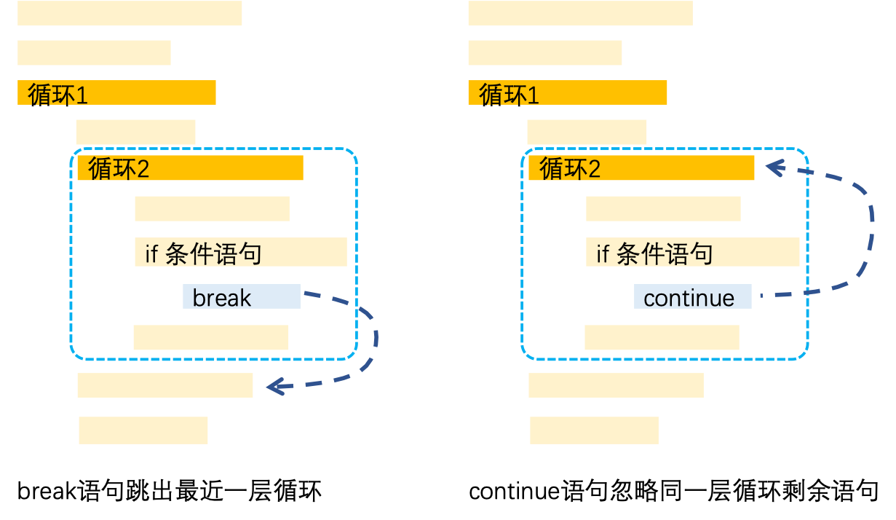

- 循环语句中的else
  - 可以用于判断是否break强制退出循环

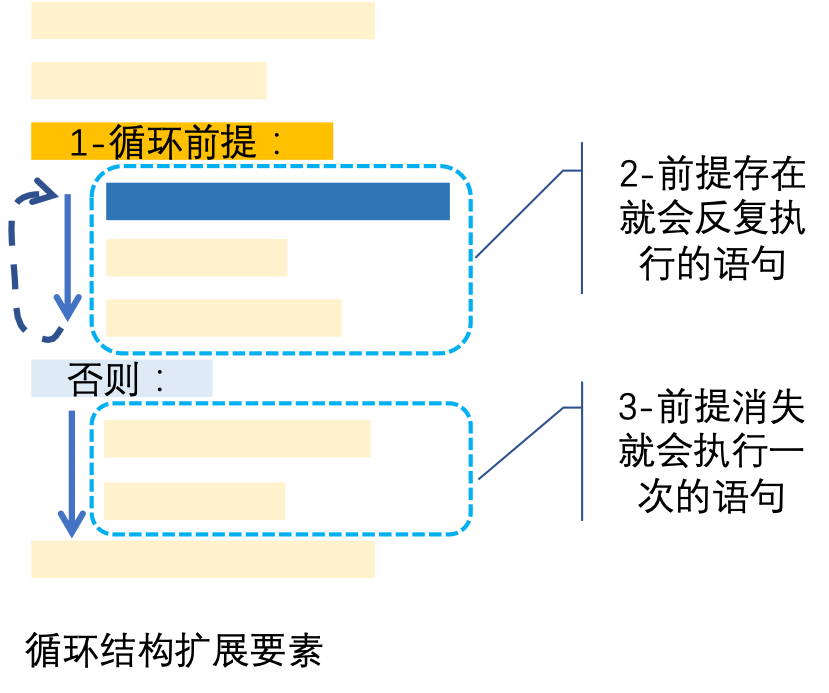

  - 与if……else一样，循环语句for和while也有else子句
  - 当循环前提不成立的时候，执行一次else子句所属的语句块
    - for取完了所有元素；while的条件不成立
  - 如果是break退出循环，则不执行else的语句块
    - 此时并非循环前提不成立

```python
n = int(input("判断素数，请输入(>1): "))
for i in range(2, int(n**0.5) + 1):
  if n % i == 0: #被任何一个主整除
    print(f"{n}不是素数。")
    break
else :
  print(f"{n}是素数。")
print("谢谢使用，再见！")
```

- break语句
  - 有时候需要立刻中断循环
  - break语句立刻中断退出循环
    - 如果有多个循环嵌套，仅退出直接包含它的那一层循环
  - 可以用在for和while循环语句中
  - 我们试着用for + break语句重写阶乘的例子：

```python
# 当n等于多少的时候，n阶乘超过10亿？
np = 1
for m in range(1, 100):
  np = np * m
  if np > 10**9:
    break
print(m, "阶乘超过10亿，等于", np)
```
```python
import math
math.factorial(13)
```

- continue语句
  - 有时候在执行循环体语句的时候，需要忽略余下的语句，直接跳到下一次循环
  - continue语句立刻跳到下一次循环
    - 仅作用于直接包含它的循环语句
  - 可以用在for和while语句
  - 示例：过7
    - 这个例子可以不用continue?

```python
### 跳7数字
for i in range(1, 100):  #从1到99报数
  if ('7' in str(i)) or (i % 7 == 0):
    print("pass!", end = ', ')
    continue
  print(i, end = ', ')
```

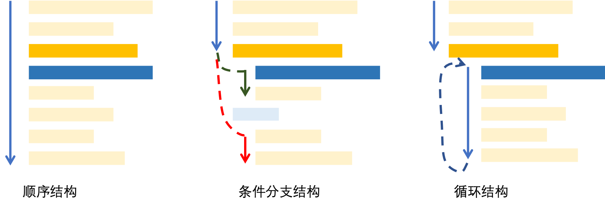

### 例外处理Exception Handling

在 Python 中，例外处理（Exception Handling） 是为了让程序在遇到错误时不要直接崩溃，而是能够“优雅地活下去”或提供有用的报错信息。
可以看作一种特殊的控制流。

- 代码运行可能会意外各种错误：
  - 语法错误：Syntax Error
  - 除以 0 错误：ZeroDivisionError
  - 列表下标越界：IndexError
  - 类型错误：TypeError…
- 错误会引起程序中止退出，如果希望掌控意外，就需要在可能出错误的地方设置陷阱捕捉错误
  ```
  try:
    < 可 能 出 错 的 代 码 >
  except:
    < 处 理 错 误 的 代 码 >
  else:
    < 没 有 出 错 执 行 的 代 码 >
  finally:
    < 无 论 出 错 否 ， 都 执 行 的 代 码 >
  ```
- try, except（可多个）必须，else, finally 可选

#### 常见例外

##### NameError

- Python代码中，引号为界，引号之内可以随意，引号之外的单词
  - Key word：if, for, while, import, def, class等语法成分的保留字
  - Name：各种对象的名字
- 名字不含特殊符号（只能是英文、数字、下划线、中文等）
- 名字区分大小写（Cost和cost是不同的名字）
- 名字先定义后使用（import，赋值等）

##### SyntaxError

- 不符合Python语法书写规范
- 除了语法成分中的保留字拼写错误（如import写成了inport）
- 最常见的错误是：***中文符号都不行哦！***
  - 小数点，逗号，冒号，引号，括号；这些必须是英文符号
- 另一类常见错误是：if, for, def等语句末尾忘记冒号

##### IndentationError

- Python是有代码格式的语言，缩进代表了语句块的归属
  - 凡是语句行末为冒号的，下一行必缩进（if, for, while, def, class等）
  - 缩进的空格数要保持一致（一般是4个空格及其倍数）
    - 可用编辑器的代码格式整理（format code）的功能来保持代码美观
    - 实际上代码编辑器会在输入代码时自动替你缩进！

##### Value/TypeError

- Python是“强类型”语言，不相容的类型无法转换或者运算
- 常见错误：需要数值的地方，给了文字（字符串类型）

##### ModuleNotFoundError
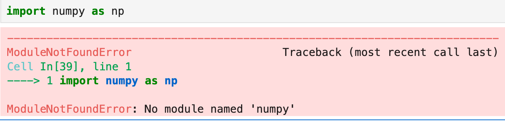


## 函数

- 函数用来对具有明确功能的代码段命名，以便复用（reuse）
- 定义函数：def 语句；
    ``` 
    def < 函 数 名 > (< 参 数 表 >):
        < 缩 进 的 代 码 段 >
        return < 函 数 返 回 值 >
    ```
  - 无 return =“return” = “return None”
- 调用函数：< 函数名 >（< 参数 >）
  - 注意括号！
  - 丢弃返回值： < 函数名 > (< 参数表 >)
  - 返回值赋值：`v = < 函数名 > (< 参数表>)`

```python
def sum_list(alist): # 定义一个带参数的函数
  sum_temp = 0
  for i in alist:
    sum_temp += i
  return sum_temp # 函数返回值

print(sum_list) # 查看函数对象sum_list

my_list = [23, 45, 67, 89, 100]
# 调用函数，将返回值赋值给my_sum
my_sum = sum_list(my_list)
print(f"sum of my list:{my_sum}")
```

```python
sum = int(input())
if sum % 2 == 1:
  print("even number required.")
  exit # 并不会按预想退出
#do sth interesting with sum
half = sum // 2
```

### 定义函数的参数

定义函数时，参数数量可以有两种情况：
- 一种是在参数表中写明参数名 key 的参数，固定了顺序和数量
调用函数时可以根据位置或 key，来提供参数。
  - `def func(key1, key2, key3⋯):`
  - `def func(key1, key2=value2⋯):`
- 另一种在参数表中不明确参数名，不确定参数数量
  - 数组参数，不带 key 的多个参数，
    - `def func(*args):`
```python
print(1, 2, 'xzm', [1, 2, 3])
```
  - 字典参数，key=val 形式的多个参数，
    - `def func(**kwargs):`

#### 固定参数
- 参数的传入顺序和缺省值的使用

```python
def func_test(key1, key2, key3=23) :
  print(f"k1={key1}, K2={key2}, K3={key3}")

print("====func_test")
# 没有传入key3，用了缺省值
func_test('v1', 'v2')
# 传入了key3
func_test('ab', 'cd', 768)
# 使用参数名称就可以不管顺序
func_test(key2='KK', key1='K')
```

#### 可变无名参数
- args 在函数里面是一个元组 tuple

```python
# 可以随意传入0个或多个无名参数
def func_test2(*args) :
  for arg, i in zip(args, range(len(args))):
    print(f"arg{i}={arg}")

print("====func_test2")
func_test2(12, 34, 'abcd', True)
```

#### 可变带名参数
- kwargs 在函数里面是一个字典 dict
```python
# 可以随意传入0个或多个带名参数
def func_test3(**kwargs):
  for key, val in kwargs.items() :
    print(f"{key}={val}")

print("====func_test3")
func_test3(myname="Tom", sep="comma", age=23)
```

### 调用函数的参数

调用函数的时候，可以传进两种参数；
- 一种是没有名字的位置参数
  - func(arg1, arg2, arg3⋯)
  - 会按照前后顺序对应到函数参数传入
- 一种是带 key 的关键字参数
  - func(key1=arg1, key2=arg2⋯)
  - 由于指定了 key，可以不按照顺序对应
- 如果混用，所有位置参数必须在前，关键字参数必须在后

## 面向对象

### 为什么需要面向对象

**面向对象是为了管理复杂程序。**

因为当代码规模变大时，**“按顺序写过程”**会由于逻辑太乱而崩溃。面向对象（OOP）通过三个核心理由解决了这个问题：

- 1. 它是对现实世界的“映射”

人类的思维习惯于看“东西”。

* **过程式**：关注“洗衣服”、“排水”、“脱水”这些动作。
* **面向对象**：关注“洗衣机”这个实体。它有属性（颜色、容量）和行为（洗涤、烘干）。
这种映射让复杂系统的设计变得非常直观。

- 2. 解决“牵一发而动全身”的混乱（封装）

在老式编程中，改一个变量可能导致全程序报错。

* **OOP** 把数据和操作数据的方法打包在一起。
* 外部只能通过预留的“按钮”操作，内部细节怎么改都不影响外面。这叫**解耦**。

- 3. 实现“代码复用”的最高境界（继承与多态）

如果你写了一个“员工”类，再写“经理”类时，只需**继承**员工即可，不用重写名字、工号等逻辑。

* 当你需要处理一堆不同类型的对象（如圆、方、三角）时，你只需要喊一句“求面积”，它们会根据自己的形态自动计算。这叫**灵活**。


**一句话总结：**
面向对象是为了把复杂的代码**模块化**，像搭积木一样组装程序，从而实现**易维护、易扩展、易复用**。

### 类的定义与调用

- 类用来实现抽象数据类型 ADT，封装实体的属性和行为
- 定义类：class 语句；
  ```
  class < 类名 >:
    def __init__(self, < 参数表 >): # 前后连着两个’_’
      pass
    def < 方法名 >(self, < 参数表 >):
      pass
  ```
- 调用类：`< 类名 >（< 参数 >）`
  - 必须有括号，即使里面为空！
  - `obj = < 类名 > (< 参数表 >)`
  - 返回一个对象实例，
  - 类方法中的 self 指这个对象实例！

#### class Force

```python
class Force: # 力 
    def __init__(self, x, y): # x,y方向分量
        self.fx, self.fy = x, y

    def show(self):  # 打印出力的值
        print(f"Force<{self.fx}, {self.fy}>")

    def add(self, force2): # 与另一个力合成
        x = self.fx + force2.fx
        y = self.fy + force2.fy
        return Force (x, y)
```

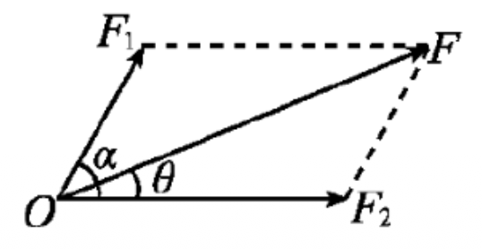

```python
# 生成一个力对象
f1 = Force(0, 1)
f1.show()
# 生成另一个力对象
f2 = Force (3, 4)
# 合成为新的力
f3 = f1.add(f2)
f3.show()
```

```python
Force(2, 3) + Force(1,1)
```

```python
Force(1, 1) == Force(1, 1)
```

```python
a = b = Force(1, 1)
a == b, a is b
```

```python
d = {}
d[a] = 5
```

```python
hash(a), hash(b), hash(id(a)>>4)
```

#### 类定义中的特殊方法
- 在类定义中实现一些特殊方法，可以 方便地使用 python 一些内置操作
  - 所有特殊方法以两个下划线开始结束
  - `__str__(self)`：自动转换为字符串
  - `__add__(self, other)`：支持 + 操作
  - `__mul__(self, other)`：支持* 操作
  - `__eq__(self, other)`：支持== 操作
  - `__hash__(self)`: 支持 hash(obj) 操作，缺省为`hash(id(x)>>4)`
- 更多特殊方法： rszalski.github.io/magicmethods/
- `__eq__` 和 `__hash__` 要一起出现，只有前者会变成 unhashable
- 它们都没有定义的话，缺省的相等和哈希针对 id(obj) 进行
- 自定义了 `__eq__` 和 `__hash__` 的类，把对象放入字典再修改它的值，可能造成“元素不是元素”的迷局

```python
import math
class Force: # 力 
    """
    二维力
    """
    def __init__(self, x, y): # x,y方向分量
        self.fx, self.fy = float(x), float(y)

    def show(self):  # 打印出力的值
        print(f"Force<{self.fx}, {self.fy}>")

    def add(self, force2): # 与另一个力合成
        if isinstance(force2, Force):
            x = self.fx + force2.fx
            y = self.fy + force2.fy
            return Force (x, y)
        else:
            raise TypeError
        
    def balance(self):    # “合”力是否为零
        return (math.isclose(self.fx, 0, 1e-9) 
                and math.isclose(self.fy, 0, 1e-9))
    def angle(self):      # 求力的角度
        return math.degrees(math.atan2(self.fy, self.fx))
    def __add__(self, other):
        return self.add(other)
    def __str__(self):
        return f"Force<{self.fx}, {self.fy}>"
    __repr__ = __str__
    def __eq__(self, other):
        return (math.isclose(self.fx, other.fx, rel_tol=1e-9)
                and math.isclose(self.fy, other.fy, rel_tol=1e-9))
    def __abs__(self):
        return math.sqrt(self.fx**2 + self.fy**2)
```

```python
Force(3, 4) + Force(1, 1)
```

```python
Force(3, 5) + Force(1, 1) == Force(4, 5)
```

```python
f = Force(4,4)
abs(f), f.angle() 
```

```python
#eq_hash.py
class node:
    def __init__(self, dt):
        self.data = dt
    def __str__(self):
        return f"node({self.data})"

class Node(node):
    def __eq__(self, other):
        return self.data == other.data
    def __hash__(self):
        return hash(self.data)

if __name__ == "__main__":
    x = node('xzm')
    Y = Node(2)
    Z = Node(2)
    w = x

    'test class objects equal'
    print(f"Z==Y?{Z==Y}")
    print(f"w==x?{w==x}")

    print(hash(x))
    d = {x:0, Y:2}
    x.data = 1
    Y.data = 'xzm'
    for i in d:           # 看这两行程序
        if i in d:        # 是不是应该恒为“真” ？ 
            print(i)
        else:
            raise KeyError(f'{i}:error key')
```

### 代码复用：类的继承
- 如果两个类具有“一般-特殊”的逻辑关系，那么特殊类就可以作为一 般类的“子类”来定义，从“父类”继承属性和方法
  - “子类” is a kind of “父类”；NOT ”a part of” nor ”an attribute of”
    ```
    class < 子类名 >(< 父类名 >):
      def < 新定义方法 >(self,⋯):
      def < 重定义方法 >(self,⋯): # 可以覆盖父类中的同名方法
    ```
- 子类对象可以调用父类方法，除非这个方法在子类中重新定义了
- Python 与 C++ 类似，可以多继承
```python
class Car:
  def __init__(self, name):
    self.name = name
    self.remain_mile = 0

  def fill_fuel(self, miles): # 加燃料里程
    self.remain_mile = miles

  def run(self,miles):  # 跑miles英里
    print(self.name, end=": ") 
    if self.remain_mile >= miles: 
      self.remain_mile -= miles
      print(f"run {miles} miles!")
    else:
      print("fuel out!")

class GasCar(Car):
  def fill_fuel(self,gas): # 加汽油gas升
    self.remain_mile = gas * 6.0 # 每升跑6英里

class ElecCar(Car):
  def fill_fuel(self, power): # 充电power度
    self.remain_mile = power * 3.0 # 每度电3英里

```
```python
gcar=GasCar("BMW")
gcar.fill_fuel(50.0)
gcar.run(200.0)
```
```python
ecar=ElecCar("Tesla")
ecar.fill_fuel(60.0)
ecar.run(200.0)
```

```python

```
